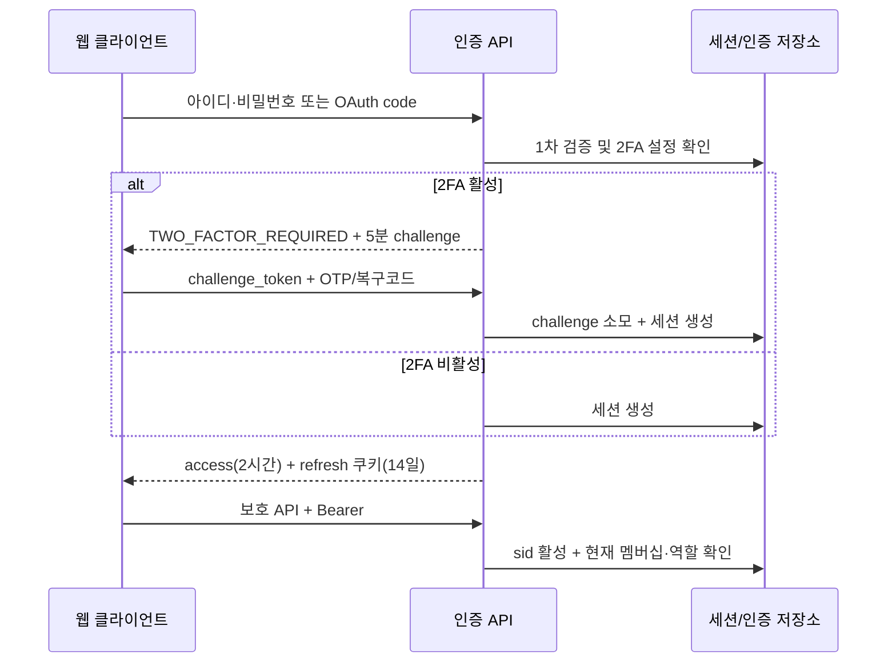
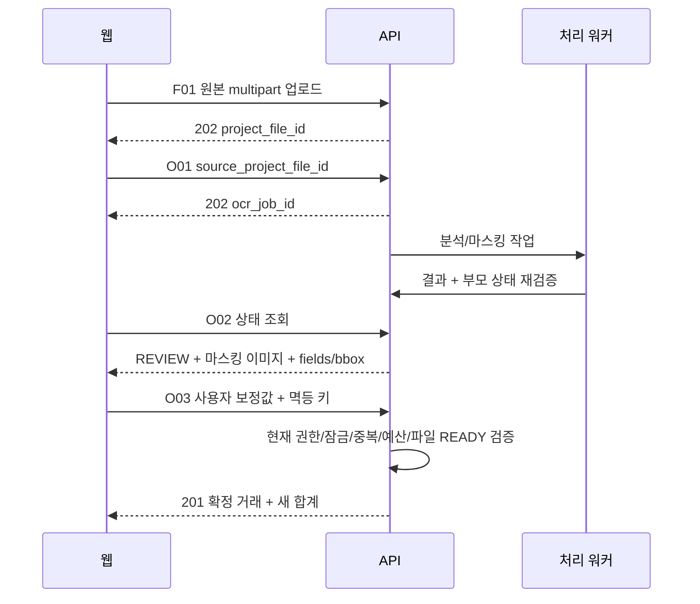
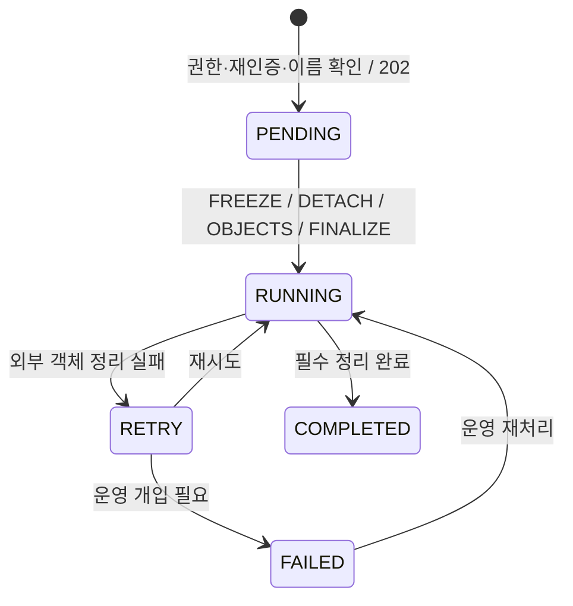

# 공금이 플랫폼 API 명세서 v1.0

> 작성일: 2026-09-30 · 기준: 기능명세 v3.3 / ERD v1.3 / 화면설계 14쪽
> 상태: 개발 착수용 설계안. 실제 서버 구현·배포·API 실행 시험 결과가 아니다.
> 산출물: 본 Markdown + `공금이_OpenAPI_v1.0.json` (OpenAPI 3.1.1)

읽는 순서: §2~4 공통 인증·권한·저장 → §5~9 업무 계약 → §10 API 색인/상세 → §11 데이터 사전 → §12 오류 → §13 추적표 → §14 인수 시험 → §15 미확정 제안. 빠른 개발 도구 연동에는 동봉 OpenAPI JSON을 사용한다.

## 1. 문서 기준과 적용 범위

본 문서는 공금이의 50개 기능을 웹 프런트엔드와 백엔드가 합의할 HTTP 계약으로 구체화한다. 원문의 업무 규칙은 **[원문 확정]**, HTTP 경로·DTO·헤더·운영 제한 등 이번에 선택한 내용은 **[설계 제안]**이다. 제안은 구현 가능한 기본안을 정한 것이며, 제품 정책을 이미 승인받았다는 의미가 아니다.

자료 안의 작성 지시·과거 검토 요청·향후 작업 문구는 참고 자료로만 취급했다. 원본 기능/ERD/PDF를 수정하거나 실제 계정·거래·초대·삭제를 실행하지 않았다.

| 근거 | 용도·우선순위 |
| --- | --- |
| [기능명세 v3.3](C:/Users/jiwon/Downloads/공금/공금이_웹앱_기능명세서_v3.3.md) | 업무 정책 최우선. §0.1~0.12, 기능별 상세, 부록 B/D |
| [테이블 명세 v1.3](C:/Users/jiwon/Downloads/공금/공금이_ERD_테이블_명세서_v1.3.md) | 36개 테이블의 컬럼·enum·복합 FK·서비스 계약. §5~10 |
| [화면 설계 PDF](C:/Users/jiwon/Downloads/공금/슬라이드_화면설계서.pdf) | 1~14쪽, 화면 00~13의 진입·목록·상세·작업 진행 흐름 |
| [ERD 전체도](C:/Users/jiwon/Downloads/공금/공금이_ERD_전체도_v1.3.png) | 도메인 간 관계 확인. 세부 FK·삭제 정책은 테이블 명세 우선 |

전송 계약은 본 문서와 OpenAPI 파일을 함께 사용한다. OpenAPI는 본 문서의 API 목록·DTO와 같은 원본에서 생성했다. 상태별 권한·원자성·중복 판정·조건부 비즈니스 검증은 JSON Schema만으로 표현할 수 없으므로 본문을 함께 구현해야 한다. 형식 기준은 [OpenAPI 3.1.1 공식 명세](https://spec.openapis.org/oas/v3.1.1.html)이며, 최신 버전 채택을 주장하지 않는다.

### 1.1 자료 간 차이의 처리

| 화면/기존 문구 | 채택 계약 | 근거 |
| --- | --- | --- |
| 팀 관리자와 총무 혼용, 전체 관리자 전용 관리 화면 | 팀 OWNER/ADMIN/MEMBER와 PROJECT_ADMIN/PROJECT_MEMBER 분리. 일반 사용자 팀 생성·팀 조회·본인 탈퇴 가능 | 기능 §0.1~0.5, 부록 B |
| 모든 장부 목록과 잔액 노출 | 일반 목록은 명시적 참여 프로젝트만. 공개 참여 목록과 OWNER 삭제 목록 별도 최소 DTO | §0.5, §0.12 |
| 예산 숫자 입력이 기본 전제 | 신규 target_budget=null. UNSET/SET(0)/SET(양수) 구분 | §0.6, F-PROJ-02 |
| 100% 초과에서만 빨강 | 100% 이상 빨강. 정확히 100% 지출은 BLOCK에서 허용 | §0.6 |
| 잠금 시 등록/수정 차단만 표현 | 삭제·예산·카테고리·기간 변경도 차단. 조회·출력·후임 지정은 허용 | F-PROJ-09 |
| 같은 날짜·금액 중복, 추출률 30% | 실제 시각·정밀도 포함 확정 중복, 엔진 표준 신뢰도 <0.30 안내 | §0.8 |
| 원본 영수증 보기/저장 | 마스킹된 전체 해상도 파생본만 제공. 처리용 원본은 배포 금지 | §0.12, F-SEC-05 |
| 결산 읽기와 내보내기 혼용 | 참여자 결산 조회 / 총무 결산 파일 / 참여자 갤러리 ZIP | ERD §5.4.5 |
| 수입 유형의 정기 회비 예시 | INITIAL_FUND/CARRYOVER/SUPPORT/DONATION/OTHER. 별도 정기 회비 enum 추가하지 않음 | ERD §5.3.7 |
| 삭제 후 즉시 홈으로 이동 | 202 수락과 외부 파일 정리 완료를 구분하여 상태 조회 | §0.10 |
| F-TEAM-08=팀 목록, F-AUTH-08=계정 허브 등 | 50개 기능 ID의 원래 정의 유지. 화면은 API 묶음으로 매핑 | 기능 부록 B |

### 1.2 범위와 단계

- **P0:** 이메일 가입/로그인·세션, 팀·초대·직급, 프로젝트 생성·기본 카테고리, 예산 상태 전환·이력 저장, 수동/OCR 거래, 조회·결산·달력, 마스킹·암호화·임시 파일 정리, 앱 내 알림·SSE, 감사·멱등 기록.
- **P1:** 소셜·재설정·TOTP·재인증, 멤버 관리·후임·마감·영구삭제, 카테고리 관리, 감사·이력 조회, XLSX/CSV·갤러리 ZIP, 웹 푸시·방해금지.
- **P2:** 설정 복제, PDF, 회원 탈퇴, 자동 화면 잠금. 생체 인증은 네이티브 앱 로컬 기능으로 웹 API를 신설하지 않는다.

P0 저장 기반을 P1 조회 화면까지 미루지 않는다. 팀/프로젝트 이탈 기능은 마지막 총무 후임 지정 기능과 함께 제공한다. 결제·은행 연동·실제 송금·환불·장부 복구·공개 파일 공유·시스템 관리자 콘솔은 이번 범위에 없다.

## 2. 공통 HTTP 계약 [설계 제안]

### 2.1 경로·형식

| 항목 | 계약 |
| --- | --- |
| Base path | `/api/v1`. 도메인은 배포 환경 설정값이며 OpenAPI servers에는 상대 경로 사용 |
| 전송 | HTTPS, 원문 요구 TLS 1.3. JSON UTF-8. 파일은 multipart 또는 바이너리 스트림 |
| 이름 | JSON/query는 snake_case, URL은 kebab-case. 경로 변수 표기만 `{projectId}` 등 |
| ID | DB BIGINT UNSIGNED는 JSON **문자열**. 예: `"301"`. session/deletion job/request_id는 UUID |
| 금액 | 단건/목표 예산은 JSON 정수. 합계·잔액은 부호 있는 10진 **문자열**로 큰 합계 정밀도 보존. 통화 KRW |
| 날짜 | business_date=`YYYY-MM-DD`. 회계 오늘은 Asia/Seoul. 서버 시각은 UTC ISO 8601 `...Z` |
| null/생략 | PATCH 생략=유지, nullable 값 null=명시 제거. PUT 거래는 전체 교체. 예산 PUT는 §5 특수 규칙 |
| 허용 필드 | 입력의 정의되지 않은 필드는 400. 작성자/역할/서버 계산값의 임의 대입 차단 |
| 문자열 | 앞뒤 공백 제거를 명시한 식별자·이름은 trim. 필수 사유의 공백만 입력 금지. 비밀번호는 trim하지 않음 |
| GET | 업무 상태 변경 금지. 다운로드 제공 감사·접속 기록은 예외적인 서버 부수 기록 |
| 삭제 | 거래 DELETE는 소프트 삭제. 팀/프로젝트는 POST `/deletion` 비동기 영구삭제. 휴지통/restore 없음 |

`BIGINT` 문자열의 20자리 패턴은 형식 검사이며 서버가 DB unsigned 범위도 검사한다. 단건 거래 1~1,000,000,000원, 목표 예산 0~1,000,000,000원은 원문 확정이다. 총합 문자열을 JS `Number`로 강제 변환하지 않는다. 수량은 소수 3자리 문자열, 비율은 표시용 number다.

### 2.2 헤더

| 헤더 | 방향·필수 조건 | 내용 |
| --- | --- | --- |
| `Authorization: Bearer <access_token>` | 보호 요청 | 정상 access만. reset/2FA/reauth 토큰으로 대체 금지 |
| `Idempotency-Key: <UUID>` | 목록에 ‘멱등 키 필수’로 표시된 쓰기 | 사용자가 시도한 하나의 저장 작업에 재사용. 수정된 별개 저장은 새 UUID |
| `X-Reauthentication-Token` | 재인증 표시 작업 | 5분, 1회용, 사용자·sid·action·target·요청 해시에 결합 |
| `X-CSRF-Token` | refresh 쿠키 사용 요청 | 서버 발급 double-submit CSRF 값. Origin/허용 사이트 검증 병행 |
| `Last-Event-ID` | SSE 재접속 | 마지막 수신 이벤트 ID. 상세 §9 |
| `X-Request-ID` | 모든 응답 | 서버 추적 UUID. 클라이언트 임의 값 그대로 신뢰하지 않음 |
| `Idempotency-Replayed` | 멱등 지원 응답 | `true`이면 기존 성공 작업 결과이며 추가 저장 없음 |
| `Location` | 201 생성 / 202 비동기 | 생성 리소스 또는 작업 상태 경로. 계정 탈퇴는 보호 GET 대신 receipt_id만 |
| `Retry-After` | 429 / 진행 충돌 / 폴링 안내 | 정수 초 |
| `Cache-Control` | 인증·장부·이미지·출력 | `private, no-store`. 서비스워커 영속 캐시에 회계 자료 저장 금지 |

refresh는 `Secure; HttpOnly; SameSite=Strict; Path=/api/v1/auth` 쿠키로만 전달하는 동일 사이트 웹 구성을 기본안으로 한다. Access는 메모리에 두며 response JSON에 반환한다. OAuth state용 단기 쿠키가 필요한 경우 별도 이름·범위·SameSite 설정을 사용한다. 도메인 분리 배포에서는 CORS/쿠키/CSRF 정책을 확정해야 한다. 비밀 토큰을 URL query·로그·분석 SDK에 넣지 않는다.

### 2.3 공통 응답

성공(200/201/202)은 `data`와 `meta`를 반환한다. 아래 예시의 `data` 구조가 각 응답 DTO다. 204는 본문이 없다. 이미지/다운로드/SSE는 JSON envelope를 사용하지 않는다.

```json
{
  "data": {"id":"301","status":"ACTIVE"},
  "meta": {"request_id":"9c62c98a-4325-4ed5-8e7f-9e23160c7f51","replayed":false}
}
```

```json
{
  "error": {
    "code":"VALIDATION_ERROR",
    "message":"입력값을 확인해 주세요.",
    "details":{"fields":[{"path":"target_budget","reason":"SET에서는 정수 금액이 필요합니다."}]},
    "retryable":false
  },
  "request_id":"9c62c98a-4325-4ed5-8e7f-9e23160c7f51"
}
```

400 입력 오류, 401 인증 실패, 403 인지 가능한 대상의 작업 권한 부족, 404 존재 또는 접근 가능한 범위 아님, 409 상태/버전/예산/중복 충돌, 410 권한 확인 후 만료·소프트 삭제, 413 파일 초과, 415 형식 오류, 429 제한, 500/503 서버/외부 장애를 사용한다. 일반 프로젝트 경로에서 미참여 비공개 대상은 404로 통일한다. 같은 팀의 OWNER 거버넌스 경로만 예외다. 삭제 중임을 알 수 있는 정당한 사용자에게만 `RESOURCE_DELETING`과 허용된 상태 조회 경로를 안내한다.

### 2.4 목록·필터·정렬

기본 `limit=20`, 최대100; `cursor`는 서명된 불투명 문자열이다. 다음 응답은 `items`, `page={next_cursor,has_next,limit}`를 갖는다. 빈 목록은 200, `items=[]`, `next_cursor=null`, `has_next=false`. 검색어는 최대100자, 배열 query는 `category_ids=11,12`처럼 쉼표 구분이다. 중복 ID는 정규화해 제거한다.

거래 기본 정렬은 `business_date DESC,id DESC`. cursor는 정렬 키·필터 해시·사용자·프로젝트·정렬 모드를 결합한다. 조회마다 최신 원장을 읽으며 여러 페이지 사이의 수정까지 불변 스냅샷으로 보장하지 않는다. 변경 감지 후 첫 페이지를 재조회하고 UI는 ID로 중복 제거한다. 목록 응답 하나의 items/summary는 같은 읽기 스냅샷을 쓴다. 30분 cursor TTL은 제안이다.

기간 양끝 포함, `date_from<=date_to`; 생략은 전체 범위. 카테고리 필터는 지출에만 적용하고, `type` 생략 시 기간 내 수입은 포함한다. `type=EXPENSE`면 수입 제외. 등록자 필터는 안정적인 user_id를 사용한다. 품목 검색은 거래 ID 집합을 확정한 뒤 집계하여 총액 중복을 방지한다. 순지출=지출-수입, 잔액=수입-지출이다.

`TIME_ASC`는 `date_from=date_to`인 선택일 조회에만 허용하는 제안이며 `occurred_at ASC NULLS LAST,id ASC`와 같은 안정 정렬을 사용한다. 시각 없는 거래는 별도 ‘시각 미입력’ 그룹으로 표시한다. 갤러리는 business_date/attachment_id, 알림은 created_at/id, 이력은 사건 시각/id의 안정 커서를 쓴다.

## 3. 인증·권한 계약

### 3.1 인증 흐름



로그인·reset·reauth는 목적이 서로 다르다. `challenge_id`는 공개 식별자이며 단독 인증 자격으로 쓰지 않는다. 2FA 로그인에 추가 난수 challenge_token을 요구하는 것은 API 보완안이다. OTP는 30초 step, ±30초 허용 및 수락 step 재사용 차단. 복구 코드는 해시로만 저장하고 성공 시 해당 행을 물리 삭제한다.

비밀번호 5회 연속 실패는 5분 잠금 후 CAPTCHA까지 필요하다. OTP 5회 실패는 5분 잠금 후 새 challenge가 필요하다. 실패 카운트는 원자 갱신한다. 재설정은 코드(6자리/5분/60초 재발송/5회)→grant(10분/1회)→비밀번호 변경·전체 세션 회수 순서다. 미가입 이메일도 동일한 외부 응답을 사용한다. 비밀번호 재설정 후 자동 로그인하지 않는다.

소셜 제공자는 GOOGLE/KAKAO/APPLE. 서버가 provider subject를 검증한다. 동일 이메일 자동 연동을 금지하며 기존 일반 계정 비밀번호·활성 OTP를 확인한다. 신규 소셜 가입의 필수 약관과 기본 알림 설정은 원자 생성한다. 제공자가 검증 이메일을 주지 않을 때 A15/A16을 사용하는 흐름은 ERD의 필수 email을 채우기 위한 **보완 제안**이다. provider별 실제 SDK/redirect/claim 검증은 구현 시 공식 규격에 맞춘다.

### 3.2 권한 표 [원문 확정]

활성 프로젝트 참여자는 **ACTIVE 사용자 + 유효 sid + ACTIVE 팀 멤버십 + ACTIVE 프로젝트 멤버십**을 모두 만족해야 한다. 아래 ‘본인’은 원 작성자의 user_id와 인증 사용자 일치다. JWT에 담긴 오래된 역할이나 버튼 노출은 서버 권한 근거가 아니다.

| 작업 | 허용 조건 | LOCKED |
| --- | --- | --- |
| 팀 정보·현재 팀원 조회 | 활성 팀원 | 무관 |
| 팀 설정·초대·프로젝트 생성 | OWNER/ADMIN | 무관 |
| MEMBER→ADMIN 승격 | OWNER/ADMIN | 무관 |
| ADMIN 강등·OWNER 위임 | OWNER, 원자 승계 | 무관 |
| 추방 | OWNER는 본인 제외, ADMIN은 MEMBER만 | 마지막 총무 보호 |
| 장부·거래·결산 조회 | 활성 프로젝트 참여 | 허용 |
| 지출 신규 | 활성 프로젝트 참여 | 차단 |
| 본인 지출 수정·삭제 | 현재 프로젝트 참여 | 차단 |
| 타인 지출·모든 수입 변경 | 현재 PROJECT_ADMIN | 차단 |
| 예산·카테고리·기간 변경 | 현재 PROJECT_ADMIN | 차단 |
| 후임 총무 지정 | 현재 PROJECT_ADMIN, 후임은 활성 참여자 | 허용 |
| 결산 생성·다운로드 | 현재 PROJECT_ADMIN + 재인증 | 허용 |
| 갤러리 ZIP | 활성 참여자, 선택 증빙 권한 | 허용 |
| 프로젝트 영구삭제 | 팀 OWNER + 재인증 + 정확한 대상명 | 허용 |
| 팀 운영 감사 | OWNER/ADMIN, TEAM 운영 사건만 | 무관 |
| 프로젝트 회계 감사 | 해당 PROJECT_ADMIN | 허용 |

팀 ADMIN+프로젝트 MEMBER는 수입/예산을 변경할 수 없다. 팀 MEMBER+프로젝트 ADMIN은 가능하다. 미참여 OWNER는 P14/P15의 삭제 경로만 사용하며 일반 장부·회계 감사에 접근할 수 없다.

마지막 총무 이탈/강등/제외는 `409 LAST_PROJECT_ADMIN`. 여러 프로젝트에 영향을 주는 추방·팀 탈퇴·회원 탈퇴는 하나라도 실패하면 전부 롤백한다. 먼저 P09로 후임 지정하거나 OWNER가 해당 프로젝트 삭제를 **완료**한 후 이탈한다. 삭제 중이라는 이유만으로 이탈을 성급히 허용하지 않는다. 팀 전체 삭제에 같이 포함된 프로젝트는 예외다.

### 3.3 재인증의 구체적 사용

1. S02에 `action,target_type,target_id,request_body`를 보내 작업 권한과 실제 본문을 검증한다. `request_body`는 실행할 요청의 업무 본문이며 DELETE query version은 같은 이름의 필드로 정규화한다. 멱등 키/confirmation_token/비밀 토큰은 제외한다.
2. S03에서 비밀번호 또는 동일 계정 소셜 재인증 + 활성 2FA의 OTP를 확인한다. 5분 REAUTH를 발급한다.
3. 실행 요청의 `X-Reauthentication-Token`으로 제출한다. 서버가 요청 해시·현재 상태·권한을 확인하고 업무 커밋과 함께 원자 소모한다. 실행 전 검증 실패는 grant를 소모하지 않되, 내용/버전이 바뀌면 다시 발급받는다.

| action | target_type / ID | 실행 API |
| --- | --- | --- |
| TEAM_DELETE | TEAM / teamId | T11 |
| PROJECT_DELETE | PROJECT / projectId | P15 |
| TEAM_MEMBER_KICK | TEAM_MEMBER / memberId | T08 |
| SETTLEMENT_CREATE | PROJECT / projectId | E01 |
| SETTLEMENT_DOWNLOAD | EXPORT_JOB / exportJobId | E05, SETTLEMENT |
| GALLERY_ZIP_CREATE | PROJECT / projectId | E02 |
| GALLERY_ZIP_DOWNLOAD | EXPORT_JOB / exportJobId | E05, GALLERY_ZIP |
| ACCOUNT_WITHDRAW | USER / 본인 ID | S16 |
| TOTP_DISABLE / RECOVERY_REGENERATE | USER / 본인 ID | S08 / S09 |
| SCREEN_UNLOCK | SESSION / 현재 sid | S10 |

원문은 대량 내보내기의 정량 기준을 정의하지 않았다. 본안은 모든 결산 파일·일괄 ZIP에 생성/다운로드 각각 재인증을 적용한다. 갤러리 ZIP을 참여자에게 허용하는 권한은 바꾸지 않는다. 재인증 1회용 정책 때문에 다운로드 전송 실패 후에는 새 grant가 필요하다. 일반 단일 영수증 열람에는 재인증을 요구하지 않는다. 화면 잠금 해제의 활성 OTP 추가는 공통 재인증 정책을 재사용한 제안이다.

### 3.4 상태별 노출과 불변 데이터

TEAM_ALL로 바꾸면 현재 활성 미참여 팀원만 PROJECT_MEMBER로 추가한다. 기존 총무 역할은 보존하고, SELECTED로 바꾸었다고 기존 참여자를 일괄 제거하지 않는다. 공개 직접 참여는 성공한 뒤 명시적 프로젝트 멤버십을 만든다. 팀 재가입은 새 team_member ID, 프로젝트 재참여는 새 project_member ID를 사용하며 과거 작성자 FK를 바꾸지 않는다.

WITHDRAWN 사용자는 원장에 user_id와 내부 작성자 스냅샷이 남아도 API/검색/알림/출력에는 `(탈퇴한 사용자)`로 표시한다. 일반 DTO의 `Actor`에 원래 스냅샷을 덧붙이지 않는다. 멤버십 비활성화는 사용자 탈퇴와 달라서 LEFT/KICKED만으로 등록 당시 이름을 일괄 삭제하지 않는다.

## 4. 멱등·동시 저장

### 4.1 성공 키 계약

멱등 범위는 `(actor_user_id, scope_type, scope_id, operation, client_key)`이다. create transaction의 UUID는 `transactions.client_request_id`, 예산 이력·출력·삭제의 내부 UUID는 `request_id`와 연결한다. 사용자/팀/프로젝트/작업 ID만 알고 다른 범위의 성공 응답을 재생할 수 없다.

- 동일 키 + 동일 정규화 업무 payload는 기존 결과 ID를 반환하며 저장·감사·알림을 반복하지 않는다. 성공한 예산 no-op도 기록한다.
- 같은 키 + 다른 payload는 `409 IDEMPOTENCY_KEY_REUSED`. 날짜/참조/금액/버전/사유/파일 원본 해시 등 업무 필드는 해시에 포함한다. confirmation_token·reauth 헤더·추적 ID는 제외한다.
- WARN 등 저장 전 4xx는 COMMITTED 기록이 아니다. 동일 업무 내용에 확인 토큰만 추가해 같은 키로 재제출한다.
- 같은 키가 동시에 오면 DB 유일키/공통 잠금으로 한 건만 성공. 짧은 대기 한도를 넘으면 `REQUEST_IN_PROGRESS`+Retry-After, 성공 기록을 미리 COMMITTED로 만들지 않는다.
- 현재 sid·권한·대상 상태를 먼저 확인한 후 성공 재생한다. 삭제/권한 회수 후 예전 원장 응답을 제공하지 않는다. LOCKED에서 변경 경로 재시도도 상태 오류가 될 수 있으며 조회 경로로 확인한다.
- 재생 응답은 저장된 result ID에 대한 **현재 허용 DTO**를 반환할 수 있다. 과거 원문 바이트 동일성을 보장하지 않는다. `meta.replayed=true`, 최초 성공 HTTP 상태를 유지한다. 재인증 grant를 다시 소모하지 않지만 현재 권한은 재검증한다.
- 초대 원문 토큰·복구 코드·비밀번호 등 비밀값은 멱등 저장소에 보관/재생하지 않는다. 초대 링크 생성/재발송 재생은 같은 invitation과 null 링크를 반환한다. 원문 링크 유실 시 새 명시적 재발송으로 토큰을 교체한다.
- T11/P15가 이미 DELETING이어도 동일 삭제 요청자는 같은 삭제 작업 상태만 재조회할 수 있다. 원장 접근 예외가 아니다.

성공 키는 대상 생존 동안 보존한다. 삭제 후 최소 tombstone 보존 기간은 운영 결정 사항이다. 원문 ERD의 idempotency_requests에는 response JSON이 없으므로 전체 응답 저장을 가정하지 않는다.

### 4.2 원자 처리 순서 [원문 확정]

사용자(필요 시 ID순) → 팀 ID순 → 프로젝트 ID순 → 업무 자식/파일 순서로 일관되게 잠근다. 최신 커밋된 권한·상태·중복·전체 유효 지출을 재조회한다. 같은 프로젝트의 거래·예산·마감·멤버십·삭제 전환은 동일 직렬화 수단을 쓴다. 개별 `version`만으로 합계 경합을 해결하지 않는다.

원장/설정 → 상세·첨부·이력 → 합계 캐시(사용 시) → 임계 상태 → 필수 감사 → 알림 사건/수신 기록/발송 대기 → 성공 멱등 기록을 한 DB 트랜잭션에 커밋한다. 감사 저장 실패면 업무도 롤백한다. 네트워크 OCR/파일/메일/푸시는 잠금 밖에서 실행한다. 외부 발송 실패로 이미 확정한 거래를 취소하지 않는다.

`version`은 ERD에 실제 존재하는 users/teams/team_members/projects/project_members/예산/카테고리/거래/설정에만 사용한다. OCR·출력·초대에 가상 version 컬럼을 전제하지 않는다. 각 변경 API의 version은 해당 대상 버전이며 P08/P09는 프로젝트 설정 버전을 올려 멤버 변경과 함께 조정한다. 초기0, 실제 변경만 +1, no-op는 유지하는 것은 API 제안이다.

## 5. 예산과 확인 계약

### 5.1 계산과 상태 [원문 확정]

T=목표 예산, E=전체 ACTIVE 확정 지출 합계, I=전체 ACTIVE 수입. OCR 미확정/DELETED 거래 제외. 잔액 I-E와 목표 예산 T-E는 다른 지표다. 부족 잔액만으로 거래를 차단하는 정책은 추가하지 않는다.

| 상태 | 응답 budget_mode / configured | target_budget | utilization_percent | over_budget_amount / remaining_budget | 적용 |
| --- | --- | --- | --- | --- | --- |
| 미설정 | UNSET / false | null | null | null / null | 경고·차단·임계 알림 없음 |
| 실제 0원 | SET / true | 0 | null | max(E,0) / -E | 지출 증가에 WARN/BLOCK, 임계 알림 없음 |
| 양수 | SET / true | 정수 | 100×E/T | max(E-T,0) / T-E | 80/100 임계, 100% 초과 증가에 WARN/BLOCK |

비율은 표시용 소수 최대6자리 반올림 제안이다. 판정은 반올림 없이 `100×E >= 기준×T`로 한다. `budget_indicator`는 UNSET, ZERO, NORMAL(<80), WARNING(80~<100), CRITICAL(>=100); 기준 알림 OFF여도 시각적 비율 색상은 유지한다. 100% 초과 비율을 100으로 잘라 반환하지 않는다.

B02 `budget_mode=SET`은 target_budget 필수 정수이며 null/빈문자/생략은400. `UNSET`은 target_budget null/생략만 허용한다. UNSET일 때 정책·토글은 기존값을 보존하며 다른 변경값 동봉은400으로 거절하는 제안이다. SET에서 정책/토글 생략은 현재 보존값 유지. 금액/모드 전환의 사유와 확인은 아래를 따른다.

| 전환 | 이력 | 사유/확인 |
| --- | --- | --- |
| 신규 프로젝트 | 생성 감사만, 예산 이력 없음 | NULL 기본값, 사유 없음 |
| 최초 UNSET→SET | INITIAL_SET | 생략 시 ‘최초 목표 예산 설정’. 기존 초과면 영향 확인 |
| SET→SET 금액 변경 | AMOUNT_CHANGED | 사유 필수. 감액 등으로 초과하면 확인 |
| SET→UNSET | UNSET | 사유 및 예산 해제 영향 확인 필수 |
| 해제 후 UNSET→SET | RESET | 새 금액·사유 필수, 기존 초과면 확인 |
| 모드/금액 같고 정책/토글 변경 | SETTINGS_CHANGED | 일반은 사유 선택. 기존 초과에서 BLOCK 전환은 사유/영향 확인 |
| 값 전체 동일 / UNSET→UNSET | 이력 없음 | 성공 멱등 기록만 |

미설정에서 90,000원 지출이 있을 때 80,000원 BLOCK 설정은 기존 초과 10,000원 안내 후 **설정 성공**이다. 기존 거래/잔액은 바뀌지 않는다. 이후 지출 증가만 차단한다. 해제는 정책/토글/카테고리 배분을 보존하고 T만 null로 바꾸며 대기 예산 발송을 제외한다.

### 5.2 WARN·기간 밖 거래·해제 확인 [API 보완]

클라이언트의 단순 `confirmed=true`를 신뢰하지 않는다. 저장 API는 영향 확인이 필요한 경우409를 반환하며 아직 저장하지 않는다. 확인 종류는 `OVER_BUDGET`, `OUTSIDE_PROJECT_PERIOD`, `BUDGET_UNSET`, `EXISTING_OVER_BUDGET`이다. 복수 사유를 한 번에 반환한다.

```json
{
  "error": {
    "code":"CONFIRMATION_REQUIRED",
    "message":"예산을 초과하는 지출입니다. 확인 후 다시 저장해 주세요.",
    "details": {
      "reasons":["OVER_BUDGET"],
      "current_expense":"90000", "projected_expense":"105000",
      "target_budget":100000, "over_budget_amount":"5000",
      "budget_version":3,
      "confirmation_token":"opaque-signed-confirmation-token",
      "expires_in":300
    },
    "retryable":false
  },
  "request_id":"9c62c98a-4325-4ed5-8e7f-9e23160c7f51"
}
```

사용자가 영향을 확인하면 원래 요청에 `confirmation_token`만 추가하여 같은 Idempotency-Key로 재제출한다. 토큰은 서버 서명/HMAC 또는 서버 임시 상태에 사용자·sid·경로·업무 payload 해시·T·E·예산/프로젝트 버전·원거래 버전·확인 사유·만료를 결합한다. 클라이언트의 totals를 신뢰하지 않는다. P06 통합 저장에서는 외부 기본정보 변경도 해시에 포함한다. 5분 TTL은 제안이다.

잠금 후 상태가 달라지면 `CONFIRMATION_STALE`에 최신 details와 새 토큰을 돌려준다. 권한 상실/LOCKED/DELETING/BLOCK/확정중복이면 해당 오류로 거절한다. 지출 증가가 아니거나 UNSET이면 OVER_BUDGET 확인을 요구하지 않는다. `BLOCK` 및 `DUPLICATE_RECEIPT`는 어떤 확인 토큰으로도 우회할 수 없다. BLOCK은 E'>T인 증가만 거절하고 E'=T는 허용한다.

### 5.3 임계 알림

`T>0 AND warning_enabled AND 100*E>=80*T`, `T>0 AND critical_enabled AND E>=T`로 상태를 각각 계산한다. false→true만 사건 생성; 동시에 넘으면 thresholds=[80,100] 한 사건이다. 계속 도달 중이면 반복하지 않고 내려갔다 재도달하면 새 사건이다. UNSET/0/OFF는 해당 도달 상태 false. 최초 설정/재설정/기준 ON도 현재 전체 E로 평가한다.

저장 시점 활성 참여자 전원에게 앱 내 알림을 생성한다. 개인 budget_alert_enabled는 외부 푸시만 제어한다. 해제 시 과거 알림은 유지하지만 미발송 예산 푸시·다이제스트를 SKIPPED 처리하고 재설정해도 예전 발송을 되살리지 않는다.

## 6. 거래·파일·OCR

### 6.1 거래 생성 예시 (H01 data 입력)

```json
{
  "type":"EXPENSE", "amount":15000, "business_date":"2026-09-29",
  "occurred_precision":"MINUTE", "occurred_local_text":"2026-09-29T12:30",
  "occurred_timezone":"Asia/Seoul", "category_id":"501",
  "expense":{"merchant_name":"동아리 식당","payment_method":"CARD"},
  "items":[{"item_name":"점심","quantity":"2","unit_price":7500,"total_price":15000,"sort_order":0}],
  "attachments":[], "memo":"회의 후 식사"
}
```

```json
{
  "type":"INCOME", "amount":200000, "business_date":"2026-09-29",
  "occurred_precision":"DATE", "occurred_local_text":null,
  "income":{"income_type":"INITIAL_FUND","depositor_name":"학생회"},
  "attachments":[], "memo":"행사 시작 공금"
}
```

서버는 작성자·entry_method·프로젝트를 인증/경로에서 결정한다. 수입은 category/expense/items를 받지 않고, 지출은 income을 받지 않는다. type은 생성 후 불변이다. 수동 입력의 실제 시각은 선택이며 기본 precision=DATE, local_text=null. 날짜만 있는 영수증을 00:00으로 만들지 않는다.

MINUTE이면 `YYYY-MM-DDTHH:mm`, SECOND이면 `YYYY-MM-DDTHH:mm:ss`와 유효 시간대를 검증한다. `occurred_at`은 서버가 파생한 UTC 값이며 MINUTE를 기술적으로 초=00으로 저장하더라도 비교·응답의 원 정밀도를 바꾸지 않는다. 원문의 실제 시각과 확정 business_date는 별도 값으로 유지한다. 미래 business_date만 원문 정책으로 차단하고, 프로젝트 기간 밖 과거일은 확인 후 허용한다.

품목·공급가·VAT·할인액은 보조 자료다. 원문은 `품목합=공급가+VAT-할인=총액`이라는 보편 등식을 정의하지 않았다. 따라서 amount를 회계 원본으로 사용하고 품목/세금 불일치는 보정 경고로 제공하는 기본안을 채택한다. 필수 총금액이 유효하지 않으면 저장하지 않는다. 품목 수량은 양수, 금액은 0 이상, 품목 최대500개 및 보조 금액 10억원 상한은 제안이다.

거래 수정 PUT는 전체 교체이며 기존 배열을 유지하려면 그대로 전송한다. 응답용 `id,registered_by,version` 외의 서버 필드를 요청에 복사하지 않는다. version은 별도로 포함한다. 거래 삭제는 반복해도 한 번만 집계에서 빠진다.

### 6.2 확정 중복 [원문 확정]

동일 프로젝트 ACTIVE EXPENSE에 대해 다음 중 하나면409 DUPLICATE_RECEIPT다.

1. 증빙의 서버 검증 `source_original_sha256`가 같다.
2. 정규화 가맹점 + 실제 거래 시각 + 동일 정밀도 + 총액이 모두 같다.

사업자번호 우선, 없으면 상호 trim/연속 공백 축약/영문 소문자. 날짜만 있는 경우 업무 fingerprint는 null이고 날짜·상호·금액 유사는 안내만 한다. 다른 정밀도도 확정 일치가 아니다. 수정 중 자기 거래는 제외하고 소프트 삭제 거래도 비교 집합에서 제외한다. 원본 해시 OR 업무 fingerprint 검사를 프로젝트 공통 잠금 안에서 수행한다. 확정 중복 details에는 이미 열람 가능한 existing_transaction_id만 제공한다.

### 6.3 업로드·OCR 호출 순서



수동 증빙도 F01(purpose=EVIDENCE)→F02 READY 확인→H01 attachments로 연결한다. `project_file_id`는 **프로젝트 바인딩 ID**이며 stored_files.id와 혼용하지 않는다. OCR 원본/표시 파생본은 서로 다른 ID이고 확정 증빙은 display ID를 사용한다. 미확정 파일은 업로더만 접근하며 프로젝트 참여 권한만으로 타인의 업로드를 연결할 수 없다.

원본 파일 JPG/PNG/HEIC 최대10MB, 증빙 최대5장/대표 최대1개. 프로필/팀 이미지는 JPG/PNG 최대5MB. 원문 MB의 바이트 정의는 없으므로 본안은 1MB=1,000,000bytes를 채택한다. MIME·매직바이트·실제 디코딩·안전한 파일명·이미지 해상도 제한은 서버에서 검증한다. 최대 이미지 픽셀/요청 본문 overhead 제한은 운영 결정이다.

F01은 원본 바이트를 반드시 받으며 client_sha256은 비교용일 뿐 권한/중복 판정 근거로 단독 신뢰하지 않는다. 최적화 WebP의 해시와 원본 해시를 분리한다. 마스킹 성공 후 원본 객체를 정리하고 해시/계보만 필요한 메타데이터를 남길 수 있다. OCR raw_text/structured_result/log도 마스킹 전 민감정보를 남기지 않는다.

OCR 상태는 PENDING→PROCESSING→REVIEW→CONFIRMED, 실패 FAILED, 취소 CANCELED. 분석 성공만으로 거래를 만들지 않는다. CONFIRMED 재확정은 동일 성공 키에만 기존 거래를 반환한다. 저신뢰(<0.30)/필수 필드 누락은 보정/수동전환 안내이며 자동 확정 기준이 아니다. 엔진 지표가 없으면 overall_confidence=null. FAILED→새 분석은 새 작업 생성으로 처리한다.

`OcrField.bbox=[x,y,width,height]`는 응답의 **표시용 이미지** pixel 좌표다. 원본 크롭/회전 좌표를 프런트에 넘길 경우 서버 어댑터가 표시본 좌표로 변환한다. 이미지 크기·rotation·field path·page·schema_version을 함께 제공한다. 민감 영역 원문 값은 노출하지 않는다.

브라우저 폴링은 2초→5초→10초 backoff 제안. 취소/삭제/권한 회수 후 늦은 콜백은 상태를 부활시키지 않는다. 워커는 완료 직전에도 사용자/팀/프로젝트/바인딩을 확인한다. 내부 OCR 콜백은 일반 사용자 API로 공개하지 않으며 서비스 간 인증·job/provider request 일치·서명·중복 방지·최종 상태 검사 계약을 별도 어댑터에 적용한다.

## 7. 내보내기와 다운로드

`SETTLEMENT`는 총무 전용 XLSX/CSV/PDF, `GALLERY_ZIP`은 참여자 ZIP이다. 생성·완료·다운로드마다 현재 권한과 대상 상태를 확인한다. 본안은 작업 조회/다운로드를 요청자 본인으로 제한한다. 생성 응답202, 상태조회200, 완료 다운로드는 인증된 POST E05 스트리밍이다. 다운로드 URL은 실행 API 경로이며 공개 S3 주소가 아니다.

작업은 PENDING→PROCESSING→COMPLETED, 실패 FAILED, 취소 CANCELED, 만료 EXPIRED. 진행 상태에서 사용자에게 임의 진행률을 만들어 보여 주지 않는다. download_url은 COMPLETED일 때만 제공한다. 실패 원인은 민감 내부 내용 대신 코드로 반환하고 재시도는 새 생성 요청/새 멱등 키를 사용한다.

```json
{
  "format":"XLSX",
  "options": {
    "date_from":"2026-09-01", "date_to":"2026-09-30",
    "category_ids":["501","502"], "include_income":true,
    "include_receipt_links":true
  }
}
```

한 출력물은 워커가 획득한 단일 읽기 스냅샷의 예산·거래·카테고리·작성자 표시를 사용한다. data_as_of는 시점 표시이며 이후 같은 시각 데이터를 다시 재현할 수 있다는 약속이 아니다. XLSX Sheet1 요약/차트, Sheet2 거래/품목으로 구성하고 다품목 거래 총액은 첫 행에만 쓴다. 선택 카테고리는 지출에만 적용하며 선택 기간 수입은 포함한다. 필터 결과와 전체 목표 예산을 함께 표시할 경우 적용 범위를 명시한다.

UNSET 숫자 필드는 공란·상태 UNSET·비율 ‘—’, 0원은 숫자0·비율 ‘—’, 양수만 계산값을 사용한다. CSV는 UTF-8 BOM 및 RFC 방식 따옴표/구분자 이스케이프를 적용하고 수식으로 해석되는 사용자 텍스트는 텍스트 처리한다. PDF/A4는 같은 집계 데이터를 사용한다. 파일명은 `[프로젝트명]_결산장부_YYYYMMDD.xlsx`, CSV는 `_거래장부_`, PDF는 `_결산리포트_`를 기본안으로 한다. 안전한 Content-Disposition filename*과 정확한 MIME를 반환한다.

영수증 셀 링크는 로그인 후 현재 권한을 검사하는 웹 경로를 삽입한다. 링크를 아는 것만으로 다운로드할 수 없다. EXPORTED 파일은 F03 일반 이미지 경로로 내려받을 수 없다. 계정 탈퇴 이후 기존 출력 파일에 원 작성자 이름이 남으면 기존 파일을 무효화하고 `EXPORT_REGENERATION_REQUIRED` 후 마스킹 재생성한다. 프로젝트/팀 삭제 시 결과 파일은 다른 프로젝트와 공유해서 계속 제공하지 않는다.

## 8. 영구삭제·회원 탈퇴

팀/프로젝트 삭제는 복구 불가지만 외부 저장소까지 DB 한 트랜잭션으로 삭제한 것으로 표현하지 않는다.



1. 공통 잠금 안에서 대상 DELETING, 감사·최소 수신자·파일/작업 키를 독립 deletion_jobs/items에 확보한다. 그 순간 신규 조회/업로드/OCR 확정/출력/다운로드를 차단한다.
2. 작업·발송 취소 후 OCR→출력→거래 자식→거래→파일 바인딩→카테고리/운영 예산 이력·설정→프로젝트 멤버 순으로 정리한다. 관련 감사는 모든 이전 사건의 소속/대상 스냅샷을 확보하고 FK만 NULL 처리한다.
3. 파일 연결 해제 후 유효한 다른 업무 참조를 확인한다. 공유 객체는 SKIPPED_SHARED, 대상 연결만 제거. 비공유 원본·파생본·썸네일·캐시·출력은 정리한다. 없는 객체는 성공으로 취급한다.
4. 늦은 업로드/콜백을 삭제 항목으로 추가하고 작업 취소/임대 종료까지 확인한 후 최종 부모 행을 정리한다. 팀 삭제는 프로젝트 정리 후 초대→팀원→팀 순서다.
5. 외부 실패 중에는 RETRY/FAILED로 보이며 접근은 계속 닫힌다. 필수 항목 완료 후 COMPLETED와 완료 감사. 임시 파일 키/수신자 개인정보는 최소화한다.

D01/D02는 최소 상태만 제공한다. 사용자에게 삭제 작업 취소/복원/강제완료/재시도 제어 API를 만들지 않는다. 실패 재처리는 운영 워커 책임이다. 이미 사용자가 다운로드한 사본을 서버가 회수한다고 약속하지 않는다.

회원 탈퇴는 회계 자료를 삭제하지 않는다. OWNER 승계와 모든 마지막 총무 조건을 검증한 뒤 사용자 tombstone·멤버십 LEFT/INACTIVE·보안/개인 데이터 정리·전체 세션 회수를 원자 확정한다. 개인 외부 객체만 PERSONAL 작업으로 후속 정리한다. S16의202는 계정은 이미 WITHDRAWN이고 외부 개인 파일 정리가 남을 수 있다는 뜻이다. 응답 이후 계정이 인증 불가하므로 일반 JWT 기반 탈퇴 진행 폴링 API는 제공하지 않는다. 응답 유실 시 재로그인이 실패할 수 있으며 완료 확인 지원 경로는 운영 결정 사항이다.

## 9. 알림·SSE·웹 푸시

### 9.1 이벤트와 노출

사건 notification_events, 사용자별 notifications, 외부 발송 notification_deliveries를 분리한다. 본인 행위/개인 푸시 OFF여도 앱 내 사건·수신 기록은 생성한다. `in_app_enabled=true` 고정. 서버 읽음은 멱등이며 앱이 뱃지를 무조건 -1 하지 않는다. read_at 기준30일 지난 읽은 알림만 자동 정리하고, 읽지 않은 알림을 생성일30일로 지우지 않는다.

대상 soft-delete/FK NULL이면 DELETED, 현재 미참여면 FORBIDDEN. 본문·썸네일·민감 target ID를 감추고 안전한 TEAM_SELECT로 이동한다. 대상이 없는 알림을 소유했다고 장부 접근 권한을 부여하지 않는다. 알림 보유와 화면 복귀 문맥은 분리한다.

최소 이벤트 분류 제안은 TEAM_INVITE / INVITATION_ACCEPTED / INVITATION_REJECTED / ROLE_CHANGED / TEAM_MEMBER_KICKED / TEAM_MEMBER_LEFT / TEAM_DELETED / PROJECT_DELETED / EXPENSE_CREATED / INCOME_CREATED / TRANSACTION_UPDATED / TRANSACTION_DELETED / BUDGET_REACHED / NEW_DEVICE_LOGIN / DIGEST다. 이벤트 유형의 기존 명시값은 유지하고 추가 상세 enum은 서버/프런트 상수로 합의한다. 각 수신자는 원문 대상 범위(활성 프로젝트 참여자, 초대 발신자, 추방 대상, 팀 관리자 등)를 따른다. 과거 작성자가 현재 권한을 잃었으면 변경 알림에도 회계 본문을 노출하지 않는다.

### 9.2 SSE 프로토콜 [설계 제안]

`GET /api/v1/me/events`에 Bearer 인증 fetch streaming을 사용한다. 브라우저 기본 EventSource는 임의 Authorization 헤더를 다룰 수 없으므로 JWT를 query에 붙이는 우회 구현을 하지 않는다. 응답 `text/event-stream`, heartbeat 주석20초, 연결 제한/재접속 backoff는 운영 설정이다.

```text
id: 86d14bf0-121c-4f15-868c-f070b8e07554
event: notification.created
data: {"notification_id":"9001","unread_count":3}

event: sync.required
data: {"reason":"REPLAY_WINDOW_EXPIRED"}
```

이벤트는 상세 회계 내용을 담지 않고 재조회에 필요한 최소 ID·서버 뱃지 값만 보낸다. 종류는 notification.created/read/deleted, unread_count.changed, sync.required, session.revoked. `id`는 전달 이벤트의 고유 ID이며 notification_events의 업무 event_id와 구분한다. 재접속은 Last-Event-ID, 클라이언트 중복 제거. 24시간 replay 버퍼는 제안이며 유실/만료/서버 재시작이면 sync.required 후 N01/N02 재조회로 회복한다. 순서·exactly-once 전달을 보장하지 않는다.

연결 시와 각 전송 시 sid 및 현재 권한을 확인한다. 세션 회수는 연결을 종료하고 권한 변경은 민감 캐시를 비우고 재조회한다. 이벤트 ID가 다른 사용자의 재생 범위를 열지 않도록 사용자별 버퍼를 검사한다.

### 9.3 외부 발송

`push_enabled && 해당 유형 토글 && 유효 구독 && 현재 권한 && 본인 행위 아님`을 만족해야 외부 푸시를 보낸다. TEAM_INVITE/EXPENSE_CREATED/BUDGET_REACHED/ROLE_CHANGED는 각각 독립 토글에 매핑한다. 그 밖의 필수 운영 알림 푸시는 전역 push_enabled를 적용하는 제안이며 상세 묶음은 운영 확정표에 남긴다. 보안 이메일과 초대 이메일을 마케팅 동의로 오해해 차단하지 않는다.

DND 동안 WAIT_DND, 종료 시 사용자+채널+기간별 DIGEST 1건, 기존 발송은 BATCHED 연결. 발송 직전에 현재 권한·삭제·구독·토글·예산 상태를 다시 본다. 재시도 키는 사건+수신자+채널+target_key. 제공자가 이미 수락한 직후 워커 장애로 중복 도착할 수 있으므로 안정 ID와 클라이언트 중복제거를 사용한다. 외부 exactly-once를 약속하지 않는다.

원문에서 초대/재설정 메일은 가입 전 이메일에도 필요하지만 notification_deliveries.recipient_user_id는 NOT NULL이다. 따라서 가입 전 메일은 별도 인프라 outbox/큐가 필요하다. 업무 notification_deliveries에 가짜 user_id를 만들지 않는다. 이것은 ERD 보완 검토 사항이며 테이블을 이미 추가했다고 간주하지 않는다.

## 10. API 색인 및 상세

아래 API-ID는 이 명세서 내부 참조이며 원문의 기능 ID를 대체하지 않는다. 모든 경로에는 `/api/v1`이 앞에 붙는다. 응답 스키마는 `data` 내부 기준이다. 각 API의 공통 오류는 아래 공통 오류 규칙과 오류 사전을 함께 적용한다. 파일/SSE를 제외한 요청·응답 필드 정의는 §11 데이터 사전에 있다.

| API-ID | Method / Path | 기능 | 단계 | 권한 |
| --- | --- | --- | --- | --- |
| [A01](#api-A01) | `GET /terms` | 현재 약관 조회 | P0 | 공개 |
| [A02](#api-A02) | `POST /auth/availability` | 아이디·이메일 중복 확인 | P0 | 공개 |
| [A03](#api-A03) | `POST /auth/signup` | 이메일 회원가입 | P0 | 공개 |
| [A04](#api-A04) | `POST /auth/login` | 아이디·이메일 로그인 | P0; 2FA 분기 P1 | 공개 |
| [A05](#api-A05) | `POST /auth/2fa/verify` | 로그인 2FA 완료 | P1 | 로그인 challenge |
| [A06](#api-A06) | `POST /auth/refresh` | Access Token 갱신 | P0 | 유효 refresh 쿠키 |
| [A07](#api-A07) | `POST /auth/logout` | 현재 세션 로그아웃 | P0 | 로그인 사용자 |
| [A08](#api-A08) | `POST /auth/password-reset/challenges` | 비밀번호 재설정 코드 발송 | P1 | 공개 |
| [A09](#api-A09) | `POST /auth/password-reset/verify` | 코드 검증 및 reset grant 발급 | P1 | RESET_CODE |
| [A10](#api-A10) | `POST /auth/password-reset/complete` | 새 비밀번호 저장 | P1 | RESET_GRANT |
| [A11](#api-A11) | `POST /auth/oauth/{provider}/start` | 소셜 인가 시작 | P1 | LOGIN 공개 / REAUTH 유효 세션 |
| [A12](#api-A12) | `POST /auth/oauth/{provider}/complete` | 소셜 인가 코드 교환 | P1 | 서버 OAuth state |
| [A13](#api-A13) | `POST /auth/social-signup` | 소셜 최초 가입 완료 | P1 | social_grant |
| [A14](#api-A14) | `POST /auth/social-link` | 기존 일반 계정에 소셜 연결 | P1 | social_grant 및 기존 계정 인증 |
| [A15](#api-A15) | `POST /auth/social-email/challenges` | 소셜 이메일 보완 인증 코드 요청 | P1 · 보완 제안 | social_grant |
| [A16](#api-A16) | `POST /auth/social-email/verify` | 소셜 이메일 보완 검증 | P1 · 보완 제안 | social_grant+EMAIL_VERIFY |
| [S01](#api-S01) | `GET /me` | 내 계정·온보딩 상태 | P0 | 본인 |
| [S02](#api-S02) | `POST /auth/reauth/intents` | 민감 작업 권한 사전 검사 | P1 | 해당 작업 권한 보유자 |
| [S03](#api-S03) | `POST /auth/reauth/verify` | 비밀번호/소셜 및 OTP 재인증 | P1 | reauth_context의 본인 |
| [S04](#api-S04) | `GET /me/security-settings` | 보안 설정 조회 | P1; 자동잠금 P2 | 본인 |
| [S05](#api-S05) | `PATCH /me/security-settings` | 화면 자동 잠금 설정 | P2 | 본인 |
| [S06](#api-S06) | `POST /me/totp/setup` | TOTP 등록 준비 | P1 | 본인 |
| [S07](#api-S07) | `POST /me/totp/enable` | TOTP 활성화 | P1 | 본인 |
| [S08](#api-S08) | `POST /me/totp/disable` | TOTP 비활성화 | P1 · 관리 보완 | 본인 |
| [S09](#api-S09) | `POST /me/totp/recovery-codes/regenerate` | 복구 코드 재발급 | P1 | 본인 |
| [S10](#api-S10) | `POST /auth/screen-unlock` | 화면 잠금 해제 검증 | P2 | 본인 |
| [S11](#api-S11) | `GET /me/login-histories` | 최근 90일 로그인 이력 | P1 | 본인 |
| [S12](#api-S12) | `GET /me/sessions` | 활성 기기 세션 | P1 | 본인 |
| [S13](#api-S13) | `DELETE /me/sessions/{sessionId}` | 기기 세션 원격 종료 | P1 | 본인 |
| [S14](#api-S14) | `POST /me/sessions/revoke-others` | 다른 기기 일괄 로그아웃 | P1 | 본인 |
| [S15](#api-S15) | `GET /me/withdrawal-check` | 회원 탈퇴 사전 확인 | P2 | 본인 |
| [S16](#api-S16) | `POST /me/withdrawal` | 회원 탈퇴 | P2 | 본인 |
| [T01](#api-T01) | `GET /teams` | 내 활성 팀 목록 | P0 | 본인 |
| [T02](#api-T02) | `POST /teams` | 팀 생성 | P0 | 로그인 사용자 |
| [T03](#api-T03) | `GET /teams/{teamId}` | 팀 정보 조회 | P0 | 활성 팀원 |
| [T04](#api-T04) | `PATCH /teams/{teamId}` | 팀 정보 수정 | P1 | 팀 OWNER/ADMIN |
| [T05](#api-T05) | `GET /teams/{teamId}/members` | 팀원 목록·종료 이력 | P0 | 활성 팀원; 이력은 OWNER/ADMIN |
| [T06](#api-T06) | `PATCH /teams/{teamId}/members/{memberId}/role` | 팀원 직급 변경 | P0 | 팀 OWNER/ADMIN |
| [T07](#api-T07) | `POST /teams/{teamId}/ownership-transfer` | 최고 관리자 위임 | P0 | 현재 OWNER |
| [T08](#api-T08) | `POST /teams/{teamId}/members/{memberId}/kick` | 팀원 추방 | P1 | OWNER: 본인 제외 / ADMIN: MEMBER만 |
| [T09](#api-T09) | `GET /teams/{teamId}/leave-check` | 팀 탈퇴 사전 확인 | P1 | 활성 팀원 |
| [T10](#api-T10) | `POST /teams/{teamId}/leave` | 팀 자진 탈퇴 | P1 | OWNER 외 활성 팀원 |
| [T11](#api-T11) | `POST /teams/{teamId}/deletion` | 팀 영구삭제 수락 | P1 | 팀 OWNER |
| [I01](#api-I01) | `GET /teams/{teamId}/invitations` | 팀 초대 현황 | P0 | 팀 OWNER/ADMIN |
| [I02](#api-I02) | `POST /teams/{teamId}/invitations` | 개별 초대·1회용 링크 생성 | P0 | 팀 OWNER/ADMIN |
| [I03](#api-I03) | `POST /teams/{teamId}/invitations/{invitationId}/resend` | 초대 재발송 | P0 | 팀 OWNER/ADMIN |
| [I04](#api-I04) | `POST /teams/{teamId}/invitations/{invitationId}/cancel` | 초대 취소 | P0 | 팀 OWNER/ADMIN |
| [I05](#api-I05) | `POST /invitations/resolve` | 외부 링크·코드·알림에서 초대 확인 | P0 | 토큰 보유자 / ID는 본인 수신자 |
| [I06](#api-I06) | `POST /invitations/{invitationId}/respond` | 초대 수락·거절 | P0 | 초대 대상 또는 유효 LINK의 최초 응답자 |
| [I07](#api-I07) | `POST /teams/{teamId}/invitation-batches/preview` | CSV 초대 검증 미리보기 | P0 | 팀 OWNER/ADMIN |
| [I08](#api-I08) | `POST /teams/{teamId}/invitation-batches/commit` | CSV 검증 행 초대 발송 | P0 | 팀 OWNER/ADMIN |
| [P01](#api-P01) | `GET /teams/{teamId}/projects` | 내 참여 프로젝트 목록 | P0 | 활성 팀원 |
| [P02](#api-P02) | `POST /teams/{teamId}/projects` | 프로젝트 생성 | P0 | 팀 OWNER/ADMIN |
| [P03](#api-P03) | `GET /teams/{teamId}/discoverable-projects` | 직접 참여 가능한 공개 장부 | P1 | 활성 팀원 |
| [P04](#api-P04) | `POST /teams/{teamId}/projects/{projectId}/join` | 공개 프로젝트 직접 참여 | P1 | 활성 팀원 |
| [P05](#api-P05) | `GET /projects/{projectId}` | 프로젝트 정보·권한 | P0 | 활성 프로젝트 참여자 |
| [P06](#api-P06) | `PATCH /projects/{projectId}` | 기본 정보·예산 통합 수정 | P1 | PROJECT_ADMIN |
| [P07](#api-P07) | `GET /projects/{projectId}/members` | 프로젝트 참여자 목록 | P0 읽기 / P1 관리 | 활성 프로젝트 참여자 |
| [P08](#api-P08) | `PATCH /projects/{projectId}/membership` | 공개 범위·멤버 일괄 설정 | P1 | PROJECT_ADMIN |
| [P09](#api-P09) | `POST /projects/{projectId}/successor` | 후임 총무 지정 | P1 | 현재 PROJECT_ADMIN |
| [P10](#api-P10) | `POST /projects/{projectId}/clone` | 설정 복제하여 새 프로젝트 생성 | P2 | 원본 PROJECT_ADMIN + 팀 OWNER/ADMIN |
| [P11](#api-P11) | `POST /projects/{projectId}/status` | 프로젝트 마감·잠금 해제 | P1 | PROJECT_ADMIN |
| [P12](#api-P12) | `GET /projects/{projectId}/dashboard` | 전체 지표 및 최근 거래 | P0 | 활성 프로젝트 참여자 |
| [P13](#api-P13) | `GET /projects/{projectId}/settlement` | 전체 결산 조회 | P0 | 활성 프로젝트 참여자 |
| [P14](#api-P14) | `GET /teams/{teamId}/project-deletion-candidates` | OWNER 전용 삭제 대상 목록 | P1 | 팀 OWNER |
| [P15](#api-P15) | `POST /teams/{teamId}/projects/{projectId}/deletion` | 프로젝트 영구삭제 수락 | P1 | 팀 OWNER; 프로젝트 참여 불필요 |
| [B01](#api-B01) | `GET /projects/{projectId}/budget` | 예산 설정 조회 | P0 | 활성 프로젝트 참여자 |
| [B02](#api-B02) | `PUT /projects/{projectId}/budget` | 예산 설정·변경·해제·재설정 | P0 | PROJECT_ADMIN |
| [B03](#api-B03) | `GET /projects/{projectId}/budget/histories` | 예산 변경 이력 조회 | P1 조회; P0 저장 | PROJECT_ADMIN |
| [C01](#api-C01) | `GET /projects/{projectId}/categories` | 지출 카테고리 조회 | P0 조회; P1 관리 | 활성 프로젝트 참여자 |
| [C02](#api-C02) | `POST /projects/{projectId}/categories` | 카테고리 추가 | P1 | PROJECT_ADMIN |
| [C03](#api-C03) | `PATCH /projects/{projectId}/categories/{categoryId}` | 카테고리 수정 | P1 | PROJECT_ADMIN |
| [C04](#api-C04) | `DELETE /projects/{projectId}/categories/{categoryId}` | 미사용 카테고리 삭제 | P1 | PROJECT_ADMIN |
| [H01](#api-H01) | `POST /projects/{projectId}/transactions` | 수동 지출·수입 등록 | P0 | 지출: 참여자 / 수입: PROJECT_ADMIN |
| [H02](#api-H02) | `GET /projects/{projectId}/transactions` | 거래 목록·필터 전체 소계 | P0 | 활성 프로젝트 참여자 |
| [H03](#api-H03) | `GET /projects/{projectId}/transactions/{transactionId}` | 거래 상세·마스킹 증빙 | P0 | 활성 프로젝트 참여자 |
| [H04](#api-H04) | `PUT /projects/{projectId}/transactions/{transactionId}` | 거래 전체 수정 | P0 | PROJECT_ADMIN 또는 본인 지출의 현재 참여자 |
| [H05](#api-H05) | `DELETE /projects/{projectId}/transactions/{transactionId}` | 거래 소프트 삭제 | P0 | PROJECT_ADMIN 또는 본인 지출의 현재 참여자 |
| [H06](#api-H06) | `GET /projects/{projectId}/calendar` | 월간 캘린더 집계 | P0 | 활성 프로젝트 참여자 |
| [F01](#api-F01) | `POST /projects/{projectId}/files` | 원본 증빙 업로드·마스킹 시작 | P0 | 활성 프로젝트 참여자 |
| [F02](#api-F02) | `GET /projects/{projectId}/files/{projectFileId}` | 업로드 처리 상태 | P0 | 프로젝트 참여 + 미확정은 업로더 본인 |
| [F03](#api-F03) | `GET /projects/{projectId}/files/{projectFileId}/content` | 마스킹 이미지 스트리밍 | P0 | 현재 증빙 열람권한 보유자 |
| [F04](#api-F04) | `DELETE /projects/{projectId}/files/{projectFileId}` | 미연결 업로드 취소·정리 | P0 | 현재 참여 + 업로더 본인 |
| [F05](#api-F05) | `GET /me/profile-image` | 내 프로필 이미지 | P0 | 본인 |
| [F06](#api-F06) | `GET /teams/{teamId}/image` | 팀 대표 이미지 | P0 읽기 | 활성 팀원 |
| [F07](#api-F07) | `GET /teams/{teamId}/members/{memberId}/profile-image` | 현재 팀원 프로필 이미지 | P0 | 같은 팀의 활성 팀원 |
| [O01](#api-O01) | `POST /projects/{projectId}/ocr-jobs` | OCR 분석 요청 | P0 | 활성 프로젝트 참여자 |
| [O02](#api-O02) | `GET /projects/{projectId}/ocr-jobs/{ocrJobId}` | OCR 상태·보정 데이터 조회 | P0 | 현재 참여 + 작업 생성자 |
| [O03](#api-O03) | `POST /projects/{projectId}/ocr-jobs/{ocrJobId}/confirm` | 보정값으로 OCR 지출 확정 | P0 | 현재 참여 + 작업 생성자 |
| [O04](#api-O04) | `POST /projects/{projectId}/ocr-jobs/{ocrJobId}/cancel` | 미확정 OCR 취소 | P0 | 현재 참여 + 작업 생성자 |
| [G01](#api-G01) | `GET /projects/{projectId}/gallery` | 증빙 갤러리 | P1 | 활성 프로젝트 참여자 |
| [E01](#api-E01) | `POST /projects/{projectId}/exports` | 결산 파일 생성 요청 | P1 XLSX/CSV; P2 PDF | PROJECT_ADMIN |
| [E02](#api-E02) | `POST /projects/{projectId}/gallery-exports` | 선택 증빙 ZIP 생성 | P1 | 활성 프로젝트 참여자 |
| [E03](#api-E03) | `GET /projects/{projectId}/exports/{exportJobId}` | 생성 작업 상태 조회 | P1; PDF P2 | 요청자 본인 + job_kind별 현재 권한 |
| [E04](#api-E04) | `POST /projects/{projectId}/exports/{exportJobId}/cancel` | 생성 작업 취소 | P1; PDF P2 | 요청자 본인 + job_kind별 현재 권한 |
| [E05](#api-E05) | `POST /projects/{projectId}/exports/{exportJobId}/download` | 생성 파일 인증 다운로드 | P1; PDF P2 | 요청자 본인 + job_kind별 현재 권한 |
| [N01](#api-N01) | `GET /me/notifications` | 내 알림·미확인 수 | P0 | 본인 |
| [N02](#api-N02) | `GET /me/notifications/unread-count` | 미확인 알림 수 | P0 | 본인 |
| [N03](#api-N03) | `POST /me/notifications/{notificationId}/read` | 알림 읽음·대상 재확인 | P0 | 본인 수신 알림 |
| [N04](#api-N04) | `POST /me/notifications/read-all` | 목록 시점까지 모두 읽음 | P0 | 본인 |
| [N05](#api-N05) | `DELETE /me/notifications/{notificationId}` | 개별 알림 삭제 | P1 | 본인 수신 알림 |
| [N06](#api-N06) | `POST /me/notifications/batch-delete` | 선택 알림 일괄 삭제 | P1 | 본인 |
| [N07](#api-N07) | `GET /me/notification-settings` | 푸시·방해금지 설정 조회 | P1 | 본인 |
| [N08](#api-N08) | `PATCH /me/notification-settings` | 푸시·방해금지 설정 수정 | P1 | 본인 |
| [N09](#api-N09) | `POST /me/push-subscriptions` | 브라우저 푸시 등록·갱신 | P1 | 본인 |
| [N10](#api-N10) | `DELETE /me/push-subscriptions/{subscriptionId}` | 브라우저 푸시 해제 | P1 | 본인 현재 구독 |
| [N11](#api-N11) | `GET /me/events` | 앱 내 알림 SSE 스트림 | P0 | 본인 |
| [D01](#api-D01) | `GET /deletion-jobs/{deletionJobId}` | 삭제 작업 진행 상태 | P1 | 요청자 본인; 또는 생존 팀의 현재 OWNER |
| [D02](#api-D02) | `GET /me/deletion-jobs` | 내 삭제 처리 현황 | P1 | 본인 |
| [U01](#api-U01) | `GET /teams/{teamId}/audit-logs` | 팀 운영 감사 조회 | P1 조회 / P0 기록 | 팀 OWNER/ADMIN |
| [U02](#api-U02) | `GET /projects/{projectId}/audit-logs` | 프로젝트 회계 감사 조회 | P1 조회 / P0 기록 | 현재 PROJECT_ADMIN |

### 10.1 인증·약관


<a id="api-A01"></a>

#### A01 · 현재 약관 조회

`GET /api/v1/terms`

- 근거: F-AUTH-03 / P0
- 권한: 공개
- 요청: 본문 없음
- 성공: **200** · [TermPage](#schema-TermPage)
- 멱등 키: 별도 키 없음; 자연 멱등/상태 규칙은 설명 참조
- 재인증: 별도 재인증 없음

Query:

| 이름 | 타입 | 필수 | 기본/조건 |
| --- | --- | --- | --- |
| `cursor` | string | N | — |
| `limit` | integer | N | 최소=1; 최대=100; 기본=20 |

시행 중 약관의 정확한 ID·버전·전문을 반환한다. 임의 v1.0 고정 금지.

관련 저장소: terms.


<a id="api-A02"></a>

#### A02 · 아이디·이메일 중복 확인

`POST /api/v1/auth/availability`

- 근거: F-AUTH-02 / P0
- 권한: 공개
- 요청: [AvailabilityInput](#schema-AvailabilityInput) · application/json
- 성공: **200** · [Availability](#schema-Availability)
- 멱등 키: 별도 키 없음; 자연 멱등/상태 규칙은 설명 참조
- 재인증: 별도 재인증 없음

ID/email trim, 이메일 lowercase. 조회는 예약이 아니며 가입 시 UNIQUE를 다시 검사. 남용 제한 적용.

관련 저장소: users.


<a id="api-A03"></a>

#### A03 · 이메일 회원가입

`POST /api/v1/auth/signup`

- 근거: F-AUTH-01, F-AUTH-03 / P0
- 권한: 공개
- 요청: [SignupMultipart](#schema-SignupMultipart) · multipart/form-data
- 성공: **201** · [AuthSession](#schema-AuthSession)
- 멱등 키: 별도 키 없음; 자연 멱등/상태 규칙은 설명 참조
- 재인증: 별도 재인증 없음

data 파트는 application/json. 비밀번호 확인과 현재 필수 SERVICE/PRIVACY 동의 검사. 사용자·동의·기본 알림 설정·세션 원자 생성. 프로필 업로드 실패 시 가입 실패 또는 미연결 객체 정리. 성공 즉시 자동 로그인; 초대는 자동 수락하지 않는다.

관련 저장소: users, term_consents, notification_settings, user_sessions, stored_files, login_histories.

주요 업무 오류: `LOGIN_ID_TAKEN`, `EMAIL_TAKEN`, `TERMS_CHANGED`, `FILE_TOO_LARGE`, `UNSUPPORTED_MEDIA_TYPE`.


<a id="api-A04"></a>

#### A04 · 아이디·이메일 로그인

`POST /api/v1/auth/login`

- 근거: F-AUTH-05, F-SEC-01 / P0; 2FA 분기 P1
- 권한: 공개
- 요청: [LoginInput](#schema-LoginInput) · application/json
- 성공: **200** · [LoginResult](#schema-LoginResult)
- 멱등 키: 별도 키 없음; 자연 멱등/상태 규칙은 설명 참조
- 재인증: 별도 재인증 없음

2FA 미설정만 즉시 세션 발급. 설정 계정은 challenge만 반환; 정식 access/refresh 발급 금지. 5회 실패 시 5분 잠금과 이후 CAPTCHA. 성공 이력은 모든 단계 완료 시점.

관련 저장소: users, user_sessions, login_histories, verification_tokens.

주요 업무 오류: `INVALID_CREDENTIALS`, `ACCOUNT_LOCKED`, `CAPTCHA_REQUIRED`.


<a id="api-A05"></a>

#### A05 · 로그인 2FA 완료

`POST /api/v1/auth/2fa/verify`

- 근거: F-SEC-01, F-AUTH-05 / P1
- 권한: 로그인 challenge
- 요청: [Login2faInput](#schema-Login2faInput) · application/json
- 성공: **200** · [AuthSession](#schema-AuthSession)
- 멱등 키: 별도 키 없음; 자연 멱등/상태 규칙은 설명 참조
- 재인증: 별도 재인증 없음

challenge_id만으로 검증 금지; 난수 challenge_token을 계정·시도·목적과 결합. 5분/5회. 성공 시 challenge 소모, 복구 코드 사용 행 물리 삭제, 정상 토큰 발급을 원자 처리.

관련 저장소: verification_tokens, user_security_settings, totp_recovery_codes, user_sessions, login_histories.

주요 업무 오류: `TOKEN_INVALID`, `TOTP_LOCKED`.


<a id="api-A06"></a>

#### A06 · Access Token 갱신

`POST /api/v1/auth/refresh`

- 근거: F-AUTH-05, F-AUTH-07 / P0
- 권한: 유효 refresh 쿠키
- 요청: 본문 없음
- 성공: **200** · [AuthSession](#schema-AuthSession)
- 멱등 키: 별도 키 없음; 자연 멱등/상태 규칙은 설명 참조
- 재인증: 별도 재인증 없음

HttpOnly refresh 쿠키 + X-CSRF-Token + Origin 검증. 14일 세션 절대 만료 내 rotation; 새 access 2시간, 단 sid 만료를 넘겨 사용할 수 없음. 이전 refresh 즉시 폐기. 프런트 single-flight 권장.

관련 저장소: user_sessions.

주요 업무 오류: `TOKEN_INVALID`.


<a id="api-A07"></a>

#### A07 · 현재 세션 로그아웃

`POST /api/v1/auth/logout`

- 근거: F-AUTH-07 / P0
- 권한: 로그인 사용자
- 요청: 본문 없음
- 성공: **204** · 본문 없음
- 멱등 키: 별도 키 없음; 자연 멱등/상태 규칙은 설명 참조
- 재인증: 별도 재인증 없음

서버 sid 폐기·refresh 무효화·access 즉시 차단, 해당 브라우저 푸시 연결 해제와 쿠키 제거. 로컬 토큰 제거 전에 호출. 응답 유실 후 동일 sid 폐기는 성공으로 처리.

관련 저장소: user_sessions, push_subscriptions, notification_deliveries.


<a id="api-A08"></a>

#### A08 · 비밀번호 재설정 코드 발송

`POST /api/v1/auth/password-reset/challenges`

- 근거: F-AUTH-06 / P1
- 권한: 공개
- 요청: [ResetRequest](#schema-ResetRequest) · application/json
- 성공: **202** · [ResetChallenge](#schema-ResetChallenge)
- 멱등 키: 별도 키 없음; 자연 멱등/상태 규칙은 설명 참조
- 재인증: 별도 재인증 없음

가입/미가입 동일 메시지·응답 형식. 미가입도 구분 불가 난수 challenge 반환. 6자리 5분, 재발송 60초, 이전 코드 무효화. 이메일 외부 발송은 트랜잭션 밖에서 재시도.

관련 저장소: verification_tokens.


<a id="api-A09"></a>

#### A09 · 코드 검증 및 reset grant 발급

`POST /api/v1/auth/password-reset/verify`

- 근거: F-AUTH-06 / P1
- 권한: RESET_CODE
- 요청: [ResetVerify](#schema-ResetVerify) · application/json
- 성공: **200** · [ResetGrant](#schema-ResetGrant)
- 멱등 키: 별도 키 없음; 자연 멱등/상태 규칙은 설명 참조
- 재인증: 별도 재인증 없음

5회 오류 시 코드 폐기. 코드 1회 소모와 10분 RESET_GRANT 1개 발급 원자 처리. 일반 업무 권한 없음.

관련 저장소: verification_tokens.

주요 업무 오류: `TOKEN_INVALID`.


<a id="api-A10"></a>

#### A10 · 새 비밀번호 저장

`POST /api/v1/auth/password-reset/complete`

- 근거: F-AUTH-06 / P1
- 권한: RESET_GRANT
- 요청: [ResetPassword](#schema-ResetPassword) · application/json
- 성공: **204** · 본문 없음
- 멱등 키: 별도 키 없음; 자연 멱등/상태 규칙은 설명 참조
- 재인증: 별도 재인증 없음

grant 소모·비밀번호 변경·모든 sid access/refresh 무효화 원자 처리. 자동 로그인하지 않는다.

관련 저장소: users, verification_tokens, user_sessions.

주요 업무 오류: `TOKEN_INVALID`.


<a id="api-A11"></a>

#### A11 · 소셜 인가 시작

`POST /api/v1/auth/oauth/{provider}/start`

- 근거: F-AUTH-04, F-SEC-06 / P1
- 권한: LOGIN 공개 / REAUTH 유효 세션
- 요청: [OAuthStart](#schema-OAuthStart) · application/json
- 성공: **200** · [OAuthStartResult](#schema-OAuthStartResult)
- 멱등 키: 별도 키 없음; 자연 멱등/상태 규칙은 설명 참조
- 재인증: 별도 재인증 없음

GOOGLE/KAKAO/APPLE만. 서버가 state·nonce·PKCE·고정 redirect_uri 생성. REAUTH는 sid·reauth_context와 연결. 서버 프로필만 신뢰; 임의 redirect 금지. 임시 상태는 서버 TTL 저장소.

관련 저장소: 서버 임시 OAuth 상태.


<a id="api-A12"></a>

#### A12 · 소셜 인가 코드 교환

`POST /api/v1/auth/oauth/{provider}/complete`

- 근거: F-AUTH-04, F-SEC-06 / P1
- 권한: 서버 OAuth state
- 요청: [OAuthCallback](#schema-OAuthCallback) · application/json
- 성공: **200** · [OAuthResult](#schema-OAuthResult)
- 멱등 키: 별도 키 없음; 자연 멱등/상태 규칙은 설명 참조
- 재인증: 별도 재인증 없음

인가 코드·state·provider subject를 서버 검증. 기존 연결은 로그인/2FA, 이메일 충돌은 LINK_REQUIRED, 신규는 SIGNUP_REQUIRED. REAUTH 목적이면 원 로그인 계정 subject 일치 후 social_proof. APPLE relay는 subject로 식별.

관련 저장소: social_accounts, users, verification_tokens, user_sessions, login_histories.

주요 업무 오류: `TOKEN_INVALID`.


<a id="api-A13"></a>

#### A13 · 소셜 최초 가입 완료

`POST /api/v1/auth/social-signup`

- 근거: F-AUTH-04, F-AUTH-03 / P1
- 권한: social_grant
- 요청: [SocialSignup](#schema-SocialSignup) · application/json
- 성공: **201** · [AuthSession](#schema-AuthSession)
- 멱등 키: 별도 키 없음; 자연 멱등/상태 규칙은 설명 참조
- 재인증: 별도 재인증 없음

서버가 4~20자 고유 login_id 생성. 필수 약관·이름·검증된 이메일 필요. provider 이메일 없으면 A15/A16의 email_grant 사용. 사용자·소셜 연결·동의·알림·세션 원자 생성.

관련 저장소: users, social_accounts, term_consents, notification_settings, user_sessions.

주요 업무 오류: `TOKEN_INVALID`, `EMAIL_TAKEN`, `TERMS_CHANGED`.


<a id="api-A14"></a>

#### A14 · 기존 일반 계정에 소셜 연결

`POST /api/v1/auth/social-link`

- 근거: F-AUTH-04 / P1
- 권한: social_grant 및 기존 계정 인증
- 요청: [SocialLink](#schema-SocialLink) · application/json
- 성공: **200** · [AuthSession](#schema-AuthSession)
- 멱등 키: 별도 키 없음; 자연 멱등/상태 규칙은 설명 참조
- 재인증: 별도 재인증 없음

이메일만으로 연결 금지. 기존 계정 비밀번호와 활성 2FA OTP 검증 후 유일키 확인·연결·grant 소모. 이메일 미검증 provider 정보는 증거로 사용하지 않는다.

관련 저장소: users, social_accounts, user_security_settings, user_sessions.

주요 업무 오류: `INVALID_CREDENTIALS`, `TOKEN_INVALID`, `TOTP_LOCKED`.


<a id="api-A15"></a>

#### A15 · 소셜 이메일 보완 인증 코드 요청

`POST /api/v1/auth/social-email/challenges`

- 근거: F-AUTH-04 / P1 · 보완 제안
- 권한: social_grant
- 요청: [EmailVerifyRequest](#schema-EmailVerifyRequest) · application/json
- 성공: **202** · [ResetChallenge](#schema-ResetChallenge)
- 멱등 키: 별도 키 없음; 자연 멱등/상태 규칙은 설명 참조
- 재인증: 별도 재인증 없음

provider가 검증 이메일을 주지 않을 때만 사용. EMAIL_VERIFY 목적. 6자리/5분/60초/5회는 재설정 정책 준용 제안. 비밀번호 재설정 코드와 혼용 금지.

관련 저장소: verification_tokens.EMAIL_VERIFY, 임시 소셜 가입 상태.


<a id="api-A16"></a>

#### A16 · 소셜 이메일 보완 검증

`POST /api/v1/auth/social-email/verify`

- 근거: F-AUTH-04 / P1 · 보완 제안
- 권한: social_grant+EMAIL_VERIFY
- 요청: [EmailVerifyInput](#schema-EmailVerifyInput) · application/json
- 성공: **200** · [EmailGrant](#schema-EmailGrant)
- 멱등 키: 별도 키 없음; 자연 멱등/상태 규칙은 설명 참조
- 재인증: 별도 재인증 없음

확인한 이메일·provider subject에 결합한 가입 전용 grant 발급. 기존 계정 연결 권한으로 사용할 수 없음.

관련 저장소: verification_tokens, 임시 소셜 가입 상태.

주요 업무 오류: `TOKEN_INVALID`.


### 10.2 계정·보안


<a id="api-S01"></a>

#### S01 · 내 계정·온보딩 상태

`GET /api/v1/me`

- 근거: F-AUTH-01, F-AUTH-05 / P0
- 권한: 본인
- 요청: 본문 없음
- 성공: **200** · [User](#schema-User)
- 멱등 키: 별도 키 없음; 자연 멱등/상태 규칙은 설명 참조
- 재인증: 별도 재인증 없음

활성 팀이 없으면 팀 생성/초대 입력 안내. 비밀번호·원래 스냅샷·보안 비밀값 제외.

관련 저장소: users, team_members, user_security_settings.


<a id="api-S02"></a>

#### S02 · 민감 작업 권한 사전 검사

`POST /api/v1/auth/reauth/intents`

- 근거: F-SEC-06 / P1
- 권한: 해당 작업 권한 보유자
- 요청: [ReauthIntent](#schema-ReauthIntent) · application/json
- 성공: **200** · [ReauthIntentResult](#schema-ReauthIntentResult)
- 멱등 키: 별도 키 없음; 자연 멱등/상태 규칙은 설명 참조
- 재인증: 별도 재인증 없음

먼저 실제 대상의 현재 권한 검사 후 사용자·sid·action·target·실제 본문 해시에 결합한 context 발급. 지원 행위와 경로의 고정 매핑은 본문 재인증표. context를 보유해도 실행 권한 없음.

관련 저장소: 임시 재인증 상태, 현재 권한 테이블.

주요 업무 오류: `FORBIDDEN`, `RESOURCE_DELETING`.


<a id="api-S03"></a>

#### S03 · 비밀번호/소셜 및 OTP 재인증

`POST /api/v1/auth/reauth/verify`

- 근거: F-SEC-06 / P1
- 권한: reauth_context의 본인
- 요청: [ReauthInput](#schema-ReauthInput) · application/json
- 성공: **200** · [ReauthGrant](#schema-ReauthGrant)
- 멱등 키: 별도 키 없음; 자연 멱등/상태 규칙은 설명 참조
- 재인증: 별도 재인증 없음

method=PASSWORD는 password, SOCIAL은 social_proof 필수. 2FA 활성 계정에만 OTP 필수. 5분 유효 1회용 REAUTH 발급. 실행 직전 현재 권한을 다시 확인.

관련 저장소: verification_tokens.REAUTH, users, user_security_settings.

주요 업무 오류: `INVALID_CREDENTIALS`, `TOKEN_INVALID`, `TOTP_LOCKED`.


<a id="api-S04"></a>

#### S04 · 보안 설정 조회

`GET /api/v1/me/security-settings`

- 근거: F-SEC-01, F-SEC-03 / P1; 자동잠금 P2
- 권한: 본인
- 요청: 본문 없음
- 성공: **200** · [SecuritySettings](#schema-SecuritySettings)
- 멱등 키: 별도 키 없음; 자연 멱등/상태 규칙은 설명 참조
- 재인증: 별도 재인증 없음

공통 인증·권한·입력·상태 계약을 적용한다.

관련 저장소: user_security_settings.


<a id="api-S05"></a>

#### S05 · 화면 자동 잠금 설정

`PATCH /api/v1/me/security-settings`

- 근거: F-SEC-03 / P2
- 권한: 본인
- 요청: [SecurityUpdate](#schema-SecurityUpdate) · application/json
- 성공: **200** · [SecuritySettings](#schema-SecuritySettings)
- 멱등 키: 별도 키 없음; 자연 멱등/상태 규칙은 설명 참조
- 재인증: 별도 재인증 없음

기본 OFF. 최초 ON 대기 15분, 10/15/30/60 허용. 브라우저 잠금은 JWT 연장이 아님.

관련 저장소: user_security_settings.

주요 업무 오류: `VERSION_CONFLICT`.


<a id="api-S06"></a>

#### S06 · TOTP 등록 준비

`POST /api/v1/me/totp/setup`

- 근거: F-SEC-01 / P1
- 권한: 본인
- 요청: 본문 없음
- 성공: **200** · [TotpSetup](#schema-TotpSetup)
- 멱등 키: 별도 키 없음; 자연 멱등/상태 규칙은 설명 참조
- 재인증: 별도 재인증 없음

미활성 계정만. 32자리 Base32 시크릿과 otpauth URI 최초 반환. 서버 임시 암호화 저장, TTL 5분 제안. QR은 클라이언트 렌더. 아직 totp_enabled=false.

관련 저장소: 임시 TOTP 설정 상태.


<a id="api-S07"></a>

#### S07 · TOTP 활성화

`POST /api/v1/me/totp/enable`

- 근거: F-SEC-01 / P1
- 권한: 본인
- 요청: [TotpEnable](#schema-TotpEnable) · application/json
- 성공: **200** · [RecoveryCodes](#schema-RecoveryCodes)
- 멱등 키: 별도 키 없음; 자연 멱등/상태 규칙은 설명 참조
- 재인증: 별도 재인증 없음

30초 step ±1 허용, 재사용 step 차단. 시크릿 AES-256 저장·활성화·복구 코드 10개 해시 저장을 원자 처리. 원문 코드는 이 응답 1회만 표시.

관련 저장소: user_security_settings, totp_recovery_codes.

주요 업무 오류: `TOKEN_INVALID`, `TOTP_LOCKED`.


<a id="api-S08"></a>

#### S08 · TOTP 비활성화

`POST /api/v1/me/totp/disable`

- 근거: F-SEC-01 / P1 · 관리 보완
- 권한: 본인
- 요청: 본문 없음
- 성공: **204** · 본문 없음
- 멱등 키: 별도 키 없음; 자연 멱등/상태 규칙은 설명 참조
- 재인증: TOTP_DISABLE

재인증 필수. 시크릿·미사용 복구 코드 제거. 잠긴 계정의 별도 운영 복구 절차는 범위 밖.

관련 저장소: user_security_settings, totp_recovery_codes.

재인증 실패 `REAUTH_REQUIRED/TOKEN_INVALID`, 멱등 오류 및 공통 오류도 적용한다.


<a id="api-S09"></a>

#### S09 · 복구 코드 재발급

`POST /api/v1/me/totp/recovery-codes/regenerate`

- 근거: F-SEC-01 / P1
- 권한: 본인
- 요청: 본문 없음
- 성공: **200** · [RecoveryCodes](#schema-RecoveryCodes)
- 멱등 키: 별도 키 없음; 자연 멱등/상태 규칙은 설명 참조
- 재인증: RECOVERY_REGENERATE

기존 미사용 코드 전부 무효화 후 10개 신규 생성. 응답 유실 시 원문 재조회 불가; 새 재인증으로 다시 재발급.

관련 저장소: totp_recovery_codes.

재인증 실패 `REAUTH_REQUIRED/TOKEN_INVALID`, 멱등 오류 및 공통 오류도 적용한다.


<a id="api-S10"></a>

#### S10 · 화면 잠금 해제 검증

`POST /api/v1/auth/screen-unlock`

- 근거: F-SEC-03 / P2
- 권한: 본인
- 요청: 본문 없음
- 성공: **200** · [User](#schema-User)
- 멱등 키: 별도 키 없음; 자연 멱등/상태 규칙은 설명 참조
- 재인증: SCREEN_UNLOCK

비밀번호/소셜 재인증 후 sid·현재 권한 재확인. access 만료 시 refresh 또는 로그인. 웹 PIN·생체 성공 플래그로 서버 인증 대체 불가.

관련 저장소: user_sessions, verification_tokens.

재인증 실패 `REAUTH_REQUIRED/TOKEN_INVALID`, 멱등 오류 및 공통 오류도 적용한다.


<a id="api-S11"></a>

#### S11 · 최근 90일 로그인 이력

`GET /api/v1/me/login-histories`

- 근거: F-SEC-04 / P1
- 권한: 본인
- 요청: 본문 없음
- 성공: **200** · [LoginHistoryPage](#schema-LoginHistoryPage)
- 멱등 키: 별도 키 없음; 자연 멱등/상태 규칙은 설명 참조
- 재인증: 별도 재인증 없음

Query:

| 이름 | 타입 | 필수 | 기본/조건 |
| --- | --- | --- | --- |
| `cursor` | string | N | — |
| `limit` | integer | N | 최소=1; 최대=100; 기본=20 |
| `from` | string | N | 형식="date-time"; UTC ISO 8601 시각 |
| `to` | string | N | 형식="date-time"; UTC ISO 8601 시각 |

90일을 넘는 조회 범위 거절. 미식별 실패를 타 계정에 붙이지 않는다.

관련 저장소: login_histories.


<a id="api-S12"></a>

#### S12 · 활성 기기 세션

`GET /api/v1/me/sessions`

- 근거: F-SEC-04 / P1
- 권한: 본인
- 요청: 본문 없음
- 성공: **200** · [SessionPage](#schema-SessionPage)
- 멱등 키: 별도 키 없음; 자연 멱등/상태 규칙은 설명 참조
- 재인증: 별도 재인증 없음

Query:

| 이름 | 타입 | 필수 | 기본/조건 |
| --- | --- | --- | --- |
| `cursor` | string | N | — |
| `limit` | integer | N | 최소=1; 최대=100; 기본=20 |

공통 인증·권한·입력·상태 계약을 적용한다.

관련 저장소: user_sessions.


<a id="api-S13"></a>

#### S13 · 기기 세션 원격 종료

`DELETE /api/v1/me/sessions/{sessionId}`

- 근거: F-SEC-04 / P1
- 권한: 본인
- 요청: 본문 없음
- 성공: **204** · 본문 없음
- 멱등 키: 별도 키 없음; 자연 멱등/상태 규칙은 설명 참조
- 재인증: 별도 재인증 없음

자기 소유 세션만. access/refresh 즉시 회수·푸시 연결 해제. 현재 세션을 지정한 경우 로컬 로그아웃.

관련 저장소: user_sessions, push_subscriptions.


<a id="api-S14"></a>

#### S14 · 다른 기기 일괄 로그아웃

`POST /api/v1/me/sessions/revoke-others`

- 근거: F-SEC-04 / P1
- 권한: 본인
- 요청: 본문 없음
- 성공: **200** · [Acknowledgement](#schema-Acknowledgement)
- 멱등 키: 별도 키 없음; 자연 멱등/상태 규칙은 설명 참조
- 재인증: 별도 재인증 없음

현재 sid를 제외한 모든 세션 취소.

관련 저장소: user_sessions, push_subscriptions.


<a id="api-S15"></a>

#### S15 · 회원 탈퇴 사전 확인

`GET /api/v1/me/withdrawal-check`

- 근거: F-AUTH-08 / P2
- 권한: 본인
- 요청: 본문 없음
- 성공: **200** · [ExitCheck](#schema-ExitCheck)
- 멱등 키: 별도 키 없음; 자연 멱등/상태 규칙은 설명 참조
- 재인증: 별도 재인증 없음

OWNER와 마지막 총무 조건 전체 검사. 실행 시 재검증. 비공개 미참여 프로젝트 ID/이름은 blocker에 노출하지 않는다.

관련 저장소: team_members, project_members.


<a id="api-S16"></a>

#### S16 · 회원 탈퇴

`POST /api/v1/me/withdrawal`

- 근거: F-AUTH-08 / P2
- 권한: 본인
- 요청: [WithdrawalInput](#schema-WithdrawalInput) · application/json
- 성공: **202** · [WithdrawalResult](#schema-WithdrawalResult)
- 멱등 키: 별도 키 없음; 자연 멱등/상태 규칙은 설명 참조
- 재인증: ACCOUNT_WITHDRAW

전체 팀/프로젝트 사전 검증 후 tombstone·비식별화·활성 멤버십 종료·세션 회수를 원자 확정. 개인 파일은 PERSONAL 삭제 작업. 회계는 보존. 응답 후 정식 세션으로 상태 조회 불가; receipt_id는 권한 토큰 아님.

관련 저장소: users 및 ERD §10.2 전체, deletion_jobs/items.

주요 업무 오류: `OWNER_TRANSFER_REQUIRED`, `LAST_PROJECT_ADMIN`.

재인증 실패 `REAUTH_REQUIRED/TOKEN_INVALID`, 멱등 오류 및 공통 오류도 적용한다.


### 10.3 팀·직급


<a id="api-T01"></a>

#### T01 · 내 활성 팀 목록

`GET /api/v1/teams`

- 근거: F-TEAM-01, F-TEAM-06 / P0
- 권한: 본인
- 요청: 본문 없음
- 성공: **200** · [TeamPage](#schema-TeamPage)
- 멱등 키: 별도 키 없음; 자연 멱등/상태 규칙은 설명 참조
- 재인증: 별도 재인증 없음

Query:

| 이름 | 타입 | 필수 | 기본/조건 |
| --- | --- | --- | --- |
| `cursor` | string | N | — |
| `limit` | integer | N | 최소=1; 최대=100; 기본=20 |

ACTIVE 팀 멤버십의 ACTIVE 팀만. 삭제 작업은 D02에서 별도 조회.

관련 저장소: teams, team_members.


<a id="api-T02"></a>

#### T02 · 팀 생성

`POST /api/v1/teams`

- 근거: F-TEAM-01 / P0
- 권한: 로그인 사용자
- 요청: [TeamMultipart](#schema-TeamMultipart) · multipart/form-data
- 성공: **201** · [Team](#schema-Team)
- 멱등 키: 필수
- 재인증: 별도 재인증 없음

data는 application/json. 생성자 OWNER 1명과 팀 원자 생성. 팀명 trim 후 2~30자.

관련 저장소: teams, team_members, stored_files, audit_logs.

주요 업무 오류: `FILE_TOO_LARGE`, `UNSUPPORTED_MEDIA_TYPE`.


<a id="api-T03"></a>

#### T03 · 팀 정보 조회

`GET /api/v1/teams/{teamId}`

- 근거: F-TEAM-06 / P0
- 권한: 활성 팀원
- 요청: 본문 없음
- 성공: **200** · [Team](#schema-Team)
- 멱등 키: 별도 키 없음; 자연 멱등/상태 규칙은 설명 참조
- 재인증: 별도 재인증 없음

공통 인증·권한·입력·상태 계약을 적용한다.

관련 저장소: teams, team_members.


<a id="api-T04"></a>

#### T04 · 팀 정보 수정

`PATCH /api/v1/teams/{teamId}`

- 근거: F-TEAM-02 / P1
- 권한: 팀 OWNER/ADMIN
- 요청: [TeamUpdateMultipart](#schema-TeamUpdateMultipart) · multipart/form-data
- 성공: **200** · [Team](#schema-Team)
- 멱등 키: 필수
- 재인증: 별도 재인증 없음

data는 application/json. 생략은 유지, description null은 제거. image와 remove_image=true 동시 입력 거절.

관련 저장소: teams, stored_files, audit_logs.

주요 업무 오류: `VERSION_CONFLICT`, `FILE_TOO_LARGE`, `UNSUPPORTED_MEDIA_TYPE`.


<a id="api-T05"></a>

#### T05 · 팀원 목록·종료 이력

`GET /api/v1/teams/{teamId}/members`

- 근거: F-TEAM-06 / P0
- 권한: 활성 팀원; 이력은 OWNER/ADMIN
- 요청: 본문 없음
- 성공: **200** · [TeamMemberPage](#schema-TeamMemberPage)
- 멱등 키: 별도 키 없음; 자연 멱등/상태 규칙은 설명 참조
- 재인증: 별도 재인증 없음

Query:

| 이름 | 타입 | 필수 | 기본/조건 |
| --- | --- | --- | --- |
| `cursor` | string | N | — |
| `limit` | integer | N | 최소=1; 최대=100; 기본=20 |
| `q` | string | N | 최대길이=100 |
| `role` | string | N | 허용=["OWNER", "ADMIN", "MEMBER"] |
| `status` | string | N | 허용=["ACTIVE", "LEFT", "KICKED"]; 기본="ACTIVE" |

OWNER→ADMIN→MEMBER, joined_at,id 순. LEFT/KICKED는 관리자만 조회.

관련 저장소: team_members, users.


<a id="api-T06"></a>

#### T06 · 팀원 직급 변경

`PATCH /api/v1/teams/{teamId}/members/{memberId}/role`

- 근거: F-TEAM-07 / P0
- 권한: 팀 OWNER/ADMIN
- 요청: [RoleChange](#schema-RoleChange) · application/json
- 성공: **200** · [TeamMember](#schema-TeamMember)
- 멱등 키: 필수
- 재인증: 별도 재인증 없음

ADMIN은 MEMBER→ADMIN만. ADMIN→MEMBER는 OWNER만. OWNER 변경은 T07 전용. 프로젝트 역할 불변.

관련 저장소: team_members, audit_logs, notification_events/notifications.

주요 업무 오류: `VERSION_CONFLICT`, `OWNER_TRANSFER_REQUIRED`.


<a id="api-T07"></a>

#### T07 · 최고 관리자 위임

`POST /api/v1/teams/{teamId}/ownership-transfer`

- 근거: F-TEAM-07 / P0
- 권한: 현재 OWNER
- 요청: [OwnershipTransfer](#schema-OwnershipTransfer) · application/json
- 성공: **200** · [Team](#schema-Team)
- 멱등 키: 필수
- 재인증: 별도 재인증 없음

후임 활성 팀원 지정 + 기존 OWNER 직급 변경 원자 처리. 모든 시점에 커밋된 OWNER 정확히 1명. 팀 잠금 사용.

관련 저장소: teams, team_members, audit_logs, notification_events/notifications.

주요 업무 오류: `VERSION_CONFLICT`.


<a id="api-T08"></a>

#### T08 · 팀원 추방

`POST /api/v1/teams/{teamId}/members/{memberId}/kick`

- 근거: F-TEAM-08 / P1
- 권한: OWNER: 본인 제외 / ADMIN: MEMBER만
- 요청: [KickInput](#schema-KickInput) · application/json
- 성공: **200** · [TeamMember](#schema-TeamMember)
- 멱등 키: 필수
- 재인증: TEAM_MEMBER_KICK

팀과 모든 영향 프로젝트 잠금 후 일괄 검증. KICKED/종료시각 기록, 참여 INACTIVE. 기존 거래 작성자 참조 유지. 부분 추방 금지.

관련 저장소: team_members, project_members, audit_logs, notifications.

주요 업무 오류: `VERSION_CONFLICT`, `LAST_PROJECT_ADMIN`.

재인증 실패 `REAUTH_REQUIRED/TOKEN_INVALID`, 멱등 오류 및 공통 오류도 적용한다.


<a id="api-T09"></a>

#### T09 · 팀 탈퇴 사전 확인

`GET /api/v1/teams/{teamId}/leave-check`

- 근거: F-TEAM-09 / P1
- 권한: 활성 팀원
- 요청: 본문 없음
- 성공: **200** · [ExitCheck](#schema-ExitCheck)
- 멱등 키: 별도 키 없음; 자연 멱등/상태 규칙은 설명 참조
- 재인증: 별도 재인증 없음

사전 조회는 예약/보장이 아님. 실행 때 동일 규칙 재검증.

관련 저장소: team_members, project_members.


<a id="api-T10"></a>

#### T10 · 팀 자진 탈퇴

`POST /api/v1/teams/{teamId}/leave`

- 근거: F-TEAM-09 / P1
- 권한: OWNER 외 활성 팀원
- 요청: [LeaveInput](#schema-LeaveInput) · application/json
- 성공: **200** · [Acknowledgement](#schema-Acknowledgement)
- 멱등 키: 필수
- 재인증: 별도 재인증 없음

모든 영향 프로젝트 함께 검사하고 LEFT/INACTIVE 원자 처리. 이력과 작성자 보존. 관리자에게 사건 생성.

관련 저장소: team_members, project_members, audit_logs, notifications.

주요 업무 오류: `OWNER_TRANSFER_REQUIRED`, `LAST_PROJECT_ADMIN`.


<a id="api-T11"></a>

#### T11 · 팀 영구삭제 수락

`POST /api/v1/teams/{teamId}/deletion`

- 근거: F-TEAM-03 / P1
- 권한: 팀 OWNER
- 요청: [DeleteRequest](#schema-DeleteRequest) · application/json
- 성공: **202** · [DeletionJob](#schema-DeletionJob)
- 멱등 키: 필수
- 재인증: TEAM_DELETE

정확한 현재 팀명 요구. 팀·모든 하위 프로젝트 DELETING 전환 후 독립 삭제 작업. 공동 삭제 프로젝트는 마지막 총무 승계 예외. 202는 완료 아님.

관련 저장소: teams, projects, deletion_jobs/items, audit_logs.

주요 업무 오류: `VERSION_CONFLICT`.

재인증 실패 `REAUTH_REQUIRED/TOKEN_INVALID`, 멱등 오류 및 공통 오류도 적용한다.


### 10.4 초대


<a id="api-I01"></a>

#### I01 · 팀 초대 현황

`GET /api/v1/teams/{teamId}/invitations`

- 근거: F-TEAM-06 / P0
- 권한: 팀 OWNER/ADMIN
- 요청: 본문 없음
- 성공: **200** · [InvitationPage](#schema-InvitationPage)
- 멱등 키: 별도 키 없음; 자연 멱등/상태 규칙은 설명 참조
- 재인증: 별도 재인증 없음

Query:

| 이름 | 타입 | 필수 | 기본/조건 |
| --- | --- | --- | --- |
| `cursor` | string | N | — |
| `limit` | integer | N | 최소=1; 최대=100; 기본=20 |
| `status` | string | N | 허용=["PENDING", "ACCEPTED", "REJECTED", "EXPIRED", "CANCELED"] |

공통 인증·권한·입력·상태 계약을 적용한다.

관련 저장소: team_invitations.


<a id="api-I02"></a>

#### I02 · 개별 초대·1회용 링크 생성

`POST /api/v1/teams/{teamId}/invitations`

- 근거: F-TEAM-04 / P0
- 권한: 팀 OWNER/ADMIN
- 요청: [InvitationInput](#schema-InvitationInput) · application/json
- 성공: **201** · [InvitationCreated](#schema-InvitationCreated)
- 멱등 키: 필수
- 재인증: 별도 재인증 없음

DIRECT는 target_identifier 필수, LINK는 금지. 기본 7일 고정; ADMIN/MEMBER만. 기존 가입자는 앱 내 알림, 미가입 이메일은 초대 메일. 원문 링크/코드는 최초 응답만; 재조회 재노출 금지.

관련 저장소: team_invitations, notification_events/notifications, 메일 발송 대기.

주요 업무 오류: `ALREADY_TEAM_MEMBER`, `INVITATION_PENDING`.


<a id="api-I03"></a>

#### I03 · 초대 재발송

`POST /api/v1/teams/{teamId}/invitations/{invitationId}/resend`

- 근거: F-TEAM-04 / P0
- 권한: 팀 OWNER/ADMIN
- 요청: 본문 없음
- 성공: **200** · [InvitationCreated](#schema-InvitationCreated)
- 멱등 키: 필수
- 재인증: 별도 재인증 없음

PENDING/EXPIRED만 재발송. 이전 토큰 즉시 무효화, 새 7일 토큰. 초대 대상·초기 직급 유지. 멱등 재응답에는 원문 링크 null; 전달 재시도는 서버 outbox.

관련 저장소: team_invitations, notification_events/notifications.

주요 업무 오류: `INVITATION_PROCESSED`, `ALREADY_TEAM_MEMBER`.


<a id="api-I04"></a>

#### I04 · 초대 취소

`POST /api/v1/teams/{teamId}/invitations/{invitationId}/cancel`

- 근거: F-TEAM-06 / P0
- 권한: 팀 OWNER/ADMIN
- 요청: 본문 없음
- 성공: **200** · [Invitation](#schema-Invitation)
- 멱등 키: 필수
- 재인증: 별도 재인증 없음

PENDING만 CANCELED. 토큰 폐기. 취소 완료 반복은 같은 결과.

관련 저장소: team_invitations.

주요 업무 오류: `INVITATION_PROCESSED`.


<a id="api-I05"></a>

#### I05 · 외부 링크·코드·알림에서 초대 확인

`POST /api/v1/invitations/resolve`

- 근거: F-TEAM-05 / P0
- 권한: 토큰 보유자 / ID는 본인 수신자
- 요청: [InvitationResolve](#schema-InvitationResolve) · application/json
- 성공: **200** · [InvitationPreview](#schema-InvitationPreview)
- 멱등 키: 별도 키 없음; 자연 멱등/상태 규칙은 설명 참조
- 재인증: 별도 재인증 없음

미로그인은 최소 정보와 안전한 invite_context 반환. 대상 지정 초대는 로그인 후 일치 검사 전 팀 설명/발신자 등 민감 추가정보 최소화. 웹 URL fragment의 토큰을 POST body로 전달하고 주소에서 제거. 초대 수락 아님.

관련 저장소: team_invitations, teams.

주요 업무 오류: `INVITATION_EXPIRED`, `INVITATION_TARGET_MISMATCH`.


<a id="api-I06"></a>

#### I06 · 초대 수락·거절

`POST /api/v1/invitations/{invitationId}/respond`

- 근거: F-TEAM-05 / P0
- 권한: 초대 대상 또는 유효 LINK의 최초 응답자
- 요청: [InvitationResponse](#schema-InvitationResponse) · application/json
- 성공: **200** · [InvitationResponseResult](#schema-InvitationResponseResult)
- 멱등 키: 필수
- 재인증: 별도 재인증 없음

팀 활성·토큰·만료·대상·미처리 확인. 응답 상태와 신규 ACTIVE 멤버십 원자 생성. LEFT/KICKED 재사용 금지. auto_join_new_members=true인 TEAM_ALL에 명시적 PROJECT_MEMBER 추가, 기존 역할 보존.

관련 저장소: team_invitations, team_members, project_members, notifications.

주요 업무 오류: `INVITATION_EXPIRED`, `INVITATION_PROCESSED`, `INVITATION_TARGET_MISMATCH`, `ALREADY_TEAM_MEMBER`.


<a id="api-I07"></a>

#### I07 · CSV 초대 검증 미리보기

`POST /api/v1/teams/{teamId}/invitation-batches/preview`

- 근거: F-TEAM-04 / P0
- 권한: 팀 OWNER/ADMIN
- 요청: [CsvInput](#schema-CsvInput) · multipart/form-data
- 성공: **200** · [CsvPreview](#schema-CsvPreview)
- 멱등 키: 별도 키 없음; 자연 멱등/상태 규칙은 설명 참조
- 재인증: 별도 재인증 없음

이메일 정규화·형식·ADMIN/MEMBER·파일 내 중복·현재 멤버/대기 초대 검사. 아직 초대/발송 없음. 정규화된 행을 서버 임시 저장; 10분 batch_token 제안.

관련 저장소: team_members, team_invitations, 임시 CSV 상태.

주요 업무 오류: `FILE_TOO_LARGE`, `UNSUPPORTED_MEDIA_TYPE`.


<a id="api-I08"></a>

#### I08 · CSV 검증 행 초대 발송

`POST /api/v1/teams/{teamId}/invitation-batches/commit`

- 근거: F-TEAM-04 / P0
- 권한: 팀 OWNER/ADMIN
- 요청: [CsvCommit](#schema-CsvCommit) · application/json
- 성공: **200** · [CsvCommitResult](#schema-CsvCommitResult)
- 멱등 키: 필수
- 재인증: 별도 재인증 없음

선택한 VALID 행만 실행; 서버 저장 행 기준 재검증. 행별 원자 저장과 행별 결과(200) 제안, 다른 정상 행 성공 허용. 동일 batch 행 재시도는 기존 invitation_id. 파일 행 오류를 전체 500으로 변환하지 않는다.

관련 저장소: team_invitations, notification_events/notifications, 임시 batch 결과.


### 10.5 프로젝트


<a id="api-P01"></a>

#### P01 · 내 참여 프로젝트 목록

`GET /api/v1/teams/{teamId}/projects`

- 근거: F-PROJ-06 / P0
- 권한: 활성 팀원
- 요청: 본문 없음
- 성공: **200** · [ProjectListItemPage](#schema-ProjectListItemPage)
- 멱등 키: 별도 키 없음; 자연 멱등/상태 규칙은 설명 참조
- 재인증: 별도 재인증 없음

Query:

| 이름 | 타입 | 필수 | 기본/조건 |
| --- | --- | --- | --- |
| `cursor` | string | N | — |
| `limit` | integer | N | 최소=1; 최대=100; 기본=20 |
| `status` | string | N | 허용=["ACTIVE", "LOCKED"] |

명시적 활성 프로젝트 참여만 반환. 미참여 OWNER/ADMIN도 비공개 목록 불가. 각 카드에 전체 유효 원장 합계 summary를 포함하며 서버가 페이지의 프로젝트를 일괄 집계한다. 필터는 프로젝트 상태에만 적용.

관련 저장소: projects, project_members, transactions, project_budget_settings.


<a id="api-P02"></a>

#### P02 · 프로젝트 생성

`POST /api/v1/teams/{teamId}/projects`

- 근거: F-PROJ-01 / P0
- 권한: 팀 OWNER/ADMIN
- 요청: [ProjectCreate](#schema-ProjectCreate) · application/json
- 성공: **201** · [Project](#schema-Project)
- 멱등 키: 필수
- 재인증: 별도 재인증 없음

ACTIVE/SELECTED/auto_join=false, 생성자 PROJECT_ADMIN, 예산 NULL/WARN/true/true 및 도달 false, 기본 식비·카페/간식·숙박비·교통비·기타 5종 원자 생성. 예산 입력/초기 수입 불필요.

관련 저장소: projects, project_members, project_categories, project_budget_settings, budget_alert_states, audit_logs.


<a id="api-P03"></a>

#### P03 · 직접 참여 가능한 공개 장부

`GET /api/v1/teams/{teamId}/discoverable-projects`

- 근거: F-PROJ-04 / P1
- 권한: 활성 팀원
- 요청: 본문 없음
- 성공: **200** · [DiscoverableProjectPage](#schema-DiscoverableProjectPage)
- 멱등 키: 별도 키 없음; 자연 멱등/상태 규칙은 설명 참조
- 재인증: 별도 재인증 없음

Query:

| 이름 | 타입 | 필수 | 기본/조건 |
| --- | --- | --- | --- |
| `cursor` | string | N | — |
| `limit` | integer | N | 최소=1; 최대=100; 기본=20 |

TEAM_ALL 미참여만 ID·이름·설명 최소 반환. SELECTED 노출 금지. 참여 전 잔액·참여자·거래 없음. 본 제안은 ACTIVE만 직접 참여 허용.

관련 저장소: projects, project_members.


<a id="api-P04"></a>

#### P04 · 공개 프로젝트 직접 참여

`POST /api/v1/teams/{teamId}/projects/{projectId}/join`

- 근거: F-PROJ-04 / P1
- 권한: 활성 팀원
- 요청: 본문 없음
- 성공: **200** · [ProjectMember](#schema-ProjectMember)
- 멱등 키: 필수
- 재인증: 별도 재인증 없음

동일 팀의 TEAM_ALL/ACTIVE만. PROJECT_MEMBER 명시 생성. 기존 ACTIVE면 기존 멤버십 반환; 비활성 이력은 새 행. 역할 자동 상승 없음.

관련 저장소: projects, project_members.

주요 업무 오류: `PROJECT_LOCKED`.


<a id="api-P05"></a>

#### P05 · 프로젝트 정보·권한

`GET /api/v1/projects/{projectId}`

- 근거: F-PROJ-06 / P0
- 권한: 활성 프로젝트 참여자
- 요청: 본문 없음
- 성공: **200** · [Project](#schema-Project)
- 멱등 키: 별도 키 없음; 자연 멱등/상태 규칙은 설명 참조
- 재인증: 별도 재인증 없음

공통 인증·권한·입력·상태 계약을 적용한다.

관련 저장소: projects, project_members.


<a id="api-P06"></a>

#### P06 · 기본 정보·예산 통합 수정

`PATCH /api/v1/projects/{projectId}`

- 근거: F-PROJ-08, F-PROJ-02 / P1
- 권한: PROJECT_ADMIN
- 요청: [ProjectUpdate](#schema-ProjectUpdate) · application/json
- 성공: **200** · [ProjectUpdateResult](#schema-ProjectUpdateResult)
- 멱등 키: 필수
- 재인증: 별도 재인증 없음

기본 정보와 선택 budget를 한 트랜잭션에서 저장. budget 전체 생략은 유지. budget 입력 시 B02 전체 계약/버전 적용. 기간 변경 후 범위 밖 기존 거래도 보존·집계. 잠금 상태 수정 금지.

관련 저장소: projects, project_budget_settings, budget_change_histories, audit_logs.

주요 업무 오류: `VERSION_CONFLICT`, `PROJECT_LOCKED`, `CONFIRMATION_REQUIRED`, `CONFIRMATION_STALE`.


<a id="api-P07"></a>

#### P07 · 프로젝트 참여자 목록

`GET /api/v1/projects/{projectId}/members`

- 근거: F-PROJ-04 / P0 읽기 / P1 관리
- 권한: 활성 프로젝트 참여자
- 요청: 본문 없음
- 성공: **200** · [ProjectMemberPage](#schema-ProjectMemberPage)
- 멱등 키: 별도 키 없음; 자연 멱등/상태 규칙은 설명 참조
- 재인증: 별도 재인증 없음

Query:

| 이름 | 타입 | 필수 | 기본/조건 |
| --- | --- | --- | --- |
| `cursor` | string | N | — |
| `limit` | integer | N | 최소=1; 최대=100; 기본=20 |

공통 인증·권한·입력·상태 계약을 적용한다.

관련 저장소: project_members, team_members, users.


<a id="api-P08"></a>

#### P08 · 공개 범위·멤버 일괄 설정

`PATCH /api/v1/projects/{projectId}/membership`

- 근거: F-PROJ-04 / P1
- 권한: PROJECT_ADMIN
- 요청: [MembershipUpdate](#schema-MembershipUpdate) · application/json
- 성공: **200** · [Project](#schema-Project)
- 멱등 키: 필수
- 재인증: 별도 재인증 없음

동일 팀 ACTIVE만 upsert. TEAM_ALL 전환은 미참여 전원 PROJECT_MEMBER 추가, 기존 역할 유지. 전환만으로 기존 참여자 제거 금지. remove는 명시 ID만. SELECTED에서 auto_join=true 금지 제안. LOCKED는 P09 후임 지정 경로 사용.

관련 저장소: projects, project_members, audit_logs.

주요 업무 오류: `VERSION_CONFLICT`, `PROJECT_LOCKED`, `LAST_PROJECT_ADMIN`, `REFERENCE_SCOPE_MISMATCH`.


<a id="api-P09"></a>

#### P09 · 후임 총무 지정

`POST /api/v1/projects/{projectId}/successor`

- 근거: F-PROJ-04 / P1
- 권한: 현재 PROJECT_ADMIN
- 요청: [SuccessorInput](#schema-SuccessorInput) · application/json
- 성공: **200** · [Project](#schema-Project)
- 멱등 키: 필수
- 재인증: 별도 재인증 없음

현재 활성 참여자 승격, demote_self 선택(default false). LOCKED 허용. 후임 승격과 선택적 본인 강등 원자 처리. 최초 생성자도 후임 이후 제외 가능.

관련 저장소: project_members, projects, audit_logs.

주요 업무 오류: `VERSION_CONFLICT`, `LAST_PROJECT_ADMIN`, `REFERENCE_SCOPE_MISMATCH`.


<a id="api-P10"></a>

#### P10 · 설정 복제하여 새 프로젝트 생성

`POST /api/v1/projects/{projectId}/clone`

- 근거: F-PROJ-05 / P2
- 권한: 원본 PROJECT_ADMIN + 팀 OWNER/ADMIN
- 요청: [CloneInput](#schema-CloneInput) · application/json
- 성공: **201** · [Project](#schema-Project)
- 멱등 키: 필수
- 재인증: 별도 재인증 없음

원본 LOCKED도 읽기 복제 허용. 동일 팀 새 ACTIVE 프로젝트. 예산 NULL/0/양수·정책·카테고리·공개/자동참여·활성 멤버 설정 복제, override 선택. 생성자 총무 보장. 원장/파일/OCR/이력/기존 ID/도달상태 미복제. 카테고리 배분은 원본 설정 복사 후 C API로 조정.

관련 저장소: projects, project_members, project_categories, project_budget_settings, budget_alert_states.

주요 업무 오류: `VERSION_CONFLICT`, `REFERENCE_SCOPE_MISMATCH`.


<a id="api-P11"></a>

#### P11 · 프로젝트 마감·잠금 해제

`POST /api/v1/projects/{projectId}/status`

- 근거: F-PROJ-09 / P1
- 권한: PROJECT_ADMIN
- 요청: [StatusInput](#schema-StatusInput) · application/json
- 성공: **200** · [Project](#schema-Project)
- 멱등 키: 필수
- 재인증: 별도 재인증 없음

ACTIVE→LOCKED 또는 LOCKED→ACTIVE. 해제 reason 필수. 날짜 종료만으로 자동 마감하지 않는다. 상태와 감사 동일 커밋. 동일 상태는 no-op.

관련 저장소: projects, audit_logs.

주요 업무 오류: `VERSION_CONFLICT`.


<a id="api-P12"></a>

#### P12 · 전체 지표 및 최근 거래

`GET /api/v1/projects/{projectId}/dashboard`

- 근거: F-PROJ-06 / P0
- 권한: 활성 프로젝트 참여자
- 요청: 본문 없음
- 성공: **200** · [Dashboard](#schema-Dashboard)
- 멱등 키: 별도 키 없음; 자연 멱등/상태 규칙은 설명 참조
- 재인증: 별도 재인증 없음

Query:

| 이름 | 타입 | 필수 | 기본/조건 |
| --- | --- | --- | --- |
| `cursor` | string | N | — |
| `limit` | integer | N | 최소=1; 최대=100; 기본=20 |
| `type` | string | N | 허용=["EXPENSE", "INCOME"] |
| `category_ids` | array<string> | N | — |
| `date_from` | string | N | 형식="date" |
| `date_to` | string | N | 형식="date" |
| `registered_by_user_ids` | array<string> | N | — |
| `q` | string | N | 최대길이=100 |
| `sort` | string | N | 허용=["LATEST", "TIME_ASC"]; 기본="LATEST" |

상단 요약/카테고리 차트는 전체 유효 거래. query 필터는 recent_transactions와 그 소계만 적용. 전체와 필터 범위를 응답으로 분리.

관련 저장소: transactions, project_budget_settings, project_categories.


<a id="api-P13"></a>

#### P13 · 전체 결산 조회

`GET /api/v1/projects/{projectId}/settlement`

- 근거: F-PROJ-10 / P0
- 권한: 활성 프로젝트 참여자
- 요청: 본문 없음
- 성공: **200** · [Settlement](#schema-Settlement)
- 멱등 키: 별도 키 없음; 자연 멱등/상태 규칙은 설명 참조
- 재인증: 별도 재인증 없음

기간 밖 과거 거래 포함 전체 ACTIVE 원장. PROJECT_MEMBER 열람 허용, 출력 권한과 별개. 예산 미설정이어도 지표·추이 정상.

관련 저장소: transactions, project_categories, project_budget_settings.


<a id="api-P14"></a>

#### P14 · OWNER 전용 삭제 대상 목록

`GET /api/v1/teams/{teamId}/project-deletion-candidates`

- 근거: F-PROJ-11 / P1
- 권한: 팀 OWNER
- 요청: 본문 없음
- 성공: **200** · [DeletionCandidatePage](#schema-DeletionCandidatePage)
- 멱등 키: 별도 키 없음; 자연 멱등/상태 규칙은 설명 참조
- 재인증: 별도 재인증 없음

Query:

| 이름 | 타입 | 필수 | 기본/조건 |
| --- | --- | --- | --- |
| `cursor` | string | N | — |
| `limit` | integer | N | 최소=1; 최대=100; 기본=20 |

ID·이름·상태만 반환. 미참여 장부의 잔액·영수증·결산·멤버·version 등의 추가 상세 미노출. 삭제 시 version은 별도 재인증 intent가 내부 결합하고 이 경로 삭제 요청은 명세의 D 주석을 따른다.

관련 저장소: projects.


<a id="api-P15"></a>

#### P15 · 프로젝트 영구삭제 수락

`POST /api/v1/teams/{teamId}/projects/{projectId}/deletion`

- 근거: F-PROJ-11 / P1
- 권한: 팀 OWNER; 프로젝트 참여 불필요
- 요청: [ProjectDeleteRequest](#schema-ProjectDeleteRequest) · application/json
- 성공: **202** · [DeletionJob](#schema-DeletionJob)
- 멱등 키: 필수
- 재인증: PROJECT_DELETE

정확한 현재 프로젝트명 확인. 미참여 OWNER도 전용 거버넌스 경로 허용. version을 입력받지 않고 재인증 intent의 내부 대상 버전에 결합한다. 일치하지 않으면 새 확인/재인증 요구. LOCKED도 삭제 가능.

관련 저장소: projects, deletion_jobs/items, audit_logs.

주요 업무 오류: `VERSION_CONFLICT`.

재인증 실패 `REAUTH_REQUIRED/TOKEN_INVALID`, 멱등 오류 및 공통 오류도 적용한다.


### 10.6 예산


<a id="api-B01"></a>

#### B01 · 예산 설정 조회

`GET /api/v1/projects/{projectId}/budget`

- 근거: F-PROJ-02 / P0
- 권한: 활성 프로젝트 참여자
- 요청: 본문 없음
- 성공: **200** · [Budget](#schema-Budget)
- 멱등 키: 별도 키 없음; 자연 멱등/상태 규칙은 설명 참조
- 재인증: 별도 재인증 없음

공통 인증·권한·입력·상태 계약을 적용한다.

관련 저장소: project_budget_settings.


<a id="api-B02"></a>

#### B02 · 예산 설정·변경·해제·재설정

`PUT /api/v1/projects/{projectId}/budget`

- 근거: F-PROJ-02 / P0
- 권한: PROJECT_ADMIN
- 요청: [BudgetWrite](#schema-BudgetWrite) · application/json
- 성공: **200** · [BudgetSaveResult](#schema-BudgetSaveResult)
- 멱등 키: 필수
- 재인증: 별도 재인증 없음

SET 정수 필수, UNSET 숫자 동봉 400. UNSET에서 정책/토글은 보존; 다른 값을 보내면 400 제안. 최초 사유 기본값, 금액 변경/해제/재설정 필수. 해제 영향 및 기존 초과를 confirmation으로 확인. 동일 값은 이력/감사/알림 없이 멱등 성공 기록.

관련 저장소: project_budget_settings, budget_change_histories, budget_alert_states, audit_logs, notifications, idempotency_requests.

주요 업무 오류: `VERSION_CONFLICT`, `PROJECT_LOCKED`, `CONFIRMATION_REQUIRED`, `CONFIRMATION_STALE`.


<a id="api-B03"></a>

#### B03 · 예산 변경 이력 조회

`GET /api/v1/projects/{projectId}/budget/histories`

- 근거: F-PROJ-02, F-PROJ-08 / P1 조회; P0 저장
- 권한: PROJECT_ADMIN
- 요청: 본문 없음
- 성공: **200** · [BudgetHistoryPage](#schema-BudgetHistoryPage)
- 멱등 키: 별도 키 없음; 자연 멱등/상태 규칙은 설명 참조
- 재인증: 별도 재인증 없음

Query:

| 이름 | 타입 | 필수 | 기본/조건 |
| --- | --- | --- | --- |
| `cursor` | string | N | — |
| `limit` | integer | N | 최소=1; 최대=100; 기본=20 |

NULL 전후·정책·토글·사유·유형 보존. 최초/해제/재설정 구분. 영구삭제 후 운영 이력은 정리, 감사 사본만 시스템 보존.

관련 저장소: budget_change_histories.


### 10.7 카테고리


<a id="api-C01"></a>

#### C01 · 지출 카테고리 조회

`GET /api/v1/projects/{projectId}/categories`

- 근거: F-PROJ-07, F-HIST-02 / P0 조회; P1 관리
- 권한: 활성 프로젝트 참여자
- 요청: 본문 없음
- 성공: **200** · [CategoryPage](#schema-CategoryPage)
- 멱등 키: 별도 키 없음; 자연 멱등/상태 규칙은 설명 참조
- 재인증: 별도 재인증 없음

Query:

| 이름 | 타입 | 필수 | 기본/조건 |
| --- | --- | --- | --- |
| `cursor` | string | N | — |
| `limit` | integer | N | 최소=1; 최대=100; 기본=20 |

공통 인증·권한·입력·상태 계약을 적용한다.

관련 저장소: project_categories.


<a id="api-C02"></a>

#### C02 · 카테고리 추가

`POST /api/v1/projects/{projectId}/categories`

- 근거: F-PROJ-07 / P1
- 권한: PROJECT_ADMIN
- 요청: [CategoryInput](#schema-CategoryInput) · application/json
- 성공: **201** · [Category](#schema-Category)
- 멱등 키: 필수
- 재인증: 별도 재인증 없음

배분 예산은 총예산과 독립. 금액 상한 10억원은 API 제안. 이름 trim/유일성, sort_order 순.

관련 저장소: project_categories, audit_logs.

주요 업무 오류: `PROJECT_LOCKED`, `CATEGORY_NAME_TAKEN`.


<a id="api-C03"></a>

#### C03 · 카테고리 수정

`PATCH /api/v1/projects/{projectId}/categories/{categoryId}`

- 근거: F-PROJ-07 / P1
- 권한: PROJECT_ADMIN
- 요청: [CategoryUpdate](#schema-CategoryUpdate) · application/json
- 성공: **200** · [Category](#schema-Category)
- 멱등 키: 필수
- 재인증: 별도 재인증 없음

공통 인증·권한·입력·상태 계약을 적용한다.

관련 저장소: project_categories, audit_logs.

주요 업무 오류: `PROJECT_LOCKED`, `VERSION_CONFLICT`, `CATEGORY_NAME_TAKEN`.


<a id="api-C04"></a>

#### C04 · 미사용 카테고리 삭제

`DELETE /api/v1/projects/{projectId}/categories/{categoryId}`

- 근거: F-PROJ-07 / P1
- 권한: PROJECT_ADMIN
- 요청: 본문 없음
- 성공: **204** · 본문 없음
- 멱등 키: 필수
- 재인증: 별도 재인증 없음

Query:

| 이름 | 타입 | 필수 | 기본/조건 |
| --- | --- | --- | --- |
| `version` | integer | Y | 최소=0; 최대=9007199254740991; 조회한 대상의 version. 성공한 실제 변경 시 1 증가한다. |

ACTIVE/DELETED 거래 참조 모두 검사. 사용 중이면 409, 비활성화 성공 처리 금지.

관련 저장소: project_categories, transactions, audit_logs.

주요 업무 오류: `PROJECT_LOCKED`, `VERSION_CONFLICT`, `CATEGORY_IN_USE`.


### 10.8 거래·달력


<a id="api-H01"></a>

#### H01 · 수동 지출·수입 등록

`POST /api/v1/projects/{projectId}/transactions`

- 근거: F-HIST-02, F-PROJ-03 / P0
- 권한: 지출: 참여자 / 수입: PROJECT_ADMIN
- 요청: [TransactionCreate](#schema-TransactionCreate) · application/json
- 성공: **201** · [TransactionSaveResult](#schema-TransactionSaveResult)
- 멱등 키: 필수
- 재인증: 별도 재인증 없음

작성자·프로젝트·entry_method는 서버 도출; 본문에 등록자 ID 금지. 유형별 상세 하나. 원본 해시/실제일시 중복과 최신 예산을 잠금 안에서 검사. 수입은 지출 필드를 받지 않는다. 초기공금/이월도 일반 INCOME이며 원본 프로젝트 차감/이체를 자동 수행하지 않는다.

관련 저장소: transactions, expense_details/income_details, transaction_items, transaction_attachments, audit_logs, notifications, idempotency_requests.

주요 업무 오류: `PROJECT_LOCKED`, `REFERENCE_SCOPE_MISMATCH`, `FUTURE_BUSINESS_DATE`, `DUPLICATE_RECEIPT`, `BUDGET_EXCEEDED`, `CONFIRMATION_REQUIRED`, `CONFIRMATION_STALE`, `FILE_NOT_READY`, `MASKING_FAILED`.


<a id="api-H02"></a>

#### H02 · 거래 목록·필터 전체 소계

`GET /api/v1/projects/{projectId}/transactions`

- 근거: F-HIST-03 / P0
- 권한: 활성 프로젝트 참여자
- 요청: 본문 없음
- 성공: **200** · [TransactionList](#schema-TransactionList)
- 멱등 키: 별도 키 없음; 자연 멱등/상태 규칙은 설명 참조
- 재인증: 별도 재인증 없음

Query:

| 이름 | 타입 | 필수 | 기본/조건 |
| --- | --- | --- | --- |
| `cursor` | string | N | — |
| `limit` | integer | N | 최소=1; 최대=100; 기본=20 |
| `type` | string | N | 허용=["EXPENSE", "INCOME"] |
| `category_ids` | array<string> | N | — |
| `date_from` | string | N | 형식="date" |
| `date_to` | string | N | 형식="date" |
| `registered_by_user_ids` | array<string> | N | — |
| `q` | string | N | 최대길이=100 |
| `sort` | string | N | 허용=["LATEST", "TIME_ASC"]; 기본="LATEST" |

기본 business_date DESC,id DESC 20건. category_ids는 지출에만 적용하며 type 미지정이면 기간 내 수입 포함. 검색 상호/품목/메모. 소계는 전체 조건 집합, 품목 JOIN 중복 금지. TIME_ASC는 선택일 한정, 알려진 실제시간 우선 및 id 안정 정렬.

관련 저장소: transactions, expense_details, income_details, transaction_items.

주요 업무 오류: `CURSOR_INVALID`, `CURSOR_EXPIRED`.


<a id="api-H03"></a>

#### H03 · 거래 상세·마스킹 증빙

`GET /api/v1/projects/{projectId}/transactions/{transactionId}`

- 근거: F-HIST-04 / P0
- 권한: 활성 프로젝트 참여자
- 요청: 본문 없음
- 성공: **200** · [Transaction](#schema-Transaction)
- 멱등 키: 별도 키 없음; 자연 멱등/상태 규칙은 설명 참조
- 재인증: 별도 재인증 없음

수입 상세의 expense=null/items=[]/category_id=null. 작성자 WITHDRAWN이면 display_name=(탈퇴한 사용자), 원래 스냅샷 미반환.

관련 저장소: transactions, 유형별 상세, transaction_items, transaction_attachments.

주요 업무 오류: `TRANSACTION_DELETED`.


<a id="api-H04"></a>

#### H04 · 거래 전체 수정

`PUT /api/v1/projects/{projectId}/transactions/{transactionId}`

- 근거: F-HIST-05 / P0
- 권한: PROJECT_ADMIN 또는 본인 지출의 현재 참여자
- 요청: [TransactionReplace](#schema-TransactionReplace) · application/json
- 성공: **200** · [TransactionSaveResult](#schema-TransactionSaveResult)
- 멱등 키: 필수
- 재인증: 별도 재인증 없음

전체 교체 PUT: 선택 필드 생략=null/default, 배열 생략=[]로 대체. type/작성자/프로젝트/entry_method 불변. 본인 여부는 user_id로 검사해 재참여 후에도 일관 적용. version 필수. 중복 비교에서 자기 거래 제외. 총무의 타인 변경 감사·작성자 알림.

관련 저장소: transactions 및 상세/품목/첨부, audit_logs, notifications.

주요 업무 오류: `PROJECT_LOCKED`, `REFERENCE_SCOPE_MISMATCH`, `FUTURE_BUSINESS_DATE`, `DUPLICATE_RECEIPT`, `BUDGET_EXCEEDED`, `CONFIRMATION_REQUIRED`, `CONFIRMATION_STALE`, `FILE_NOT_READY`, `MASKING_FAILED`, `VERSION_CONFLICT`, `TRANSACTION_TYPE_IMMUTABLE`, `TRANSACTION_DELETED`.


<a id="api-H05"></a>

#### H05 · 거래 소프트 삭제

`DELETE /api/v1/projects/{projectId}/transactions/{transactionId}`

- 근거: F-HIST-05 / P0
- 권한: PROJECT_ADMIN 또는 본인 지출의 현재 참여자
- 요청: 본문 없음
- 성공: **200** · [TransactionDeleteResult](#schema-TransactionDeleteResult)
- 멱등 키: 필수
- 재인증: 별도 재인증 없음

Query:

| 이름 | 타입 | 필수 | 기본/조건 |
| --- | --- | --- | --- |
| `version` | integer | Y | 최소=0; 최대=9007199254740991; 조회한 대상의 version. 성공한 실제 변경 시 1 증가한다. |

DELETED 전환 및 합계 재계산. 같은 성공 키는 재차감 없음. 이미 DELETED이고 동일 사용자의 정당한 중복 삭제는 현재 상태 반환(제안); 권한/잠금은 생략 안 함. 목록·결산·갤러리 제외, 알림은 삭제됨.

관련 저장소: transactions, budget_alert_states, audit_logs, notifications.

주요 업무 오류: `PROJECT_LOCKED`, `VERSION_CONFLICT`.


<a id="api-H06"></a>

#### H06 · 월간 캘린더 집계

`GET /api/v1/projects/{projectId}/calendar`

- 근거: F-HIST-06 / P0
- 권한: 활성 프로젝트 참여자
- 요청: 본문 없음
- 성공: **200** · [Calendar](#schema-Calendar)
- 멱등 키: 별도 키 없음; 자연 멱등/상태 규칙은 설명 참조
- 재인증: 별도 재인증 없음

Query:

| 이름 | 타입 | 필수 | 기본/조건 |
| --- | --- | --- | --- |
| `month` | string | Y | 패턴="^[0-9]{4}-(0[1-9]\|1[0-2])$" |

business_date 기준. 월 전체 일자 반환, 빈 날 0. 프로젝트 기간 밖 기존 거래 표시, 미래일/LOCKED는 can_create=false. 선택일 목록은 H02 date_from=date_to,sort=TIME_ASC.

관련 저장소: transactions, projects.


### 10.9 파일


<a id="api-F01"></a>

#### F01 · 원본 증빙 업로드·마스킹 시작

`POST /api/v1/projects/{projectId}/files`

- 근거: F-HIST-01, F-HIST-02, F-SEC-05, F-SEC-08 / P0
- 권한: 활성 프로젝트 참여자
- 요청: [FileUpload](#schema-FileUpload) · multipart/form-data
- 성공: **202** · [ProjectFile](#schema-ProjectFile)
- 멱등 키: 필수
- 재인증: 별도 재인증 없음

서버가 원본 바이트 SHA-256 확인. 임시 원본과 표시 파생본 분리. 외부 처리 후 부모 상태 재확인. 클라이언트 크롭 정보는 후속 확장; 원본을 대체하지 않는다. 공개 객체 URL 미발급.

관련 저장소: stored_files, project_files, deletion_jobs/items.

주요 업무 오류: `PROJECT_LOCKED`, `FILE_TOO_LARGE`, `UNSUPPORTED_MEDIA_TYPE`.


<a id="api-F02"></a>

#### F02 · 업로드 처리 상태

`GET /api/v1/projects/{projectId}/files/{projectFileId}`

- 근거: F-HIST-01, F-HIST-02 / P0
- 권한: 프로젝트 참여 + 미확정은 업로더 본인
- 요청: 본문 없음
- 성공: **200** · [ProjectFile](#schema-ProjectFile)
- 멱등 키: 별도 키 없음; 자연 멱등/상태 규칙은 설명 참조
- 재인증: 별도 재인증 없음

미연결/미확정 파일은 업로더만; 확정 증빙은 참여자. 물리 bucket/key 반환 금지. 원본 해시 반환은 이 범위 안에서만.

관련 저장소: stored_files, project_files.


<a id="api-F03"></a>

#### F03 · 마스킹 이미지 스트리밍

`GET /api/v1/projects/{projectId}/files/{projectFileId}/content`

- 근거: F-HIST-04, F-HIST-07, F-SEC-05 / P0
- 권한: 현재 증빙 열람권한 보유자
- 요청: 본문 없음
- 성공: **200** · image/*
- 멱등 키: 별도 키 없음; 자연 멱등/상태 규칙은 설명 참조
- 재인증: 별도 재인증 없음

Query:

| 이름 | 타입 | 필수 | 기본/조건 |
| --- | --- | --- | --- |
| `variant` | string | N | 허용=["DISPLAY", "THUMBNAIL"]; 기본="DISPLAY" |
| `disposition` | string | N | 허용=["inline", "attachment"]; 기본="inline" |

처리용 원본/EXPORT 용도는 거절. MASKED_DISPLAY READY만. 부모 거래 ACTIVE·바인딩·현재 참여 확인; OCR 미확정은 생성자만. 인증 프록시가 바이트 제공, 장기 presigned GET로 우회 불가. Cache-Control private,no-store.

관련 저장소: project_files, stored_files, transaction_attachments, ocr_jobs.

주요 업무 오류: `FILE_NOT_READY`, `MASKING_FAILED`, `TRANSACTION_DELETED`.


<a id="api-F04"></a>

#### F04 · 미연결 업로드 취소·정리

`DELETE /api/v1/projects/{projectId}/files/{projectFileId}`

- 근거: F-HIST-01, F-HIST-02 / P0
- 권한: 현재 참여 + 업로더 본인
- 요청: 본문 없음
- 성공: **202** · [DeletionJob](#schema-DeletionJob)
- 멱등 키: 필수
- 재인증: 별도 재인증 없음

거래/OCR 사용 중이면 직접 삭제 금지(먼저 OCR 취소). 본인 미연결만 취소. LOCKED여도 이미 올린 임시 객체의 정리는 허용하는 제안. 공유 객체는 참조 확인.

관련 저장소: project_files, stored_files, deletion_jobs/items.

주요 업무 오류: `FILE_IN_USE`.


<a id="api-F05"></a>

#### F05 · 내 프로필 이미지

`GET /api/v1/me/profile-image`

- 근거: F-AUTH-01 / P0
- 권한: 본인
- 요청: 본문 없음
- 성공: **200** · image/*
- 멱등 키: 별도 키 없음; 자연 멱등/상태 규칙은 설명 참조
- 재인증: 별도 재인증 없음

본인 users.profile_file_id의 PROFILE 객체만 제공. 없으면404. object_key 공개 금지.

관련 저장소: users, stored_files.


<a id="api-F06"></a>

#### F06 · 팀 대표 이미지

`GET /api/v1/teams/{teamId}/image`

- 근거: F-TEAM-01, F-TEAM-02 / P0 읽기
- 권한: 활성 팀원
- 요청: 본문 없음
- 성공: **200** · image/*
- 멱등 키: 별도 키 없음; 자연 멱등/상태 규칙은 설명 참조
- 재인증: 별도 재인증 없음

팀 대표 TEAM_IMAGE만. 팀 삭제 진행이면 차단, 없으면404.

관련 저장소: teams, stored_files.


<a id="api-F07"></a>

#### F07 · 현재 팀원 프로필 이미지

`GET /api/v1/teams/{teamId}/members/{memberId}/profile-image`

- 근거: F-TEAM-06 / P0
- 권한: 같은 팀의 활성 팀원
- 요청: 본문 없음
- 성공: **200** · image/*
- 멱등 키: 별도 키 없음; 자연 멱등/상태 규칙은 설명 참조
- 재인증: 별도 재인증 없음

대상도 ACTIVE 팀원이며 사용자 WITHDRAWN이면 제공하지 않는다. 과거 작성자 프로필은 권한 없을 때 profile_url=null. 이미지 경로는 해당 조회 문맥의 팀에 결합.

관련 저장소: team_members, users, stored_files.


### 10.10 OCR


<a id="api-O01"></a>

#### O01 · OCR 분석 요청

`POST /api/v1/projects/{projectId}/ocr-jobs`

- 근거: F-HIST-01 / P0
- 권한: 활성 프로젝트 참여자
- 요청: [OcrCreate](#schema-OcrCreate) · application/json
- 성공: **202** · [OcrJob](#schema-OcrJob)
- 멱등 키: 필수
- 재인증: 별도 재인증 없음

본인이 올린 동일 프로젝트 OCR_SOURCE만. 외부 OCR 비동기, 미확정은 원장에 생성하지 않는다.

관련 저장소: ocr_jobs, project_files, stored_files.

주요 업무 오류: `PROJECT_LOCKED`, `REFERENCE_SCOPE_MISMATCH`.


<a id="api-O02"></a>

#### O02 · OCR 상태·보정 데이터 조회

`GET /api/v1/projects/{projectId}/ocr-jobs/{ocrJobId}`

- 근거: F-HIST-01 / P0
- 권한: 현재 참여 + 작업 생성자
- 요청: 본문 없음
- 성공: **200** · [OcrJob](#schema-OcrJob)
- 멱등 키: 별도 키 없음; 자연 멱등/상태 규칙은 설명 참조
- 재인증: 별도 재인증 없음

마스킹된 필드만 제공. REVIEW 전 민감 텍스트/이미지 없음. bbox는 표시용 이미지의 pixel 좌표 [x,y,width,height]. 필드 정밀도/페이지/회전/신뢰도 보존. raw_text를 통째로 반환하지 않는다.

관련 저장소: ocr_jobs, project_files.


<a id="api-O03"></a>

#### O03 · 보정값으로 OCR 지출 확정

`POST /api/v1/projects/{projectId}/ocr-jobs/{ocrJobId}/confirm`

- 근거: F-HIST-01 / P0
- 권한: 현재 참여 + 작업 생성자
- 요청: [OcrConfirm](#schema-OcrConfirm) · application/json
- 성공: **201** · [TransactionSaveResult](#schema-TransactionSaveResult)
- 멱등 키: 필수
- 재인증: 별도 재인증 없음

REVIEW+마스킹 READY 필수. 수정 보정값으로 H01 검증. display_project_file_id는 RECEIPT로 반드시 포함하고 최대5장. 서버 entry_method=OCR. OCR 연결·지출·합계·알림 같은 커밋. 동일 성공 키는 기존 거래, 다른 내용 재확정 금지. CONFIRMED의 후속 수정은 H04.

관련 저장소: ocr_jobs, transactions 및 상세, budget_alert_states, audit_logs, notifications.

주요 업무 오류: `PROJECT_LOCKED`, `REFERENCE_SCOPE_MISMATCH`, `FUTURE_BUSINESS_DATE`, `DUPLICATE_RECEIPT`, `BUDGET_EXCEEDED`, `CONFIRMATION_REQUIRED`, `CONFIRMATION_STALE`, `FILE_NOT_READY`, `MASKING_FAILED`, `OCR_NOT_REVIEWABLE`, `OCR_ALREADY_CONFIRMED`.


<a id="api-O04"></a>

#### O04 · 미확정 OCR 취소

`POST /api/v1/projects/{projectId}/ocr-jobs/{ocrJobId}/cancel`

- 근거: F-HIST-01 / P0
- 권한: 현재 참여 + 작업 생성자
- 요청: 본문 없음
- 성공: **200** · [OcrJob](#schema-OcrJob)
- 멱등 키: 필수
- 재인증: 별도 재인증 없음

PENDING/PROCESSING/REVIEW/FAILED에서 CANCELED. 취소 반복 멱등. 워커 늦은 완료 무시·결과 정리. 수동전환 시 F02에서 확인한 READY 표시용 파일은 TTL 내 수동 거래 재사용 가능하도록 보존(제안).

관련 저장소: ocr_jobs, deletion_jobs/items.

주요 업무 오류: `OCR_ALREADY_CONFIRMED`.


### 10.11 갤러리


<a id="api-G01"></a>

#### G01 · 증빙 갤러리

`GET /api/v1/projects/{projectId}/gallery`

- 근거: F-HIST-07 / P1
- 권한: 활성 프로젝트 참여자
- 요청: 본문 없음
- 성공: **200** · [GalleryItemPage](#schema-GalleryItemPage)
- 멱등 키: 별도 키 없음; 자연 멱등/상태 규칙은 설명 참조
- 재인증: 별도 재인증 없음

Query:

| 이름 | 타입 | 필수 | 기본/조건 |
| --- | --- | --- | --- |
| `cursor` | string | N | — |
| `limit` | integer | N | 최소=1; 최대=100; 기본=20 |
| `attachment_type` | string | N | 허용=["RECEIPT", "EVIDENCE", "BANK_CAPTURE", "OTHER"] |
| `category_ids` | array<string> | N | — |
| `date_from` | string | N | 형식="date" |
| `date_to` | string | N | 형식="date" |

유효 거래 마스킹 증빙만, business_date DESC,attachment_id DESC. 사진 탭은 확대, 거래 상세는 별도 H03. 탈퇴 사용자 이름 마스킹.

관련 저장소: transaction_attachments, transactions, project_files.


### 10.12 내보내기


<a id="api-E01"></a>

#### E01 · 결산 파일 생성 요청

`POST /api/v1/projects/{projectId}/exports`

- 근거: F-EXP-01, F-EXP-02, F-EXP-03 / P1 XLSX/CSV; P2 PDF
- 권한: PROJECT_ADMIN
- 요청: [SettlementExportInput](#schema-SettlementExportInput) · application/json
- 성공: **202** · [ExportJob](#schema-ExportJob)
- 멱등 키: 필수
- 재인증: SETTLEMENT_CREATE

모든 결산 파일 생성에 재인증 적용하는 제안. 날짜 양끝 포함; category_ids는 지출만, 수입은 선택 기간 전체 포함. 한 읽기 스냅샷으로 거래/예산/작성자 표시 생성. LOCKED 허용, UNSET 허용. PDF는 A4.

관련 저장소: export_jobs, transactions, project_budget_settings, stored_files, audit_logs.

재인증 실패 `REAUTH_REQUIRED/TOKEN_INVALID`, 멱등 오류 및 공통 오류도 적용한다.


<a id="api-E02"></a>

#### E02 · 선택 증빙 ZIP 생성

`POST /api/v1/projects/{projectId}/gallery-exports`

- 근거: F-HIST-07 / P1
- 권한: 활성 프로젝트 참여자
- 요청: [GalleryExportInput](#schema-GalleryExportInput) · application/json
- 성공: **202** · [ExportJob](#schema-ExportJob)
- 멱등 키: 필수
- 재인증: GALLERY_ZIP_CREATE

GALLERY_ZIP/ZIP으로 생성. 참여자 허용, 결산 출력 권한 불필요. 500장 상한·일괄 ZIP 재인증은 제안. 현재 유효 마스킹 증빙만 포함; 금액 요약 원장은 포함하지 않는다.

관련 저장소: export_jobs, transaction_attachments, stored_files, audit_logs.

주요 업무 오류: `REFERENCE_SCOPE_MISMATCH`.

재인증 실패 `REAUTH_REQUIRED/TOKEN_INVALID`, 멱등 오류 및 공통 오류도 적용한다.


<a id="api-E03"></a>

#### E03 · 생성 작업 상태 조회

`GET /api/v1/projects/{projectId}/exports/{exportJobId}`

- 근거: F-EXP-01, F-EXP-02, F-EXP-03, F-HIST-07 / P1; PDF P2
- 권한: 요청자 본인 + job_kind별 현재 권한
- 요청: 본문 없음
- 성공: **200** · [ExportJob](#schema-ExportJob)
- 멱등 키: 별도 키 없음; 자연 멱등/상태 규칙은 설명 참조
- 재인증: 별도 재인증 없음

다른 사용자의 작업을 공유하지 않는 제안. SETTLEMENT 현재 총무, GALLERY_ZIP 현재 참여자. data_as_of는 생성 워커의 스냅샷 시각.

관련 저장소: export_jobs.


<a id="api-E04"></a>

#### E04 · 생성 작업 취소

`POST /api/v1/projects/{projectId}/exports/{exportJobId}/cancel`

- 근거: F-EXP-01, F-EXP-02, F-EXP-03, F-HIST-07 / P1; PDF P2
- 권한: 요청자 본인 + job_kind별 현재 권한
- 요청: 본문 없음
- 성공: **200** · [ExportJob](#schema-ExportJob)
- 멱등 키: 필수
- 재인증: 별도 재인증 없음

PENDING/PROCESSING만 취소. 이미 CANCELED면 동일 상태. 완료 파일은 만료/정리 경로 사용. 늦은 결과를 다운로드 가능 상태로 만들지 않는다.

관련 저장소: export_jobs, deletion_jobs/items.


<a id="api-E05"></a>

#### E05 · 생성 파일 인증 다운로드

`POST /api/v1/projects/{projectId}/exports/{exportJobId}/download`

- 근거: F-EXP-01, F-EXP-02, F-EXP-03, F-HIST-07 / P1; PDF P2
- 권한: 요청자 본인 + job_kind별 현재 권한
- 요청: 본문 없음
- 성공: **200** · application/octet-stream
- 멱등 키: 별도 키 없음; 자연 멱등/상태 규칙은 설명 참조
- 재인증: SETTLEMENT_DOWNLOAD 또는 GALLERY_ZIP_DOWNLOAD

현재 역할·부모 상태·만료·최종 개인정보 마스킹 재검증. 재인증 action은 job_kind와 일치. 바이트 스트리밍 전 grant 소모 및 제공 감사. 파일 링크 값은 이 POST 경로를 뜻한다. 클라이언트 저장 완료로 기록하지 않는다.

관련 저장소: export_jobs, project_files, stored_files, audit_logs.

주요 업무 오류: `JOB_NOT_READY`, `JOB_EXPIRED`, `JOB_CANCELED`, `EXPORT_REGENERATION_REQUIRED`.

재인증 실패 `REAUTH_REQUIRED/TOKEN_INVALID`, 멱등 오류 및 공통 오류도 적용한다.


### 10.13 알림


<a id="api-N01"></a>

#### N01 · 내 알림·미확인 수

`GET /api/v1/me/notifications`

- 근거: F-NOTI-01 / P0
- 권한: 본인
- 요청: 본문 없음
- 성공: **200** · [NotificationList](#schema-NotificationList)
- 멱등 키: 별도 키 없음; 자연 멱등/상태 규칙은 설명 참조
- 재인증: 별도 재인증 없음

Query:

| 이름 | 타입 | 필수 | 기본/조건 |
| --- | --- | --- | --- |
| `cursor` | string | N | — |
| `limit` | integer | N | 최소=1; 최대=100; 기본=20 |
| `unread_only` | boolean | N | — |

최신순 created_at DESC,id DESC. 본인 행위도 앱 내 보존. 대상 삭제/현재 권한을 재계산하여 body/target을 마스킹. snapshot_before_id는 모두 읽음 경계.

관련 저장소: notifications, notification_events.


<a id="api-N02"></a>

#### N02 · 미확인 알림 수

`GET /api/v1/me/notifications/unread-count`

- 근거: F-NOTI-01 / P0
- 권한: 본인
- 요청: 본문 없음
- 성공: **200** · [UnreadCount](#schema-UnreadCount)
- 멱등 키: 별도 키 없음; 자연 멱등/상태 규칙은 설명 참조
- 재인증: 별도 재인증 없음

음수 불가. UI 자체 증감만 신뢰하지 않고 서버 값 동기화.

관련 저장소: notifications.


<a id="api-N03"></a>

#### N03 · 알림 읽음·대상 재확인

`POST /api/v1/me/notifications/{notificationId}/read`

- 근거: F-NOTI-02 / P0
- 권한: 본인 수신 알림
- 요청: 본문 없음
- 성공: **200** · [NotificationRead](#schema-NotificationRead)
- 멱등 키: 별도 키 없음; 자연 멱등/상태 규칙은 설명 참조
- 재인증: 별도 재인증 없음

read_at 최초 1회만 설정. 대상 삭제/권한 상실이어도 읽음 성공, next_action=TEAM_SELECT. 본문/썸네일 비노출.

관련 저장소: notifications, notification_events.


<a id="api-N04"></a>

#### N04 · 목록 시점까지 모두 읽음

`POST /api/v1/me/notifications/read-all`

- 근거: F-NOTI-01 / P0
- 권한: 본인
- 요청: [ReadAll](#schema-ReadAll) · application/json
- 성공: **200** · [CountResult](#schema-CountResult)
- 멱등 키: 별도 키 없음; 자연 멱등/상태 규칙은 설명 참조
- 재인증: 별도 재인증 없음

본인 알림 중 id<=through_id만 읽음. 동시 도착 신규 알림을 무조건 읽지 않는 제안. 최초 read_at 보존.

관련 저장소: notifications.


<a id="api-N05"></a>

#### N05 · 개별 알림 삭제

`DELETE /api/v1/me/notifications/{notificationId}`

- 근거: F-NOTI-03 / P1
- 권한: 본인 수신 알림
- 요청: 본문 없음
- 성공: **204** · 본문 없음
- 멱등 키: 별도 키 없음; 자연 멱등/상태 규칙은 설명 참조
- 재인증: 별도 재인증 없음

본인 수신 행 물리 삭제. 다른 수신자/사건을 함께 삭제하지 않는다. 삭제한 알림은 발송 재시도로 부활하지 않음.

관련 저장소: notifications.


<a id="api-N06"></a>

#### N06 · 선택 알림 일괄 삭제

`POST /api/v1/me/notifications/batch-delete`

- 근거: F-NOTI-03 / P1
- 권한: 본인
- 요청: [NotificationDeleteBatch](#schema-NotificationDeleteBatch) · application/json
- 성공: **200** · [CountResult](#schema-CountResult)
- 멱등 키: 별도 키 없음; 자연 멱등/상태 규칙은 설명 참조
- 재인증: 별도 재인증 없음

최대100개 제안. 본인 수신 범위와 요청 ID의 교집합만 삭제한다. 미존재·이미 삭제·타인 ID는 동일하게 무시하여 타인 존재 여부를 구분하지 않는다. affected_count는 실제 삭제한 본인 행 수.

관련 저장소: notifications.


<a id="api-N07"></a>

#### N07 · 푸시·방해금지 설정 조회

`GET /api/v1/me/notification-settings`

- 근거: F-NOTI-04 / P1
- 권한: 본인
- 요청: 본문 없음
- 성공: **200** · [NotificationSettings](#schema-NotificationSettings)
- 멱등 키: 별도 키 없음; 자연 멱등/상태 규칙은 설명 참조
- 재인증: 별도 재인증 없음

공통 인증·권한·입력·상태 계약을 적용한다.

관련 저장소: notification_settings.


<a id="api-N08"></a>

#### N08 · 푸시·방해금지 설정 수정

`PATCH /api/v1/me/notification-settings`

- 근거: F-NOTI-04 / P1
- 권한: 본인
- 요청: [NotificationSettingsUpdate](#schema-NotificationSettingsUpdate) · application/json
- 성공: **200** · [NotificationSettings](#schema-NotificationSettings)
- 멱등 키: 별도 키 없음; 자연 멱등/상태 규칙은 설명 참조
- 재인증: 별도 재인증 없음

in_app_enabled 변경 필드 없음(true 고정). DND ON은 시작/끝/timezone 필수. 시작=끝은 400 제안. 자정/DST 처리, 초기 시간 예시 22:00~08:00. 방해금지 종료에 사용자·채널·기간별 요약1건.

관련 저장소: notification_settings, notification_deliveries.

주요 업무 오류: `VERSION_CONFLICT`.


<a id="api-N09"></a>

#### N09 · 브라우저 푸시 등록·갱신

`POST /api/v1/me/push-subscriptions`

- 근거: F-NOTI-04 / P1
- 권한: 본인
- 요청: [PushInput](#schema-PushInput) · application/json
- 성공: **201** · [PushResult](#schema-PushResult)
- 멱등 키: 별도 키 없음; 자연 멱등/상태 규칙은 설명 참조
- 재인증: 별도 재인증 없음

브라우저 동의 후 실제 구독 키. user/sid/provider는 서버 도출. endpoint_hash 유일; 다른 로그인 세션 연결은 안전하게 재바인딩. 서버는 허용된 HTTPS 푸시 제공자 endpoint만 사용(SSRF 차단).

관련 저장소: push_subscriptions.


<a id="api-N10"></a>

#### N10 · 브라우저 푸시 해제

`DELETE /api/v1/me/push-subscriptions/{subscriptionId}`

- 근거: F-NOTI-04 / P1
- 권한: 본인 현재 구독
- 요청: 본문 없음
- 성공: **204** · 본문 없음
- 멱등 키: 별도 키 없음; 자연 멱등/상태 규칙은 설명 참조
- 재인증: 별도 재인증 없음

사용자/세션 연결 해제 및 대기 발송 차단. 다른 사용자의 구독 식별자 접근 금지.

관련 저장소: push_subscriptions, notification_deliveries.


<a id="api-N11"></a>

#### N11 · 앱 내 알림 SSE 스트림

`GET /api/v1/me/events`

- 근거: F-NOTI-01 / P0
- 권한: 본인
- 요청: 본문 없음
- 성공: **200** · text/event-stream
- 멱등 키: 별도 키 없음; 자연 멱등/상태 규칙은 설명 참조
- 재인증: 별도 재인증 없음

Bearer 가능한 fetch streaming 사용. URL 토큰 금지. event id로 중복제거; Last-Event-ID 재접속. notification.created/read/deleted, unread_count.changed, sync.required, session.revoked. 연결/각 전송에 현재 세션·권한 검증. 상세 계약 본문 참조.

관련 저장소: notifications, notification_events, 임시 이벤트 전송 버퍼.


### 10.14 삭제 작업


<a id="api-D01"></a>

#### D01 · 삭제 작업 진행 상태

`GET /api/v1/deletion-jobs/{deletionJobId}`

- 근거: F-TEAM-03, F-PROJ-11 / P1
- 권한: 요청자 본인; 또는 생존 팀의 현재 OWNER
- 요청: 본문 없음
- 성공: **200** · [DeletionJob](#schema-DeletionJob)
- 멱등 키: 별도 키 없음; 자연 멱등/상태 규칙은 설명 참조
- 재인증: 별도 재인증 없음

부모가 삭제돼도 독립 작업 조회. 완료 후에는 요청자 본인만 최소 상태. 저장소 키/상세 회계/대상별 파일목록 미반환. PERSONAL/FILE 사용자 공개 조회는 본인 활성 계정만. 자동 재시도·실패는 구분.

관련 저장소: deletion_jobs.


<a id="api-D02"></a>

#### D02 · 내 삭제 처리 현황

`GET /api/v1/me/deletion-jobs`

- 근거: F-TEAM-03, F-PROJ-11 / P1
- 권한: 본인
- 요청: 본문 없음
- 성공: **200** · [DeletionJobPage](#schema-DeletionJobPage)
- 멱등 키: 별도 키 없음; 자연 멱등/상태 규칙은 설명 참조
- 재인증: 별도 재인증 없음

Query:

| 이름 | 타입 | 필수 | 기본/조건 |
| --- | --- | --- | --- |
| `cursor` | string | N | — |
| `limit` | integer | N | 최소=1; 최대=100; 기본=20 |

로그인 가능한 본인 요청의 TEAM/PROJECT 작업만. 팀 목록에서 사라진 뒤에도 진행상태 표시.

관련 저장소: deletion_jobs.


### 10.15 감사


<a id="api-U01"></a>

#### U01 · 팀 운영 감사 조회

`GET /api/v1/teams/{teamId}/audit-logs`

- 근거: F-SEC-07 / P1 조회 / P0 기록
- 권한: 팀 OWNER/ADMIN
- 요청: 본문 없음
- 성공: **200** · [AuditLogPage](#schema-AuditLogPage)
- 멱등 키: 별도 키 없음; 자연 멱등/상태 규칙은 설명 참조
- 재인증: 별도 재인증 없음

Query:

| 이름 | 타입 | 필수 | 기본/조건 |
| --- | --- | --- | --- |
| `cursor` | string | N | — |
| `limit` | integer | N | 최소=1; 최대=100; 기본=20 |
| `action_type` | string | N | — |
| `actor_user_id` | string | N | 패턴="^[1-9][0-9]{0,19}$"; BIGINT ID는 정밀도 손실을 막기 위해 숫자 문자열로 전달한다. |
| `from` | string | N | 형식="date-time"; UTC ISO 8601 시각 |
| `to` | string | N | 형식="date-time"; UTC ISO 8601 시각 |

scope_type=TEAM 운영 사건만. 프로젝트 회계 before/after·비공개 이름 우회 노출 금지. 삭제 후 과거 역할로 조회 불가.

관련 저장소: audit_logs.


<a id="api-U02"></a>

#### U02 · 프로젝트 회계 감사 조회

`GET /api/v1/projects/{projectId}/audit-logs`

- 근거: F-SEC-07 / P1 조회 / P0 기록
- 권한: 현재 PROJECT_ADMIN
- 요청: 본문 없음
- 성공: **200** · [AuditLogPage](#schema-AuditLogPage)
- 멱등 키: 별도 키 없음; 자연 멱등/상태 규칙은 설명 참조
- 재인증: 별도 재인증 없음

Query:

| 이름 | 타입 | 필수 | 기본/조건 |
| --- | --- | --- | --- |
| `cursor` | string | N | — |
| `limit` | integer | N | 최소=1; 최대=100; 기본=20 |
| `action_type` | string | N | — |
| `actor_user_id` | string | N | 패턴="^[1-9][0-9]{0,19}$"; BIGINT ID는 정밀도 손실을 막기 위해 숫자 문자열로 전달한다. |
| `from` | string | N | 형식="date-time"; UTC ISO 8601 시각 |
| `to` | string | N | 형식="date-time"; UTC ISO 8601 시각 |

해당 프로젝트만. 탈퇴 이름 원문 스냅샷은 일반 DTO 마스킹. LOCKED 열람 가능. 수정/삭제 API 없음.

관련 저장소: audit_logs.


## 11. 데이터 사전

`필수`는 JSON 속성 존재 요구다. `nullable`은 존재할 때 null을 허용한다. 조건부 필수는 DTO 설명 및 해당 API의 업무 규칙으로 추가 검증한다. 응답의 모든 선택/nullable 필드는 자격 검증 후에만 반환하며 서버 비밀 컬럼을 자동 직렬화하지 않는다. 배열 안의 ID도 문자열이다.


<a id="schema-Error"></a>

### Error

| 필드 | 타입 | 필수 | 검증·설명 |
| --- | --- | --- | --- |
| `error` | object | Y | — |
| `error.code` | string | Y | 허용=["VALIDATION_ERROR", "INVALID_CREDENTIALS", "UNAUTHENTICATED", "FORBIDDEN", "NOT_FOUND", "RATE_LIMITED", "INTERNAL_ERROR", "DEPENDENCY_UNAVAILABLE", "ACCOUNT_LOCKED", "CAPTCHA_REQUIRED", "TOKEN_INVALID", "TOTP_LOCKED", "LOGIN_ID_TAKEN", "EMAIL_TAKEN", "TERMS_CHANGED", "VERSION_CONFLICT", "IDEMPOTENCY_KEY_REUSED", "REQUEST_IN_PROGRESS", "PROJECT_LOCKED", "RESOURCE_DELETING", "LAST_PROJECT_ADMIN", "OWNER_TRANSFER_REQUIRED", "ALREADY_TEAM_MEMBER", "INVITATION_PENDING", "INVITATION_PROCESSED", "INVITATION_EXPIRED", "INVITATION_TARGET_MISMATCH", "CATEGORY_IN_USE", "CATEGORY_NAME_TAKEN", "REFERENCE_SCOPE_MISMATCH", "FUTURE_BUSINESS_DATE", "TRANSACTION_TYPE_IMMUTABLE", "TRANSACTION_DELETED", "DUPLICATE_RECEIPT", "BUDGET_EXCEEDED", "CONFIRMATION_REQUIRED", "CONFIRMATION_STALE", "REAUTH_REQUIRED", "FILE_TOO_LARGE", "UNSUPPORTED_MEDIA_TYPE", "FILE_NOT_READY", "MASKING_FAILED", "FILE_IN_USE", "OCR_NOT_REVIEWABLE", "OCR_ALREADY_CONFIRMED", "JOB_NOT_READY", "JOB_EXPIRED", "JOB_CANCELED", "EXPORT_REGENERATION_REQUIRED", "CURSOR_INVALID", "CURSOR_EXPIRED"] |
| `error.message` | string | Y | — |
| `error.details` | object | Y | — |
| `error.retryable` | boolean | Y | — |
| `request_id` | string | Y | 형식="uuid" |

<a id="schema-Page"></a>

### Page

| 필드 | 타입 | 필수 | 검증·설명 |
| --- | --- | --- | --- |
| `next_cursor` | string / null | Y | — |
| `has_next` | boolean | Y | — |
| `limit` | integer | Y | 최소=1; 최대=100 |

<a id="schema-Empty"></a>

### Empty

빈 객체 또는 아래 정의를 따른다.


<a id="schema-Acknowledgement"></a>

### Acknowledgement

| 필드 | 타입 | 필수 | 검증·설명 |
| --- | --- | --- | --- |
| `accepted` | boolean | Y | — |

<a id="schema-CountResult"></a>

### CountResult

| 필드 | 타입 | 필수 | 검증·설명 |
| --- | --- | --- | --- |
| `affected_count` | integer | Y | 최소=0 |
| `unread_count` | integer | Y | 최소=0 |

<a id="schema-Actor"></a>

### Actor

| 필드 | 타입 | 필수 | 검증·설명 |
| --- | --- | --- | --- |
| `user_id` | string | Y | 패턴="^[1-9][0-9]{0,19}$"; BIGINT ID는 정밀도 손실을 막기 위해 숫자 문자열로 전달한다. |
| `display_name` | string | Y | — |
| `profile_url` | string / null | Y | — |

<a id="schema-Permissions"></a>

### Permissions

| 필드 | 타입 | 필수 | 검증·설명 |
| --- | --- | --- | --- |
| `can_read` | boolean | Y | — |
| `can_create_expense` | boolean | Y | — |
| `can_create_income` | boolean | Y | — |
| `can_manage_budget` | boolean | Y | — |
| `can_manage_members` | boolean | Y | — |
| `can_export_settlement` | boolean | Y | — |
| `can_export_gallery` | boolean | Y | — |
| `can_lock` | boolean | Y | — |
| `can_delete_project` | boolean | Y | — |

<a id="schema-User"></a>

### User

| 필드 | 타입 | 필수 | 검증·설명 |
| --- | --- | --- | --- |
| `id` | string | Y | 패턴="^[1-9][0-9]{0,19}$"; BIGINT ID는 정밀도 손실을 막기 위해 숫자 문자열로 전달한다. |
| `login_id` | string | Y | 패턴="^[a-z0-9]{4,20}$" |
| `email` | string | Y | 최대길이=254; 형식="email" |
| `display_name` | string | Y | — |
| `profile_url` | string / null | Y | — |
| `totp_enabled` | boolean | Y | — |
| `has_active_team` | boolean | Y | — |

<a id="schema-Term"></a>

### Term

| 필드 | 타입 | 필수 | 검증·설명 |
| --- | --- | --- | --- |
| `id` | string | Y | 패턴="^[1-9][0-9]{0,19}$"; BIGINT ID는 정밀도 손실을 막기 위해 숫자 문자열로 전달한다. |
| `term_type` | string | Y | 허용=["SERVICE", "PRIVACY", "MARKETING"] |
| `version_name` | string | Y | — |
| `title` | string | Y | — |
| `content` | string | Y | — |
| `is_required` | boolean | Y | — |
| `published_at` | string | Y | 형식="date-time"; UTC ISO 8601 시각 |

<a id="schema-ConsentInput"></a>

### ConsentInput

| 필드 | 타입 | 필수 | 검증·설명 |
| --- | --- | --- | --- |
| `term_id` | string | Y | 패턴="^[1-9][0-9]{0,19}$"; BIGINT ID는 정밀도 손실을 막기 위해 숫자 문자열로 전달한다. |
| `is_agreed` | boolean | Y | — |

<a id="schema-SignupInput"></a>

### SignupInput

| 필드 | 타입 | 필수 | 검증·설명 |
| --- | --- | --- | --- |
| `login_id` | string | Y | 패턴="^[a-z0-9]{4,20}$" |
| `email` | string | Y | 최대길이=254; 형식="email" |
| `password` | string | Y | 최소길이=8; 최대길이=20; 입력 전용 비밀값; 8~20자, 대문자/소문자/숫자/특수문자 중 3종 이상. 서버 검증. |
| `password_confirmation` | string | Y | 최소길이=8; 최대길이=20; 입력 전용 비밀값; 8~20자, 대문자/소문자/숫자/특수문자 중 3종 이상. 서버 검증. |
| `display_name` | string | Y | 최소길이=2; 최대길이=20; 패턴="^[가-힣A-Za-z]{2,20}$"; 한글 또는 영문 2~20자 |
| `consents` | array<[ConsentInput](#schema-ConsentInput)> | Y | 최소개수=2 |
| `invite_context` | string | N | 최소길이=16; 최대길이=2048; 충분한 난수 토큰. 최초 발급 응답만 제공; no-store. |

<a id="schema-SignupMultipart"></a>

### SignupMultipart

| 필드 | 타입 | 필수 | 검증·설명 |
| --- | --- | --- | --- |
| `data` | [SignupInput](#schema-SignupInput) | Y | — |
| `profile_image` | string | N | 형식="binary"; 선택 JPG/PNG, 최대 5MB |

<a id="schema-AuthSession"></a>

### AuthSession

| 필드 | 타입 | 필수 | 검증·설명 |
| --- | --- | --- | --- |
| `auth_status` | string | Y | 허용=["AUTHENTICATED"] |
| `access_token` | string | Y | 최소길이=16; 최대길이=2048; 충분한 난수 토큰. 최초 발급 응답만 제공; no-store. |
| `token_type` | string | Y | 허용=["Bearer"] |
| `expires_in` | integer | Y | 고정=7200 |
| `session_id` | string | Y | 형식="uuid" |
| `user` | [User](#schema-User) | Y | — |
| `next_action` | string | Y | 허용=["INVITATION_REVIEW", "TEAM_ONBOARDING", "TEAM_SELECT"] |
| `invite_context` | string / null | Y | — |

<a id="schema-LoginChallenge"></a>

### LoginChallenge

| 필드 | 타입 | 필수 | 검증·설명 |
| --- | --- | --- | --- |
| `auth_status` | string | Y | 허용=["TWO_FACTOR_REQUIRED"] |
| `challenge_id` | string | Y | 형식="uuid" |
| `challenge_token` | string | Y | 최소길이=16; 최대길이=2048; 충분한 난수 토큰. 최초 발급 응답만 제공; no-store. |
| `expires_in` | integer | Y | 고정=300 |
| `methods` | array<string> | Y | — |

<a id="schema-LoginResult"></a>

### LoginResult

oneOf: [AuthSession](#schema-AuthSession) / [LoginChallenge](#schema-LoginChallenge)


<a id="schema-LoginInput"></a>

### LoginInput

| 필드 | 타입 | 필수 | 검증·설명 |
| --- | --- | --- | --- |
| `identifier` | string | Y | 최소길이=1; 최대길이=254 |
| `password` | string | Y | 입력 전용 비밀값 |
| `captcha_token` | string | N | 최소길이=16; 최대길이=2048; 입력 전용 비밀값; 비밀값. 로그·URL·감사 기록에 포함하지 않는다. |
| `invite_context` | string | N | 최소길이=16; 최대길이=2048; 충분한 난수 토큰. 최초 발급 응답만 제공; no-store. |

<a id="schema-Login2faInput"></a>

### Login2faInput

| 필드 | 타입 | 필수 | 검증·설명 |
| --- | --- | --- | --- |
| `challenge_id` | string | Y | 형식="uuid" |
| `challenge_token` | string | Y | 최소길이=16; 최대길이=2048; 입력 전용 비밀값; 비밀값. 로그·URL·감사 기록에 포함하지 않는다. |
| `method` | string | Y | 허용=["OTP", "RECOVERY_CODE"] |
| `code` | string | Y | 최소길이=1; 최대길이=128; 입력 전용 비밀값 |

<a id="schema-AvailabilityInput"></a>

### AvailabilityInput

| 필드 | 타입 | 필수 | 검증·설명 |
| --- | --- | --- | --- |
| `field` | string | Y | 허용=["login_id", "email"] |
| `value` | string | Y | 최소길이=1; 최대길이=254 |

<a id="schema-Availability"></a>

### Availability

| 필드 | 타입 | 필수 | 검증·설명 |
| --- | --- | --- | --- |
| `is_available` | boolean | Y | — |
| `normalized_value` | string | Y | — |

<a id="schema-ResetRequest"></a>

### ResetRequest

| 필드 | 타입 | 필수 | 검증·설명 |
| --- | --- | --- | --- |
| `email` | string | Y | 최대길이=254; 형식="email" |

<a id="schema-ResetChallenge"></a>

### ResetChallenge

| 필드 | 타입 | 필수 | 검증·설명 |
| --- | --- | --- | --- |
| `challenge_id` | string | Y | 형식="uuid" |
| `message` | string | Y | — |
| `expires_in` | integer | Y | 고정=300 |
| `resend_after` | integer | Y | 고정=60 |

<a id="schema-ResetVerify"></a>

### ResetVerify

| 필드 | 타입 | 필수 | 검증·설명 |
| --- | --- | --- | --- |
| `challenge_id` | string | Y | 형식="uuid" |
| `code` | string | Y | 패턴="^[0-9]{6}$"; 입력 전용 비밀값 |

<a id="schema-ResetGrant"></a>

### ResetGrant

| 필드 | 타입 | 필수 | 검증·설명 |
| --- | --- | --- | --- |
| `reset_grant` | string | Y | 최소길이=16; 최대길이=2048; 충분한 난수 토큰. 최초 발급 응답만 제공; no-store. |
| `expires_in` | integer | Y | 고정=600 |

<a id="schema-ResetPassword"></a>

### ResetPassword

| 필드 | 타입 | 필수 | 검증·설명 |
| --- | --- | --- | --- |
| `reset_grant` | string | Y | 최소길이=16; 최대길이=2048; 입력 전용 비밀값; 비밀값. 로그·URL·감사 기록에 포함하지 않는다. |
| `password` | string | Y | 최소길이=8; 최대길이=20; 입력 전용 비밀값; 8~20자, 대문자/소문자/숫자/특수문자 중 3종 이상. 서버 검증. |
| `password_confirmation` | string | Y | 최소길이=8; 최대길이=20; 입력 전용 비밀값; 8~20자, 대문자/소문자/숫자/특수문자 중 3종 이상. 서버 검증. |

<a id="schema-OAuthStart"></a>

### OAuthStart

| 필드 | 타입 | 필수 | 검증·설명 |
| --- | --- | --- | --- |
| `purpose` | string | Y | 허용=["LOGIN", "REAUTH"] |
| `invite_context` | string | N | 최소길이=16; 최대길이=2048; 충분한 난수 토큰. 최초 발급 응답만 제공; no-store. |
| `reauth_context` | string | N | 최소길이=16; 최대길이=2048; 충분한 난수 토큰. 최초 발급 응답만 제공; no-store. |

<a id="schema-OAuthStartResult"></a>

### OAuthStartResult

| 필드 | 타입 | 필수 | 검증·설명 |
| --- | --- | --- | --- |
| `authorization_url` | string | Y | 형식="uri" |
| `state` | string | Y | 최소길이=16; 최대길이=2048; 충분한 난수 토큰. 최초 발급 응답만 제공; no-store. |
| `expires_at` | string | Y | 형식="date-time"; UTC ISO 8601 시각 |

<a id="schema-OAuthCallback"></a>

### OAuthCallback

| 필드 | 타입 | 필수 | 검증·설명 |
| --- | --- | --- | --- |
| `code` | string | Y | 최소길이=1; 입력 전용 비밀값 |
| `state` | string | Y | 최소길이=16; 최대길이=2048; 입력 전용 비밀값; 비밀값. 로그·URL·감사 기록에 포함하지 않는다. |

<a id="schema-SocialPending"></a>

### SocialPending

| 필드 | 타입 | 필수 | 검증·설명 |
| --- | --- | --- | --- |
| `auth_status` | string | Y | 허용=["SIGNUP_REQUIRED", "LINK_REQUIRED"] |
| `social_grant` | string | Y | 최소길이=16; 최대길이=2048; 충분한 난수 토큰. 최초 발급 응답만 제공; no-store. |
| `expires_at` | string | Y | 형식="date-time"; UTC ISO 8601 시각 |

<a id="schema-SocialProof"></a>

### SocialProof

| 필드 | 타입 | 필수 | 검증·설명 |
| --- | --- | --- | --- |
| `auth_status` | string | Y | 허용=["REAUTH_PROOF"] |
| `social_proof` | string | Y | 최소길이=16; 최대길이=2048; 충분한 난수 토큰. 최초 발급 응답만 제공; no-store. |
| `expires_at` | string | Y | 형식="date-time"; UTC ISO 8601 시각 |

<a id="schema-OAuthResult"></a>

### OAuthResult

oneOf: [AuthSession](#schema-AuthSession) / [LoginChallenge](#schema-LoginChallenge) / [SocialPending](#schema-SocialPending) / [SocialProof](#schema-SocialProof)


<a id="schema-SocialSignup"></a>

### SocialSignup

| 필드 | 타입 | 필수 | 검증·설명 |
| --- | --- | --- | --- |
| `social_grant` | string | Y | 최소길이=16; 최대길이=2048; 입력 전용 비밀값; 비밀값. 로그·URL·감사 기록에 포함하지 않는다. |
| `display_name` | string | Y | 최소길이=2; 최대길이=20; 패턴="^[가-힣A-Za-z]{2,20}$"; 한글 또는 영문 2~20자 |
| `consents` | array<[ConsentInput](#schema-ConsentInput)> | Y | 최소개수=2 |
| `email_grant` | string | N | 최소길이=16; 최대길이=2048; 입력 전용 비밀값; 비밀값. 로그·URL·감사 기록에 포함하지 않는다. |

<a id="schema-SocialLink"></a>

### SocialLink

| 필드 | 타입 | 필수 | 검증·설명 |
| --- | --- | --- | --- |
| `social_grant` | string | Y | 최소길이=16; 최대길이=2048; 입력 전용 비밀값; 비밀값. 로그·URL·감사 기록에 포함하지 않는다. |
| `identifier` | string | Y | — |
| `password` | string | Y | 입력 전용 비밀값 |
| `otp` | string | N | 패턴="^[0-9]{6}$"; 입력 전용 비밀값 |

<a id="schema-EmailVerifyRequest"></a>

### EmailVerifyRequest

| 필드 | 타입 | 필수 | 검증·설명 |
| --- | --- | --- | --- |
| `social_grant` | string | Y | 최소길이=16; 최대길이=2048; 입력 전용 비밀값; 비밀값. 로그·URL·감사 기록에 포함하지 않는다. |
| `email` | string | Y | 최대길이=254; 형식="email" |

<a id="schema-EmailVerifyInput"></a>

### EmailVerifyInput

| 필드 | 타입 | 필수 | 검증·설명 |
| --- | --- | --- | --- |
| `social_grant` | string | Y | 최소길이=16; 최대길이=2048; 입력 전용 비밀값; 비밀값. 로그·URL·감사 기록에 포함하지 않는다. |
| `challenge_id` | string | Y | 형식="uuid" |
| `code` | string | Y | 패턴="^[0-9]{6}$"; 입력 전용 비밀값 |

<a id="schema-EmailGrant"></a>

### EmailGrant

| 필드 | 타입 | 필수 | 검증·설명 |
| --- | --- | --- | --- |
| `email_grant` | string | Y | 최소길이=16; 최대길이=2048; 충분한 난수 토큰. 최초 발급 응답만 제공; no-store. |
| `expires_at` | string | Y | 형식="date-time"; UTC ISO 8601 시각 |

<a id="schema-ReauthIntent"></a>

### ReauthIntent

| 필드 | 타입 | 필수 | 검증·설명 |
| --- | --- | --- | --- |
| `action` | string | Y | 허용=["TEAM_DELETE", "PROJECT_DELETE", "TEAM_MEMBER_KICK", "SETTLEMENT_CREATE", "SETTLEMENT_DOWNLOAD", "GALLERY_ZIP_CREATE", "GALLERY_ZIP_DOWNLOAD", "ACCOUNT_WITHDRAW", "TOTP_DISABLE", "RECOVERY_REGENERATE", "SCREEN_UNLOCK"] |
| `target_type` | string | Y | 허용=["TEAM", "PROJECT", "TEAM_MEMBER", "EXPORT_JOB", "USER", "SESSION"] |
| `target_id` | string | Y | 최소길이=1; 최대길이=100 |
| `request_body` | object | Y | 민감 작업의 실제 본문. 토큰·비밀번호는 제외. 서버가 작업별 스키마로 검사하고 해시 계산. |

<a id="schema-ReauthIntentResult"></a>

### ReauthIntentResult

| 필드 | 타입 | 필수 | 검증·설명 |
| --- | --- | --- | --- |
| `reauth_context` | string | Y | 최소길이=16; 최대길이=2048; 충분한 난수 토큰. 최초 발급 응답만 제공; no-store. |
| `required_factors` | array<string> | Y | — |
| `expires_at` | string | Y | 형식="date-time"; UTC ISO 8601 시각 |

<a id="schema-ReauthInput"></a>

### ReauthInput

| 필드 | 타입 | 필수 | 검증·설명 |
| --- | --- | --- | --- |
| `reauth_context` | string | Y | 최소길이=16; 최대길이=2048; 입력 전용 비밀값; 비밀값. 로그·URL·감사 기록에 포함하지 않는다. |
| `method` | string | Y | 허용=["PASSWORD", "SOCIAL"] |
| `password` | string | N | 입력 전용 비밀값 |
| `social_proof` | string | N | 최소길이=16; 최대길이=2048; 입력 전용 비밀값; 비밀값. 로그·URL·감사 기록에 포함하지 않는다. |
| `otp` | string | N | 패턴="^[0-9]{6}$"; 입력 전용 비밀값 |

조건부 검증(JSON Schema):

```json
{
  "allOf": [
    {
      "if": {
        "properties": {
          "method": {
            "const": "PASSWORD"
          }
        }
      },
      "then": {
        "required": [
          "password"
        ],
        "not": {
          "required": [
            "social_proof"
          ]
        }
      },
      "else": {
        "required": [
          "social_proof"
        ],
        "not": {
          "required": [
            "password"
          ]
        }
      }
    }
  ]
}
```

<a id="schema-ReauthGrant"></a>

### ReauthGrant

| 필드 | 타입 | 필수 | 검증·설명 |
| --- | --- | --- | --- |
| `reauth_token` | string | Y | 최소길이=16; 최대길이=2048; 충분한 난수 토큰. 최초 발급 응답만 제공; no-store. |
| `expires_in` | integer | Y | 고정=300 |

<a id="schema-SecuritySettings"></a>

### SecuritySettings

| 필드 | 타입 | 필수 | 검증·설명 |
| --- | --- | --- | --- |
| `totp_enabled` | boolean | Y | — |
| `auto_lock_enabled` | boolean | Y | — |
| `auto_lock_minutes` | integer / null | Y | — |
| `version` | integer | Y | 최소=0; 최대=9007199254740991; 조회한 대상의 version. 성공한 실제 변경 시 1 증가한다. |

<a id="schema-SecurityUpdate"></a>

### SecurityUpdate

| 필드 | 타입 | 필수 | 검증·설명 |
| --- | --- | --- | --- |
| `auto_lock_enabled` | boolean | Y | — |
| `auto_lock_minutes` | integer | N | 허용=[10, 15, 30, 60] |
| `version` | integer | Y | 최소=0; 최대=9007199254740991; 조회한 대상의 version. 성공한 실제 변경 시 1 증가한다. |

조건부 검증(JSON Schema):

```json
{
  "allOf": [
    {
      "if": {
        "properties": {
          "auto_lock_enabled": {
            "const": true
          }
        }
      },
      "then": {
        "properties": {
          "auto_lock_minutes": {
            "type": "integer",
            "enum": [
              10,
              15,
              30,
              60
            ]
          }
        }
      }
    }
  ]
}
```

<a id="schema-TotpSetup"></a>

### TotpSetup

| 필드 | 타입 | 필수 | 검증·설명 |
| --- | --- | --- | --- |
| `setup_token` | string | Y | 최소길이=16; 최대길이=2048; 충분한 난수 토큰. 최초 발급 응답만 제공; no-store. |
| `secret_base32` | string | Y | — |
| `otpauth_uri` | string | Y | — |
| `expires_at` | string | Y | 형식="date-time"; UTC ISO 8601 시각 |

<a id="schema-TotpEnable"></a>

### TotpEnable

| 필드 | 타입 | 필수 | 검증·설명 |
| --- | --- | --- | --- |
| `setup_token` | string | Y | 최소길이=16; 최대길이=2048; 입력 전용 비밀값; 비밀값. 로그·URL·감사 기록에 포함하지 않는다. |
| `otp` | string | Y | 패턴="^[0-9]{6}$"; 입력 전용 비밀값 |

<a id="schema-RecoveryCodes"></a>

### RecoveryCodes

| 필드 | 타입 | 필수 | 검증·설명 |
| --- | --- | --- | --- |
| `codes` | array<string> | Y | 최소개수=10; 최대개수=10 |
| `shown_once` | boolean | Y | 고정=true |

<a id="schema-Session"></a>

### Session

| 필드 | 타입 | 필수 | 검증·설명 |
| --- | --- | --- | --- |
| `id` | string | Y | 형식="uuid" |
| `device_name` | string / null | Y | — |
| `ip_address` | string / null | Y | — |
| `issued_at` | string | Y | 형식="date-time"; UTC ISO 8601 시각 |
| `last_seen_at` | string | Y | 형식="date-time"; UTC ISO 8601 시각 |
| `expires_at` | string | Y | 형식="date-time"; UTC ISO 8601 시각 |
| `is_current` | boolean | Y | — |

<a id="schema-LoginHistory"></a>

### LoginHistory

| 필드 | 타입 | 필수 | 검증·설명 |
| --- | --- | --- | --- |
| `id` | string | Y | 패턴="^[1-9][0-9]{0,19}$"; BIGINT ID는 정밀도 손실을 막기 위해 숫자 문자열로 전달한다. |
| `occurred_at` | string | Y | 형식="date-time"; UTC ISO 8601 시각 |
| `device_name` | string / null | Y | — |
| `ip_address` | string / null | Y | — |
| `success` | boolean | Y | — |
| `auth_stage` | string | Y | 허용=["PASSWORD", "SOCIAL", "OTP", "RECOVERY", "COMPLETE"] |

<a id="schema-TeamInput"></a>

### TeamInput

| 필드 | 타입 | 필수 | 검증·설명 |
| --- | --- | --- | --- |
| `name` | string | Y | 최소길이=2; 최대길이=30 |
| `description` | string / null | N | — |

<a id="schema-TeamMultipart"></a>

### TeamMultipart

| 필드 | 타입 | 필수 | 검증·설명 |
| --- | --- | --- | --- |
| `data` | [TeamInput](#schema-TeamInput) | Y | — |
| `image` | string | N | 형식="binary"; JPG/PNG, 최대 5MB |

<a id="schema-TeamUpdate"></a>

### TeamUpdate

| 필드 | 타입 | 필수 | 검증·설명 |
| --- | --- | --- | --- |
| `name` | string | N | 최소길이=2; 최대길이=30 |
| `description` | string / null | N | — |
| `remove_image` | boolean | N | — |
| `version` | integer | Y | 최소=0; 최대=9007199254740991; 조회한 대상의 version. 성공한 실제 변경 시 1 증가한다. |

<a id="schema-TeamUpdateMultipart"></a>

### TeamUpdateMultipart

| 필드 | 타입 | 필수 | 검증·설명 |
| --- | --- | --- | --- |
| `data` | [TeamUpdate](#schema-TeamUpdate) | Y | — |
| `image` | string | N | 형식="binary"; JPG/PNG, 최대 5MB; remove_image=true와 함께 전송 불가 |

<a id="schema-Team"></a>

### Team

| 필드 | 타입 | 필수 | 검증·설명 |
| --- | --- | --- | --- |
| `id` | string | Y | 패턴="^[1-9][0-9]{0,19}$"; BIGINT ID는 정밀도 손실을 막기 위해 숫자 문자열로 전달한다. |
| `name` | string | Y | — |
| `description` | string / null | Y | — |
| `image_url` | string / null | Y | — |
| `status` | string | Y | 허용=["ACTIVE", "DELETING"] |
| `my_member_id` | string | Y | 패턴="^[1-9][0-9]{0,19}$"; BIGINT ID는 정밀도 손실을 막기 위해 숫자 문자열로 전달한다. |
| `my_role` | string | Y | 허용=["OWNER", "ADMIN", "MEMBER"] |
| `member_count` | integer | Y | 최소=0 |
| `version` | integer | Y | 최소=0; 최대=9007199254740991; 조회한 대상의 version. 성공한 실제 변경 시 1 증가한다. |

<a id="schema-TeamMember"></a>

### TeamMember

| 필드 | 타입 | 필수 | 검증·설명 |
| --- | --- | --- | --- |
| `id` | string | Y | 패턴="^[1-9][0-9]{0,19}$"; BIGINT ID는 정밀도 손실을 막기 위해 숫자 문자열로 전달한다. |
| `user` | [Actor](#schema-Actor) | Y | — |
| `email` | string / null | Y | — |
| `role` | string | Y | 허용=["OWNER", "ADMIN", "MEMBER"] |
| `status` | string | Y | 허용=["ACTIVE", "LEFT", "KICKED"] |
| `joined_at` | string | Y | 형식="date-time"; UTC ISO 8601 시각 |
| `ended_at` | string / null | Y | — |
| `version` | integer | Y | 최소=0; 최대=9007199254740991; 조회한 대상의 version. 성공한 실제 변경 시 1 증가한다. |

<a id="schema-RoleChange"></a>

### RoleChange

| 필드 | 타입 | 필수 | 검증·설명 |
| --- | --- | --- | --- |
| `role` | string | Y | 허용=["ADMIN", "MEMBER"] |
| `version` | integer | Y | 최소=0; 최대=9007199254740991; 조회한 대상의 version. 성공한 실제 변경 시 1 증가한다. |

<a id="schema-OwnershipTransfer"></a>

### OwnershipTransfer

| 필드 | 타입 | 필수 | 검증·설명 |
| --- | --- | --- | --- |
| `successor_member_id` | string | Y | 패턴="^[1-9][0-9]{0,19}$"; BIGINT ID는 정밀도 손실을 막기 위해 숫자 문자열로 전달한다. |
| `previous_owner_role` | string | Y | 허용=["ADMIN", "MEMBER"] |
| `team_version` | integer | Y | 최소=0; 최대=9007199254740991; 조회한 대상의 version. 성공한 실제 변경 시 1 증가한다. |
| `confirmed` | boolean | Y | 고정=true |

<a id="schema-KickInput"></a>

### KickInput

| 필드 | 타입 | 필수 | 검증·설명 |
| --- | --- | --- | --- |
| `version` | integer | Y | 최소=0; 최대=9007199254740991; 조회한 대상의 version. 성공한 실제 변경 시 1 증가한다. |
| `reason` | string | N | 최대길이=255 |

<a id="schema-LeaveInput"></a>

### LeaveInput

| 필드 | 타입 | 필수 | 검증·설명 |
| --- | --- | --- | --- |
| `confirmed` | boolean | Y | 고정=true |

<a id="schema-InvitationInput"></a>

### InvitationInput

| 필드 | 타입 | 필수 | 검증·설명 |
| --- | --- | --- | --- |
| `invite_method` | string | Y | 허용=["DIRECT", "LINK"] |
| `target_identifier` | string | N | 최소길이=1; 최대길이=254 |
| `initial_role` | string | Y | 허용=["ADMIN", "MEMBER"] |

조건부 검증(JSON Schema):

```json
{
  "allOf": [
    {
      "if": {
        "properties": {
          "invite_method": {
            "const": "DIRECT"
          }
        }
      },
      "then": {
        "required": [
          "target_identifier"
        ]
      },
      "else": {
        "not": {
          "required": [
            "target_identifier"
          ]
        }
      }
    }
  ]
}
```

데이터 예시:

```json
{
  "invite_method": "DIRECT",
  "target_identifier": "member@example.com",
  "initial_role": "MEMBER"
}
```

<a id="schema-Invitation"></a>

### Invitation

| 필드 | 타입 | 필수 | 검증·설명 |
| --- | --- | --- | --- |
| `id` | string | Y | 패턴="^[1-9][0-9]{0,19}$"; BIGINT ID는 정밀도 손실을 막기 위해 숫자 문자열로 전달한다. |
| `team_id` | string | Y | 패턴="^[1-9][0-9]{0,19}$"; BIGINT ID는 정밀도 손실을 막기 위해 숫자 문자열로 전달한다. |
| `target_email` | string / null | Y | — |
| `initial_role` | string | Y | 허용=["ADMIN", "MEMBER"] |
| `invite_method` | string | Y | 허용=["DIRECT", "CSV", "LINK"] |
| `status` | string | Y | 허용=["PENDING", "ACCEPTED", "REJECTED", "EXPIRED", "CANCELED"] |
| `expires_at` | string | Y | 형식="date-time"; UTC ISO 8601 시각 |
| `created_at` | string | Y | 형식="date-time"; UTC ISO 8601 시각 |

<a id="schema-InvitationCreated"></a>

### InvitationCreated

| 필드 | 타입 | 필수 | 검증·설명 |
| --- | --- | --- | --- |
| `invitation` | [Invitation](#schema-Invitation) | Y | — |
| `invite_url` | string / null | Y | — |
| `invite_code` | string / null | Y | — |

<a id="schema-InvitationResolve"></a>

### InvitationResolve

세 필드 중 정확히 하나. ID 조회는 로그인한 실제 수신자만 가능.

| 필드 | 타입 | 필수 | 검증·설명 |
| --- | --- | --- | --- |
| `invite_token` | string | N | 최소길이=16; 최대길이=2048; 충분한 난수 토큰. 최초 발급 응답만 제공; no-store. |
| `invite_context` | string | N | 최소길이=16; 최대길이=2048; 충분한 난수 토큰. 최초 발급 응답만 제공; no-store. |
| `invitation_id` | string | N | 패턴="^[1-9][0-9]{0,19}$"; BIGINT ID는 정밀도 손실을 막기 위해 숫자 문자열로 전달한다. |

조건부 검증(JSON Schema):

```json
{
  "oneOf": [
    {
      "required": [
        "invite_token"
      ]
    },
    {
      "required": [
        "invite_context"
      ]
    },
    {
      "required": [
        "invitation_id"
      ]
    }
  ]
}
```

<a id="schema-InvitationPreview"></a>

### InvitationPreview

| 필드 | 타입 | 필수 | 검증·설명 |
| --- | --- | --- | --- |
| `invitation_id` | string | Y | 패턴="^[1-9][0-9]{0,19}$"; BIGINT ID는 정밀도 손실을 막기 위해 숫자 문자열로 전달한다. |
| `team_name` | string | Y | — |
| `team_description` | string / null | Y | — |
| `inviter_name` | string | Y | — |
| `initial_role` | string | Y | 허용=["ADMIN", "MEMBER"] |
| `status` | string | Y | 허용=["PENDING", "ACCEPTED", "REJECTED", "EXPIRED", "CANCELED"] |
| `expires_at` | string | Y | 형식="date-time"; UTC ISO 8601 시각 |
| `invite_context` | string | Y | 최소길이=16; 최대길이=2048; 충분한 난수 토큰. 최초 발급 응답만 제공; no-store. |
| `login_required` | boolean | Y | — |
| `can_respond` | boolean | Y | — |

<a id="schema-InvitationResponse"></a>

### InvitationResponse

| 필드 | 타입 | 필수 | 검증·설명 |
| --- | --- | --- | --- |
| `invite_context` | string | Y | 최소길이=16; 최대길이=2048; 충분한 난수 토큰. 최초 발급 응답만 제공; no-store. |
| `decision` | string | Y | 허용=["ACCEPT", "REJECT"] |

<a id="schema-InvitationResponseResult"></a>

### InvitationResponseResult

| 필드 | 타입 | 필수 | 검증·설명 |
| --- | --- | --- | --- |
| `invitation_id` | string | Y | 패턴="^[1-9][0-9]{0,19}$"; BIGINT ID는 정밀도 손실을 막기 위해 숫자 문자열로 전달한다. |
| `status` | string | Y | 허용=["ACCEPTED", "REJECTED"] |
| `team_id` | string / null | Y | — |
| `next_action` | string | Y | 허용=["TEAM_HOME", "TEAM_SELECT"] |

<a id="schema-CsvInput"></a>

### CsvInput

| 필드 | 타입 | 필수 | 검증·설명 |
| --- | --- | --- | --- |
| `file` | string | Y | 형식="binary"; UTF-8 BOM 선택 CSV, 헤더 email,role. 1MB/100행 상한은 제안값. |

<a id="schema-CsvRowResult"></a>

### CsvRowResult

| 필드 | 타입 | 필수 | 검증·설명 |
| --- | --- | --- | --- |
| `row_number` | integer | Y | 최소=2 |
| `email` | string | Y | — |
| `role` | string | Y | — |
| `status` | string | Y | 허용=["VALID", "INVALID", "CREATED", "FAILED"] |
| `error_code` | string / null | Y | — |
| `invitation_id` | string / null | Y | — |

<a id="schema-CsvPreview"></a>

### CsvPreview

| 필드 | 타입 | 필수 | 검증·설명 |
| --- | --- | --- | --- |
| `batch_token` | string | Y | 최소길이=16; 최대길이=2048; 충분한 난수 토큰. 최초 발급 응답만 제공; no-store. |
| `expires_at` | string | Y | 형식="date-time"; UTC ISO 8601 시각 |
| `rows` | array<[CsvRowResult](#schema-CsvRowResult)> | Y | — |

<a id="schema-CsvCommit"></a>

### CsvCommit

| 필드 | 타입 | 필수 | 검증·설명 |
| --- | --- | --- | --- |
| `batch_token` | string | Y | 최소길이=16; 최대길이=2048; 입력 전용 비밀값; 비밀값. 로그·URL·감사 기록에 포함하지 않는다. |
| `row_numbers` | array<integer> | Y | 최소개수=1; 최대개수=100; 중복 원소 불가 |

<a id="schema-CsvCommitResult"></a>

### CsvCommitResult

| 필드 | 타입 | 필수 | 검증·설명 |
| --- | --- | --- | --- |
| `rows` | array<[CsvRowResult](#schema-CsvRowResult)> | Y | — |
| `created_count` | integer | Y | 최소=0 |
| `failed_count` | integer | Y | 최소=0 |

<a id="schema-ProjectCreate"></a>

### ProjectCreate

| 필드 | 타입 | 필수 | 검증·설명 |
| --- | --- | --- | --- |
| `name` | string | Y | 최소길이=2; 최대길이=30 |
| `description` | string / null | N | — |
| `start_date` | string | Y | 형식="date" |
| `end_date` | string | Y | 형식="date" |

데이터 예시:

```json
{
  "name": "가을 행사",
  "start_date": "2026-09-01",
  "end_date": "2026-09-30"
}
```

<a id="schema-Project"></a>

### Project

| 필드 | 타입 | 필수 | 검증·설명 |
| --- | --- | --- | --- |
| `id` | string | Y | 패턴="^[1-9][0-9]{0,19}$"; BIGINT ID는 정밀도 손실을 막기 위해 숫자 문자열로 전달한다. |
| `team_id` | string | Y | 패턴="^[1-9][0-9]{0,19}$"; BIGINT ID는 정밀도 손실을 막기 위해 숫자 문자열로 전달한다. |
| `name` | string | Y | — |
| `description` | string / null | Y | — |
| `start_date` | string | Y | 형식="date" |
| `end_date` | string | Y | 형식="date" |
| `status` | string | Y | 허용=["ACTIVE", "LOCKED", "DELETING"] |
| `visibility` | string | Y | 허용=["TEAM_ALL", "SELECTED"] |
| `auto_join_new_members` | boolean | Y | — |
| `my_role` | string | Y | 허용=["PROJECT_ADMIN", "PROJECT_MEMBER"] |
| `version` | integer | Y | 최소=0; 최대=9007199254740991; 조회한 대상의 version. 성공한 실제 변경 시 1 증가한다. |
| `permissions` | [Permissions](#schema-Permissions) | Y | — |

<a id="schema-DiscoverableProject"></a>

### DiscoverableProject

| 필드 | 타입 | 필수 | 검증·설명 |
| --- | --- | --- | --- |
| `id` | string | Y | 패턴="^[1-9][0-9]{0,19}$"; BIGINT ID는 정밀도 손실을 막기 위해 숫자 문자열로 전달한다. |
| `name` | string | Y | — |
| `description` | string / null | Y | — |

<a id="schema-DeletionCandidate"></a>

### DeletionCandidate

| 필드 | 타입 | 필수 | 검증·설명 |
| --- | --- | --- | --- |
| `id` | string | Y | 패턴="^[1-9][0-9]{0,19}$"; BIGINT ID는 정밀도 손실을 막기 위해 숫자 문자열로 전달한다. |
| `name` | string | Y | — |
| `status` | string | Y | 허용=["ACTIVE", "LOCKED", "DELETING"] |

<a id="schema-ProjectMember"></a>

### ProjectMember

| 필드 | 타입 | 필수 | 검증·설명 |
| --- | --- | --- | --- |
| `id` | string | Y | 패턴="^[1-9][0-9]{0,19}$"; BIGINT ID는 정밀도 손실을 막기 위해 숫자 문자열로 전달한다. |
| `team_member_id` | string | Y | 패턴="^[1-9][0-9]{0,19}$"; BIGINT ID는 정밀도 손실을 막기 위해 숫자 문자열로 전달한다. |
| `user` | [Actor](#schema-Actor) | Y | — |
| `role` | string | Y | 허용=["PROJECT_ADMIN", "PROJECT_MEMBER"] |
| `status` | string | Y | 허용=["ACTIVE", "INACTIVE"] |
| `joined_at` | string | Y | 형식="date-time"; UTC ISO 8601 시각 |
| `version` | integer | Y | 최소=0; 최대=9007199254740991; 조회한 대상의 version. 성공한 실제 변경 시 1 증가한다. |

<a id="schema-MembershipEdit"></a>

### MembershipEdit

| 필드 | 타입 | 필수 | 검증·설명 |
| --- | --- | --- | --- |
| `team_member_id` | string | Y | 패턴="^[1-9][0-9]{0,19}$"; BIGINT ID는 정밀도 손실을 막기 위해 숫자 문자열로 전달한다. |
| `role` | string | Y | 허용=["PROJECT_ADMIN", "PROJECT_MEMBER"] |

<a id="schema-MembershipUpdate"></a>

### MembershipUpdate

| 필드 | 타입 | 필수 | 검증·설명 |
| --- | --- | --- | --- |
| `project_version` | integer | Y | 최소=0; 최대=9007199254740991; 조회한 대상의 version. 성공한 실제 변경 시 1 증가한다. |
| `visibility` | string | N | 허용=["TEAM_ALL", "SELECTED"] |
| `auto_join_new_members` | boolean | N | — |
| `upserts` | array<[MembershipEdit](#schema-MembershipEdit)> | N | 중복 원소 불가 |
| `remove_project_member_ids` | array<string> | N | 중복 원소 불가 |

<a id="schema-SuccessorInput"></a>

### SuccessorInput

| 필드 | 타입 | 필수 | 검증·설명 |
| --- | --- | --- | --- |
| `project_version` | integer | Y | 최소=0; 최대=9007199254740991; 조회한 대상의 version. 성공한 실제 변경 시 1 증가한다. |
| `successor_project_member_id` | string | Y | 패턴="^[1-9][0-9]{0,19}$"; BIGINT ID는 정밀도 손실을 막기 위해 숫자 문자열로 전달한다. |
| `demote_self` | boolean | N | — |

<a id="schema-BudgetWrite"></a>

### BudgetWrite

| 필드 | 타입 | 필수 | 검증·설명 |
| --- | --- | --- | --- |
| `budget_mode` | string | Y | 허용=["SET", "UNSET"] |
| `target_budget` | integer / null | N | — |
| `over_budget_policy` | string | N | 허용=["WARN", "BLOCK"] |
| `warning_enabled` | boolean | N | — |
| `critical_enabled` | boolean | N | — |
| `reason` | string | N | 최소길이=1; 최대길이=500; 공백만 입력 불가. 사유 필수 여부는 작업별 규칙을 따른다. |
| `version` | integer | Y | 최소=0; 최대=9007199254740991; 조회한 대상의 version. 성공한 실제 변경 시 1 증가한다. |
| `confirmation_token` | string | N | 최소길이=16; 최대길이=2048; 충분한 난수 토큰. 최초 발급 응답만 제공; no-store. |

조건부 검증(JSON Schema):

```json
{
  "allOf": [
    {
      "if": {
        "properties": {
          "budget_mode": {
            "const": "SET"
          }
        }
      },
      "then": {
        "required": [
          "target_budget"
        ],
        "properties": {
          "target_budget": {
            "type": "integer",
            "minimum": 0,
            "maximum": 1000000000,
            "description": "KRW 원 단위 정수. 실제 0원을 포함한다."
          }
        }
      },
      "else": {
        "properties": {
          "target_budget": {
            "type": "null"
          }
        }
      }
    }
  ]
}
```

데이터 예시:

```json
{
  "budget_mode": "SET",
  "target_budget": 0,
  "over_budget_policy": "WARN",
  "warning_enabled": true,
  "critical_enabled": true,
  "version": 0
}
```

<a id="schema-Budget"></a>

### Budget

| 필드 | 타입 | 필수 | 검증·설명 |
| --- | --- | --- | --- |
| `budget_mode` | string | Y | 허용=["SET", "UNSET"] |
| `budget_configured` | boolean | Y | — |
| `target_budget` | integer / null | Y | — |
| `over_budget_policy` | string | Y | 허용=["WARN", "BLOCK"] |
| `warning_enabled` | boolean | Y | — |
| `critical_enabled` | boolean | Y | — |
| `first_configured_at` | string / null | Y | — |
| `version` | integer | Y | 최소=0; 최대=9007199254740991; 조회한 대상의 version. 성공한 실제 변경 시 1 증가한다. |

데이터 예시:

```json
{
  "budget_mode": "UNSET",
  "budget_configured": false,
  "target_budget": null,
  "over_budget_policy": "WARN",
  "warning_enabled": true,
  "critical_enabled": true,
  "first_configured_at": null,
  "version": 0
}
```

<a id="schema-FinancialSummary"></a>

### FinancialSummary

| 필드 | 타입 | 필수 | 검증·설명 |
| --- | --- | --- | --- |
| `currency` | string | Y | 허용=["KRW"] |
| `total_income` | string | Y | 패턴="^-?(0\|[1-9][0-9]*)$"; 합계는 범위 초과/부호를 보존하는 10진 정수 문자열. 통화 KRW. |
| `total_expense` | string | Y | 패턴="^-?(0\|[1-9][0-9]*)$"; 합계는 범위 초과/부호를 보존하는 10진 정수 문자열. 통화 KRW. |
| `balance` | string | Y | 패턴="^-?(0\|[1-9][0-9]*)$"; 합계는 범위 초과/부호를 보존하는 10진 정수 문자열. 통화 KRW. |
| `net_expense` | string | Y | 패턴="^-?(0\|[1-9][0-9]*)$"; 합계는 범위 초과/부호를 보존하는 10진 정수 문자열. 통화 KRW. |
| `budget_mode` | string | Y | 허용=["SET", "UNSET"] |
| `budget_configured` | boolean | Y | — |
| `target_budget` | integer / null | Y | — |
| `utilization_percent` | number / null | Y | — |
| `over_budget_amount` | string / null | Y | — |
| `remaining_budget` | string / null | Y | — |
| `budget_indicator` | string | Y | 허용=["UNSET", "ZERO", "NORMAL", "WARNING", "CRITICAL"] |
| `as_of` | string | Y | 형식="date-time"; UTC ISO 8601 시각 |

데이터 예시:

```json
{
  "currency": "KRW",
  "total_income": "200000",
  "total_expense": "15000",
  "balance": "185000",
  "net_expense": "-185000",
  "budget_mode": "UNSET",
  "budget_configured": false,
  "target_budget": null,
  "utilization_percent": null,
  "over_budget_amount": null,
  "remaining_budget": null,
  "budget_indicator": "UNSET",
  "as_of": "2026-09-29T03:30:00Z"
}
```

<a id="schema-ProjectListItem"></a>

### ProjectListItem

| 필드 | 타입 | 필수 | 검증·설명 |
| --- | --- | --- | --- |
| `project` | [Project](#schema-Project) | Y | — |
| `summary` | [FinancialSummary](#schema-FinancialSummary) | Y | — |

<a id="schema-BudgetSaveResult"></a>

### BudgetSaveResult

| 필드 | 타입 | 필수 | 검증·설명 |
| --- | --- | --- | --- |
| `budget` | [Budget](#schema-Budget) | Y | — |
| `summary` | [FinancialSummary](#schema-FinancialSummary) | Y | — |
| `change_type` | string / null | Y | — |
| `changed` | boolean | Y | — |

<a id="schema-BudgetHistory"></a>

### BudgetHistory

| 필드 | 타입 | 필수 | 검증·설명 |
| --- | --- | --- | --- |
| `id` | string | Y | 패턴="^[1-9][0-9]{0,19}$"; BIGINT ID는 정밀도 손실을 막기 위해 숫자 문자열로 전달한다. |
| `change_type` | string | Y | 허용=["INITIAL_SET", "AMOUNT_CHANGED", "UNSET", "RESET", "SETTINGS_CHANGED"] |
| `previous` | [BudgetSnapshot](#schema-BudgetSnapshot) | Y | — |
| `current` | [BudgetSnapshot](#schema-BudgetSnapshot) | Y | — |
| `actor` | [Actor](#schema-Actor) | Y | — |
| `reason` | string / null | Y | — |
| `changed_at` | string | Y | 형식="date-time"; UTC ISO 8601 시각 |

<a id="schema-BudgetSnapshot"></a>

### BudgetSnapshot

| 필드 | 타입 | 필수 | 검증·설명 |
| --- | --- | --- | --- |
| `budget_configured` | boolean | Y | — |
| `target_budget` | integer / null | Y | — |
| `over_budget_policy` | string | Y | 허용=["WARN", "BLOCK"] |
| `warning_enabled` | boolean | Y | — |
| `critical_enabled` | boolean | Y | — |

<a id="schema-ProjectUpdate"></a>

### ProjectUpdate

| 필드 | 타입 | 필수 | 검증·설명 |
| --- | --- | --- | --- |
| `name` | string | N | 최소길이=2; 최대길이=30 |
| `description` | string / null | N | — |
| `start_date` | string | N | 형식="date" |
| `end_date` | string | N | 형식="date" |
| `version` | integer | Y | 최소=0; 최대=9007199254740991; 조회한 대상의 version. 성공한 실제 변경 시 1 증가한다. |
| `budget` | [BudgetWrite](#schema-BudgetWrite) | N | — |

<a id="schema-ProjectUpdateResult"></a>

### ProjectUpdateResult

| 필드 | 타입 | 필수 | 검증·설명 |
| --- | --- | --- | --- |
| `project` | [Project](#schema-Project) | Y | — |
| `budget` | [Budget](#schema-Budget) | Y | — |

<a id="schema-CloneInput"></a>

### CloneInput

| 필드 | 타입 | 필수 | 검증·설명 |
| --- | --- | --- | --- |
| `name` | string | Y | 최소길이=2; 최대길이=30 |
| `start_date` | string | Y | 형식="date" |
| `end_date` | string | Y | 형식="date" |
| `source_version` | integer | Y | 최소=0; 최대=9007199254740991; 조회한 대상의 version. 성공한 실제 변경 시 1 증가한다. |
| `budget_override` | [CloneBudget](#schema-CloneBudget) | N | — |
| `visibility` | string | N | 허용=["TEAM_ALL", "SELECTED"] |
| `auto_join_new_members` | boolean | N | — |
| `members` | array<[MembershipEdit](#schema-MembershipEdit)> | N | — |

<a id="schema-CloneBudget"></a>

### CloneBudget

| 필드 | 타입 | 필수 | 검증·설명 |
| --- | --- | --- | --- |
| `budget_mode` | string | Y | 허용=["SET", "UNSET"] |
| `target_budget` | integer / null | N | — |
| `over_budget_policy` | string | N | 허용=["WARN", "BLOCK"] |
| `warning_enabled` | boolean | N | — |
| `critical_enabled` | boolean | N | — |

조건부 검증(JSON Schema):

```json
{
  "allOf": [
    {
      "if": {
        "properties": {
          "budget_mode": {
            "const": "SET"
          }
        }
      },
      "then": {
        "required": [
          "target_budget"
        ],
        "properties": {
          "target_budget": {
            "type": "integer",
            "minimum": 0,
            "maximum": 1000000000,
            "description": "KRW 원 단위 정수. 실제 0원을 포함한다."
          }
        }
      },
      "else": {
        "properties": {
          "target_budget": {
            "type": "null"
          }
        }
      }
    }
  ]
}
```

<a id="schema-StatusInput"></a>

### StatusInput

| 필드 | 타입 | 필수 | 검증·설명 |
| --- | --- | --- | --- |
| `status` | string | Y | 허용=["ACTIVE", "LOCKED"] |
| `version` | integer | Y | 최소=0; 최대=9007199254740991; 조회한 대상의 version. 성공한 실제 변경 시 1 증가한다. |
| `reason` | string | N | 최소길이=1; 최대길이=500; 공백만 입력 불가. 사유 필수 여부는 작업별 규칙을 따른다. |

조건부 검증(JSON Schema):

```json
{
  "allOf": [
    {
      "if": {
        "properties": {
          "status": {
            "const": "ACTIVE"
          }
        }
      },
      "then": {
        "required": [
          "reason"
        ]
      }
    }
  ]
}
```

<a id="schema-CategoryInput"></a>

### CategoryInput

| 필드 | 타입 | 필수 | 검증·설명 |
| --- | --- | --- | --- |
| `name` | string | Y | 최소길이=1; 최대길이=50 |
| `allocated_budget` | integer / null | N | — |
| `color_hex` | string / null | N | — |
| `icon_key` | string / null | N | — |
| `sort_order` | integer | N | 최소=0; 최대=65535 |

<a id="schema-CategoryUpdate"></a>

### CategoryUpdate

| 필드 | 타입 | 필수 | 검증·설명 |
| --- | --- | --- | --- |
| `name` | string | N | 최소길이=1; 최대길이=50 |
| `allocated_budget` | integer / null | N | — |
| `color_hex` | string / null | N | — |
| `icon_key` | string / null | N | — |
| `sort_order` | integer | N | 최소=0; 최대=65535 |
| `version` | integer | Y | 최소=0; 최대=9007199254740991; 조회한 대상의 version. 성공한 실제 변경 시 1 증가한다. |

<a id="schema-Category"></a>

### Category

| 필드 | 타입 | 필수 | 검증·설명 |
| --- | --- | --- | --- |
| `id` | string | Y | 패턴="^[1-9][0-9]{0,19}$"; BIGINT ID는 정밀도 손실을 막기 위해 숫자 문자열로 전달한다. |
| `name` | string | Y | 최소길이=1; 최대길이=50 |
| `allocated_budget` | integer / null | Y | — |
| `color_hex` | string / null | Y | — |
| `icon_key` | string / null | Y | — |
| `sort_order` | integer | Y | 최소=0; 최대=65535 |
| `is_default` | boolean | Y | — |
| `version` | integer | Y | 최소=0; 최대=9007199254740991; 조회한 대상의 version. 성공한 실제 변경 시 1 증가한다. |

<a id="schema-VersionInput"></a>

### VersionInput

| 필드 | 타입 | 필수 | 검증·설명 |
| --- | --- | --- | --- |
| `version` | integer | Y | 최소=0; 최대=9007199254740991; 조회한 대상의 version. 성공한 실제 변경 시 1 증가한다. |

<a id="schema-DeleteRequest"></a>

### DeleteRequest

| 필드 | 타입 | 필수 | 검증·설명 |
| --- | --- | --- | --- |
| `confirmation_name` | string | Y | 최소길이=2; 최대길이=30 |
| `version` | integer | Y | 최소=0; 최대=9007199254740991; 조회한 대상의 version. 성공한 실제 변경 시 1 증가한다. |

<a id="schema-DeletionJob"></a>

### DeletionJob

| 필드 | 타입 | 필수 | 검증·설명 |
| --- | --- | --- | --- |
| `id` | string | Y | 형식="uuid" |
| `scope_type` | string | Y | 허용=["TEAM", "PROJECT", "PERSONAL", "FILE"] |
| `scope_id` | string | Y | 패턴="^[1-9][0-9]{0,19}$"; BIGINT ID는 정밀도 손실을 막기 위해 숫자 문자열로 전달한다. |
| `scope_name` | string | Y | — |
| `status` | string | Y | 허용=["PENDING", "RUNNING", "RETRY", "FAILED", "COMPLETED"] |
| `phase` | string | Y | 허용=["FREEZE", "DETACH", "OBJECTS", "FINALIZE"] |
| `created_at` | string | Y | 형식="date-time"; UTC ISO 8601 시각 |
| `completed_at` | string / null | Y | — |
| `last_error_code` | string / null | Y | — |
| `retry_scheduled` | boolean | Y | — |

데이터 예시:

```json
{
  "id": "c13b4936-7934-458e-8c5e-c4e509a932e7",
  "scope_type": "PROJECT",
  "scope_id": "301",
  "scope_name": "가을 행사",
  "status": "RUNNING",
  "phase": "OBJECTS",
  "created_at": "2026-09-29T03:30:00Z",
  "completed_at": null,
  "last_error_code": null,
  "retry_scheduled": false
}
```

<a id="schema-WithdrawalInput"></a>

### WithdrawalInput

| 필드 | 타입 | 필수 | 검증·설명 |
| --- | --- | --- | --- |
| `acknowledged` | boolean | Y | 고정=true |

<a id="schema-WithdrawalResult"></a>

### WithdrawalResult

| 필드 | 타입 | 필수 | 검증·설명 |
| --- | --- | --- | --- |
| `account_status` | string | Y | 허용=["WITHDRAWN"] |
| `cleanup_status` | string | Y | 허용=["PENDING", "RUNNING", "COMPLETED"] |
| `receipt_id` | string | Y | 형식="uuid" |
| `message` | string | Y | — |

<a id="schema-ExitCheck"></a>

### ExitCheck

| 필드 | 타입 | 필수 | 검증·설명 |
| --- | --- | --- | --- |
| `can_exit` | boolean | Y | — |
| `blockers` | array<object> | Y | — |

<a id="schema-ExpenseDetails"></a>

### ExpenseDetails

| 필드 | 타입 | 필수 | 검증·설명 |
| --- | --- | --- | --- |
| `merchant_name` | string | Y | 최소길이=1; 최대길이=200 |
| `business_number` | string / null | N | — |
| `merchant_address` | string / null | N | — |
| `subtotal_amount` | integer / null | N | — |
| `tax_amount` | integer / null | N | — |
| `discount_amount` | integer / null | N | — |
| `payment_method` | string / null | N | — |
| `masked_card_number` | string / null | N | — |
| `approval_number` | string / null | N | — |

<a id="schema-IncomeDetails"></a>

### IncomeDetails

| 필드 | 타입 | 필수 | 검증·설명 |
| --- | --- | --- | --- |
| `income_type` | string | Y | 허용=["INITIAL_FUND", "CARRYOVER", "SUPPORT", "DONATION", "OTHER"] |
| `depositor_name` | string / null | N | — |

<a id="schema-Item"></a>

### Item

| 필드 | 타입 | 필수 | 검증·설명 |
| --- | --- | --- | --- |
| `item_name` | string | Y | 최소길이=1; 최대길이=255 |
| `quantity` | string / null | N | — |
| `unit_price` | integer / null | N | — |
| `total_price` | integer / null | N | — |
| `sort_order` | integer | Y | 최소=0; 최대=65535 |

<a id="schema-AttachmentInput"></a>

### AttachmentInput

| 필드 | 타입 | 필수 | 검증·설명 |
| --- | --- | --- | --- |
| `project_file_id` | string | Y | 패턴="^[1-9][0-9]{0,19}$"; BIGINT ID는 정밀도 손실을 막기 위해 숫자 문자열로 전달한다. |
| `attachment_type` | string | Y | 허용=["RECEIPT", "EVIDENCE", "BANK_CAPTURE", "OTHER"] |
| `is_primary` | boolean | Y | — |
| `sort_order` | integer | Y | 최소=0; 최대=65535 |

<a id="schema-Attachment"></a>

### Attachment

| 필드 | 타입 | 필수 | 검증·설명 |
| --- | --- | --- | --- |
| `id` | string | Y | 패턴="^[1-9][0-9]{0,19}$"; BIGINT ID는 정밀도 손실을 막기 위해 숫자 문자열로 전달한다. |
| `project_file_id` | string | Y | 패턴="^[1-9][0-9]{0,19}$"; BIGINT ID는 정밀도 손실을 막기 위해 숫자 문자열로 전달한다. |
| `attachment_type` | string | Y | 허용=["RECEIPT", "EVIDENCE", "BANK_CAPTURE", "OTHER"] |
| `is_primary` | boolean | Y | — |
| `sort_order` | integer | Y | 최소=0; 최대=65535 |
| `download_url` | string | Y | — |
| `thumbnail_url` | string | Y | — |
| `masking_status` | string | Y | 허용=["READY"] |

<a id="schema-ExpenseInput"></a>

### ExpenseInput

지출 필수값. 세금/품목/증빙은 선택. 전체 PAN 금지. DATE 기본에서는 occurred_local_text=null/생략. 선택 배열 기본[].

| 필드 | 타입 | 필수 | 검증·설명 |
| --- | --- | --- | --- |
| `amount` | integer | Y | 최소=1; 최대=1000000000; KRW 원 단위 양의 정수 |
| `business_date` | string | Y | 형식="date" |
| `occurred_precision` | string | N | 허용=["DATE", "MINUTE", "SECOND"]; 기본="DATE" |
| `occurred_local_text` | string / null | N | — |
| `occurred_timezone` | string | N | 최대길이=40; 기본="Asia/Seoul"; IANA timezone. 기본 Asia/Seoul |
| `memo` | string / null | N | — |
| `attachments` | array<[AttachmentInput](#schema-AttachmentInput)> | N | 최대개수=5 |
| `confirmation_token` | string | N | 최소길이=16; 최대길이=2048; 충분한 난수 토큰. 최초 발급 응답만 제공; no-store. |
| `type` | string | Y | 허용=["EXPENSE"] |
| `category_id` | string | Y | 패턴="^[1-9][0-9]{0,19}$"; BIGINT ID는 정밀도 손실을 막기 위해 숫자 문자열로 전달한다. |
| `expense` | [ExpenseDetails](#schema-ExpenseDetails) | Y | — |
| `items` | array<[Item](#schema-Item)> | N | 최대개수=500 |

조건부 검증(JSON Schema):

```json
{
  "allOf": [
    {
      "if": {
        "properties": {
          "occurred_precision": {
            "const": "DATE"
          }
        }
      },
      "then": {
        "properties": {
          "occurred_local_text": {
            "type": "null"
          }
        }
      }
    },
    {
      "if": {
        "required": [
          "occurred_precision"
        ],
        "properties": {
          "occurred_precision": {
            "enum": [
              "MINUTE",
              "SECOND"
            ]
          }
        }
      },
      "then": {
        "required": [
          "occurred_local_text"
        ],
        "properties": {
          "occurred_local_text": {
            "type": "string",
            "minLength": 16,
            "maxLength": 19
          }
        }
      }
    }
  ]
}
```

데이터 예시:

```json
{
  "type": "EXPENSE",
  "amount": 15000,
  "business_date": "2026-09-29",
  "occurred_precision": "MINUTE",
  "occurred_local_text": "2026-09-29T12:30",
  "occurred_timezone": "Asia/Seoul",
  "category_id": "501",
  "expense": {
    "merchant_name": "동아리 식당",
    "payment_method": "CARD"
  },
  "items": [
    {
      "item_name": "점심",
      "quantity": "2",
      "unit_price": 7500,
      "total_price": 15000,
      "sort_order": 0
    }
  ],
  "attachments": [],
  "memo": "회의 후 식사"
}
```

<a id="schema-IncomeInput"></a>

### IncomeInput

수입: category_id/expense/items 금지. 날짜·금액·income 필수. 현재 총무만.

| 필드 | 타입 | 필수 | 검증·설명 |
| --- | --- | --- | --- |
| `amount` | integer | Y | 최소=1; 최대=1000000000; KRW 원 단위 양의 정수 |
| `business_date` | string | Y | 형식="date" |
| `occurred_precision` | string | N | 허용=["DATE", "MINUTE", "SECOND"]; 기본="DATE" |
| `occurred_local_text` | string / null | N | — |
| `occurred_timezone` | string | N | 최대길이=40; 기본="Asia/Seoul"; IANA timezone. 기본 Asia/Seoul |
| `memo` | string / null | N | — |
| `attachments` | array<[AttachmentInput](#schema-AttachmentInput)> | N | 최대개수=5 |
| `confirmation_token` | string | N | 최소길이=16; 최대길이=2048; 충분한 난수 토큰. 최초 발급 응답만 제공; no-store. |
| `type` | string | Y | 허용=["INCOME"] |
| `income` | [IncomeDetails](#schema-IncomeDetails) | Y | — |

조건부 검증(JSON Schema):

```json
{
  "allOf": [
    {
      "if": {
        "properties": {
          "occurred_precision": {
            "const": "DATE"
          }
        }
      },
      "then": {
        "properties": {
          "occurred_local_text": {
            "type": "null"
          }
        }
      }
    },
    {
      "if": {
        "required": [
          "occurred_precision"
        ],
        "properties": {
          "occurred_precision": {
            "enum": [
              "MINUTE",
              "SECOND"
            ]
          }
        }
      },
      "then": {
        "required": [
          "occurred_local_text"
        ],
        "properties": {
          "occurred_local_text": {
            "type": "string",
            "minLength": 16,
            "maxLength": 19
          }
        }
      }
    }
  ]
}
```

데이터 예시:

```json
{
  "type": "INCOME",
  "amount": 200000,
  "business_date": "2026-09-29",
  "occurred_precision": "DATE",
  "occurred_local_text": null,
  "income": {
    "income_type": "INITIAL_FUND",
    "depositor_name": "학생회"
  },
  "attachments": [],
  "memo": "행사 시작 공금"
}
```

<a id="schema-TransactionCreate"></a>

### TransactionCreate

oneOf: [ExpenseInput](#schema-ExpenseInput) / [IncomeInput](#schema-IncomeInput)


<a id="schema-ExpenseReplace"></a>

### ExpenseReplace

지출 필수값. 세금/품목/증빙은 선택. 전체 PAN 금지. DATE 기본에서는 occurred_local_text=null/생략. 선택 배열 기본[].

| 필드 | 타입 | 필수 | 검증·설명 |
| --- | --- | --- | --- |
| `amount` | integer | Y | 최소=1; 최대=1000000000; KRW 원 단위 양의 정수 |
| `business_date` | string | Y | 형식="date" |
| `occurred_precision` | string | N | 허용=["DATE", "MINUTE", "SECOND"]; 기본="DATE" |
| `occurred_local_text` | string / null | N | — |
| `occurred_timezone` | string | N | 최대길이=40; 기본="Asia/Seoul"; IANA timezone. 기본 Asia/Seoul |
| `memo` | string / null | N | — |
| `attachments` | array<[AttachmentInput](#schema-AttachmentInput)> | N | 최대개수=5 |
| `confirmation_token` | string | N | 최소길이=16; 최대길이=2048; 충분한 난수 토큰. 최초 발급 응답만 제공; no-store. |
| `type` | string | Y | 허용=["EXPENSE"] |
| `category_id` | string | Y | 패턴="^[1-9][0-9]{0,19}$"; BIGINT ID는 정밀도 손실을 막기 위해 숫자 문자열로 전달한다. |
| `expense` | [ExpenseDetails](#schema-ExpenseDetails) | Y | — |
| `items` | array<[Item](#schema-Item)> | N | 최대개수=500 |
| `version` | integer | Y | 최소=0; 최대=9007199254740991; 조회한 대상의 version. 성공한 실제 변경 시 1 증가한다. |

조건부 검증(JSON Schema):

```json
{
  "allOf": [
    {
      "if": {
        "properties": {
          "occurred_precision": {
            "const": "DATE"
          }
        }
      },
      "then": {
        "properties": {
          "occurred_local_text": {
            "type": "null"
          }
        }
      }
    },
    {
      "if": {
        "required": [
          "occurred_precision"
        ],
        "properties": {
          "occurred_precision": {
            "enum": [
              "MINUTE",
              "SECOND"
            ]
          }
        }
      },
      "then": {
        "required": [
          "occurred_local_text"
        ],
        "properties": {
          "occurred_local_text": {
            "type": "string",
            "minLength": 16,
            "maxLength": 19
          }
        }
      }
    }
  ]
}
```

<a id="schema-IncomeReplace"></a>

### IncomeReplace

| 필드 | 타입 | 필수 | 검증·설명 |
| --- | --- | --- | --- |
| `amount` | integer | Y | 최소=1; 최대=1000000000; KRW 원 단위 양의 정수 |
| `business_date` | string | Y | 형식="date" |
| `occurred_precision` | string | N | 허용=["DATE", "MINUTE", "SECOND"]; 기본="DATE" |
| `occurred_local_text` | string / null | N | — |
| `occurred_timezone` | string | N | 최대길이=40; 기본="Asia/Seoul"; IANA timezone. 기본 Asia/Seoul |
| `memo` | string / null | N | — |
| `attachments` | array<[AttachmentInput](#schema-AttachmentInput)> | N | 최대개수=5 |
| `confirmation_token` | string | N | 최소길이=16; 최대길이=2048; 충분한 난수 토큰. 최초 발급 응답만 제공; no-store. |
| `type` | string | Y | 허용=["INCOME"] |
| `income` | [IncomeDetails](#schema-IncomeDetails) | Y | — |
| `version` | integer | Y | 최소=0; 최대=9007199254740991; 조회한 대상의 version. 성공한 실제 변경 시 1 증가한다. |

조건부 검증(JSON Schema):

```json
{
  "allOf": [
    {
      "if": {
        "properties": {
          "occurred_precision": {
            "const": "DATE"
          }
        }
      },
      "then": {
        "properties": {
          "occurred_local_text": {
            "type": "null"
          }
        }
      }
    },
    {
      "if": {
        "required": [
          "occurred_precision"
        ],
        "properties": {
          "occurred_precision": {
            "enum": [
              "MINUTE",
              "SECOND"
            ]
          }
        }
      },
      "then": {
        "required": [
          "occurred_local_text"
        ],
        "properties": {
          "occurred_local_text": {
            "type": "string",
            "minLength": 16,
            "maxLength": 19
          }
        }
      }
    }
  ]
}
```

<a id="schema-TransactionReplace"></a>

### TransactionReplace

oneOf: [ExpenseReplace](#schema-ExpenseReplace) / [IncomeReplace](#schema-IncomeReplace)


<a id="schema-Transaction"></a>

### Transaction

| 필드 | 타입 | 필수 | 검증·설명 |
| --- | --- | --- | --- |
| `id` | string | Y | 패턴="^[1-9][0-9]{0,19}$"; BIGINT ID는 정밀도 손실을 막기 위해 숫자 문자열로 전달한다. |
| `project_id` | string | Y | 패턴="^[1-9][0-9]{0,19}$"; BIGINT ID는 정밀도 손실을 막기 위해 숫자 문자열로 전달한다. |
| `type` | string | Y | 허용=["EXPENSE", "INCOME"] |
| `amount` | integer | Y | 최소=1; 최대=1000000000; KRW 원 단위 양의 정수 |
| `business_date` | string | Y | 형식="date" |
| `occurred_at` | string / null | Y | — |
| `occurred_local_text` | string / null | Y | — |
| `occurred_precision` | string | Y | 허용=["DATE", "MINUTE", "SECOND"] |
| `occurred_timezone` | string | Y | — |
| `category_id` | string / null | Y | — |
| `entry_method` | string | Y | 허용=["OCR", "MANUAL"] |
| `memo` | string / null | Y | — |
| `registered_by` | [Actor](#schema-Actor) | Y | — |
| `registered_by_project_member_id` | string | Y | 패턴="^[1-9][0-9]{0,19}$"; BIGINT ID는 정밀도 손실을 막기 위해 숫자 문자열로 전달한다. |
| `expense` | [ExpenseDetails](#schema-ExpenseDetails) / null | Y | — |
| `income` | [IncomeDetails](#schema-IncomeDetails) / null | Y | — |
| `items` | array<[Item](#schema-Item)> | Y | — |
| `attachments` | array<[Attachment](#schema-Attachment)> | Y | — |
| `status` | string | Y | 허용=["ACTIVE", "DELETED"] |
| `created_at` | string | Y | 형식="date-time"; UTC ISO 8601 시각 |
| `updated_at` | string | Y | 형식="date-time"; UTC ISO 8601 시각 |
| `version` | integer | Y | 최소=0; 최대=9007199254740991; 조회한 대상의 version. 성공한 실제 변경 시 1 증가한다. |
| `can_edit` | boolean | Y | — |
| `can_delete` | boolean | Y | — |

<a id="schema-TransactionSaveResult"></a>

### TransactionSaveResult

| 필드 | 타입 | 필수 | 검증·설명 |
| --- | --- | --- | --- |
| `transaction` | [Transaction](#schema-Transaction) | Y | — |
| `summary` | [FinancialSummary](#schema-FinancialSummary) | Y | — |

데이터 예시:

```json
{
  "transaction": {
    "id": "7001",
    "project_id": "301",
    "type": "EXPENSE",
    "amount": 15000,
    "business_date": "2026-09-29",
    "occurred_at": "2026-09-29T03:30:00Z",
    "occurred_local_text": "2026-09-29T12:30",
    "occurred_precision": "MINUTE",
    "occurred_timezone": "Asia/Seoul",
    "category_id": "501",
    "entry_method": "MANUAL",
    "memo": "회의 후 식사",
    "registered_by": {
      "user_id": "101",
      "display_name": "김지원",
      "profile_url": null
    },
    "registered_by_project_member_id": "401",
    "expense": {
      "merchant_name": "동아리 식당",
      "payment_method": "CARD"
    },
    "income": null,
    "items": [
      {
        "item_name": "점심",
        "quantity": "2",
        "unit_price": 7500,
        "total_price": 15000,
        "sort_order": 0
      }
    ],
    "attachments": [],
    "status": "ACTIVE",
    "created_at": "2026-09-29T03:30:00Z",
    "updated_at": "2026-09-29T03:30:00Z",
    "version": 0,
    "can_edit": true,
    "can_delete": true
  },
  "summary": {
    "currency": "KRW",
    "total_income": "200000",
    "total_expense": "15000",
    "balance": "185000",
    "net_expense": "-185000",
    "budget_mode": "UNSET",
    "budget_configured": false,
    "target_budget": null,
    "utilization_percent": null,
    "over_budget_amount": null,
    "remaining_budget": null,
    "budget_indicator": "UNSET",
    "as_of": "2026-09-29T03:30:00Z"
  }
}
```

<a id="schema-TransactionDeleteResult"></a>

### TransactionDeleteResult

| 필드 | 타입 | 필수 | 검증·설명 |
| --- | --- | --- | --- |
| `id` | string | Y | 패턴="^[1-9][0-9]{0,19}$"; BIGINT ID는 정밀도 손실을 막기 위해 숫자 문자열로 전달한다. |
| `status` | string | Y | 허용=["DELETED"] |
| `version` | integer | Y | 최소=0; 최대=9007199254740991; 조회한 대상의 version. 성공한 실제 변경 시 1 증가한다. |
| `summary` | [FinancialSummary](#schema-FinancialSummary) | Y | — |

<a id="schema-FilterSummary"></a>

### FilterSummary

| 필드 | 타입 | 필수 | 검증·설명 |
| --- | --- | --- | --- |
| `total_income` | string | Y | 패턴="^-?(0\|[1-9][0-9]*)$"; 합계는 범위 초과/부호를 보존하는 10진 정수 문자열. 통화 KRW. |
| `total_expense` | string | Y | 패턴="^-?(0\|[1-9][0-9]*)$"; 합계는 범위 초과/부호를 보존하는 10진 정수 문자열. 통화 KRW. |
| `net_expense` | string | Y | 패턴="^-?(0\|[1-9][0-9]*)$"; 합계는 범위 초과/부호를 보존하는 10진 정수 문자열. 통화 KRW. |
| `transaction_count` | integer | Y | 최소=0 |
| `category_filter_applies_to` | string | Y | 허용=["EXPENSE_ONLY"] |
| `as_of` | string | Y | 형식="date-time"; UTC ISO 8601 시각 |

<a id="schema-TransactionList"></a>

### TransactionList

| 필드 | 타입 | 필수 | 검증·설명 |
| --- | --- | --- | --- |
| `items` | array<[Transaction](#schema-Transaction)> | Y | — |
| `page` | [Page](#schema-Page) | Y | — |
| `summary` | [FilterSummary](#schema-FilterSummary) | Y | — |

<a id="schema-CategoryStatistic"></a>

### CategoryStatistic

| 필드 | 타입 | 필수 | 검증·설명 |
| --- | --- | --- | --- |
| `category_id` | string | Y | 패턴="^[1-9][0-9]{0,19}$"; BIGINT ID는 정밀도 손실을 막기 위해 숫자 문자열로 전달한다. |
| `category_name` | string | Y | — |
| `amount` | string | Y | 패턴="^-?(0\|[1-9][0-9]*)$"; 합계는 범위 초과/부호를 보존하는 10진 정수 문자열. 통화 KRW. |
| `share_percent` | number | Y | 최소=0; 최대=100 |

<a id="schema-DailyTotal"></a>

### DailyTotal

| 필드 | 타입 | 필수 | 검증·설명 |
| --- | --- | --- | --- |
| `business_date` | string | Y | 형식="date" |
| `total_income` | string | Y | 패턴="^-?(0\|[1-9][0-9]*)$"; 합계는 범위 초과/부호를 보존하는 10진 정수 문자열. 통화 KRW. |
| `total_expense` | string | Y | 패턴="^-?(0\|[1-9][0-9]*)$"; 합계는 범위 초과/부호를 보존하는 10진 정수 문자열. 통화 KRW. |
| `transaction_count` | integer | Y | 최소=0 |
| `in_project_period` | boolean | Y | — |
| `can_create` | boolean | Y | — |

<a id="schema-Dashboard"></a>

### Dashboard

| 필드 | 타입 | 필수 | 검증·설명 |
| --- | --- | --- | --- |
| `project` | [Project](#schema-Project) | Y | — |
| `summary` | [FinancialSummary](#schema-FinancialSummary) | Y | — |
| `category_statistics` | array<[CategoryStatistic](#schema-CategoryStatistic)> | Y | — |
| `recent_transactions` | [TransactionList](#schema-TransactionList) | Y | — |
| `summary_scope` | string | Y | 허용=["ALL_ACTIVE_TRANSACTIONS"] |

<a id="schema-Settlement"></a>

### Settlement

| 필드 | 타입 | 필수 | 검증·설명 |
| --- | --- | --- | --- |
| `summary` | [FinancialSummary](#schema-FinancialSummary) | Y | — |
| `category_statistics` | array<[CategoryStatistic](#schema-CategoryStatistic)> | Y | — |
| `daily_totals` | array<[DailyTotal](#schema-DailyTotal)> | Y | — |
| `scope` | string | Y | 허용=["ALL_ACTIVE_TRANSACTIONS"] |

<a id="schema-Calendar"></a>

### Calendar

| 필드 | 타입 | 필수 | 검증·설명 |
| --- | --- | --- | --- |
| `month` | string | Y | 패턴="^[0-9]{4}-(0[1-9]\|1[0-2])$" |
| `timezone` | string | Y | 허용=["Asia/Seoul"] |
| `days` | array<[DailyTotal](#schema-DailyTotal)> | Y | 최소개수=28; 최대개수=31 |
| `summary` | [FilterSummary](#schema-FilterSummary) | Y | — |

<a id="schema-FileUpload"></a>

### FileUpload

| 필드 | 타입 | 필수 | 검증·설명 |
| --- | --- | --- | --- |
| `file` | string | Y | 형식="binary"; 업로드 원본 바이트. JPG/PNG/HEIC, 최대 10MB. 파생본만 업로드하지 않는다. |
| `purpose` | string | Y | 허용=["OCR_SOURCE", "EVIDENCE"] |
| `client_sha256` | string | N | 패턴="^[a-f0-9]{64}$" |

<a id="schema-ProjectFile"></a>

### ProjectFile

| 필드 | 타입 | 필수 | 검증·설명 |
| --- | --- | --- | --- |
| `id` | string | Y | 패턴="^[1-9][0-9]{0,19}$"; BIGINT ID는 정밀도 손실을 막기 위해 숫자 문자열로 전달한다. |
| `purpose` | string | Y | 허용=["OCR_SOURCE", "EVIDENCE", "THUMBNAIL", "EXPORT"] |
| `masking_status` | string | Y | 허용=["PENDING", "READY", "FAILED"] |
| `source_original_sha256` | string | Y | 패턴="^[a-f0-9]{64}$" |
| `display_project_file_id` | string / null | Y | — |
| `download_url` | string / null | Y | — |
| `thumbnail_url` | string / null | Y | — |
| `expires_at` | string / null | Y | — |

<a id="schema-OcrCreate"></a>

### OcrCreate

| 필드 | 타입 | 필수 | 검증·설명 |
| --- | --- | --- | --- |
| `source_project_file_id` | string | Y | 패턴="^[1-9][0-9]{0,19}$"; BIGINT ID는 정밀도 손실을 막기 위해 숫자 문자열로 전달한다. |

<a id="schema-OcrField"></a>

### OcrField

| 필드 | 타입 | 필수 | 검증·설명 |
| --- | --- | --- | --- |
| `path` | string | Y | 예: /expense/merchant_name 또는 /items/0/item_name |
| `value` | string/number/boolean/null | Y | — |
| `confidence` | number / null | Y | — |
| `page` | integer | Y | 최소=1 |
| `bbox` | array<number> | Y | 최소개수=4; 최대개수=4 |
| `coordinate_unit` | string | Y | 허용=["PIXEL"] |
| `image_width` | integer | Y | 최소=1 |
| `image_height` | integer | Y | 최소=1 |
| `rotation_degrees` | integer | Y | 허용=[0, 90, 180, 270] |

<a id="schema-OcrJob"></a>

### OcrJob

| 필드 | 타입 | 필수 | 검증·설명 |
| --- | --- | --- | --- |
| `id` | string | Y | 패턴="^[1-9][0-9]{0,19}$"; BIGINT ID는 정밀도 손실을 막기 위해 숫자 문자열로 전달한다. |
| `project_id` | string | Y | 패턴="^[1-9][0-9]{0,19}$"; BIGINT ID는 정밀도 손실을 막기 위해 숫자 문자열로 전달한다. |
| `status` | string | Y | 허용=["PENDING", "PROCESSING", "REVIEW", "CONFIRMED", "FAILED", "CANCELED"] |
| `source_project_file_id` | string | Y | 패턴="^[1-9][0-9]{0,19}$"; BIGINT ID는 정밀도 손실을 막기 위해 숫자 문자열로 전달한다. |
| `display_project_file_id` | string / null | Y | — |
| `transaction_id` | string / null | Y | — |
| `overall_confidence` | number / null | Y | — |
| `confidence_metric_version` | string / null | Y | — |
| `structured_result` | object | Y | — |
| `structured_result.schema_version` | string | Y | 허용=["1.0"] |
| `structured_result.fields` | array<[OcrField](#schema-OcrField)> | Y | — |
| `warnings` | array<string> | Y | — |
| `failure_code` | string / null | Y | — |
| `expires_at` | string / null | Y | — |

데이터 예시:

```json
{
  "id": "6001",
  "project_id": "301",
  "status": "REVIEW",
  "source_project_file_id": "801",
  "display_project_file_id": "802",
  "transaction_id": null,
  "overall_confidence": 0.91,
  "confidence_metric_version": "adapter-v1",
  "structured_result": {
    "schema_version": "1.0",
    "fields": [
      {
        "path": "/expense/merchant_name",
        "value": "동아리 식당",
        "confidence": 0.95,
        "page": 1,
        "bbox": [
          100,
          120,
          300,
          40
        ],
        "coordinate_unit": "PIXEL",
        "image_width": 1200,
        "image_height": 1800,
        "rotation_degrees": 0
      }
    ]
  },
  "warnings": [],
  "failure_code": null,
  "expires_at": "2026-09-30T03:30:00Z"
}
```

<a id="schema-OcrConfirm"></a>

### OcrConfirm

지출 필수값. 세금/품목/증빙은 선택. 전체 PAN 금지. DATE 기본에서는 occurred_local_text=null/생략. 선택 배열 기본[].

| 필드 | 타입 | 필수 | 검증·설명 |
| --- | --- | --- | --- |
| `amount` | integer | Y | 최소=1; 최대=1000000000; KRW 원 단위 양의 정수 |
| `business_date` | string | Y | 형식="date" |
| `occurred_precision` | string | N | 허용=["DATE", "MINUTE", "SECOND"]; 기본="DATE" |
| `occurred_local_text` | string / null | N | — |
| `occurred_timezone` | string | N | 최대길이=40; 기본="Asia/Seoul"; IANA timezone. 기본 Asia/Seoul |
| `memo` | string / null | N | — |
| `attachments` | array<[AttachmentInput](#schema-AttachmentInput)> | N | 최대개수=5 |
| `confirmation_token` | string | N | 최소길이=16; 최대길이=2048; 충분한 난수 토큰. 최초 발급 응답만 제공; no-store. |
| `type` | string | Y | 허용=["EXPENSE"] |
| `category_id` | string | Y | 패턴="^[1-9][0-9]{0,19}$"; BIGINT ID는 정밀도 손실을 막기 위해 숫자 문자열로 전달한다. |
| `expense` | [ExpenseDetails](#schema-ExpenseDetails) | Y | — |
| `items` | array<[Item](#schema-Item)> | N | 최대개수=500 |

조건부 검증(JSON Schema):

```json
{
  "allOf": [
    {
      "if": {
        "properties": {
          "occurred_precision": {
            "const": "DATE"
          }
        }
      },
      "then": {
        "properties": {
          "occurred_local_text": {
            "type": "null"
          }
        }
      }
    },
    {
      "if": {
        "required": [
          "occurred_precision"
        ],
        "properties": {
          "occurred_precision": {
            "enum": [
              "MINUTE",
              "SECOND"
            ]
          }
        }
      },
      "then": {
        "required": [
          "occurred_local_text"
        ],
        "properties": {
          "occurred_local_text": {
            "type": "string",
            "minLength": 16,
            "maxLength": 19
          }
        }
      }
    }
  ]
}
```

<a id="schema-GalleryItem"></a>

### GalleryItem

| 필드 | 타입 | 필수 | 검증·설명 |
| --- | --- | --- | --- |
| `attachment` | [Attachment](#schema-Attachment) | Y | — |
| `transaction_id` | string | Y | 패턴="^[1-9][0-9]{0,19}$"; BIGINT ID는 정밀도 손실을 막기 위해 숫자 문자열로 전달한다. |
| `business_date` | string | Y | 형식="date" |
| `amount` | integer | Y | 최소=1; 최대=1000000000; KRW 원 단위 양의 정수 |
| `caption` | string | Y | — |
| `registered_by` | [Actor](#schema-Actor) | Y | — |

<a id="schema-ExportOptions"></a>

### ExportOptions

| 필드 | 타입 | 필수 | 검증·설명 |
| --- | --- | --- | --- |
| `date_from` | string | N | 형식="date" |
| `date_to` | string | N | 형식="date" |
| `category_ids` | array<string> | N | 중복 원소 불가 |
| `include_receipt_links` | boolean | N | — |
| `include_income` | boolean | N | 고정=true; 기본=true |

<a id="schema-SettlementExportInput"></a>

### SettlementExportInput

| 필드 | 타입 | 필수 | 검증·설명 |
| --- | --- | --- | --- |
| `format` | string | Y | 허용=["XLSX", "CSV", "PDF"] |
| `options` | [ExportOptions](#schema-ExportOptions) | Y | — |

데이터 예시:

```json
{
  "format": "XLSX",
  "options": {
    "date_from": "2026-09-01",
    "date_to": "2026-09-30",
    "category_ids": [
      "501",
      "502"
    ],
    "include_income": true,
    "include_receipt_links": true
  }
}
```

<a id="schema-GalleryExportInput"></a>

### GalleryExportInput

| 필드 | 타입 | 필수 | 검증·설명 |
| --- | --- | --- | --- |
| `attachment_ids` | array<string> | Y | 최소개수=1; 최대개수=500; 중복 원소 불가 |

<a id="schema-ExportJob"></a>

### ExportJob

| 필드 | 타입 | 필수 | 검증·설명 |
| --- | --- | --- | --- |
| `id` | string | Y | 패턴="^[1-9][0-9]{0,19}$"; BIGINT ID는 정밀도 손실을 막기 위해 숫자 문자열로 전달한다. |
| `job_kind` | string | Y | 허용=["SETTLEMENT", "GALLERY_ZIP"] |
| `format` | string | Y | 허용=["XLSX", "CSV", "PDF", "ZIP"] |
| `status` | string | Y | 허용=["PENDING", "PROCESSING", "COMPLETED", "FAILED", "EXPIRED", "CANCELED"] |
| `requested_at` | string | Y | 형식="date-time"; UTC ISO 8601 시각 |
| `data_as_of` | string / null | Y | — |
| `completed_at` | string / null | Y | — |
| `expires_at` | string / null | Y | — |
| `failure_code` | string / null | Y | — |
| `download_url` | string / null | Y | — |
| `budget_snapshot` | [BudgetSnapshot](#schema-BudgetSnapshot) / null | Y | — |

데이터 예시:

```json
{
  "id": "8001",
  "job_kind": "SETTLEMENT",
  "format": "XLSX",
  "status": "PENDING",
  "requested_at": "2026-09-29T03:30:00Z",
  "data_as_of": null,
  "completed_at": null,
  "expires_at": null,
  "failure_code": null,
  "download_url": null,
  "budget_snapshot": null
}
```

<a id="schema-Notification"></a>

### Notification

| 필드 | 타입 | 필수 | 검증·설명 |
| --- | --- | --- | --- |
| `id` | string | Y | 패턴="^[1-9][0-9]{0,19}$"; BIGINT ID는 정밀도 손실을 막기 위해 숫자 문자열로 전달한다. |
| `event_id` | string | Y | 형식="uuid" |
| `event_type` | string | Y | — |
| `title` | string | Y | — |
| `body` | string / null | Y | — |
| `created_at` | string | Y | 형식="date-time"; UTC ISO 8601 시각 |
| `read_at` | string / null | Y | — |
| `target_status` | string | Y | 허용=["AVAILABLE", "DELETED", "FORBIDDEN"] |
| `target` | object / null | Y | — |
| `thresholds` | array<integer> | Y | — |

데이터 예시:

```json
{
  "id": "9001",
  "event_id": "c4dffdd3-07f9-4f1e-9810-e67de6d2925a",
  "event_type": "EXPENSE_CREATED",
  "title": "새 지출이 등록되었습니다.",
  "body": null,
  "created_at": "2026-09-29T03:30:00Z",
  "read_at": null,
  "target_status": "FORBIDDEN",
  "target": null,
  "thresholds": []
}
```

<a id="schema-NotificationList"></a>

### NotificationList

| 필드 | 타입 | 필수 | 검증·설명 |
| --- | --- | --- | --- |
| `items` | array<[Notification](#schema-Notification)> | Y | — |
| `page` | [Page](#schema-Page) | Y | — |
| `unread_count` | integer | Y | 최소=0 |
| `snapshot_before_id` | string / null | Y | — |

<a id="schema-NotificationRead"></a>

### NotificationRead

| 필드 | 타입 | 필수 | 검증·설명 |
| --- | --- | --- | --- |
| `notification` | [Notification](#schema-Notification) | Y | — |
| `unread_count` | integer | Y | 최소=0 |
| `next_action` | string | Y | 허용=["OPEN_TARGET", "TEAM_SELECT"] |

<a id="schema-ReadAll"></a>

### ReadAll

| 필드 | 타입 | 필수 | 검증·설명 |
| --- | --- | --- | --- |
| `through_id` | string | Y | 패턴="^[1-9][0-9]{0,19}$"; BIGINT ID는 정밀도 손실을 막기 위해 숫자 문자열로 전달한다. |

<a id="schema-NotificationDeleteBatch"></a>

### NotificationDeleteBatch

| 필드 | 타입 | 필수 | 검증·설명 |
| --- | --- | --- | --- |
| `notification_ids` | array<string> | Y | 최소개수=1; 최대개수=100; 중복 원소 불가 |

<a id="schema-NotificationSettings"></a>

### NotificationSettings

| 필드 | 타입 | 필수 | 검증·설명 |
| --- | --- | --- | --- |
| `in_app_enabled` | boolean | Y | 고정=true |
| `push_enabled` | boolean | Y | — |
| `team_invite_enabled` | boolean | Y | — |
| `expense_created_enabled` | boolean | Y | — |
| `budget_alert_enabled` | boolean | Y | — |
| `role_changed_enabled` | boolean | Y | — |
| `dnd_enabled` | boolean | Y | — |
| `dnd_start_time` | string / null | Y | — |
| `dnd_end_time` | string / null | Y | — |
| `timezone` | string | Y | — |
| `version` | integer | Y | 최소=0; 최대=9007199254740991; 조회한 대상의 version. 성공한 실제 변경 시 1 증가한다. |

<a id="schema-NotificationSettingsUpdate"></a>

### NotificationSettingsUpdate

| 필드 | 타입 | 필수 | 검증·설명 |
| --- | --- | --- | --- |
| `push_enabled` | boolean | N | — |
| `team_invite_enabled` | boolean | N | — |
| `expense_created_enabled` | boolean | N | — |
| `budget_alert_enabled` | boolean | N | — |
| `role_changed_enabled` | boolean | N | — |
| `dnd_enabled` | boolean | N | — |
| `dnd_start_time` | string / null | N | — |
| `dnd_end_time` | string / null | N | — |
| `timezone` | string | N | — |
| `version` | integer | Y | 최소=0; 최대=9007199254740991; 조회한 대상의 version. 성공한 실제 변경 시 1 증가한다. |

<a id="schema-PushInput"></a>

### PushInput

| 필드 | 타입 | 필수 | 검증·설명 |
| --- | --- | --- | --- |
| `endpoint` | string | Y | 최대길이=2048; 형식="uri" |
| `p256dh_key` | string | Y | 최대길이=255 |
| `auth_secret` | string | Y | 최대길이=255; 입력 전용 비밀값 |

<a id="schema-PushResult"></a>

### PushResult

| 필드 | 타입 | 필수 | 검증·설명 |
| --- | --- | --- | --- |
| `id` | string | Y | 패턴="^[1-9][0-9]{0,19}$"; BIGINT ID는 정밀도 손실을 막기 위해 숫자 문자열로 전달한다. |
| `is_active` | boolean | Y | — |

<a id="schema-AuditLog"></a>

### AuditLog

| 필드 | 타입 | 필수 | 검증·설명 |
| --- | --- | --- | --- |
| `id` | string | Y | 패턴="^[1-9][0-9]{0,19}$"; BIGINT ID는 정밀도 손실을 막기 위해 숫자 문자열로 전달한다. |
| `scope_type` | string | Y | 허용=["TEAM", "PROJECT"] |
| `team_id_snapshot` | string / null | Y | — |
| `team_name_snapshot` | string / null | Y | — |
| `project_id_snapshot` | string / null | Y | — |
| `project_name_snapshot` | string / null | Y | — |
| `actor` | [Actor](#schema-Actor) | Y | — |
| `action_type` | string | Y | — |
| `target_type` | string | Y | — |
| `target_id_snapshot` | string | Y | — |
| `target_name_snapshot` | string | Y | — |
| `before_value` | object / null | Y | — |
| `after_value` | object / null | Y | — |
| `result_status` | string | Y | 허용=["SUCCESS", "FAILURE"] |
| `risk_level` | string | Y | 허용=["LOW", "MEDIUM", "HIGH"] |
| `reason` | string / null | Y | — |
| `created_at` | string | Y | 형식="date-time"; UTC ISO 8601 시각 |

<a id="schema-TermPage"></a>

### TermPage

| 필드 | 타입 | 필수 | 검증·설명 |
| --- | --- | --- | --- |
| `items` | array<[Term](#schema-Term)> | Y | — |
| `page` | [Page](#schema-Page) | Y | — |

<a id="schema-LoginHistoryPage"></a>

### LoginHistoryPage

| 필드 | 타입 | 필수 | 검증·설명 |
| --- | --- | --- | --- |
| `items` | array<[LoginHistory](#schema-LoginHistory)> | Y | — |
| `page` | [Page](#schema-Page) | Y | — |

<a id="schema-SessionPage"></a>

### SessionPage

| 필드 | 타입 | 필수 | 검증·설명 |
| --- | --- | --- | --- |
| `items` | array<[Session](#schema-Session)> | Y | — |
| `page` | [Page](#schema-Page) | Y | — |

<a id="schema-TeamPage"></a>

### TeamPage

| 필드 | 타입 | 필수 | 검증·설명 |
| --- | --- | --- | --- |
| `items` | array<[Team](#schema-Team)> | Y | — |
| `page` | [Page](#schema-Page) | Y | — |

<a id="schema-TeamMemberPage"></a>

### TeamMemberPage

| 필드 | 타입 | 필수 | 검증·설명 |
| --- | --- | --- | --- |
| `items` | array<[TeamMember](#schema-TeamMember)> | Y | — |
| `page` | [Page](#schema-Page) | Y | — |

<a id="schema-InvitationPage"></a>

### InvitationPage

| 필드 | 타입 | 필수 | 검증·설명 |
| --- | --- | --- | --- |
| `items` | array<[Invitation](#schema-Invitation)> | Y | — |
| `page` | [Page](#schema-Page) | Y | — |

<a id="schema-ProjectListItemPage"></a>

### ProjectListItemPage

| 필드 | 타입 | 필수 | 검증·설명 |
| --- | --- | --- | --- |
| `items` | array<[ProjectListItem](#schema-ProjectListItem)> | Y | — |
| `page` | [Page](#schema-Page) | Y | — |

<a id="schema-DiscoverableProjectPage"></a>

### DiscoverableProjectPage

| 필드 | 타입 | 필수 | 검증·설명 |
| --- | --- | --- | --- |
| `items` | array<[DiscoverableProject](#schema-DiscoverableProject)> | Y | — |
| `page` | [Page](#schema-Page) | Y | — |

<a id="schema-ProjectMemberPage"></a>

### ProjectMemberPage

| 필드 | 타입 | 필수 | 검증·설명 |
| --- | --- | --- | --- |
| `items` | array<[ProjectMember](#schema-ProjectMember)> | Y | — |
| `page` | [Page](#schema-Page) | Y | — |

<a id="schema-DeletionCandidatePage"></a>

### DeletionCandidatePage

| 필드 | 타입 | 필수 | 검증·설명 |
| --- | --- | --- | --- |
| `items` | array<[DeletionCandidate](#schema-DeletionCandidate)> | Y | — |
| `page` | [Page](#schema-Page) | Y | — |

<a id="schema-ProjectDeleteRequest"></a>

### ProjectDeleteRequest

미참여 OWNER에게 version을 노출하지 않는다. 서버 reauth intent에 내부 프로젝트 버전 결합.

| 필드 | 타입 | 필수 | 검증·설명 |
| --- | --- | --- | --- |
| `confirmation_name` | string | Y | 최소길이=2; 최대길이=30 |

<a id="schema-BudgetHistoryPage"></a>

### BudgetHistoryPage

| 필드 | 타입 | 필수 | 검증·설명 |
| --- | --- | --- | --- |
| `items` | array<[BudgetHistory](#schema-BudgetHistory)> | Y | — |
| `page` | [Page](#schema-Page) | Y | — |

<a id="schema-CategoryPage"></a>

### CategoryPage

| 필드 | 타입 | 필수 | 검증·설명 |
| --- | --- | --- | --- |
| `items` | array<[Category](#schema-Category)> | Y | — |
| `page` | [Page](#schema-Page) | Y | — |

<a id="schema-GalleryItemPage"></a>

### GalleryItemPage

| 필드 | 타입 | 필수 | 검증·설명 |
| --- | --- | --- | --- |
| `items` | array<[GalleryItem](#schema-GalleryItem)> | Y | — |
| `page` | [Page](#schema-Page) | Y | — |

<a id="schema-UnreadCount"></a>

### UnreadCount

| 필드 | 타입 | 필수 | 검증·설명 |
| --- | --- | --- | --- |
| `unread_count` | integer | Y | 최소=0 |

<a id="schema-DeletionJobPage"></a>

### DeletionJobPage

| 필드 | 타입 | 필수 | 검증·설명 |
| --- | --- | --- | --- |
| `items` | array<[DeletionJob](#schema-DeletionJob)> | Y | — |
| `page` | [Page](#schema-Page) | Y | — |

<a id="schema-AuditLogPage"></a>

### AuditLogPage

| 필드 | 타입 | 필수 | 검증·설명 |
| --- | --- | --- | --- |
| `items` | array<[AuditLog](#schema-AuditLog)> | Y | — |
| `page` | [Page](#schema-Page) | Y | — |

## 12. 오류 코드 사전

모든 보호 API는 공통으로 UNAUTHENTICATED/FORBIDDEN/NOT_FOUND를 적용하고 입력·제한·서버 오류는 전 API에 적용한다. 미참여 비공개 정보가 403/details를 통해 노출되지 않도록 §2.3의404 정책을 우선한다. `retryable=true`는 네트워크/일시 장애에만 사용하며 사용자 확인·재입력·재인증을 무조건 자동 재시도하지 않는다.

| code | HTTP | 의미·클라이언트 처리 |
| --- | --- | --- |
| `VALIDATION_ERROR` | 400 | 형식·필수값·상호 조건 오류. details.fields에 경로와 사유. |
| `INVALID_CREDENTIALS` | 401 | 계정 존재 여부와 비밀번호 오류를 구분하지 않는다. |
| `UNAUTHENTICATED` | 401 | 토큰 누락·만료·세션 취소. 다시 로그인하거나 refresh. |
| `FORBIDDEN` | 403 | 현재 역할로 해당 작업을 수행할 수 없다. |
| `NOT_FOUND` | 404 | 존재하지 않거나 노출할 수 없는 리소스. |
| `RATE_LIMITED` | 429 | Retry-After 이후 재시도. |
| `INTERNAL_ERROR` | 500 | request_id로 문의. 민감 내부 오류 미노출. |
| `DEPENDENCY_UNAVAILABLE` | 503 | 외부 서비스/저장소 사용 불가. 커밋 여부를 확인하고 동일 키 재시도. |
| `ACCOUNT_LOCKED` | 429 | 5회 실패, 5분 잠금. 비밀번호는 CAPTCHA도 요구. |
| `CAPTCHA_REQUIRED` | 400 | 잠금 종료 후 CAPTCHA 필요. |
| `TOKEN_INVALID` | 401 | 인증 목적 토큰 만료·소모·바인딩 불일치. |
| `TOTP_LOCKED` | 429 | OTP 5회 실패. 5분 뒤 새 challenge부터 다시 진행. |
| `LOGIN_ID_TAKEN` | 409 | 최종 가입 시 로그인 ID 중복. |
| `EMAIL_TAKEN` | 409 | 최종 가입 시 이메일 중복. |
| `TERMS_CHANGED` | 409 | 필수 약관 최신 게시 버전을 다시 조회. |
| `VERSION_CONFLICT` | 409 | details.current_version을 반환. 재조회 후 사용자 변경 병합. |
| `IDEMPOTENCY_KEY_REUSED` | 409 | 동일 키에 다른 업무 내용. 새 작업에는 새 키. |
| `REQUEST_IN_PROGRESS` | 409 | 동일 키 작업 진행 중. Retry-After 후 동일 키 재시도. |
| `PROJECT_LOCKED` | 409 | 잠긴 장부의 회계/설정 변경 금지. |
| `RESOURCE_DELETING` | 409 | 삭제 중. 작업 상태 경로만 제공. |
| `LAST_PROJECT_ADMIN` | 409 | 활성 총무 최소 1명. 후임 지정 필요. 미참여 비공개 정보 비노출. |
| `OWNER_TRANSFER_REQUIRED` | 409 | OWNER 승계 또는 팀 삭제 완료 필요. |
| `ALREADY_TEAM_MEMBER` | 409 | 이미 활성 팀원. |
| `INVITATION_PENDING` | 409 | 대기 초대 존재. 명시적 재발송 필요. |
| `INVITATION_PROCESSED` | 409 | 이미 응답·취소된 1회용 초대. |
| `INVITATION_EXPIRED` | 410 | 초대 만료. 재초대 필요. |
| `INVITATION_TARGET_MISMATCH` | 403 | 대상 계정과 불일치. 대상 개인정보 미노출. |
| `CATEGORY_IN_USE` | 409 | 소프트 삭제 포함 거래 참조 존재. |
| `CATEGORY_NAME_TAKEN` | 409 | 동일 프로젝트 카테고리명 중복. |
| `REFERENCE_SCOPE_MISMATCH` | 400 | 파일·카테고리·멤버·OCR 등 참조가 요청 프로젝트와 다르거나 사용 불가. |
| `FUTURE_BUSINESS_DATE` | 400 | Asia/Seoul의 오늘 이후 회계일자 금지. |
| `TRANSACTION_TYPE_IMMUTABLE` | 400 | 수입/지출 유형 변경 금지. |
| `TRANSACTION_DELETED` | 410 | 소프트 삭제 거래. 복구 API 없음. |
| `DUPLICATE_RECEIPT` | 409 | 동일 프로젝트 유효 지출의 원본 해시 또는 가맹점+실제 시각·정밀도+금액 일치. 강제등록 불가. |
| `BUDGET_EXCEEDED` | 409 | BLOCK 상태에서 전체 지출이 증가하고 예산 초과. 감액·삭제·총액 불변 허용. |
| `CONFIRMATION_REQUIRED` | 409 | 저장 미완료. reasons·현재/예상 값과 결합된 confirmation_token 제공. |
| `CONFIRMATION_STALE` | 409 | 확인 후 요청·예산·전체 지출·대상 버전 변경. 새 확인 정보 제공. |
| `REAUTH_REQUIRED` | 403 | 해당 행위·대상·요청에 대한 재인증 필요. |
| `FILE_TOO_LARGE` | 413 | 요청/파일 크기 상한 초과. |
| `UNSUPPORTED_MEDIA_TYPE` | 415 | 확장자와 실제 콘텐츠 형식 모두 검증. |
| `FILE_NOT_READY` | 409 | 마스킹 미완료. 폴링 후 재요청. |
| `MASKING_FAILED` | 409 | 마스킹 실패. 배포·확정 차단, 재업로드 안내. |
| `FILE_IN_USE` | 409 | 거래/작업에 사용 중인 파일은 단독 취소 불가. |
| `OCR_NOT_REVIEWABLE` | 409 | REVIEW 상태가 아님. FAILED는 수동전환/새 작업. |
| `OCR_ALREADY_CONFIRMED` | 409 | 다른 내용으로 재확정 금지. 기존 거래 수정 API 사용. |
| `JOB_NOT_READY` | 409 | 아직 다운로드할 수 없음. |
| `JOB_EXPIRED` | 410 | 생성 결과 만료. 새 작업 생성 필요. |
| `JOB_CANCELED` | 409 | 취소되었거나 권한 회수로 무효화된 작업. |
| `EXPORT_REGENERATION_REQUIRED` | 409 | 작성자 탈퇴 등으로 기존 생성 파일을 제공할 수 없음. 마스킹 재생성 필요. |
| `CURSOR_INVALID` | 400 | 서명·필터·정렬·범위가 일치하지 않는 커서. |
| `CURSOR_EXPIRED` | 410 | 목록을 첫 페이지부터 다시 조회. |

| 주요 details 계약 | 필드 |
| --- | --- |
| VALIDATION_ERROR | fields[{path,reason}]. 실제 비밀번호/OTP 값 제외 |
| VERSION_CONFLICT | current_version, reload_required=true. 권한 있는 대상만 |
| CONFIRMATION_REQUIRED / STALE | reasons, confirmation_token, expires_in, current_expense/projected_expense/target_budget/over_budget_amount, 관련 version |
| BUDGET_EXCEEDED | current_expense, projected_expense, target_budget, over_budget_amount, policy=BLOCK |
| DUPLICATE_RECEIPT | match_type=ORIGINAL_HASH/BUSINESS_FINGERPRINT, existing_transaction_id(열람 가능할 때만) |
| LAST_PROJECT_ADMIN | message, action=ASSIGN_SUCCESSOR_OR_DELETE_PROJECT. 권한 없는 비공개 상세/목록 제외 |
| ACCOUNT_LOCKED / TOTP_LOCKED / RATE_LIMITED | retry_after_seconds. 계정 존재 여부를 노출하지 않는 동일 로그인 메시지 |
| JOB_EXPIRED / EXPORT_REGENERATION_REQUIRED | action=CREATE_NEW_EXPORT |

P15 미참여 OWNER 삭제 경로의 VERSION_CONFLICT는 current_version을 노출하지 않고 `reload_required=true, action=REAUTHORIZE`만 반환한다. P14의 ID·이름·상태 최소 정보 계약을 유지한다.

## 13. 기능·화면·테이블 추적

### 13.1 50개 기능 ID 매핑

| 기능 ID | 원문 기능 | API/시스템 처리 |
| --- | --- | --- |
| F-AUTH-01 | 이메일 회원 가입 | [A03](#api-A03), [S01](#api-S01), [F05](#api-F05) |
| F-AUTH-02 | 아이디/이메일 중복 확인 | [A02](#api-A02) |
| F-AUTH-03 | 약관 동의 | [A01](#api-A01), [A03](#api-A03), [A13](#api-A13) |
| F-AUTH-04 | 소셜 간편 가입/로그인 | [A11](#api-A11), [A12](#api-A12), [A13](#api-A13), [A14](#api-A14), [A15](#api-A15), [A16](#api-A16) |
| F-AUTH-05 | 이메일/아이디 로그인 | [A04](#api-A04), [A05](#api-A05), [A06](#api-A06), [S01](#api-S01) |
| F-AUTH-06 | 비밀번호 재설정 | [A08](#api-A08), [A09](#api-A09), [A10](#api-A10) |
| F-AUTH-07 | 로그아웃 | [A06](#api-A06), [A07](#api-A07) |
| F-AUTH-08 | 회원 탈퇴 | [S15](#api-S15), [S16](#api-S16) |
| F-TEAM-01 | 팀 생성 | [T01](#api-T01), [T02](#api-T02), [F06](#api-F06) |
| F-TEAM-02 | 팀 정보 수정 | [T04](#api-T04), [F06](#api-F06) |
| F-TEAM-03 | 팀 삭제 | [T11](#api-T11), [D01](#api-D01), [D02](#api-D02) |
| F-TEAM-04 | 팀원 초대/추가 | [I02](#api-I02), [I03](#api-I03), [I07](#api-I07), [I08](#api-I08) |
| F-TEAM-05 | 초대 응답 (수락/거절) | [I05](#api-I05), [I06](#api-I06) |
| F-TEAM-06 | 팀원 목록 조회 | [T01](#api-T01), [T03](#api-T03), [T05](#api-T05), [I01](#api-I01), [I04](#api-I04), [F07](#api-F07) |
| F-TEAM-07 | 팀원 직급/권한 변경 | [T06](#api-T06), [T07](#api-T07) |
| F-TEAM-08 | 팀원 추방/제거 | [T08](#api-T08) |
| F-TEAM-09 | 팀 탈퇴 | [T09](#api-T09), [T10](#api-T10) |
| F-PROJ-01 | 프로젝트 기본 생성 | [P02](#api-P02) |
| F-PROJ-02 | 목표 예산 선택 설정·미설정 및 초과 정책 | [P06](#api-P06), [B01](#api-B01), [B02](#api-B02), [B03](#api-B03) |
| F-PROJ-03 | 초기 공금/이월금 등록 | [H01](#api-H01) |
| F-PROJ-04 | 참여 멤버 지정 | [P03](#api-P03), [P04](#api-P04), [P07](#api-P07), [P08](#api-P08), [P09](#api-P09) |
| F-PROJ-05 | 프로젝트 복제 생성 | [P10](#api-P10) |
| F-PROJ-06 | 프로젝트 대시보드 | [P01](#api-P01), [P05](#api-P05), [P12](#api-P12) |
| F-PROJ-07 | 지출 카테고리 관리 | [C01](#api-C01), [C02](#api-C02), [C03](#api-C03), [C04](#api-C04) |
| F-PROJ-08 | 프로젝트/예산 통합 수정 | [P06](#api-P06), [B03](#api-B03) |
| F-PROJ-09 | 프로젝트 마감/잠금 | [P11](#api-P11) |
| F-PROJ-10 | 결산 요약 조회 | [P13](#api-P13) |
| F-PROJ-11 | 프로젝트 삭제 | [P14](#api-P14), [P15](#api-P15), [D01](#api-D01), [D02](#api-D02) |
| F-SEC-01 | 2단계 인증 (2FA / OTP) | [A04](#api-A04), [A05](#api-A05), [S04](#api-S04), [S06](#api-S06), [S07](#api-S07), [S08](#api-S08), [S09](#api-S09) |
| F-SEC-02 | 생체 인증 (지문/Face ID) | 네이티브 기기의 로컬 생체 잠금. 웹 신규 API 없음 (S10/A06의 서버 인증을 대체하지 않음). |
| F-SEC-03 | 자동 세션 잠금 | [S04](#api-S04), [S05](#api-S05), [S10](#api-S10) |
| F-SEC-04 | 로그인 이력 조회 | [S11](#api-S11), [S12](#api-S12), [S13](#api-S13), [S14](#api-S14) |
| F-SEC-05 | 영수증 정보 마스킹 | [F01](#api-F01), [F03](#api-F03) |
| F-SEC-06 | 민감 작업 2차 확인 | [A11](#api-A11), [A12](#api-A12), [S02](#api-S02), [S03](#api-S03) |
| F-SEC-07 | 보안 감사 로그 | [U01](#api-U01), [U02](#api-U02) |
| F-SEC-08 | 영수증 암호화 저장 | [F01](#api-F01) |
| F-HIST-01 | 영수증 OCR 자동 입력 | [F01](#api-F01), [F02](#api-F02), [F04](#api-F04), [O01](#api-O01), [O02](#api-O02), [O03](#api-O03), [O04](#api-O04) |
| F-HIST-02 | 수동 입력 (지출 및 수입) | [C01](#api-C01), [H01](#api-H01), [F01](#api-F01), [F02](#api-F02), [F04](#api-F04) |
| F-HIST-03 | 거래내역 목록 조회 및 필터 | [H02](#api-H02) |
| F-HIST-04 | 거래내역 상세 및 영수증 뷰 | [H03](#api-H03), [F03](#api-F03) |
| F-HIST-05 | 거래내역 수정 및 삭제 | [H04](#api-H04), [H05](#api-H05) |
| F-HIST-06 | 캘린더 (일자별 내역 시각화) | [H06](#api-H06) |
| F-HIST-07 | 증빙 사진 갤러리 (모아보기) | [F03](#api-F03), [G01](#api-G01), [E02](#api-E02), [E03](#api-E03), [E04](#api-E04), [E05](#api-E05) |
| F-EXP-01 | 엑셀 (.xlsx) 내보내기 | [E01](#api-E01), [E03](#api-E03), [E04](#api-E04), [E05](#api-E05) |
| F-EXP-02 | CSV 데이터 내보내기 | [E01](#api-E01), [E03](#api-E03), [E04](#api-E04), [E05](#api-E05) |
| F-EXP-03 | 결산 리포트 인쇄 / PDF | [E01](#api-E01), [E03](#api-E03), [E04](#api-E04), [E05](#api-E05) |
| F-NOTI-01 | 알림 목록 조회 및 미확인 뱃지 | [N01](#api-N01), [N02](#api-N02), [N04](#api-N04), [N11](#api-N11) |
| F-NOTI-02 | 알림 읽음 및 딥링크 이동 | [N03](#api-N03) |
| F-NOTI-03 | 알림 개별/일괄 삭제 | [N05](#api-N05), [N06](#api-N06) |
| F-NOTI-04 | 알림 설정 (푸시 ON/OFF) | [N07](#api-N07), [N08](#api-N08), [N09](#api-N09), [N10](#api-N10) |

### 13.2 화면별 호출 묶음

| PDF 쪽 / 화면 | 주요 API | 프런트 처리 |
| --- | --- | --- |
| 1 / 00 팀·장부 선택 | S01,T01,T03,T05,P01,P03,D02 | 무소속 온보딩, 참여목록, 최소 공개 참여목록 분리 |
| 2 / 01 대시보드 | P05,P12,P11,N02,N11 | 예산3종·잠금 배지. 최근 필터와 전체 상단 합계 분리 |
| 3 / 02 거래목록 | H02,C01,P07 | 전체 필터 소계, 커서20건, 필터/스크롤 유지 |
| 4 / 03 달력 | H06,H02,H03 | 표시월 전체/선택일 소계, 기간 밖 거래, 미래 등록 금지 |
| 5 / 04 설정 허브 | P05,B01,S04,N07 | 현재 권한에 맞는 메뉴만 노출하되 서버 권한검사는 별도 |
| 6 / 05 상세 | H03,H04,H05,F03 | 수입/지출 분기, 본인·총무·잠금, 닫기 원래 문맥 복귀 |
| 7 / 06 인증 | A01~A16,I05,I06 | 초대 복귀, 2FA, 코드/grant, 약관/중복검사 |
| 8 / 07 팀·프로젝트 관리 | T02~T11,I01~I08,P02,P06~P11,P14~P15,B01~B03,C01~C04,S02~S03 | 팀 직급·총무 분리, 후임 지정, 삭제 상태 D01/D02 |
| 9 / 08 결산·출력 | P13,E01,E03~E05,S02~S03 | 참여자 읽기, 총무 출력, 생성 상태와 만료·재인증 |
| 10 / 09 OCR | F01~F03,O01~O04,C01 | 분석/마스킹/보정/확정, bbox 대응, 중복/예산 확인 |
| 11 / 10 수동 거래 | H01,F01~F03,C01 | 지출/수입 별도 폼, 서버 금액·날짜·권한 오류 |
| 12 / 11 갤러리 | G01,F03,H03,E02~E05 | 기본 사진 확대, 별도 상세, 마스킹 ZIP |
| 13 / 12 알림 | N01~N06,N11,I05,I06 | 인라인 초대 응답, 대상 재검증, 읽음 서버 값 |
| 14 / 13 보안·알림 | S01~S16,N07~N10,U01~U02,A07 | 현재 계정·세션, 감사 범위 분리, 탈퇴 제약 |

### 13.3 36개 테이블과 API 책임

| 테이블 | API 책임 / 내부 처리 |
| --- | --- |
| `users` | A03/A04/A13/S01/S16; 회원·tombstone |
| `social_accounts` | A11~A14/S16; 제공자 subject 연결 |
| `terms` | A01/A03/A13; 정확한 시행 버전 |
| `term_consents` | A03/A13/S16; 가입 원자 저장·탈퇴 정리 |
| `user_sessions` | A03~A07/S12~S16; sid 즉시 회수 |
| `verification_tokens` | A05/A08~A10/A15~A16/S02~S03; 목적별 인증 |
| `user_security_settings` | S04~S10/A05; 시크릿/실패창 |
| `totp_recovery_codes` | A05/S07~S09; 성공 사용 즉시 행 삭제 |
| `login_histories` | A04/A05/A12/S11; P0 기록/P1 조회 |
| `teams` | T01~T04/T07/T11; OWNER 1명 |
| `team_members` | T05~T10/I06; 상태 이력·재가입 새 ID |
| `team_invitations` | I01~I08; 1회 응답/만료/토큰 |
| `projects` | P01~P15/T11; 장부 상태·공통 잠금 |
| `project_members` | P04/P07~P10/I06/T08~T10; 활성 참여·마지막 총무 |
| `project_budget_settings` | B01~B02/P02/P06/P10; NULL과0 구분 |
| `budget_alert_states` | B02/H01/H04/H05/O03; 임계 전환만, 독립 수정 API 없음 |
| `budget_change_histories` | B02~B03/P06; P0 저장·영구 감사 사본 |
| `project_categories` | C01~C04/P02/P10; 사용 중 삭제 금지 |
| `transactions` | H01~H06/P12~P13/O03; 원장·소프트 삭제 |
| `expense_details` | H01/H03/H04/O03; 지출 상세 |
| `income_details` | H01/H03/H04; 수입 상세 |
| `transaction_items` | H01/H03/H04/O03; 거래 총액 중복 합산 금지 |
| `stored_files` | F01~F04/E01~E05/T02~T04/A03; 물리 객체·마스킹 |
| `project_files` | F01~F04/O01~O04/E01~E05; 범위 바인딩 |
| `transaction_attachments` | H01/H03/H04/O03/G01/E02; 최대5장 |
| `ocr_jobs` | O01~O04; 1회 확정/미확정 제외 |
| `export_jobs` | E01~E05; job_kind별 권한 |
| `notification_settings` | A03/A13/N07~N08; 가입 기본값 |
| `push_subscriptions` | N09~N10/A07/S13~S16; 세션 연결 |
| `notification_events` | 업무 커밋/N01~N04/N11; 사건·노출 마스킹 |
| `notifications` | N01~N06/N11; 본인 읽음·삭제 |
| `notification_deliveries` | N07~N10 및 발송 워커; 사용자 수신 외부 발송 |
| `audit_logs` | U01~U02 및 모든 지정 쓰기; 감사 불변 |
| `idempotency_requests` | 멱등 표시 쓰기 전체; 성공 no-op 포함 |
| `deletion_jobs` | T11/P15/F04/S16/D01~D02; 부모 CASCADE 밖 |
| `deletion_job_items` | 삭제 워커 내부; 파일 키/재시도는 일반 API 미공개 |

테이블별 CRUD를 그대로 공개하지 않는다. 복합 FK/enum/CHECK는 ERD에서 구현하고, ACTIVE·현재 역할·잠금·본인 여부·마지막 총무는 서비스에서 검사한다. 임시 OAuth/TOTP/CSV/confirmation/SSE 상태는 TTL 저장소를 전제로 하며 영구 회계 테이블의 새 컬럼으로 자동 간주하지 않는다.

## 14. 개발 인수 시나리오

원문 부록 D의 AC-01~28을 모두 추적한다. 아래는 **구현 후 실행할 시험**이며 이 문서 작성 중 서비스가 통과한 결과가 아니다.

| 원문 AC | 적용 API | 조건·행동 | 기대 결과 |
| --- | --- | --- | --- |
| AC-01 | H01/H04/B02 | 팀 ADMIN+프로젝트 MEMBER가 수입 등록. 팀 MEMBER+프로젝트 ADMIN이 수입/예산 관리. | 전자는 403, 후자는 허용. 본인 작성 수입도 총무 강등 후 수정 불가. |
| AC-02 | P01/P14/P15/H02 | 비공개 미참여 팀원 및 OWNER가 일반 목록/거래 URL 접근. | 장부 목록·회계 정보 비노출. OWNER는 별도 최소 삭제 관리만 가능. 일반 팀원 팀 조회·본인 탈퇴 경로는 유지. |
| AC-03 | H01/O03/H04 | T=100,000, E=90,000, BLOCK에서 8,000원 두 건 동시 저장. | 한 건만 승인, 최종 E=98,000. OCR/수동/증액 경로 동일. |
| AC-04 | B02/N07 | 80%만, 100%만, 둘 다, 둘 다 OFF 저장 후 재조회. | 각 상태 정확히 복원. 개인 푸시 토글과 무관하게 프로젝트 기준 보존. 반복 저장은 동일 임계 알림 중복 생성 없음. |
| AC-05 | B01/B02/H01 | T=0에서 비율 조회 및 양수 지출 등록. | 비율 없음, 80/100 임계 알림 없음. WARN은 확인 후 가능, BLOCK은 차단. |
| AC-06 | B02/H04/H05 | 예산 감액으로 기존 초과 상태 생성 후 지출 정정. | 기존 거래 유지. BLOCK에서 감액/삭제 허용, 증액 거절. WARN은 최신 초과액 재확인. |
| AC-07 | P11/H01/H04/H05 | 마감과 등록/수정/삭제 동시 요청, 잠긴 장부에서 총무의 삭제. | 먼저 확정된 상태에 따라 일관 처리, LOCKED이면 삭제 포함 차단. 사유 없는 해제 실패. |
| AC-08 | H01/O03/P08/F01 | 다른 프로젝트 멤버 ID·카테고리·OCR·파일을 넣어 저장. | 관계 불일치 거절. 인증 사용자 외 작성자 대입 불가. |
| AC-09 | H01/H04/O03 | 동일 파일 또는 동일 가맹점+실제 일시+금액 동시 확정. 같은 날 다른 시각의 결제 등록. | 확정 중복은 한 건만 저장, 강제 등록 불가. 다른 시각 정상 거래는 허용. 시각 없는 자료는 가짜 00:00 비교 금지. |
| AC-10 | P08/P09/T08/T10/S16 | 마지막 총무를 제외/강등/추방/팀탈퇴/회원탈퇴. | 후임 없이 원자적으로 차단. OWNER 자동 총무 승계 없음. 후임 지정 후 기존 작성자 참조 유지. |
| AC-11 | C04 | 사용 중 카테고리 삭제(soft-delete 거래 참조 포함). | CATEGORY_IN_USE, 자동 비활성화 성공 없음. |
| AC-12 | H04/U01/U02/P15/T11 | P0 총무의 타인 거래 수정 후 프로젝트/팀 삭제. | 처음부터 감사 저장. 이후에도 각 로그의 원래 소속 및 대상 스냅샷 식별 가능, 미참여 팀 관리자에 회계 감사 비노출. |
| AC-13 | P15/T11/D01/O04/E03/F03 | OCR·증빙·내보내기 작업이 있는 프로젝트 삭제, 객체 삭제 실패/늦은 콜백. | 접근 즉시 닫힘, 처리 중/실패/완료 구분, 재시도 후 정리, 늦은 완료로 부활 없음. 타 업무 공유 파일 보호, 감사 보존. |
| AC-14 | I05/A03/I06 | 외부 초대→가입→복귀→동시 수락/재접속. | 동일 초대 확인 후 명시 수락, 1회 소모·활성 멤버십 한 건, 만료/기처리 거절. |
| AC-15 | A04/A05/A09/A10/S07 | 비밀번호/소셜 1차 성공한 2FA 활성 계정, 만료·재사용 reset grant, 사용된 복구 코드. | OTP 전 업무 JWT 없음. grant와 복구 코드 재사용 실패, 사용 해시 삭제, 전체 세션 회수 후 기존 access 거절. |
| AC-16 | H02/H03/E05/S16 | 회원 탈퇴한 작성자의 거래를 목록/API/검색/엑셀로 조회. | 원장과 식별자·이름 스냅샷 유지, 표시는 (탈퇴한 사용자), 원래 이름 원문 응답 없음. |
| AC-17 | P13/E01/E05 | 프로젝트 MEMBER의 결산/출력, ADMIN의 필터 엑셀 다품목 거래. | MEMBER 조회만 허용, 출력 거절. ADMIN 옵션 반영, 두 시트 합계 일치·거래 총액 중복 없음. |
| AC-18 | N03/H06/G01 | 삭제/권한 상실 알림 탭, 캘린더 모달 닫기, 갤러리 사진 탭. | 삭제/접근불가 안내, 원래 날짜/필터 복귀, 사진 확대가 기본. |
| AC-19 | P02/B01/H01 | 신규 프로젝트 생성 후 예산 입력 건너뛰기. | T=NULL, UNSET. 거래·잔액·결산 정상 제공, 예산 미설정 표시. 예산 설정 완료를 요구하지 않음. |
| AC-20 | H01/H04/O03 | 미설정 프로젝트에서 OCR/수동 지출 신규 등록·증액, 수입 등록. 보존 정책은 BLOCK. | 예산 경고·차단·80/100% 이벤트 없음. 권한·잠금·중복·금액·날짜 검증과 잔액·일반 거래 알림은 유지. |
| AC-21 | B02 | E=90,000원인 미설정 프로젝트에 T=80,000원·BLOCK 설정. | 초과 10,000원 안내 후 설정 저장. 과거 거래·잔액 유지, 활성 임계치 도달 사건 1회. 이후 지출 증가 차단. |
| AC-22 | B02/P12/P13 | 설정된 예산을 사유와 함께 해제한 후 재조회. | T=NULL, 기존 거래·잔액·카테고리 보존. 금액 전후 이력과 감사 저장. 게이지·초과 표시·예산 차단 없음. 정책·알림 선택은 비활성 값으로 보존. |
| AC-23 | B02/B03 | 해제 후 양수 예산 재설정, 최초/반복 저장·재시도. | 새 금액·사유 입력, 현재 전체 유효 지출로 재계산, 비활성→도달이면 사건 1회. 같은 저장 재시도는 이력·알림 중복 없음. |
| AC-24 | P12/P13/E01/E05 | UNSET·SET(0원)·SET(양수)를 대시보드·결산·엑셀·CSV/PDF로 조회/출력. | 미설정은 NULL/숫자 필드 공란과 미설정 표시, 0원은 숫자 0과 비율 없음, 양수는 계산된 비율. 미설정을 0원/0%로 출력하지 않음. |
| AC-25 | B02/P06 | SET에서 금액 누락, UNSET과 숫자 금액 동시 전송, 기간만 수정하여 예산 필드 생략. | 앞 두 요청은 400. 마지막 요청은 기존 예산 상태 유지. 빈 입력을 0원 설정·해제로 임의 변환하지 않음. |
| AC-26 | B02/H01/P11 | 예산 해제/설정과 거래 저장 동시 실행, 잠긴 장부에서 예산 해제. | 공통 잠금 안의 최신 상태로 거래 정책 적용. LOCKED는 해제도 거절하며 미설정으로 잠금을 우회할 수 없음. |
| AC-27 | B02/N01/N03/발송 워커 | 예산 초과 이벤트 전송 대기 중 예산 해제, 과거 알림 탭. | 미전송 예산 푸시·다이제스트는 제외. 기존 알림은 사건 당시 내용 유지, 탭 시 현재 미설정 대시보드와 현재 접근권한 적용. |
| AC-28 | P10 | 미설정·0원·양수 프로젝트를 각각 복제. | 설정 여부와 금액을 정확히 승계. 거래·변경 이력·도달 상태는 복제하지 않고 신규 거래 합계로 계산. |

추가 API 계약 검증:

| ID | 시나리오 | 기대 결과 |
| --- | --- | --- |
| API-01 | 같은 멱등 키로 동시 거래 생성 / 다른 payload | 저장1건 / 다른 내용409 |
| API-02 | WARN 확인 이후 다른 지출 또는 예산 변경 | 새 현재값으로409 CONFIRMATION_STALE 또는 최신 BLOCK/잠금 오류 |
| API-03 | 예산 no-op 성공 후 다른 사용자가 예산 변경, 과거 키 재전송 | 새 설정/이력 생성 없음. 재생 표시, 과거 상태로 덮어쓰지 않음 |
| API-04 | 보호 파일 링크 확보 후 추방·프로젝트 삭제 | 다음 접근 거절. EXPORT를 일반 파일 다운로드로 우회 불가 |
| API-05 | 2FA challenge/reset grant로 거래 API 호출 | 정상 Bearer가 아니므로401 |
| API-06 | CSV 미리보기 후 다른 관리자가 같은 대상 초대 | 해당 행 충돌 결과, 정상 행 결과와 구분, 재전송 중복 없음 |
| API-07 | SSE 유실/중복/재연결/세션 취소 | 중복 ID 무시, 목록·뱃지 재동기화, 취소 세션 연결 종료 |
| API-08 | 생성된 엑셀 이후 작성자 회원 탈퇴, 파일 다운로드 | 기존 이름 원문 노출 없이 무효화·재생성 |
| API-09 | 미참여 OWNER가 삭제 대상 확인 | ID/이름/상태만. version·예산·참여자 노출 없음 |
| API-10 | TOTP 복구 코드 사용 동시2건 / 사용 후 DB 검사 | 한 건 성공, 사용 해시 행 없음 |
| API-11 | 현재 페이지20건·다품목 검색·카테고리 필터 수입 포함 | 전체 조건 소계, 중복 없는 총액, 명시된 수입 규칙 |
| API-12 | 다운로드 스트리밍 실패 후 같은 reauth 재사용 | 이미 소모됐으면 거절, 새 grant 필요. 감사는 제공 시점만 |

## 15. 구현 전에 확정할 제안·운영값

원문 확정값인 2시간/14일 토큰, 코드5분·grant10분·challenge/reauth5분, 재발송60초·실패5회, 초대기본7일, 읽은 알림30일, 단건/목표10억원, 예산NULL/0/양수, 권한·중복·후임 정책을 임의 운영 설정으로 약화하지 않는다.

| 항목 | 이번 기본안 / 남은 결정 | 영향 |
| --- | --- | --- |
| 웹 인증 배치 | 동일 사이트 Bearer access+HttpOnly refresh, CSRF. 실제 도메인·CORS 확정 필요 | 프런트 로그인/다운로드 |
| Refresh rotation | 14일 절대 세션 만료 유지, 매 갱신 교체, 동시 refresh single-flight. 탈취 재사용 탐지는 별도 보안 인프라 선택 | 세션 저장·갱신 |
| 대량 출력 기준 | 모든 결산 생성/다운로드, 모든 ZIP에 재인증 | UX·grant 호출 수 |
| 파일 크기 | MB=1,000,000bytes. 증빙10MB/프로필·팀5MB | 인입 proxy·멀티파트 크기 |
| CSV 배치 | 최대100행/1MB, 10분 미리보기 token, 선택행별 원자 성공/실패 | 부분 성공 UX·결과 저장 |
| 임시 상태 | OAuth/social/TOTP/CSV/confirmation 임시 TTL 저장. 개인정보·비밀 최소화 | Redis/큐 구성 |
| 기본 TTL 제안 | OAuth/social/signup 이메일 grant10분, TOTP setup/confirmation5분, cursor30분, 미연결 파일·미확정 OCR24시간, 출력24시간, SSE replay24시간 | 상태 응답 expires_at, 정리 워커 |
| 복제 모달 | 이름/기간/예산/멤버 override 지원, 카테고리는 복제 후 관리 API에서 조정 | 폼 범위 |
| LOCKED 참여 관리 | 후임 지정 P09만 허용, 공개 신규 join/일반 멤버 편집은 해제 후 | 원문이 명시한 후임 예외 범위를 보수적으로 적용 |
| 이미지/OCR 제한 | 픽셀·품목500·ZIP500 상한, 해상도/압축 정책 확정 | 리소스 비용·응답 크기 |
| 부금액·품목 검증 | 보조 금액 상한10억원, 수량 양수. 합계 불일치는 경고 | 비정형 영수증 입력 |
| 소셜 이메일 부족 | EMAIL_VERIFY 보완 엔드포인트, 기존 계정 자동연결 금지 | provider별 계정 정책 |
| 필수 메일 발송 | 가입 전 수신자는 별도 인프라 outbox/큐 필요. 현 notification_deliveries에 recipient_user_id NULL 금지 유지 | DB/메시지 설계 검토 |
| 알림 상세 enum/푸시 | 명시4종은 독립 토글, 나머지 운영 알림은 전역 토글 기본안 | 알림 정책 상수 |
| 운영 재시도 | OCR/export/delete/mail/push의 timeout·backoff·최대횟수·실패 경보 | API는 상태/오류/다음재시도만 공개 |
| 영구삭제 운영 | 백업·객체 버전·CDN 소거기한, 작업/멱등 tombstone 최소 보존, 외부 파일 정리 완료 정의 | 삭제 완료 기준 |
| 감사/개인정보 | 회계 감사 영구 보존과 개인 로그인 이력 정리 구분. 운영 접근·키관리·백업은 별도 결정 | 저장/운영 통제 |
| DB 배포 | Spring Boot/MySQL 지향. 실제 MySQL 버전·collation·CHECK·복합 FK·격리수준/락 재시도 확정 | 실제 경합 시험 필수 |

확인 없이 원문에 추가한 것으로 간주하지 말아야 할 항목은 위 표와 각 API의 ‘제안’ 문구다. 구현 시작 시 선택값을 ADR/설정으로 확정하고 OpenAPI와 본 문서를 함께 갱신한다.

## 16. 문서 검증 결과

- 111개 HTTP 작업 / 97개 경로, 156개 업무·공통 DTO를 생성했다.
- 50개 기능을 모두 추적했다. 49개는 API/서버 계약에 연결하고 F-SEC-02는 네이티브 로컬 기능으로 명시했다.
- 14개 화면, 36개 테이블, 원문 AC-01~28 및 추가 API 시험12개를 연결했다.
- 내부 schema 참조, operationId/경로 중복, 경로 변수 정의, 기능 ID 유효성·누락을 자동 검사했다.
- OpenAPI 3.1.1 표준 검증(openapi-spec-validator), 218개 스키마 메타 검증, 정상 데이터 예시19개·거절 대상 입력24개, Markdown 내부 링크/코드펜스 및 보호 API 인증 선언 검사를 통과했다. 상세는 `검증_결과.json`에 기록했다.

원본 식별 해시(SHA-256):

- `공금이_웹앱_기능명세서_v3.3.md`: `0c3252a5bfeae4f010ebe6c39bb094e45dcf3b8f4f15b96cb1cd5f1286ad7b8b`
- `공금이_ERD_테이블_명세서_v1.3.md`: `2831d1ff515a2ec98b63e4321a5250824a2b0b3e598cbbb70208343b61589c95`
- `슬라이드_화면설계서.pdf`: `3fdcd27fb461691fb88275504f5288a186e65b38435c29e398a60077d53ebb8d`
- `공금이_ERD_전체도_v1.3.png`: `721d09c4f1341f268753197275cc04b36bc6e035acf132d2f817210ccf8ec949`

구조 검증은 API 구현의 권한·DB 트랜잭션·실제 OCR·메일·푸시·스토리지 삭제 검증을 대신하지 않는다. 실제 서비스 실행 검증은 §14 인수 기준으로 별도 수행한다.
