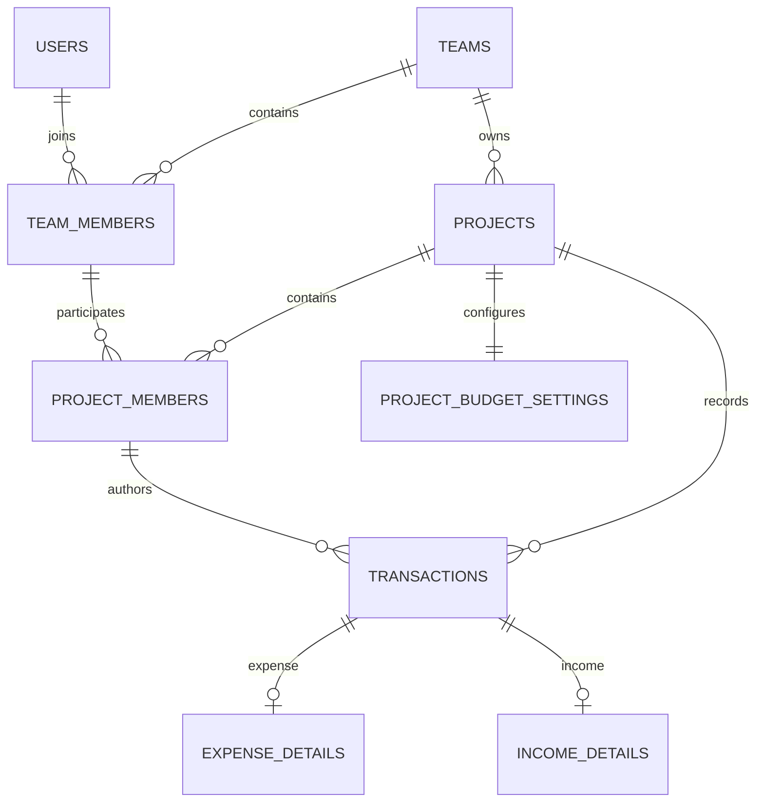

# 공금이 웹앱 ERD 및 데이터 테이블 명세서

> ERD 버전: v1.3 / 기능 기준: v3.3  
> 작성일: 2026-09-16  
> 기준 소스: 공금이_웹앱_기능명세서_v3.3.md, 기존 ERD v1.2  
> 범위: 논리 모델·MySQL 지향 컬럼/키·서비스 계약·ERD 이미지  
> 산출물: 전체도 1장, 영역별 상세도 6장, 확대용 SVG, 재생성용 구조 데이터

## 1. 설계 기준과 변경 결과

이 문서는 **공금이 웹앱 기능명세 v3.3**을 우선 기준으로 삼는다. 화면설계서 PDF는 화면의 참고 자료이며, 정책이 다르면 기능명세와 그 부록 B를 따른다. 기존 ERD v1.2를 확인한 뒤 재설계했으며 기능명세/PDF 자체는 수정하지 않았다. 대상은 Spring Boot + MySQL 관계형 설계다. 실행한 DB 마이그레이션 SQL이나 앱 테스트 결과가 아니다.

기존 29개 테이블의 역할을 재검토하여 **36개**로 구성했다. `device_tokens`는 `push_subscriptions`로 대체하고 아래 7개를 추가했다. 화면마다 테이블을 만드는 대신 실제 저장해야 하는 상태를 분리했다. 추가된 테이블 이름/분리 방식은 구현 설계 선택이며 새로운 사용자 기능을 추가한 것이 아니다.

| 추가 테이블 | 필요한 이유 | 기준 |
| --- | --- | --- |
| project_files | 파일 객체와 프로젝트 접근 범위 분리, 정당한 공유 참조 보호 | §0.7, §0.10 |
| budget_alert_states | 미설정/해제/재설정 및 기준 토글 시 도달 전환 추적 | §0.6 |
| notification_events | 사건 ID·발생 당시 정보·앱 내/외부 발송 분리 | §0.12 |
| notification_deliveries | 외부 발송 대기·재시도·방해금지/다이제스트 기록 | §0.7, §0.12 |
| idempotency_requests | 거래뿐 아니라 예산 no-op/변경·내보내기 저장 재시도 보장 | §0.7 |
| deletion_jobs | 삭제 대상이 없어져도 남는 독립 정리 작업 | §0.10 |
| deletion_job_items | 파일 키·늦은 콜백·공유 참조·실패별 재시도 | §0.10 |

| v1.2 대비 핵심 변경 | v1.3 설계 |
| --- | --- |
| 목표 예산 0원 기본값 | target_budget NULL 허용/기본 NULL. 0원은 그대로 실제 0원 |
| 경고 기준 컬럼 | 고정 80/100은 코드 상수, warning_enabled/critical_enabled만 저장 |
| 숫자 금액 변경 중심 이력 | NULL 전후·최초 설정/변경/해제/재설정/선택 변경, P0 이력 |
| 예산 변경만으로 이벤트 미발송 | 설정·재활성화 후 이미 도달했다면 1회 이벤트 생성 |
| 서비스만으로 프로젝트 일치 | 팀/멤버/작성자/카테고리/증빙/OCR 복합 FK + 활성 권한 서비스 검증 |
| 모든 파일 프로젝트 독점 | 물리 객체와 프로젝트 바인딩 분리, 타 업무 유효 공유 참조 보호 |
| 원본·표시용 이미지 구분 부족 | 처리용 임시 원본과 마스킹 표시용/썸네일 구분, 원본 해시 별도 보존 |
| 알림 객체에 내용 복제 | 사건과 수신 기록 분리. 본인 행위도 앱 내 알림 생성, 푸시만 억제 |
| 저장 파일 상태만으로 삭제 재개 | 부모 CASCADE와 독립인 삭제 작업·대상별 상태 |
| 예산 이력 영구 테이블 유지 | 운영 이력은 프로젝트 삭제 시 정리, 동일 사건의 영구 감사 사본 보존 |
| 파일 생성 모두 ADMIN 전용 | 결산 출력은 총무, 갤러리 ZIP은 참여자. job_kind로 권한 분기 |
| 카테고리 is_active 확장 | 미정의 비활성화 제거, 사용 중 삭제는 CATEGORY_IN_USE |

## 2. 읽는 방법과 공통 규칙

- PK=기본키, FK=다른 테이블 참조, UK=중복 금지, IDX=검색용 인덱스, AI=자동 증가. Null Y는 값 없음 허용이다.
- 이미지의 실선은 실제 FK이며 부모 쪽 `1`/`0..1`, 자식 쪽 `0..N`/`0..1`을 표기한다. 복합 FK는 선 하나로 표시하되 전체 구성 컬럼은 상세 FK 표를 따른다. 외부 도메인 표는 회색 `CONTEXT`로 표시한다.
- `BIGINT UNSIGNED`는 내부 ID/원 단위 금액, `DATETIME(6)`는 UTC 서버 시각, `DATE`는 회계일자다. KRW 단일 통화이며 합계·순지출·잔액 계산은 부호와 충분한 범위를 가진 타입으로 계산한다.
- 역할/상태는 문자열 enum 허용 집합을 서버와 DB CHECK로 제한한다. 컬럼 표의 기본값이 비어 있으면 서비스가 명시 제공한다. 세부 테이블에 없는 created_at/version을 임의로 가정하지 않는다.
- 일반 FK는 RESTRICT. CASCADE/SET NULL은 FK 상세표에 지정한 관계에만 적용한다. 사용자 행은 탈퇴 시 tombstone으로 남긴다.
- 모든 복합 FK의 참조 대상은 명시된 UK를 먼저 생성한다. 자식 복합 FK 컬럼 순서와 참조 컬럼 타입·정렬 규칙을 일치시킨다. MySQL 실제 버전에서 CHECK/생성 열·인덱스 길이를 검증해야 한다.
- `project_members.team_id/user_id`는 무결성 제약을 위한 의도적 중복이다. 프로젝트/멤버의 소속·사용자는 불변이며 복합 FK로 원본과 일치시킨다. 단순 중복 캐시로 자유 수정하지 않는다.
- 잔액·총수입·총지출·소진율은 조회 시 계산한다. `budget_alert_states`는 알림 도달 상태이지 회계 합계의 원본이 아니다. 캘린더·대시보드·결산·갤러리용 별도 원장은 없다.

## 3. 핵심 ERD

위 그림은 핵심 관계만 표시한다. 프로젝트 생성 트랜잭션은 예산 설정·도달 상태 1행씩을 반드시 만든다. DB의 자식 FK 자체가 부모의 ‘최소 1개 자식’을 강제하지는 않는다. 유형별 거래 상세도 서비스가 정확히 하나를 생성한다. 전체 36개 표의 관계와 컬럼은 아래 상세 명세 및 이미지 묶음을 기준으로 한다.

## 4. 전체 테이블 목록

| 번호 | 영역 | 테이블 | 역할 | 기반 도입 |
| ---: | --- | --- | --- | --- |
| 1 | 계정·인증 | `users` | 사용자 | P0 |
| 2 | 계정·인증 | `social_accounts` | 소셜 연동 | P1 |
| 3 | 계정·인증 | `terms` | 약관 버전 | P0 |
| 4 | 계정·인증 | `term_consents` | 약관 동의 | P0 |
| 5 | 계정·인증 | `user_sessions` | 로그인 세션 | P0 |
| 6 | 계정·인증 | `verification_tokens` | 단계별 인증 자격 | P1 |
| 7 | 계정·인증 | `user_security_settings` | 보안 설정 | P1 |
| 8 | 계정·인증 | `totp_recovery_codes` | 미사용 복구 코드 | P1 |
| 9 | 계정·인증 | `login_histories` | 로그인 시도 | P0 |
| 10 | 팀·프로젝트 | `teams` | 팀 | P0 |
| 11 | 팀·프로젝트 | `team_members` | 팀 소속 이력 | P0 |
| 12 | 팀·프로젝트 | `team_invitations` | 단일 응답 초대 | P0 |
| 13 | 팀·프로젝트 | `projects` | 프로젝트 장부 | P0 |
| 14 | 팀·프로젝트 | `project_members` | 프로젝트 참여 이력 | P0 |
| 15 | 예산·거래 | `project_budget_settings` | 목표 예산 설정 | P0 |
| 16 | 예산·거래 | `budget_alert_states` | 임계 도달 상태 | P0 |
| 17 | 예산·거래 | `budget_change_histories` | 예산 변경 이력 | P0 |
| 18 | 예산·거래 | `project_categories` | 지출 카테고리 | P0 |
| 19 | 예산·거래 | `transactions` | 회계 원장 | P0 |
| 20 | 예산·거래 | `expense_details` | 지출 상세 | P0 |
| 21 | 예산·거래 | `income_details` | 수입 상세 | P0 |
| 22 | 예산·거래 | `transaction_items` | 지출 품목 | P0 |
| 23 | 파일·OCR·출력 | `stored_files` | 물리 파일 객체 | P0 |
| 24 | 파일·OCR·출력 | `project_files` | 프로젝트 파일 바인딩 | P0 |
| 25 | 파일·OCR·출력 | `transaction_attachments` | 거래 증빙 연결 | P0 |
| 26 | 파일·OCR·출력 | `ocr_jobs` | OCR 작업 | P0 |
| 27 | 파일·OCR·출력 | `export_jobs` | 결산·증빙 ZIP 생성 | P1; PDF P2 |
| 28 | 알림·발송 | `notification_settings` | 개인 푸시 설정 | P0 |
| 29 | 알림·발송 | `push_subscriptions` | 브라우저 푸시 구독 | P1 |
| 30 | 알림·발송 | `notification_events` | 알림 사건 | P0 |
| 31 | 알림·발송 | `notifications` | 수신자별 앱 내 알림 | P0 |
| 32 | 알림·발송 | `notification_deliveries` | 외부 발송 대기 | P1 |
| 33 | 감사·멱등·삭제 | `audit_logs` | 영구 감사 증적 | P0 |
| 34 | 감사·멱등·삭제 | `idempotency_requests` | 성공 요청 멱등 기록 | P0 |
| 35 | 감사·멱등·삭제 | `deletion_jobs` | 독립 삭제 작업 | P0/P1 |
| 36 | 감사·멱등·삭제 | `deletion_job_items` | 삭제 대상 및 재시도 | P0/P1 |

### 4.1 기능 ID 추적표

| 기능 ID | 주요 테이블/계약 |
| --- | --- |
| F-AUTH-01 | users, terms, term_consents, notification_settings, user_sessions |
| F-AUTH-02 | users 유일키와 서버 중복 확인 |
| F-AUTH-03 | terms, term_consents |
| F-AUTH-04 | social_accounts, users, verification_tokens, 약관/2FA 계약 |
| F-AUTH-05 | users, user_sessions, login_histories, verification_tokens |
| F-AUTH-06 | verification_tokens, user_sessions |
| F-AUTH-07 | user_sessions, push_subscriptions, Redis access TTL |
| F-AUTH-08 | users 및 §10.2 전체 정리 |
| F-TEAM-01 | teams, team_members |
| F-TEAM-02 | teams, stored_files |
| F-TEAM-03 | deletion_jobs/items, 팀 하위 정리, audit_logs |
| F-TEAM-04 | team_invitations, notification_events/notifications |
| F-TEAM-05 | team_invitations, team_members, project_members |
| F-TEAM-06 | team_members, team_invitations |
| F-TEAM-07 | team_members, audit_logs, 알림 사건 |
| F-TEAM-08 | team_members, project_members, 마지막 총무 보호 |
| F-TEAM-09 | team_members, project_members, 마지막 총무 보호 |
| F-PROJ-01 | projects, project_members, project_budget_settings, budget_alert_states, project_categories |
| F-PROJ-02 | project_budget_settings, budget_change_histories, budget_alert_states, audit_logs, idempotency_requests |
| F-PROJ-03 | transactions, income_details |
| F-PROJ-04 | projects, project_members, 복합 FK·후임 |
| F-PROJ-05 | projects/예산/카테고리/멤버 설정 복제, 원장·이력 미복제 |
| F-PROJ-06 | transactions 합계, 예산 상태, 최근 거래 |
| F-PROJ-07 | project_categories, CATEGORY_IN_USE |
| F-PROJ-08 | projects 및 P0 예산 저장 계약 |
| F-PROJ-09 | projects.status, audit_logs |
| F-PROJ-10 | transactions, 카테고리/일자별 집계 |
| F-PROJ-11 | deletion_jobs/items, 프로젝트 하위 정리, audit_logs |
| F-SEC-01 | user_security_settings, totp_recovery_codes, verification_tokens |
| F-SEC-02 | 기기 로컬 기능; 별도 업무 DB 없음 |
| F-SEC-03 | user_security_settings, 세션 재인증 |
| F-SEC-04 | login_histories, user_sessions |
| F-SEC-05 | stored_files 마스킹 파생본, OCR/지출 마스킹 |
| F-SEC-06 | verification_tokens.REAUTH + 현재 권한 |
| F-SEC-07 | audit_logs, 범위별 조회 |
| F-SEC-08 | 비밀번호/시크릿 암호화, stored_files, TLS·키 관리 |
| F-HIST-01 | ocr_jobs, stored_files, project_files, transactions 및 지출 상세 |
| F-HIST-02 | transactions, expense_details/income_details, 증빙 |
| F-HIST-03 | transactions, 카테고리/품목/유형별 상세 조회 |
| F-HIST-04 | transactions, 유형별 상세, 품목, 첨부 |
| F-HIST-05 | transactions.version/status, audit_logs, 멱등/예산 검증 |
| F-HIST-06 | transactions.business_date 집계 |
| F-HIST-07 | transaction_attachments, project_files, export_jobs.GALLERY_ZIP |
| F-EXP-01 | export_jobs.SETTLEMENT(XLSX), 파일, audit_logs |
| F-EXP-02 | export_jobs.SETTLEMENT(CSV), 파일, audit_logs |
| F-EXP-03 | export_jobs.SETTLEMENT(PDF), 파일, audit_logs |
| F-NOTI-01 | notification_events, notifications |
| F-NOTI-02 | notifications.read_at + 현재 대상 접근 검사 |
| F-NOTI-03 | notifications 물리 삭제/읽은 뒤 30일 정리 |
| F-NOTI-04 | notification_settings, push_subscriptions, notification_deliveries |

## 5. 테이블별 상세 명세

복합 FK에 `SET NULL`을 적용할 때 NOT NULL project_id까지 비우는 오류를 피하기 위해 범위 일치용 복합 FK는 RESTRICT로 둔다. 삭제 서비스가 자식을 먼저 정리한다. 삭제 정책은 아래 FK 표가 우선이다.

### 5.1 계정·인증

영역별 이미지: [PNG](images/01_identity.png) · [확대용 SVG](images/01_identity.svg)

#### 5.1.1 `users` — 사용자

기반 도입: **P0**.

| 컬럼 | 타입 | Null | 키/기본값 | 설명 |
| --- | --- | :---: | --- | --- |
| `id` | `BIGINT UNSIGNED` | N | PK, AI | 사용자 ID |
| `login_id` | `VARCHAR(20)` | N | UK | 로그인 아이디 |
| `email` | `VARCHAR(254)` | N | UK | 소문자 정규화 이메일 |
| `password_hash` | `VARCHAR(255)` | Y | — | 소셜 전용 계정은 NULL 가능 |
| `display_name` | `VARCHAR(20)` | N | — | 표시 이름 |
| `profile_file_id` | `BIGINT UNSIGNED` | Y | FK | 프로필 이미지 |
| `status` | `VARCHAR(20)` | N | ACTIVE | ACTIVE, LOCKED, WITHDRAWN |
| `failed_login_count` | `TINYINT UNSIGNED` | N | 0 | 연속 로그인 실패 횟수 |
| `locked_until` | `DATETIME(6)` | Y | — | 임시 잠금 종료 시각 |
| `withdrawn_at` | `DATETIME(6)` | Y | — | 탈퇴 시각 |
| `created_at` | `DATETIME(6)` | N | — | 가입 시각 |
| `updated_at` | `DATETIME(6)` | N | — | 수정 시각 |
| `version` | `BIGINT UNSIGNED` | N | 0 | 낙관적 잠금 |

제약·동작:

- UK(login_id), UK(email). 일반 가입 이름 2~20자, ID 4~20자 정규식은 서버 검증. 이메일 정규화 후 유일성 검사.
- 탈퇴 시 내부 PK는 유지하며 로그인 식별값 비식별화, password_hash/profile_file_id NULL. 일반 응답·검색·내보내기는 원래 이름 스냅샷을 반환하지 않는다.

| FK 컬럼 | 참조 테이블(컬럼) | ON DELETE |
| --- | --- | --- |
| `profile_file_id` | `stored_files(id)` | RESTRICT |

#### 5.1.2 `social_accounts` — 소셜 연동

기반 도입: **P1**.

| 컬럼 | 타입 | Null | 키/기본값 | 설명 |
| --- | --- | :---: | --- | --- |
| `id` | `BIGINT UNSIGNED` | N | PK, AI | 소셜 연동 ID |
| `user_id` | `BIGINT UNSIGNED` | N | FK | 사용자 |
| `provider` | `VARCHAR(20)` | N | — | GOOGLE, KAKAO, APPLE |
| `provider_subject` | `VARCHAR(255)` | N | — | 제공자 고유 사용자 값 |
| `provider_email` | `VARCHAR(254)` | Y | — | 제공자가 반환한 이메일 |
| `linked_at` | `DATETIME(6)` | N | — | 연동 시각 |
| `last_login_at` | `DATETIME(6)` | Y | — | 최근 사용 시각 |

제약·동작:

- UK(provider, provider_subject), UK(user_id, provider). 동일 이메일만으로 자동 연동 금지; 기존 계정 비밀번호·활성 2FA 확인.

| FK 컬럼 | 참조 테이블(컬럼) | ON DELETE |
| --- | --- | --- |
| `user_id` | `users(id)` | RESTRICT |

#### 5.1.3 `terms` — 약관 버전

기반 도입: **P0**.

| 컬럼 | 타입 | Null | 키/기본값 | 설명 |
| --- | --- | :---: | --- | --- |
| `id` | `BIGINT UNSIGNED` | N | PK, AI | 약관 버전 ID |
| `term_type` | `VARCHAR(30)` | N | — | SERVICE, PRIVACY, MARKETING |
| `version_name` | `VARCHAR(30)` | N | — | v1.0 등 |
| `title` | `VARCHAR(200)` | N | — | 약관 제목 |
| `content` | `LONGTEXT` | N | — | 약관 전문 |
| `is_required` | `BOOLEAN` | N | — | 필수 여부 |
| `published_at` | `DATETIME(6)` | N | — | 시행 시각 |
| `retired_at` | `DATETIME(6)` | Y | — | 폐기 시각 |

제약·동작:

- UK(term_type, version_name). 필수 약관 2종의 실제 게시 버전을 저장한다.

업무 대상 FK 없음. ID 스냅샷은 참조 무결성/접근권한을 자동 부여하지 않는다.

#### 5.1.4 `term_consents` — 약관 동의

기반 도입: **P0**.

| 컬럼 | 타입 | Null | 키/기본값 | 설명 |
| --- | --- | :---: | --- | --- |
| `id` | `BIGINT UNSIGNED` | N | PK, AI | 동의 ID |
| `user_id` | `BIGINT UNSIGNED` | N | FK | 사용자 |
| `term_id` | `BIGINT UNSIGNED` | N | FK | 정확한 약관 버전 |
| `is_agreed` | `BOOLEAN` | N | — | 동의 여부 |
| `agreed_at` | `DATETIME(6)` | N | — | 선택 시각 |
| `withdrawn_at` | `DATETIME(6)` | Y | — | 선택 동의 철회 시각 |
| `ip_address` | `VARBINARY(16)` | Y | — | 동의 요청 IP |

제약·동작:

- UK(user_id, term_id). 사용자·필수 동의·기본 알림 설정은 같은 가입 트랜잭션. 탈퇴 시 사용자 연결 동의 삭제.

| FK 컬럼 | 참조 테이블(컬럼) | ON DELETE |
| --- | --- | --- |
| `user_id` | `users(id)` | RESTRICT |
| `term_id` | `terms(id)` | RESTRICT |

#### 5.1.5 `user_sessions` — 로그인 세션

기반 도입: **P0**.

| 컬럼 | 타입 | Null | 키/기본값 | 설명 |
| --- | --- | :---: | --- | --- |
| `id` | `CHAR(36)` | N | PK | 세션 UUID |
| `user_id` | `BIGINT UNSIGNED` | N | FK | 사용자 |
| `refresh_token_hash` | `CHAR(64)` | N | UK | Refresh Token 해시 |
| `device_name` | `VARCHAR(200)` | Y | — | 기기 표시명 |
| `user_agent` | `VARCHAR(500)` | Y | — | 브라우저·앱 정보 |
| `ip_address` | `VARBINARY(16)` | Y | — | 최근 IP |
| `issued_at` | `DATETIME(6)` | N | — | 발급 시각 |
| `last_seen_at` | `DATETIME(6)` | N | — | 최근 사용 시각 |
| `expires_at` | `DATETIME(6)` | N | IDX | 만료 시각 |
| `revoked_at` | `DATETIME(6)` | Y | — | 원격 로그아웃 시각 |
| `revoke_reason` | `VARCHAR(50)` | Y | — | LOGOUT, REMOTE, WITHDRAWAL 등 |

제약·동작:

- UK(refresh_token_hash), IDX(user_id, revoked_at, expires_at). Access 2시간/Refresh 14일, JWT sid를 이 행에 연결한다.
- 매 보호 요청에서 서명/만료 및 세션 활성 검사. 세션 취소 시 기존 access도 즉시 차단. 개별 access 블랙리스트는 Redis TTL로 만료까지 유지(업무 테이블 추가 없음).

| FK 컬럼 | 참조 테이블(컬럼) | ON DELETE |
| --- | --- | --- |
| `user_id` | `users(id)` | RESTRICT |

#### 5.1.6 `verification_tokens` — 단계별 인증 자격

기반 도입: **P1**.

| 컬럼 | 타입 | Null | 키/기본값 | 설명 |
| --- | --- | :---: | --- | --- |
| `id` | `BIGINT UNSIGNED` | N | PK, AI | 토큰 ID |
| `user_id` | `BIGINT UNSIGNED` | Y | FK | 가입 전 인증은 NULL 가능 |
| `target_email` | `VARCHAR(254)` | Y | IDX | 이메일 인증/재설정 코드에는 필수 |
| `purpose` | `VARCHAR(30)` | N | — | RESET_CODE, RESET_GRANT, LOGIN_2FA, REAUTH, EMAIL_VERIFY |
| `challenge_id` | `CHAR(36)` | N | UK | 외부 공개용 무작위 요청 식별자; 그 자체는 인증 권한 아님 |
| `parent_token_id` | `BIGINT UNSIGNED` | Y | UK, FK | GRANT를 발급한 CODE; 한 CODE당 GRANT 최대 1개 |
| `token_hash` | `CHAR(64)` | Y | — | 계정·목적·challenge_id에 결합한 HMAC; 소모/폐기 후 NULL |
| `hash_key_version` | `VARCHAR(30)` | Y | — | 짧은 코드 HMAC 키 버전; 키 본문은 DB 밖 |
| `context_json` | `JSON` | Y | — | REAUTH의 세션/작업/대상/요청 해시, 안전한 초대 복귀 식별자; 비밀값 금지 |
| `attempt_count` | `TINYINT UNSIGNED` | N | 0 | 검증 실패 횟수 |
| `resend_available_at` | `DATETIME(6)` | Y | — | CODE 발급 후 최소 60초 |
| `expires_at` | `DATETIME(6)` | N | IDX | 만료 시각 |
| `used_at` | `DATETIME(6)` | Y | — | 사용 시각 |
| `revoked_at` | `DATETIME(6)` | Y | — | 재발급·실패 제한·탈퇴로 무효화 |
| `created_at` | `DATETIME(6)` | N | — | 발급 시각 |

제약·동작:

- UK(challenge_id), UK(parent_token_id). RESET_GRANT의 부모는 같은 사용자의 RESET_CODE, 그 외 부모 NULL; 자기 참조/순환 금지.
- RESET_CODE 5분/6자리, 재발송 60초, 5회 실패. 성공 시 code 소모와 grant 1개 발급 원자 처리. RESET_GRANT 10분; 비밀번호 변경·소모·전체 세션 취소 원자 처리.
- LOGIN_2FA와 REAUTH는 5분. 정식 업무 토큰과 혼용 금지. REAUTH는 사용자·sid·행위·대상에 바인딩. 키 기반 해시의 비밀키는 DB 외부 보관.

| FK 컬럼 | 참조 테이블(컬럼) | ON DELETE |
| --- | --- | --- |
| `user_id` | `users(id)` | RESTRICT |
| `parent_token_id` | `verification_tokens(id)` | RESTRICT |

#### 5.1.7 `user_security_settings` — 보안 설정

기반 도입: **P1**.

| 컬럼 | 타입 | Null | 키/기본값 | 설명 |
| --- | --- | :---: | --- | --- |
| `user_id` | `BIGINT UNSIGNED` | N | PK, FK | 사용자 |
| `totp_enabled` | `BOOLEAN` | N | FALSE | 2FA 사용 여부 |
| `totp_secret_ciphertext` | `VARBINARY(512)` | Y | — | AES 암호화 TOTP 비밀키 |
| `totp_enabled_at` | `DATETIME(6)` | Y | — | 활성화 시각 |
| `totp_failed_count` | `TINYINT UNSIGNED` | N | 0 | 연속 OTP 실패 |
| `totp_locked_until` | `DATETIME(6)` | Y | — | 5회 실패 시 5분 잠금 |
| `last_accepted_totp_step` | `BIGINT` | Y | — | 동일 시간창 코드 재사용 방지 |
| `auto_lock_enabled` | `BOOLEAN` | N | FALSE | 자동 잠금 여부 |
| `auto_lock_minutes` | `SMALLINT UNSIGNED` | Y | — | 10, 15, 30, 60 |
| `updated_at` | `DATETIME(6)` | N | — | 수정 시각 |
| `version` | `BIGINT UNSIGNED` | N | 0 | 낙관적 잠금 |

제약·동작:

- user_id PK. OTP 5회 실패/5분 잠금 후 새 challenge 요구. last_accepted_totp_step은 동시 OTP 재사용 차단용.
- auto_lock_minutes는 활성 시 10/15/30/60, 최초 15분. 2FA 시크릿은 암호문만 저장; 탈퇴·해제 시 제거.

| FK 컬럼 | 참조 테이블(컬럼) | ON DELETE |
| --- | --- | --- |
| `user_id` | `users(id)` | RESTRICT |

#### 5.1.8 `totp_recovery_codes` — 미사용 복구 코드

기반 도입: **P1**.

| 컬럼 | 타입 | Null | 키/기본값 | 설명 |
| --- | --- | :---: | --- | --- |
| `id` | `BIGINT UNSIGNED` | N | PK, AI | 복구 코드 ID |
| `user_id` | `BIGINT UNSIGNED` | N | FK | 사용자 |
| `code_hash` | `CHAR(64)` | N | UK | 복구 코드 해시 |
| `created_at` | `DATETIME(6)` | N | — | 생성 시각 |

제약·동작:

- 복구 코드 10개, 원문 1회 표시. 성공 트랜잭션에서 해당 행 물리 DELETE, 사용된 해시를 used_at 방식으로 보존하지 않는다.

| FK 컬럼 | 참조 테이블(컬럼) | ON DELETE |
| --- | --- | --- |
| `user_id` | `users(id)` | RESTRICT |

#### 5.1.9 `login_histories` — 로그인 시도

기반 도입: **P0**.

| 컬럼 | 타입 | Null | 키/기본값 | 설명 |
| --- | --- | :---: | --- | --- |
| `id` | `BIGINT UNSIGNED` | N | PK, AI | 로그인 이력 ID |
| `user_id` | `BIGINT UNSIGNED` | Y | FK | 식별 실패 시 NULL |
| `login_identifier_hash` | `CHAR(64)` | Y | — | 계정 탐색 방지용 식별자 해시 |
| `session_id` | `CHAR(36)` | Y | FK | 성공 세션 |
| `success` | `BOOLEAN` | N | — | 성공 여부 |
| `failure_reason` | `VARCHAR(50)` | Y | — | 내부 분석용 사유 |
| `ip_address` | `VARBINARY(16)` | Y | — | 접속 IP |
| `user_agent` | `VARCHAR(500)` | Y | — | 기기·브라우저 |
| `occurred_at` | `DATETIME(6)` | N | IDX | 시도 시각 |
| `auth_stage` | `VARCHAR(20)` | N | — | PASSWORD, SOCIAL, OTP, RECOVERY, COMPLETE |
| `login_attempt_id` | `CHAR(36)` | N | — | 전체 로그인 시도 연결 ID |

제약·동작:

- 저장은 P0. 전체 필수 인증 완료만 success=true. 1차/OTP 실패·잠금은 단계별 기록. 미식별 실패를 임의 계정에 귀속하지 않는다.
- IDX(user_id, occurred_at), IDX(login_attempt_id). 조회 최근 90일; 탈퇴 시 IP·기기·식별자 해시 삭제/비식별화. 감사와 같은 영구 보존 대상이 아니다.

| FK 컬럼 | 참조 테이블(컬럼) | ON DELETE |
| --- | --- | --- |
| `user_id` | `users(id)` | SET NULL |
| `session_id` | `user_sessions(id)` | SET NULL |

### 5.2 팀·프로젝트

영역별 이미지: [PNG](images/02_membership.png) · [확대용 SVG](images/02_membership.svg)

#### 5.2.1 `teams` — 팀

기반 도입: **P0**.

| 컬럼 | 타입 | Null | 키/기본값 | 설명 |
| --- | --- | :---: | --- | --- |
| `id` | `BIGINT UNSIGNED` | N | PK, AI | 팀 ID |
| `name` | `VARCHAR(30)` | N | — | 팀명 |
| `description` | `VARCHAR(200)` | Y | — | 팀 설명 |
| `image_file_id` | `BIGINT UNSIGNED` | Y | FK | 대표 이미지 |
| `created_by_user_id` | `BIGINT UNSIGNED` | N | FK | 생성자 |
| `status` | `VARCHAR(20)` | N | ACTIVE | ACTIVE, DELETING; 삭제 중 접근/신규 작업 차단 |
| `created_at` | `DATETIME(6)` | N | — | 생성 시각 |
| `updated_at` | `DATETIME(6)` | N | — | 수정 시각 |
| `version` | `BIGINT UNSIGNED` | N | 0 | 낙관적 잠금 |

제약·동작:

- 상태 ACTIVE/DELETING. 활성 OWNER 정확히 1명은 팀 행 잠금+트랜잭션으로 보장한다.

| FK 컬럼 | 참조 테이블(컬럼) | ON DELETE |
| --- | --- | --- |
| `created_by_user_id` | `users(id)` | RESTRICT |
| `image_file_id` | `stored_files(id)` | RESTRICT |

#### 5.2.2 `team_members` — 팀 소속 이력

기반 도입: **P0**.

| 컬럼 | 타입 | Null | 키/기본값 | 설명 |
| --- | --- | :---: | --- | --- |
| `id` | `BIGINT UNSIGNED` | N | PK, AI | 팀원 ID |
| `team_id` | `BIGINT UNSIGNED` | N | FK | 팀 |
| `user_id` | `BIGINT UNSIGNED` | N | FK | 사용자 |
| `role` | `VARCHAR(20)` | N | — | OWNER, ADMIN, MEMBER |
| `status` | `VARCHAR(20)` | N | ACTIVE | ACTIVE, LEFT, KICKED |
| `joined_at` | `DATETIME(6)` | N | — | 가입 시각 |
| `ended_at` | `DATETIME(6)` | Y | — | 탈퇴·추방 시각 |
| `ended_reason` | `VARCHAR(255)` | Y | — | 추방 사유 등 |
| `invited_by_member_id` | `BIGINT UNSIGNED` | Y | FK | 초대한 팀원 |
| `active_marker` | `TINYINT` | Y | GENERATED | ACTIVE이면 1, 아니면 NULL |
| `owner_marker` | `TINYINT` | Y | GENERATED | ACTIVE OWNER이면 1, 아니면 NULL |
| `created_at` | `DATETIME(6)` | N | — | 행 생성 시각 |
| `updated_at` | `DATETIME(6)` | N | — | 수정 시각 |
| `version` | `BIGINT UNSIGNED` | N | 0 | 낙관적 잠금 |

제약·동작:

- UK(team_id, user_id, active_marker), UK(team_id, owner_marker), UK(id, team_id, user_id), UK(id, team_id).
- active_marker=CASE WHEN status=ACTIVE THEN 1 ELSE NULL END, owner_marker=CASE WHEN status=ACTIVE AND role=OWNER THEN 1 ELSE NULL END.
- ACTIVE는 ended_at NULL, LEFT/KICKED는 종료시각 필수. 재가입은 새 행이며 기존 거래 참조는 변경하지 않는다.

| FK 컬럼 | 참조 테이블(컬럼) | ON DELETE |
| --- | --- | --- |
| `team_id` | `teams(id)` | RESTRICT |
| `user_id` | `users(id)` | RESTRICT |
| `invited_by_member_id` | `team_members(id)` | SET NULL |

#### 5.2.3 `team_invitations` — 단일 응답 초대

기반 도입: **P0**.

| 컬럼 | 타입 | Null | 키/기본값 | 설명 |
| --- | --- | :---: | --- | --- |
| `id` | `BIGINT UNSIGNED` | N | PK, AI | 초대 ID |
| `team_id` | `BIGINT UNSIGNED` | N | FK | 초대 팀 |
| `inviter_member_id` | `BIGINT UNSIGNED` | N | FK | 발신자 |
| `target_user_id` | `BIGINT UNSIGNED` | Y | FK | 가입 사용자 대상 |
| `target_email` | `VARCHAR(254)` | Y | IDX | 미가입 사용자 대상 |
| `initial_role` | `VARCHAR(20)` | N | MEMBER | ADMIN 또는 MEMBER |
| `invite_method` | `VARCHAR(20)` | N | — | DIRECT, CSV, LINK |
| `token_hash` | `CHAR(64)` | N | UK | 초대 링크 토큰 해시 |
| `status` | `VARCHAR(20)` | N | PENDING | PENDING, ACCEPTED, REJECTED, EXPIRED, CANCELED |
| `expires_at` | `DATETIME(6)` | N | IDX | 기본 7일 |
| `responded_at` | `DATETIME(6)` | Y | — | 응답 시각 |
| `responded_by_user_id` | `BIGINT UNSIGNED` | Y | FK | 실제 수락·거절 사용자, 특히 LINK 응답 추적 |
| `created_at` | `DATETIME(6)` | N | — | 발송 시각 |

제약·동작:

- UK(token_hash). DIRECT/CSV는 대상 계정 또는 이메일 필요. LINK도 1행당 한 번만 응답 가능(다회용 초대 아님).
- PENDING+미만료+대상 일치 확인 후 수락/거절과 멤버 생성 원자 처리. 외부 링크 로그인/가입 후 동일 초대 확인으로 복귀하며 자동 수락하지 않는다.

| FK 컬럼 | 참조 테이블(컬럼) | ON DELETE |
| --- | --- | --- |
| `team_id` | `teams(id)` | RESTRICT |
| `inviter_member_id, team_id` | `team_members(id, team_id)` | RESTRICT |
| `target_user_id` | `users(id)` | RESTRICT |
| `responded_by_user_id` | `users(id)` | RESTRICT |

#### 5.2.4 `projects` — 프로젝트 장부

기반 도입: **P0**.

| 컬럼 | 타입 | Null | 키/기본값 | 설명 |
| --- | --- | :---: | --- | --- |
| `id` | `BIGINT UNSIGNED` | N | PK, AI | 프로젝트 ID |
| `team_id` | `BIGINT UNSIGNED` | N | FK | 소유 팀 |
| `name` | `VARCHAR(30)` | N | — | 프로젝트명 |
| `description` | `VARCHAR(200)` | Y | — | 설명 |
| `start_date` | `DATE` | N | — | 시작일 |
| `end_date` | `DATE` | N | — | 종료일 |
| `status` | `VARCHAR(20)` | N | ACTIVE | ACTIVE, LOCKED, DELETING |
| `visibility` | `VARCHAR(20)` | N | SELECTED | TEAM_ALL, SELECTED |
| `auto_join_new_members` | `BOOLEAN` | N | FALSE | 공개 프로젝트 신규 팀원 자동 참여 |
| `created_by_member_id` | `BIGINT UNSIGNED` | N | FK | 생성자 |
| `locked_at` | `DATETIME(6)` | Y | — | 마감 시각 |
| `created_at` | `DATETIME(6)` | N | — | 생성 시각 |
| `updated_at` | `DATETIME(6)` | N | — | 수정 시각 |
| `version` | `BIGINT UNSIGNED` | N | 0 | 낙관적 잠금 |

제약·동작:

- UK(id, team_id), CHECK(start_date<=end_date). 초기 ACTIVE/SELECTED/auto_join_new_members=false. 모든 회계/예산 쓰기에 공통 프로젝트 잠금.
- TEAM_ALL 전환은 미참여자만 PROJECT_MEMBER로 추가하고 기존 역할 유지. 범위 변경만으로 기존 참여자를 제거하지 않는다.

| FK 컬럼 | 참조 테이블(컬럼) | ON DELETE |
| --- | --- | --- |
| `team_id` | `teams(id)` | RESTRICT |
| `created_by_member_id, team_id` | `team_members(id, team_id)` | RESTRICT |

#### 5.2.5 `project_members` — 프로젝트 참여 이력

기반 도입: **P0**.

| 컬럼 | 타입 | Null | 키/기본값 | 설명 |
| --- | --- | :---: | --- | --- |
| `id` | `BIGINT UNSIGNED` | N | PK, AI | 프로젝트 멤버 ID |
| `project_id` | `BIGINT UNSIGNED` | N | FK | 프로젝트 |
| `team_member_id` | `BIGINT UNSIGNED` | N | FK | 팀 멤버십 |
| `role` | `VARCHAR(30)` | N | — | PROJECT_ADMIN, PROJECT_MEMBER |
| `status` | `VARCHAR(20)` | N | ACTIVE | ACTIVE, INACTIVE |
| `joined_at` | `DATETIME(6)` | N | — | 참여 시각 |
| `ended_at` | `DATETIME(6)` | Y | — | 참여 종료 시각 |
| `active_marker` | `TINYINT` | Y | GENERATED | ACTIVE이면 1 |
| `created_at` | `DATETIME(6)` | N | — | 생성 시각 |
| `updated_at` | `DATETIME(6)` | N | — | 수정 시각 |
| `version` | `BIGINT UNSIGNED` | N | 0 | 낙관적 잠금 |
| `team_id` | `BIGINT UNSIGNED` | N | FK | 프로젝트·팀원 소속 일치용 |
| `user_id` | `BIGINT UNSIGNED` | N | FK | 팀원 사용자 일치용 |

제약·동작:

- UK(project_id, team_member_id, active_marker), UK(id, project_id, user_id), UK(id, project_id). active_marker는 ACTIVE만 1, 그 외 NULL.
- 복합 FK로 프로젝트의 팀과 팀원의 팀·사용자 일치를 보장. ACTIVE면 ended_at NULL. 마지막 총무 보호는 서비스 잠금 안에서 검사하며 LOCKED에서도 후임 지정 허용.

| FK 컬럼 | 참조 테이블(컬럼) | ON DELETE |
| --- | --- | --- |
| `project_id, team_id` | `projects(id, team_id)` | RESTRICT |
| `team_member_id, team_id, user_id` | `team_members(id, team_id, user_id)` | RESTRICT |

### 5.3 예산·거래

영역별 이미지: [PNG](images/03_ledger.png) · [확대용 SVG](images/03_ledger.svg)

#### 5.3.1 `project_budget_settings` — 목표 예산 설정

기반 도입: **P0**.

| 컬럼 | 타입 | Null | 키/기본값 | 설명 |
| --- | --- | :---: | --- | --- |
| `project_id` | `BIGINT UNSIGNED` | N | PK, FK | 명시 입력 |
| `target_budget` | `BIGINT UNSIGNED` | Y | NULL | NULL=UNSET, 0 이상=SET; 최대 10억원 |
| `over_budget_policy` | `VARCHAR(20)` | N | WARN | WARN/BLOCK, 기본 WARN |
| `warning_enabled` | `BOOLEAN` | N | TRUE | 80% 활성 |
| `critical_enabled` | `BOOLEAN` | N | TRUE | 100% 활성 |
| `first_configured_at` | `DATETIME(6)` | Y | — | 최초 SET 시각; 해제 후에도 유지 |
| `created_at` | `DATETIME(6)` | N | — | 명시 입력 |
| `updated_at` | `DATETIME(6)` | N | — | 명시 입력 |
| `version` | `BIGINT UNSIGNED` | N | 0 | 낙관적 수정 버전 |

제약·동작:

- CHECK(target_budget IS NULL OR target_budget BETWEEN 0 AND 1000000000). budget_configured/budget_mode는 금액에서 도출하며 중복 상태 컬럼을 두지 않는다.
- 임계값 80/100은 고정 상수. 신규 NULL/WARN/true/true. UNSET은 보존된 정책/알림을 적용하지 않는다. 해제 시 금액만 NULL, 정책/선택 유지.
- first_configured_at으로 INITIAL_SET/RESET을 구분한다. 복제 SET은 새 프로젝트 생성 시각, 복제 UNSET은 NULL; 과거 설정 이력/도달 상태를 복제하지 않는다.

| FK 컬럼 | 참조 테이블(컬럼) | ON DELETE |
| --- | --- | --- |
| `project_id` | `projects(id)` | RESTRICT |

#### 5.3.2 `budget_alert_states` — 임계 도달 상태

기반 도입: **P0**.

| 컬럼 | 타입 | Null | 키/기본값 | 설명 |
| --- | --- | :---: | --- | --- |
| `project_id` | `BIGINT UNSIGNED` | N | PK, FK | 명시 입력 |
| `warning_reached` | `BOOLEAN` | N | FALSE | 활성 80% 기준의 현재 도달 상태 |
| `critical_reached` | `BOOLEAN` | N | FALSE | 활성 100% 기준의 현재 도달 상태 |
| `event_sequence` | `BIGINT UNSIGNED` | N | 0 | 프로젝트별 새 임계 이벤트 순번 |
| `evaluated_at` | `DATETIME(6)` | N | — | 명시 입력 |
| `version` | `BIGINT UNSIGNED` | N | 0 | 낙관적 수정 버전 |

제약·동작:

- 프로젝트 생성 시 false/false/0. 회계 원장이 아니라 임계 이벤트 중복 방지 상태다. 거래/예산 변경과 같은 잠금·트랜잭션에서 갱신.
- T>0, 해당 기준 ON, 현재 전체 E 도달을 모두 만족할 때 true. false→true만 event 생성. 동시에 둘 다 도달하면 단일 이벤트의 thresholds=[80,100].
- UNSET/0원/기준 OFF는 해당 상태 false. 해제 후 재설정·기준 재활성화 시 현재 E로 새 전환 검사. 계속 true이면 반복 알림 없음.

| FK 컬럼 | 참조 테이블(컬럼) | ON DELETE |
| --- | --- | --- |
| `project_id` | `projects(id)` | RESTRICT |

#### 5.3.3 `budget_change_histories` — 예산 변경 이력

기반 도입: **P0**.

| 컬럼 | 타입 | Null | 키/기본값 | 설명 |
| --- | --- | :---: | --- | --- |
| `id` | `BIGINT UNSIGNED` | N | PK, AI | 내부 식별자 |
| `project_id` | `BIGINT UNSIGNED` | N | FK | 명시 입력 |
| `changed_by_project_member_id` | `BIGINT UNSIGNED` | N | FK | 명시 입력 |
| `changed_by_user_id` | `BIGINT UNSIGNED` | N | FK | 명시 입력 |
| `change_type` | `VARCHAR(30)` | N | — | INITIAL_SET, AMOUNT_CHANGED, UNSET, RESET, SETTINGS_CHANGED |
| `previous_budget` | `BIGINT UNSIGNED` | Y | — | 이전 NULL 또는 0~10억원 |
| `new_budget` | `BIGINT UNSIGNED` | Y | — | 이후 NULL 또는 0~10억원 |
| `previous_policy` | `VARCHAR(20)` | N | — | 명시 입력 |
| `new_policy` | `VARCHAR(20)` | N | — | 명시 입력 |
| `previous_warning_enabled` | `BOOLEAN` | N | — | 실제 변경 전/후 선택값; 요청 시 명시 저장 |
| `new_warning_enabled` | `BOOLEAN` | N | — | 실제 변경 전/후 선택값; 요청 시 명시 저장 |
| `previous_critical_enabled` | `BOOLEAN` | N | — | 실제 변경 전/후 선택값; 요청 시 명시 저장 |
| `new_critical_enabled` | `BOOLEAN` | N | — | 실제 변경 전/후 선택값; 요청 시 명시 저장 |
| `reason` | `VARCHAR(500)` | Y | — | 최초 설정 기본 사유, 금액/해제/재설정 필수; 설정만 변경은 선택 |
| `request_id` | `CHAR(36)` | N | UK | 저장 작업 멱등 ID 스냅샷 |
| `changed_at` | `DATETIME(6)` | N | — | 명시 입력 |

제약·동작:

- 저장 기반 P0. previous/new_configured는 각각 금액 IS NOT NULL에서 도출. NULL을 0으로 변환하지 않는다.
- 예산 저장·이력·영구 audit_logs·알림 대기를 같은 트랜잭션으로 확정. 동일 값 저장은 이력 없음. 운영 이력은 프로젝트 영구삭제 시 정리하되 감사 사본은 보존(v3.3 §0.10).
- IDX(project_id, changed_at), UK(request_id). 설정 여부/금액 변경을 유형으로 우선 분류하고 함께 바뀐 정책/체크도 전후값 저장.

| FK 컬럼 | 참조 테이블(컬럼) | ON DELETE |
| --- | --- | --- |
| `project_id` | `projects(id)` | RESTRICT |
| `changed_by_project_member_id, project_id, changed_by_user_id` | `project_members(id, project_id, user_id)` | RESTRICT |

#### 5.3.4 `project_categories` — 지출 카테고리

기반 도입: **P0**.

| 컬럼 | 타입 | Null | 키/기본값 | 설명 |
| --- | --- | :---: | --- | --- |
| `id` | `BIGINT UNSIGNED` | N | PK, AI | 카테고리 ID |
| `project_id` | `BIGINT UNSIGNED` | N | FK | 프로젝트 |
| `name` | `VARCHAR(50)` | N | — | 카테고리명 |
| `allocated_budget` | `BIGINT UNSIGNED` | Y | — | 선택 배분 예산 |
| `color_hex` | `CHAR(7)` | Y | — | #RRGGBB |
| `icon_key` | `VARCHAR(50)` | Y | — | 프론트 아이콘 키 |
| `sort_order` | `SMALLINT UNSIGNED` | N | 0 | 표시 순서 |
| `is_default` | `BOOLEAN` | N | FALSE | 기본 5종 여부 |
| `created_at` | `DATETIME(6)` | N | — | 생성 시각 |
| `updated_at` | `DATETIME(6)` | N | — | 수정 시각 |
| `version` | `BIGINT UNSIGNED` | N | 0 | 낙관적 잠금 |

제약·동작:

- UK(project_id, name), UK(id, project_id). ACTIVE/DELETED 거래가 하나라도 참조하면 CATEGORY_IN_USE. 비활성화로 성공 처리하지 않는다.
- allocated_budget은 선택 값이며 총예산 미설정과 독립. 배분 합계로 target_budget을 자동 설정하지 않는다.

| FK 컬럼 | 참조 테이블(컬럼) | ON DELETE |
| --- | --- | --- |
| `project_id` | `projects(id)` | RESTRICT |

#### 5.3.5 `transactions` — 회계 원장

기반 도입: **P0**.

| 컬럼 | 타입 | Null | 키/기본값 | 설명 |
| --- | --- | :---: | --- | --- |
| `id` | `BIGINT UNSIGNED` | N | PK, AI | 거래 ID |
| `project_id` | `BIGINT UNSIGNED` | N | FK | 프로젝트 |
| `type` | `VARCHAR(20)` | N | — | EXPENSE, INCOME |
| `amount` | `BIGINT UNSIGNED` | N | — | 1~1,000,000,000원 |
| `business_date` | `DATE` | N | IDX | 캘린더·결산 기준일 |
| `occurred_at` | `DATETIME(6)` | Y | — | 실제 거래 시각 UTC; 시각 미입력 시 NULL |
| `occurred_timezone` | `VARCHAR(40)` | N | Asia/Seoul | 원 거래 시간대 |
| `occurred_precision` | `VARCHAR(20)` | N | DATE | DATE, MINUTE, SECOND; 원문 정밀도 보존 |
| `category_id` | `BIGINT UNSIGNED` | Y | FK | 지출만 필수 |
| `entry_method` | `VARCHAR(20)` | N | — | OCR, MANUAL |
| `memo` | `VARCHAR(1000)` | Y | — | 거래 메모 |
| `registered_by_project_member_id` | `BIGINT UNSIGNED` | N | FK | 등록자 멤버십 |
| `registered_by_user_id` | `BIGINT UNSIGNED` | N | FK | 안정적인 사용자 참조 |
| `registered_by_name_snapshot` | `VARCHAR(100)` | N | — | 등록 당시 표시 이름 |
| `dedup_fingerprint` | `CHAR(64)` | Y | IDX | 정규화 가맹점+실제 거래 일시·정밀도+금액 지문; 시각 없으면 NULL |
| `dedup_rule_version` | `VARCHAR(30)` | Y | — | DATETIME_V1; 시각 없으면 업무 지문 NULL |
| `client_request_id` | `CHAR(36)` | N | UK 일부 | 등록 재시도 멱등 키; 사용자·프로젝트 범위 |
| `request_payload_hash` | `CHAR(64)` | N | — | 멱등 키에 바인딩한 정규화 등록 요청 해시 |
| `status` | `VARCHAR(20)` | N | ACTIVE | ACTIVE, DELETED |
| `deleted_by_project_member_id` | `BIGINT UNSIGNED` | Y | FK | 삭제자 |
| `deleted_at` | `DATETIME(6)` | Y | — | 소프트 삭제 시각 |
| `created_at` | `DATETIME(6)` | N | — | 등록 시각 |
| `updated_at` | `DATETIME(6)` | N | — | 수정 시각 |
| `version` | `BIGINT UNSIGNED` | N | 0 | 낙관적 잠금 |
| `occurred_local_text` | `VARCHAR(40)` | Y | — | 원문 정밀도대로 YYYY-MM-DDTHH:mm 또는 :ss |

제약·동작:

- UK(id, project_id), UK(project_id, registered_by_user_id, client_request_id). CHECK(amount BETWEEN 1 AND 1000000000).
- EXPENSE면 category_id 필수, INCOME이면 NULL. 각 유형 상세 정확히 하나, 반대 상세/수입 품목 금지. 유형·프로젝트·작성자는 불변.
- ACTIVE이면 deleted_at=NULL, DELETED이면 삭제시각 필수. 수정은 version 대조, 불일치 409 VERSION_CONFLICT. 작성자 관련 복합 FK는 과거 비활성 멤버도 허용.
- IDX(project_id,status,business_date,id), IDX(project_id,status,type,business_date), IDX(project_id,dedup_fingerprint). 파일 해시/업무 지문 검사는 공통 잠금 안에서 수행.
- occurred_precision=DATE이면 occurred_at/occurred_local_text/dedup_fingerprint NULL. MINUTE/SECOND는 원문 정밀도를 함께 비교; 분 자료를 초 자료와 같게 취급하지 않는다.

| FK 컬럼 | 참조 테이블(컬럼) | ON DELETE |
| --- | --- | --- |
| `project_id` | `projects(id)` | RESTRICT |
| `registered_by_project_member_id, project_id, registered_by_user_id` | `project_members(id, project_id, user_id)` | RESTRICT |
| `deleted_by_project_member_id, project_id` | `project_members(id, project_id)` | RESTRICT |
| `category_id, project_id` | `project_categories(id, project_id)` | RESTRICT |

#### 5.3.6 `expense_details` — 지출 상세

기반 도입: **P0**.

| 컬럼 | 타입 | Null | 키/기본값 | 설명 |
| --- | --- | :---: | --- | --- |
| `transaction_id` | `BIGINT UNSIGNED` | N | PK, FK | 지출 거래 |
| `merchant_name` | `VARCHAR(200)` | N | IDX | 상호명 |
| `business_number` | `VARCHAR(20)` | Y | — | 사업자등록번호 |
| `merchant_address` | `VARCHAR(500)` | Y | — | 가맹점 주소 |
| `subtotal_amount` | `BIGINT UNSIGNED` | Y | — | 공급가액 |
| `tax_amount` | `BIGINT UNSIGNED` | Y | — | 부가세 |
| `discount_amount` | `BIGINT UNSIGNED` | Y | — | 할인액 |
| `payment_method` | `VARCHAR(30)` | Y | — | CARD, CASH, TRANSFER, ETC |
| `masked_card_number` | `VARCHAR(30)` | Y | — | 마스킹된 번호만 저장 |
| `approval_number` | `VARCHAR(50)` | Y | — | 카드 승인번호 |

제약·동작:

- PK(transaction_id). business_number 우선으로 가맹점 정규화, 없으면 상호 trim·공백 축약·영문 소문자. 민감 번호 전체 저장 금지.

| FK 컬럼 | 참조 테이블(컬럼) | ON DELETE |
| --- | --- | --- |
| `transaction_id` | `transactions(id)` | CASCADE |

#### 5.3.7 `income_details` — 수입 상세

기반 도입: **P0**.

| 컬럼 | 타입 | Null | 키/기본값 | 설명 |
| --- | --- | :---: | --- | --- |
| `transaction_id` | `BIGINT UNSIGNED` | N | PK, FK | 수입 거래 |
| `income_type` | `VARCHAR(30)` | N | — | INITIAL_FUND, CARRYOVER, SUPPORT, DONATION, OTHER |
| `depositor_name` | `VARCHAR(100)` | Y | — | 입금자명 |

제약·동작:

- PK(transaction_id). INITIAL_FUND/CARRYOVER/SUPPORT/DONATION/OTHER. 입금자는 선택. 현재 총무만 생성·수정·삭제 가능.

| FK 컬럼 | 참조 테이블(컬럼) | ON DELETE |
| --- | --- | --- |
| `transaction_id` | `transactions(id)` | CASCADE |

#### 5.3.8 `transaction_items` — 지출 품목

기반 도입: **P0**.

| 컬럼 | 타입 | Null | 키/기본값 | 설명 |
| --- | --- | :---: | --- | --- |
| `id` | `BIGINT UNSIGNED` | N | PK, AI | 품목 ID |
| `transaction_id` | `BIGINT UNSIGNED` | N | FK | 지출 거래 |
| `item_name` | `VARCHAR(255)` | N | IDX | 품목명 |
| `quantity` | `DECIMAL(12,3)` | Y | — | 수량 |
| `unit_price` | `BIGINT UNSIGNED` | Y | — | 단가 |
| `total_price` | `BIGINT UNSIGNED` | Y | — | 품목 합계 |
| `sort_order` | `SMALLINT UNSIGNED` | N | 0 | 영수증 표시 순서 |
| `created_at` | `DATETIME(6)` | N | — | 생성 시각 |
| `updated_at` | `DATETIME(6)` | N | — | 수정 시각 |

제약·동작:

- IDX(transaction_id,sort_order). 지출에만 연결. 품목 JOIN으로 거래 총액을 중복 합산하지 않는다.

| FK 컬럼 | 참조 테이블(컬럼) | ON DELETE |
| --- | --- | --- |
| `transaction_id` | `transactions(id)` | CASCADE |

### 5.4 파일·OCR·출력

영역별 이미지: [PNG](images/04_evidence.png) · [확대용 SVG](images/04_evidence.svg)

#### 5.4.1 `stored_files` — 물리 파일 객체

기반 도입: **P0**.

| 컬럼 | 타입 | Null | 키/기본값 | 설명 |
| --- | --- | :---: | --- | --- |
| `id` | `BIGINT UNSIGNED` | N | PK, AI | 내부 식별자 |
| `uploaded_by_user_id` | `BIGINT UNSIGNED` | Y | FK | 업로더 |
| `storage_provider` | `VARCHAR(20)` | N | — | S3 등 |
| `bucket_name` | `VARCHAR(100)` | N | — | 명시 입력 |
| `object_key` | `VARCHAR(500)` | N | — | 스토리지 객체 키 |
| `original_name` | `VARCHAR(255)` | N | — | 명시 입력 |
| `content_type` | `VARCHAR(100)` | N | — | 명시 입력 |
| `size_bytes` | `BIGINT UNSIGNED` | N | — | 바이트 |
| `sha256_hash` | `CHAR(64)` | N | — | 이 객체의 바이트 해시 |
| `source_original_sha256` | `CHAR(64)` | Y | — | 서버 검증 업로드 원본 해시; 파생본에도 보존 |
| `parent_file_id` | `BIGINT UNSIGNED` | Y | FK | 파생본의 처리용 부모; 부모 행 제거 시 SET NULL |
| `representation` | `VARCHAR(30)` | N | — | PROCESSING_ORIGINAL, MASKED_DISPLAY, THUMBNAIL, PROFILE, TEAM_IMAGE, EXPORT |
| `masking_status` | `VARCHAR(20)` | N | — | NOT_REQUIRED, PENDING, READY, FAILED |
| `encryption_type` | `VARCHAR(30)` | N | — | SSE_KMS 등 |
| `status` | `VARCHAR(20)` | N | — | ACTIVE, DELETE_PENDING, DELETE_FAILED, DELETED |
| `created_at` | `DATETIME(6)` | N | — | 명시 입력 |
| `expires_at` | `DATETIME(6)` | Y | — | 명시 입력 |
| `deleted_at` | `DATETIME(6)` | Y | — | 명시 입력 |

제약·동작:

- UK(storage_provider, bucket_name, object_key), IDX(source_original_sha256), IDX(status, expires_at). 키 길이/콜레이션은 물리 DDL에서 검증한다.
- 파일 ID나 해시를 안다는 사실은 접근권한이 아니다. 프로젝트 파일은 project_files와 현재 참여권한으로 검증한다.
- 민감한 처리용 원본은 사용자에게 제공하지 않는다. 마스킹 성공 후 원본 객체를 정리하고 원본 해시를 표시용 파생본에 유지한다. 살아 있는 OCR 참조가 있으면 원본 메타데이터만 남길 수 있다.
- 다른 활성 업무의 유효 참조가 있는 공유 파일은 삭제하지 않는다. 삭제 대상 원장의 EXPORT 파일은 공유 금지. 원본/파생본/썸네일 각각의 정리를 추적한다.

| FK 컬럼 | 참조 테이블(컬럼) | ON DELETE |
| --- | --- | --- |
| `uploaded_by_user_id` | `users(id)` | SET NULL |
| `parent_file_id` | `stored_files(id)` | SET NULL |

#### 5.4.2 `project_files` — 프로젝트 파일 바인딩

기반 도입: **P0**.

| 컬럼 | 타입 | Null | 키/기본값 | 설명 |
| --- | --- | :---: | --- | --- |
| `id` | `BIGINT UNSIGNED` | N | PK, AI | 내부 식별자 |
| `project_id` | `BIGINT UNSIGNED` | N | FK | 명시 입력 |
| `file_id` | `BIGINT UNSIGNED` | N | FK | 명시 입력 |
| `added_by_project_member_id` | `BIGINT UNSIGNED` | N | FK | 명시 입력 |
| `purpose` | `VARCHAR(30)` | N | — | OCR_SOURCE, EVIDENCE, THUMBNAIL, EXPORT |
| `status` | `VARCHAR(20)` | N | — | ACTIVE, REVOKED |
| `created_at` | `DATETIME(6)` | N | — | 명시 입력 |
| `revoked_at` | `DATETIME(6)` | Y | — | 명시 입력 |

제약·동작:

- UK(project_id, file_id), UK(id, project_id), IDX(file_id, status). 추가자는 같은 프로젝트 멤버여야 한다.
- 신규 연결은 업로드 소유/허가와 용도를 서버에서 검사한다. 임의 타 프로젝트 파일 ID의 연결은 거절한다. 공유 참조 지원은 공유 UI/복제 기능을 추가하는 뜻이 아니다.
- 파일 삭제 예약과 연결 추가는 같은 stored_files 행을 잠가 경합을 막는다. ACTIVE 바인딩과 활성 부모가 있어야 다운로드할 수 있다.

| FK 컬럼 | 참조 테이블(컬럼) | ON DELETE |
| --- | --- | --- |
| `project_id` | `projects(id)` | RESTRICT |
| `file_id` | `stored_files(id)` | RESTRICT |
| `added_by_project_member_id, project_id` | `project_members(id, project_id)` | RESTRICT |

#### 5.4.3 `transaction_attachments` — 거래 증빙 연결

기반 도입: **P0**.

| 컬럼 | 타입 | Null | 키/기본값 | 설명 |
| --- | --- | :---: | --- | --- |
| `id` | `BIGINT UNSIGNED` | N | PK, AI | 내부 식별자 |
| `project_id` | `BIGINT UNSIGNED` | N | FK | 명시 입력 |
| `transaction_id` | `BIGINT UNSIGNED` | N | FK | 명시 입력 |
| `project_file_id` | `BIGINT UNSIGNED` | N | FK | 명시 입력 |
| `attachment_type` | `VARCHAR(30)` | N | — | RECEIPT, EVIDENCE, BANK_CAPTURE, OTHER |
| `is_primary` | `BOOLEAN` | N | FALSE | 명시 입력 |
| `sort_order` | `SMALLINT UNSIGNED` | N | 0 | 명시 입력 |
| `created_at` | `DATETIME(6)` | N | — | 명시 입력 |

제약·동작:

- UK(transaction_id, project_file_id). 거래/프로젝트 파일 양쪽과 project_id 복합 FK로 일치. 증빙 최대 5장·대표 최대 1개는 거래 잠금 아래 검사.
- MASKED_DISPLAY만 확정 증빙으로 연결한다. 원본 해시 검사는 연결된 파생본의 source_original_sha256을 사용한다.

| FK 컬럼 | 참조 테이블(컬럼) | ON DELETE |
| --- | --- | --- |
| `transaction_id, project_id` | `transactions(id, project_id)` | CASCADE |
| `project_file_id, project_id` | `project_files(id, project_id)` | RESTRICT |

#### 5.4.4 `ocr_jobs` — OCR 작업

기반 도입: **P0**.

| 컬럼 | 타입 | Null | 키/기본값 | 설명 |
| --- | --- | :---: | --- | --- |
| `id` | `BIGINT UNSIGNED` | N | PK, AI | OCR 작업 ID |
| `project_id` | `BIGINT UNSIGNED` | N | FK | 대상 프로젝트 |
| `requested_by_project_member_id` | `BIGINT UNSIGNED` | N | FK | 요청자 |
| `transaction_id` | `BIGINT UNSIGNED` | Y | UK, FK | 확정 후 연결 |
| `engine_name` | `VARCHAR(50)` | N | — | 사용 OCR 엔진 |
| `engine_version` | `VARCHAR(50)` | Y | — | 엔진 버전 |
| `status` | `VARCHAR(30)` | N | PENDING | PENDING, PROCESSING, REVIEW, CONFIRMED, FAILED, CANCELED |
| `raw_text` | `LONGTEXT` | Y | — | 마스킹 정책 적용 원문 |
| `structured_result` | `JSON` | Y | — | schema_version, 필드 경로, page, bbox, 원본 크기/회전, 값·신뢰도; 원본-폼 대응 |
| `overall_confidence` | `DECIMAL(5,4)` | Y | — | 엔진이 표준화해 제공하는 0~1 신뢰도; 없으면 NULL |
| `confidence_metric_version` | `VARCHAR(30)` | Y | — | 신뢰도 계산 정의·엔진 어댑터 버전 |
| `failure_reason` | `VARCHAR(500)` | Y | — | 실패 사유 |
| `requested_at` | `DATETIME(6)` | N | — | 요청 시각 |
| `processed_at` | `DATETIME(6)` | Y | — | 처리 완료 시각 |
| `confirmed_at` | `DATETIME(6)` | Y | — | 사용자 확정 시각 |
| `expires_at` | `DATETIME(6)` | Y | IDX | 미확정 작업 정리 시각 |
| `source_project_file_id` | `BIGINT UNSIGNED` | N | FK | 처리용 원본 바인딩 |
| `display_project_file_id` | `BIGINT UNSIGNED` | Y | FK | 검토/확정용 마스킹 파생본 바인딩 |

제약·동작:

- UK(transaction_id). project_id와 요청자·source/display_project_file_id·transaction_id는 같은 프로젝트 복합 FK로 검사한다.
- PENDING→PROCESSING→REVIEW→CONFIRMED, 실패 FAILED, 취소 CANCELED. 원문/JSON은 마스킹 완료값만 저장. CONFIRMED에는 transaction_id 필수.
- 표준화 신뢰도 제공 시 <0.30 안내, 없으면 NULL과 엔진/필수 항목 실패 사용. recognition_rate 같은 가상 추출률 필드를 추가하지 않는다.
- 확정에는 READY 표시용 파일 필수. 콜백 재실행은 같은 거래를 반환하고 원본 bytes는 마스킹 성공 후 정리한다.

| FK 컬럼 | 참조 테이블(컬럼) | ON DELETE |
| --- | --- | --- |
| `project_id` | `projects(id)` | RESTRICT |
| `requested_by_project_member_id, project_id` | `project_members(id, project_id)` | RESTRICT |
| `transaction_id, project_id` | `transactions(id, project_id)` | RESTRICT |
| `source_project_file_id, project_id` | `project_files(id, project_id)` | RESTRICT |
| `display_project_file_id, project_id` | `project_files(id, project_id)` | RESTRICT |

#### 5.4.5 `export_jobs` — 결산·증빙 ZIP 생성

기반 도입: **P1; PDF P2**.

| 컬럼 | 타입 | Null | 키/기본값 | 설명 |
| --- | --- | :---: | --- | --- |
| `id` | `BIGINT UNSIGNED` | N | PK, AI | 작업 ID |
| `project_id` | `BIGINT UNSIGNED` | N | FK | 대상 프로젝트 |
| `project_name_snapshot` | `VARCHAR(30)` | N | — | 삭제 후 식별 |
| `project_id_snapshot` | `BIGINT UNSIGNED` | N | — | 작업 취소/정리 시 원래 대상 식별 |
| `requested_by_user_id` | `BIGINT UNSIGNED` | N | FK | 요청자 |
| `format` | `VARCHAR(20)` | N | — | XLSX, CSV, PDF, ZIP(갤러리만) |
| `options_json` | `JSON` | N | — | schema_version, date_from, date_to, category_ids, include_receipt_links |
| `status` | `VARCHAR(20)` | N | PENDING | PENDING, PROCESSING, COMPLETED, FAILED, EXPIRED, CANCELED |
| `data_as_of` | `DATETIME(6)` | Y | — | 파일용 일관된 읽기 스냅샷 취득 시각; 과거 재현 보장은 아님 |
| `canceled_at` | `DATETIME(6)` | Y | — | 권한 상실/프로젝트 삭제에 따른 취소 |
| `failure_reason` | `VARCHAR(500)` | Y | — | 실패 사유 |
| `requested_at` | `DATETIME(6)` | N | — | 요청 시각 |
| `completed_at` | `DATETIME(6)` | Y | — | 완료 시각 |
| `expires_at` | `DATETIME(6)` | Y | IDX | 다운로드 만료 |
| `job_kind` | `VARCHAR(20)` | N | — | SETTLEMENT 또는 GALLERY_ZIP |
| `result_project_file_id` | `BIGINT UNSIGNED` | Y | FK | 비공유 결과 바인딩 |
| `budget_snapshot_json` | `JSON` | Y | — | 같은 읽기 시점의 target_budget NULL 포함·정책·소진율 |
| `request_id` | `CHAR(36)` | N | UK | 멱등 작업 ID |

제약·동작:

- SETTLEMENT: PROJECT_ADMIN만 생성/다운로드; XLSX/CSV P1, PDF P2. GALLERY_ZIP: 활성 참여자 P1, 지정된 마스킹 증빙만 포함. 두 권한을 섞지 않는다.
- options_json: schema_version,date_from,date_to,category_ids,include_receipt_links,include_income=true; 갤러리는 attachment_ids. 수입에는 지출 카테고리 조건을 강제하지 않는다.
- 프로젝트·결과 바인딩 복합 FK. 현재 권한·대상 상태를 생성/완료/다운로드 시 확인. 삭제 시 정리 작업에 결과 키를 옮긴 뒤 작업 행도 정리.
- 예산과 거래·두 시트를 같은 DB 읽기 스냅샷으로 생성. data_as_of는 시점 표시이며 과거 수정 이력 복원을 의미하지 않는다. UNSET은 숫자 공란/비율 —, 실제 0원은 숫자 0.

| FK 컬럼 | 참조 테이블(컬럼) | ON DELETE |
| --- | --- | --- |
| `project_id` | `projects(id)` | RESTRICT |
| `requested_by_user_id` | `users(id)` | RESTRICT |
| `result_project_file_id, project_id` | `project_files(id, project_id)` | RESTRICT |

### 5.5 알림·발송

영역별 이미지: [PNG](images/05_notifications.png) · [확대용 SVG](images/05_notifications.svg)

#### 5.5.1 `notification_settings` — 개인 푸시 설정

기반 도입: **P0**.

| 컬럼 | 타입 | Null | 키/기본값 | 설명 |
| --- | --- | :---: | --- | --- |
| `user_id` | `BIGINT UNSIGNED` | N | PK, FK | 사용자 |
| `in_app_enabled` | `BOOLEAN` | N | TRUE | 앱 내 알림 |
| `push_enabled` | `BOOLEAN` | N | TRUE | 푸시 전체 |
| `team_invite_enabled` | `BOOLEAN` | N | TRUE | 팀 초대 |
| `expense_created_enabled` | `BOOLEAN` | N | TRUE | 지출 등록 |
| `budget_alert_enabled` | `BOOLEAN` | N | TRUE | 예산 경고 |
| `role_changed_enabled` | `BOOLEAN` | N | TRUE | 직급 변경 |
| `dnd_enabled` | `BOOLEAN` | N | FALSE | 방해금지 |
| `dnd_start_time` | `TIME` | Y | — | 시작 시각 |
| `dnd_end_time` | `TIME` | Y | — | 종료 시각 |
| `timezone` | `VARCHAR(40)` | N | Asia/Seoul | 사용자 시간대 |
| `updated_at` | `DATETIME(6)` | N | — | 수정 시각 |
| `version` | `BIGINT UNSIGNED` | N | 0 | 낙관적 잠금 |

제약·동작:

- 가입 시 P0 1행 생성. in_app_enabled는 현재 범위 true 고정(CHECK), 유형별 토글과 push_enabled는 외부 푸시에만 적용.
- DND 활성 시 시작·끝·시간대 필수. 자정 경유 및 DST를 시간대 기준 처리. 개인 설정과 프로젝트 80/100 활성값은 별개.

| FK 컬럼 | 참조 테이블(컬럼) | ON DELETE |
| --- | --- | --- |
| `user_id` | `users(id)` | RESTRICT |

#### 5.5.2 `push_subscriptions` — 브라우저 푸시 구독

기반 도입: **P1**.

| 컬럼 | 타입 | Null | 키/기본값 | 설명 |
| --- | --- | :---: | --- | --- |
| `id` | `BIGINT UNSIGNED` | N | PK, AI | 내부 식별자 |
| `user_id` | `BIGINT UNSIGNED` | Y | FK | 로그아웃 시 연결 해제 |
| `session_id` | `CHAR(36)` | Y | FK | 해당 브라우저 세션 |
| `provider` | `VARCHAR(20)` | N | — | WEB_PUSH; FCM/APNS는 네이티브 제공 시만 |
| `endpoint` | `VARCHAR(2048)` | N | — | 웹 endpoint 또는 제공자 토큰 |
| `endpoint_hash` | `CHAR(64)` | N | UK | 전체 endpoint의 서버 계산 해시 |
| `p256dh_key` | `VARCHAR(255)` | Y | — | 웹 공개키 |
| `auth_secret_ciphertext` | `VARBINARY(512)` | Y | — | 웹 구독 인증 비밀 암호문 |
| `is_active` | `BOOLEAN` | N | TRUE | 명시 입력 |
| `created_at` | `DATETIME(6)` | N | — | 명시 입력 |
| `last_seen_at` | `DATETIME(6)` | N | — | 명시 입력 |
| `revoked_at` | `DATETIME(6)` | Y | — | 명시 입력 |

제약·동작:

- UK(endpoint_hash). WEB_PUSH이면 endpoint·p256dh_key·auth_secret_ciphertext 필수. 사용자가 허용한 구독만 활성화한다.
- 로그아웃/탈퇴 시 해당 세션의 구독 사용자 연결을 해제하고 대기 발송을 취소한다. 네이티브 토큰을 웹 MVP의 선행 조건으로 요구하지 않는다.

| FK 컬럼 | 참조 테이블(컬럼) | ON DELETE |
| --- | --- | --- |
| `user_id` | `users(id)` | SET NULL |
| `session_id` | `user_sessions(id)` | SET NULL |

#### 5.5.3 `notification_events` — 알림 사건

기반 도입: **P0**.

| 컬럼 | 타입 | Null | 키/기본값 | 설명 |
| --- | --- | :---: | --- | --- |
| `id` | `CHAR(36)` | N | PK | 업무 트랜잭션이 만드는 사건 ID |
| `event_key` | `VARCHAR(191)` | N | — | 업무 사건/버전 기반 안정 키 |
| `event_type` | `VARCHAR(40)` | N | — | EXPENSE_CREATED, BUDGET_REACHED, TEAM_INVITE, ROLE_CHANGED, DIGEST 등 |
| `actor_user_id` | `BIGINT UNSIGNED` | Y | FK | 명시 입력 |
| `team_id` | `BIGINT UNSIGNED` | Y | FK | 명시 입력 |
| `project_id` | `BIGINT UNSIGNED` | Y | FK | 명시 입력 |
| `transaction_id` | `BIGINT UNSIGNED` | Y | FK | 명시 입력 |
| `invitation_id` | `BIGINT UNSIGNED` | Y | FK | 명시 입력 |
| `payload_json` | `JSON` | N | — | schema_version·당시 금액·thresholds·최소 소속 스냅샷; 삭제 시 회계 본문 제거 |
| `occurred_at` | `DATETIME(6)` | N | — | 명시 입력 |
| `redacted_at` | `DATETIME(6)` | Y | — | 명시 입력 |

제약·동작:

- UK(event_key). 사건과 수신자별 notifications 및 발송 대기를 동일 DB 트랜잭션으로 생성한다. 이 테이블은 삭제 불가 감사 원장이 아니다.
- 예산 사건 key는 project_id+budget_alert_states.event_sequence, 거래 사건은 transaction_id+version+action. 개인 토글 OFF/본인 행위도 앱 내 사건은 유지한다.

| FK 컬럼 | 참조 테이블(컬럼) | ON DELETE |
| --- | --- | --- |
| `actor_user_id` | `users(id)` | RESTRICT |
| `team_id` | `teams(id)` | SET NULL |
| `project_id` | `projects(id)` | SET NULL |
| `transaction_id` | `transactions(id)` | SET NULL |
| `invitation_id` | `team_invitations(id)` | SET NULL |

#### 5.5.4 `notifications` — 수신자별 앱 내 알림

기반 도입: **P0**.

| 컬럼 | 타입 | Null | 키/기본값 | 설명 |
| --- | --- | :---: | --- | --- |
| `id` | `BIGINT UNSIGNED` | N | PK, AI | 알림 ID |
| `recipient_user_id` | `BIGINT UNSIGNED` | N | FK | 수신자 |
| `read_at` | `DATETIME(6)` | Y | — | 읽음 시각 |
| `created_at` | `DATETIME(6)` | N | IDX | 생성 시각 |
| `event_id` | `CHAR(36)` | N | FK | 정규화된 사건 |

제약·동작:

- UK(recipient_user_id,event_id), IDX(recipient_user_id,read_at,created_at). 사건별 본인 수신 기록. 읽음은 멱등, 삭제 및 읽은 뒤 30일 경과는 물리 삭제.
- 제목/본문/링크는 사건과 현재 대상 상태로 응답. 삭제 거래는 FK NULL 외에도 DELETED를 검사. 권한 상실이면 회계 본문/썸네일 비노출.

| FK 컬럼 | 참조 테이블(컬럼) | ON DELETE |
| --- | --- | --- |
| `recipient_user_id` | `users(id)` | RESTRICT |
| `event_id` | `notification_events(id)` | RESTRICT |

#### 5.5.5 `notification_deliveries` — 외부 발송 대기

기반 도입: **P1**.

| 컬럼 | 타입 | Null | 키/기본값 | 설명 |
| --- | --- | :---: | --- | --- |
| `id` | `BIGINT UNSIGNED` | N | PK, AI | 내부 식별자 |
| `event_id` | `CHAR(36)` | N | FK | 명시 입력 |
| `recipient_user_id` | `BIGINT UNSIGNED` | N | FK | 명시 입력 |
| `channel` | `VARCHAR(20)` | N | — | WEB_PUSH, EMAIL; 네이티브는 확장 |
| `subscription_id` | `BIGINT UNSIGNED` | Y | FK | 웹푸시 구독; 이메일이면 NULL |
| `target_key` | `CHAR(64)` | N | — | 구독ID 또는 이메일 채널 대상의 비밀키 해시 |
| `status` | `VARCHAR(20)` | N | — | PENDING, PROCESSING, WAIT_DND, RETRY, SENT, FAILED, SKIPPED, BATCHED |
| `digest_delivery_id` | `BIGINT UNSIGNED` | Y | FK | 원본 발송을 대체한 요약 발송 |
| `attempt_count` | `INT UNSIGNED` | N | 0 | 명시 입력 |
| `available_at` | `DATETIME(6)` | N | — | 명시 입력 |
| `lease_until` | `DATETIME(6)` | Y | — | 명시 입력 |
| `sent_at` | `DATETIME(6)` | Y | — | 명시 입력 |
| `last_error_code` | `VARCHAR(100)` | Y | — | 민감정보 없는 오류 |
| `created_at` | `DATETIME(6)` | N | — | 명시 입력 |

제약·동작:

- UK(event_id,recipient_user_id,channel,target_key), IDX(status,available_at). 사건+수신자+채널의 논리 중복 제거, 여러 구독은 target_key로 세분화.
- P1 외부 발송 outbox로 채택한다. 임대 만료 작업 재선점·백오프·최대 실패 경보. 제공자 수락 후 프로세스 장애의 외부 중복 가능성은 안정 event_id와 클라이언트 중복 제거로 완화하며 exactly-once 도착을 보장한다고 쓰지 않는다.
- DND 종료 시 사용자+채널+시간구간의 DIGEST 사건을 UK로 한 번 생성, 원본을 BATCHED로 연결. 전송 직전 대상 권한·구독·개인 설정·본인 행위·현재 예산을 재검증한다.
- 예산 해제 시 미전송 예산 발송은 SKIPPED로 바꾸며 다시 설정해도 되살리지 않는다. 요약 직전 원본 사건의 유효성을 재검증한다.

| FK 컬럼 | 참조 테이블(컬럼) | ON DELETE |
| --- | --- | --- |
| `event_id` | `notification_events(id)` | RESTRICT |
| `recipient_user_id` | `users(id)` | RESTRICT |
| `subscription_id` | `push_subscriptions(id)` | SET NULL |
| `digest_delivery_id` | `notification_deliveries(id)` | SET NULL |

### 5.6 감사·멱등·삭제

영역별 이미지: [PNG](images/06_operations.png) · [확대용 SVG](images/06_operations.svg)

#### 5.6.1 `audit_logs` — 영구 감사 증적

기반 도입: **P0**.

| 컬럼 | 타입 | Null | 키/기본값 | 설명 |
| --- | --- | :---: | --- | --- |
| `id` | `BIGINT UNSIGNED` | N | PK, AI | 로그 ID |
| `scope_type` | `VARCHAR(20)` | N | — | SYSTEM, TEAM, PROJECT |
| `team_id` | `BIGINT UNSIGNED` | Y | FK | 팀 범위 |
| `project_id` | `BIGINT UNSIGNED` | Y | FK | 프로젝트 범위 |
| `team_id_snapshot` | `BIGINT UNSIGNED` | Y | IDX | 팀·프로젝트 사건 필수; SYSTEM은 NULL 가능 |
| `team_name_snapshot` | `VARCHAR(30)` | Y | — | 팀·프로젝트 사건 필수; 발생 당시 이름 |
| `project_id_snapshot` | `BIGINT UNSIGNED` | Y | IDX | 프로젝트 이벤트에는 필수; 원소속 프로젝트 ID |
| `project_name_snapshot` | `VARCHAR(30)` | Y | — | 프로젝트 사건 필수; 발생 당시 이름 |
| `actor_user_id` | `BIGINT UNSIGNED` | Y | FK | 행위자 |
| `actor_name_snapshot` | `VARCHAR(100)` | N | — | 행위 당시 이름 |
| `action_type` | `VARCHAR(60)` | N | IDX | 권한 변경, 삭제, 잠금, 내보내기 등 |
| `target_type` | `VARCHAR(60)` | N | — | 대상 엔티티 종류 |
| `target_id_snapshot` | `VARCHAR(100)` | N | — | 대상 ID 문자열 |
| `target_name_snapshot` | `VARCHAR(200)` | N | — | 대상 이름 |
| `before_value` | `JSON` | Y | — | 변경 전 값 |
| `after_value` | `JSON` | Y | — | 변경 후 값 |
| `result_status` | `VARCHAR(20)` | N | — | SUCCESS, FAILURE |
| `risk_level` | `VARCHAR(20)` | N | — | LOW, MEDIUM, HIGH |
| `ip_address` | `VARBINARY(16)` | Y | — | 요청 IP |
| `request_id` | `VARCHAR(64)` | Y | IDX | 서버 요청 추적 ID |
| `reason` | `VARCHAR(500)` | Y | — | 잠금 해제·예산 변경 등 요구된 작업은 필수 |
| `created_at` | `DATETIME(6)` | N | IDX | 기록 시각 |

제약·동작:

- P0부터 사건과 같은 트랜잭션 기록. 소속(team/project ID·이름)과 행위 대상 ID·이름을 각각 보존한다. FK SET NULL 이후에도 식별 가능.
- 일반 앱 UPDATE/DELETE 금지. 팀 운영 감사는 OWNER/ADMIN, 프로젝트 회계 감사는 해당 활성 PROJECT_ADMIN만 조회. 삭제 후 시스템 보존 범위로 제한.
- 사용자 탈퇴의 표시 마스킹은 스냅샷 삭제와 다르다. 비밀번호·토큰·OTP·마스킹 전 개인정보는 감사 JSON에 넣지 않는다.

| FK 컬럼 | 참조 테이블(컬럼) | ON DELETE |
| --- | --- | --- |
| `actor_user_id` | `users(id)` | RESTRICT |
| `team_id` | `teams(id)` | SET NULL |
| `project_id` | `projects(id)` | SET NULL |

#### 5.6.2 `idempotency_requests` — 성공 요청 멱등 기록

기반 도입: **P0**.

| 컬럼 | 타입 | Null | 키/기본값 | 설명 |
| --- | --- | :---: | --- | --- |
| `id` | `CHAR(36)` | N | PK | 명시 입력 |
| `actor_user_id` | `BIGINT UNSIGNED` | N | FK | 명시 입력 |
| `scope_type` | `VARCHAR(20)` | N | — | USER, TEAM, PROJECT |
| `scope_id_snapshot` | `BIGINT UNSIGNED` | N | — | FK 아님; 대상 삭제 후 재요청 식별 |
| `operation` | `VARCHAR(50)` | N | — | TRANSACTION_CREATE/UPDATE/DELETE, BUDGET_SAVE 등 |
| `client_key` | `VARCHAR(100)` | N | — | 명시 입력 |
| `payload_hash` | `CHAR(64)` | N | — | 명시 입력 |
| `status` | `VARCHAR(20)` | N | — | COMMITTED; 업무 저장과 함께만 생성 |
| `result_type` | `VARCHAR(40)` | N | — | 명시 입력 |
| `result_id_snapshot` | `VARCHAR(100)` | N | — | 대상 ID; no-op는 프로젝트/설정 ID |
| `response_code` | `SMALLINT UNSIGNED` | N | — | 명시 입력 |
| `created_at` | `DATETIME(6)` | N | — | 명시 입력 |

제약·동작:

- UK(actor_user_id,scope_type,scope_id_snapshot,operation,client_key). 동일 키+동일 정규화 payload는 기존 결과, 다른 payload는 409.
- 권한·세션·대상 상태를 먼저 검사한 뒤 재시도 결과를 반환한다. 과거 성공 응답을 재생해 삭제/권한 회수를 우회하지 않는다.
- 성공한 no-op 예산 저장도 기록해 뒤의 재시도가 새 변경이 되지 않게 한다. 동일 값이면 예산 이력/감사는 추가하지 않는다. 미확정 WARN 응답은 성공 기록이 아니다.
- 대상 생존 동안 성공 키를 보존하는 설계안. 삭제 후는 최소 tombstone 기간을 운영에서 확정. 등록/이력/작업에는 request_id 또는 client_request_id도 유지한다.

| FK 컬럼 | 참조 테이블(컬럼) | ON DELETE |
| --- | --- | --- |
| `actor_user_id` | `users(id)` | RESTRICT |

#### 5.6.3 `deletion_jobs` — 독립 삭제 작업

기반 도입: **P0/P1**.

| 컬럼 | 타입 | Null | 키/기본값 | 설명 |
| --- | --- | :---: | --- | --- |
| `id` | `CHAR(36)` | N | PK | 명시 입력 |
| `scope_type` | `VARCHAR(20)` | N | — | TEAM, PROJECT, PERSONAL, FILE |
| `scope_id_snapshot` | `BIGINT UNSIGNED` | N | — | 명시 입력 |
| `scope_name_snapshot` | `VARCHAR(100)` | N | — | 명시 입력 |
| `requested_by_user_id` | `BIGINT UNSIGNED` | Y | FK | 명시 입력 |
| `request_id` | `CHAR(36)` | N | UK | 명시 입력 |
| `status` | `VARCHAR(20)` | N | — | PENDING, RUNNING, RETRY, FAILED, COMPLETED |
| `phase` | `VARCHAR(30)` | N | — | FREEZE, DETACH, OBJECTS, FINALIZE |
| `context_json` | `JSON` | Y | — | 최소 수신자·소속·감사 식별자; 완료 후 개인정보 제거 |
| `attempt_count` | `INT UNSIGNED` | N | 0 | 명시 입력 |
| `available_at` | `DATETIME(6)` | N | — | 명시 입력 |
| `lease_until` | `DATETIME(6)` | Y | — | 명시 입력 |
| `last_error_code` | `VARCHAR(100)` | Y | — | 정리 실패 코드 |
| `created_at` | `DATETIME(6)` | N | — | 명시 입력 |
| `completed_at` | `DATETIME(6)` | Y | — | 명시 입력 |

제약·동작:

- 부모 팀/프로젝트 FK 없음. 삭제 대상 CASCADE 밖에서 진행 상태 유지. 중복 요청은 같은 작업을 반환한다.
- IDX(scope_type,scope_id_snapshot), IDX(status,available_at). 동일 대상의 진행 작업 1개는 대상 행 잠금 안에서 보장. 새 기능이 아니라 §0.10 영구삭제 생명주기의 저장 구현이다.
- P0는 임시 원본/미연결 파일 정리, P1은 팀/프로젝트 영구삭제, P2는 회원 탈퇴 개인 정리에 사용한다. FILE 범위는 파일 ID 스냅샷을 대상으로 한다.

| FK 컬럼 | 참조 테이블(컬럼) | ON DELETE |
| --- | --- | --- |
| `requested_by_user_id` | `users(id)` | SET NULL |

#### 5.6.4 `deletion_job_items` — 삭제 대상 및 재시도

기반 도입: **P0/P1**.

| 컬럼 | 타입 | Null | 키/기본값 | 설명 |
| --- | --- | :---: | --- | --- |
| `id` | `BIGINT UNSIGNED` | N | PK, AI | 내부 식별자 |
| `job_id` | `CHAR(36)` | N | FK | 명시 입력 |
| `resource_type` | `VARCHAR(30)` | N | — | OCR_JOB, EXPORT_JOB, FILE, CACHE, PROJECT, TEAM |
| `resource_id_snapshot` | `VARCHAR(100)` | N | — | 명시 입력 |
| `resource_key_hash` | `CHAR(64)` | N | — | 정리 대상 고유키 |
| `locator_json` | `JSON` | Y | — | 객체 bucket/key/version/파생본 또는 작업 식별자; 완료 후 최소화 |
| `status` | `VARCHAR(20)` | N | — | PENDING, RUNNING, RETRY, DONE, SKIPPED_SHARED, FAILED |
| `attempt_count` | `INT UNSIGNED` | N | 0 | 명시 입력 |
| `available_at` | `DATETIME(6)` | N | — | 명시 입력 |
| `lease_until` | `DATETIME(6)` | Y | — | 명시 입력 |
| `last_error_code` | `VARCHAR(100)` | Y | — | 민감값 제외 |
| `completed_at` | `DATETIME(6)` | Y | — | 명시 입력 |

제약·동작:

- UK(job_id,resource_type,resource_key_hash), IDX(status,available_at). 실제 정리 대상에는 FK를 두지 않고 작업에만 FK.
- 없는 객체는 성공. 타 활성 업무의 유효 참조가 있으면 SKIPPED_SHARED로 대상 연결만 정리. 정리 목록은 늦은 결과까지 기록하고 완료 전 비우지 않는다.

| FK 컬럼 | 참조 테이블(컬럼) | ON DELETE |
| --- | --- | --- |
| `job_id` | `deletion_jobs(id)` | RESTRICT |

## 6. 예산 3종 상태와 저장 계약

T=target_budget, E=전체 ACTIVE 지출, I=전체 ACTIVE 수입. 잔액=I−E, 순지출=E−I. 목록 필터 결과와 프로젝트 전체 예산 판정 범위를 혼동하지 않는다.

| 상태 | 저장값 | 소진율 | 초과액/예산 잔여액 | 지출 증가 정책 | 80/100 사건 |
| --- | --- | --- | --- | --- | --- |
| UNSET | NULL | NULL | 모두 NULL | WARN/BLOCK 적용 안 함 | 생성 안 함 |
| SET 0원 | 0 | NULL | max(E−T,0) / T−E | WARN 확인 또는 BLOCK 거절 | 생성 안 함 |
| SET 양수 | 1~10억원 | 100×E/T | max(E−T,0) / T−E | E′>T인 증가만 WARN/BLOCK | 활성 기준 false→true |

예산 잔여액은 초과 시 음수로 표현하는 설계다. API는 `budget_configured=(T IS NOT NULL)`, `budget_mode=SET/UNSET`을 도출한다. UNSET을 0/0%로 출력하지 않는다. 0원은 `— (목표 예산 0원)`, 미설정은 `목표 예산 미설정`이다. 100% 이상은 빨강, 100% 초과 비율도 원값을 표시한다.

### 6.1 설정·해제 이력

| 전환 | change_type | 금액/사유 | 처리 |
| --- | --- | --- | --- |
| 신규 생성 | 이력 없음, 프로젝트 생성 감사 | NULL, 수동 사유 불필요 | UNSET/WARN/두 기준 true, 도달 false |
| 처음 UNSET→SET | INITIAL_SET | 정수 필수, 기본 사유 ‘최초 목표 예산 설정’ | first_configured_at 최초 기록 |
| SET→SET 금액 변경 | AMOUNT_CHANGED | 변경 사유 필수 | 전후 금액·정책·토글 저장 |
| SET→UNSET | UNSET | 공백 아닌 사유·해제 영향 확인 | 금액 NULL, 정책/토글 보존, 도달 false |
| 해제 후 UNSET→SET | RESET | 새 금액·사유 필수 | 이전 금액 자동 복원 안 함 |
| 금액/설정 여부 같고 정책/토글만 변경 | SETTINGS_CHANGED | 사유 선택 | 전후 정책/토글 기록 |
| 완전히 같은 값 | 없음 | 동일 요청/값 | 새 이력·사건 없음; 성공 요청 키는 기록 |

SET은 금액 누락/NULL/빈 문자열 거절. UNSET은 NULL 또는 생략만 허용하고 숫자 동봉 거절. 수정 요청에서 예산 부분 전체가 생략되면 기존값 유지다. 미설정 중 정책/토글 조작은 UI에서 비활성화하고 저장 서비스도 기존 선택값을 유지한다. UNSET→UNSET은 no-op다.

현재 총무만 설정·변경·해제할 수 있고 LOCKED/DELETING은 모두 차단한다. 기존 E보다 작은 T 또는 BLOCK 전환은 초과 안내·사유 확인 후 설정 자체는 허용한다. 과거 거래·잔액은 바꾸지 않는다. 기존 초과 상태라도 감액/삭제/총액 불변 정정은 허용하며 증가만 정책 대상이다.

### 6.2 임계 사건 알고리즘

공통 프로젝트 잠금 안에서 이전 `budget_alert_states`를 읽고 최신 E/T/토글로 새 상태를 계산한다. 각 기준의 새 상태는 `T>0 AND enabled AND 100×E>=threshold×T`이다. false→true가 있으면 event_sequence를 1 증가시키고 단일 BUDGET_REACHED 사건을 만든다. 두 기준이 함께 바뀌면 thresholds=[80,100]이다. 계속 true인 저장에서는 사건을 만들지 않는다.

UNSET/0원/기준 OFF이면 해당 상태를 false로 만든다. UNSET→양수 설정, 감액, 기준 ON으로 현재 E가 임계치 이상이 되면 즉시 한 번 생성한다. 내려갔다 재도달하면 새 사건이다. 해제는 대기 예산 푸시를 SKIPPED로 바꾸고 다이제스트 후보에서도 제외하지만 과거 앱 내 알림은 유지한다. 예산 재설정으로 취소한 옛 발송을 부활시키지 않는다.

예: E=90,000인 UNSET에 T=80,000/BLOCK을 저장하면 설정은 성공하고 [80,100] 사건 1개를 생성한다. 이후 지출 증가만 차단한다. 같은 저장 재시도는 설정 이력/사건을 재생성하지 않는다.

## 7. 권한·무결성·동시 처리

### 7.1 권한표

모든 프로젝트 API는 활성 세션 + 미탈퇴 사용자 + ACTIVE 팀 멤버십 + ACTIVE 프로젝트 멤버십을 검사한다. 팀 직급과 프로젝트 역할은 서로 자동 승계되지 않는다.

| 작업 | 허용 조건 | LOCKED |
| --- | --- | --- |
| 팀 정보·팀원 명단 | 활성 팀원 전체 | 무관 |
| 팀 초대·대기 목록·프로젝트 생성 | 팀 OWNER/ADMIN | 무관 |
| 팀 MEMBER→ADMIN 승격 | 팀 OWNER/ADMIN | 무관 |
| ADMIN 강등·OWNER 위임 | OWNER; 위임/본인 강등 원자 처리 | 무관 |
| 추방 | OWNER는 본인 외; ADMIN은 MEMBER만 | 마지막 총무 보호 적용 |
| 본인 팀 탈퇴 | OWNER 위임 완료 + 마지막 총무 인계 | 허용 |
| 원장·대시보드·결산 조회 | 현재 프로젝트 참여자 | 허용 |
| 본인 지출 생성·수정·삭제 | 현재 참여자, 수정/삭제는 본인 user_id | 차단 |
| 타인 지출·모든 수입 변경 | PROJECT_ADMIN | 차단 |
| 예산 설정/변경/해제 | PROJECT_ADMIN | 차단 |
| 참여자 지정·후임 총무 지정 | PROJECT_ADMIN, 최소 총무 1명 | 후임 지정 허용 |
| 결산 XLSX/CSV/PDF | PROJECT_ADMIN, 해당 재인증 | 허용 |
| 갤러리 증빙 ZIP | 현재 참여자, 지정 증빙 접근 검증 | 허용 |
| 프로젝트 영구 삭제 | 팀 OWNER + 대상명 정확히 입력 + 재인증 | 허용 |
| 팀 운영 감사 | 팀 OWNER/ADMIN, 팀 운영 사건만 | 무관 |
| 프로젝트 회계 감사 | 해당 PROJECT_ADMIN만 | 허용 |

미참여 OWNER는 일반 비공개 목록·원장·회계 감사에 접근할 수 없다. 별도 삭제 관리 경로에서 ID·이름·상태만 본다. 삭제 후 감사는 시스템 보존 범위로 남기며 과거 프로젝트 역할을 사용자 조회권으로 유지하지 않는다.

마지막 총무의 제외/강등/추방/탈퇴는 먼저 활성 참여자에게 후임을 지정해야 한다. 없으면 OWNER의 기존 삭제 권한으로 프로젝트 삭제를 완료한 뒤 이탈한다. 여러 프로젝트 중 하나라도 실패하면 전체 이탈을 롤백하고 `409 LAST_PROJECT_ADMIN`. 팀 전체 삭제에 동반되는 프로젝트에는 후임을 요구하지 않는다.

### 7.2 DB 제약과 서비스 검증의 경계

복합 FK는 소속/작성자/프로젝트 불일치를 막고, 서비스는 행위 시점의 ACTIVE·역할·잠금·같은 사용자·파일 사용 권한을 보장한다. 과거 작성자의 멤버십이 INACTIVE여도 거래 FK는 유효하다. 서버가 인증 사용자에서 작성자 ID를 도출하며 요청자가 다른 ID를 대입할 수 없다.

FK로 강제하는 주요 경로는 `project_members(project_id,team_id)→projects`, `project_members(team_member_id,team_id,user_id)→team_members`, `transactions(registered_by_project_member_id,project_id,registered_by_user_id)→project_members`, `transactions(category_id,project_id)→project_categories`, `attachments(transaction_id,project_id)→transactions`와 `(project_file_id,project_id)→project_files`다. 삭제자·예산 변경자·OCR 요청자도 같은 범위를 강제한다.

다음은 FK만으로 강제되지 않는다: 팀 OWNER 최소 1명, 프로젝트 총무 최소 1명, 상세의 정확히 한 유형, 파일 마스킹 READY, 첨부 개수/대표 이미지 수, 권한, 임계 합계, 중복 영수증. 해당 쓰기 경로를 서비스로 통제하고 직접 DB 임의 쓰기를 허용하지 않는다.

### 7.3 공통 저장 순서

1. 인증·입력 형식을 확인한다. 사용자 동시 탈퇴 조정이 필요한 경우 사용자 ID 순서 잠금, 그 다음 팀 ID 순서, 프로젝트 ID 순서, 업무 자식/파일 순서로 잠근다. 모든 쓰기·권한 변경·계정/팀 이탈·삭제가 같은 순서를 사용한다. 파일 GC는 파일 잠금 뒤 부모 잠금을 역순으로 얻지 않는다.
2. 잠금 후 세션·팀/프로젝트 상태·참여·역할을 다시 검증한다. 성공한 동일 요청 키가 있으면 payload_hash 일치 후 기존 결과만 반환한다. 키를 다른 내용에 쓰면 409이다. 권한 상실/삭제 상태에는 캐시된 민감 응답을 재생하지 않는다.
3. 최신 커밋된 ACTIVE 거래 합계와 중복 후보를 조회한다. 개별 수정은 version 대조도 수행한다. 오래된 스냅샷으로 예산 판정하지 않도록 실제 선택한 격리 수준에서 2개 연결 경합 시험을 한다.
4. 프로젝트 일치·날짜·금액·중복·예산을 검사한다. UNSET은 예산 분기만 생략한다. WARN 확인은 요청 내용·T·E·예산 버전에 묶고 재제출 중 값이 바뀌면 다시 확인받는다. BLOCK 또는 확정 중복은 확인으로 우회 불가다.
5. 원장/예산·상세/이력·도달 상태·audit_logs·notification_events·수신 notifications·필요 외부 발송 대기·성공 멱등 기록을 같은 DB 트랜잭션으로 커밋한다. 감사 실패는 업무도 롤백한다.
6. 외부 OCR/스토리지/푸시/메일 호출은 DB 잠금 밖에서 한다. 외부 발송 실패로 확정된 원장을 취소하지 않는다. DB에 커밋된 deliveries를 워커가 재시도한다. 앱 내 알림은 SSE 유실 후 목록 재조회로 복구 가능하다.

예산 100,000/E=90,000/BLOCK에서 8,000원 두 요청은 한 건만 승인되어 E=98,000이다. 먼저 마감이 커밋되면 후속 거래를 차단한다. 예산 해제/설정과 거래 경합도 잠금 후 최신 T를 사용한다. 낙관적 version이나 3초 UI 연타 방지만으로 이 합계 제약을 보장하지 않는다.

## 8. OCR·파일·회계일자 계약

확정 중복은 동일 프로젝트의 ACTIVE EXPENSE에서 원본 SHA-256 일치 **또는** 정규화 가맹점+실제 거래 일시+정밀도+금액의 일치다. 사업자번호가 있으면 우선하고 없으면 상호 trim·연속 공백 축약·영문 소문자를 사용한다. 지문 직렬화는 필드 경계가 모호하지 않은 형식과 버전을 사용한다. 수정은 자기 거래를 제외한다.

원본 파일 해시는 서버가 업로드 원본 바이트로 계산한다. 클라이언트 최적화본만 보내 원본 해시를 검증할 수 없는 흐름은 원본 확보/업로드 절차를 보완한다. 표시용 파생본의 sha256_hash와 source_original_sha256을 구분하여 원본 바이너리를 지운 후에도 중복 검사 근거를 유지한다.

`occurred_precision=DATE`이면 실제 시각과 업무 지문은 NULL이다. MINUTE 자료는 원문 분 단위 문자열·시간대·UTC 기준 정규화 값과 정밀도를 보존하며 초 단위 자료와 확정 일치시키지 않는다. 서로 다른 정밀도/시각 없는 날짜 유사는 보정 안내 대상이다. 가짜 00:00으로 중복 차단하지 않는다. 같은 날 서로 다른 실제 시각은 허용한다. 시간대가 식별되지 않으면 기본 업무 시간대 적용 여부를 사용자 보정에서 확인한다.

회계 집계는 business_date/기본 Asia/Seoul 기준. 미래 날짜는 거절하며 프로젝트 기간 밖 과거 거래는 확인 안내 후 저장·조회할 수 있다. 원문 실제 시각과 사용자가 확정한 회계일자를 임의 UTC 변환으로 바꾸지 않는다.

OCR 미확정은 합계에서 제외한다. 신뢰도가 제공되면 <0.30 안내, 없으면 엔진 실패/필수값 누락으로 수동전환을 제안한다. 필드 bbox는 page·좌표 단위·원본 크기·회전·필드 경로를 schema_version과 함께 저장한다. 마스킹 실패 시 사용자 표시·내보내기·거래 확정을 보류한다. 수동 증빙도 같은 민감 이미지 보호를 적용한다.

사용자에게 제공되는 영수증 전체 해상도/썸네일은 마스킹된 파생본이다. 처리용 원본은 제한된 처리 경로에서만 사용하며 마스킹 완료 뒤 정리한다. 객체 삭제 후 참조 중인 메타데이터가 남는 경우 `status=DELETED`로 다운로드 불가를 나타낸다. 실제 바이트 보존 참조와 해시/계보만의 참조를 구분한다.

## 9. 인증·알림·내보내기

### 9.1 인증

2FA 활성 계정은 비밀번호/소셜 1차 성공 후 LOGIN_2FA 5분 challenge를 거쳐 OTP/복구 코드 성공 시에만 정상 Access 2시간/Refresh 14일을 발급한다. OTP 5회 실패는 5분 잠금 및 새 challenge, 비밀번호 5회 실패는 5분 경과와 CAPTCHA가 모두 필요하다. 실패 카운트는 원자 갱신한다.

RESET_CODE(6자리·5분)와 RESET_GRANT(충분한 난수·10분)를 분리하고 user/purpose/challenge_id에 결합한 키 기반 해시만 저장한다. 재발송은 60초·기존 코드 폐기, 오입력 5회 제한. 코드 소모+grant 발급, grant 소모+비밀번호 갱신+전체 세션 폐기는 각각 원자적이다. 비밀번호 재설정만으로 자동 로그인하지 않는다. 복구 코드 성공은 행 즉시 삭제다.

로그아웃·원격 종료·탈퇴·비밀번호 재설정은 sid 활성 검사로 기존 access까지 차단한다. 개별 access 블랙리스트는 Redis TTL로 처리하며 브라우저 화면 잠금은 JWT 연장이 아니다. 소셜 동일 이메일 자동 연결은 금지하고 최초 소셜 가입도 필수 약관·기본 알림 설정이 필요하다.

초대 링크의 맥락은 허용된 내부 복귀 경로를 가진 서명 state/서버 세션에 보존한다. 로그인/가입 후 동일 초대를 다시 확인하고 명시적으로 수락한다. 만료/기처리/대상 일치/팀 상태를 재검증하고 1회 상태 변경과 멤버 생성은 한 트랜잭션이다.

### 9.2 앱 내 알림과 외부 전송

앱 내 사건은 저장 시점의 활성 참여자에게 생성하며 개인 푸시 OFF나 본인 행위 때문에 없애지 않는다. `in_app_enabled=true`를 유지한다. 자기 행위는 외부 푸시만 억제한다. 팀 초대와 직급 변경 토글은 독립이다. 발송 워커는 현재 권한·프로젝트/거래 삭제·현재 예산·구독·설정·DND를 다시 검사한다.

사용자별 읽음/삭제는 notifications만 변경한다. 같은 사건을 여러 사람이 받았어도 다른 수신자의 읽음 상태를 바꾸지 않는다. 사건·전송 행은 참조가 남는 동안 보존하고, 모든 수신 기록/발송 목적이 종료되면 정해진 정리 정책으로 제거한다. 알림 삭제 후 워커 재시도가 앱 내 행을 다시 만들지 않도록 앱 내 행은 업무 커밋에서만 생성한다.

알림 유형에 해당하는 대상 FK가 NULL이거나 거래 DELETED이면 `(삭제됨)`. 현재 미참여이면 회계 내용/썸네일을 숨긴다. 예산 해제만으로 과거 알림 본문은 지우지 않지만 링크는 현재 미설정 대시보드를 보여 준다. 프로젝트 영구삭제는 사건 payload에서 회계 본문을 제거하고 최소 이름/삭제 상태만 남긴다.

### 9.3 조회/결산/출력

빈 합계는 0. 목록 소계는 페이지 20건이 아니라 전체 필터 결과다. 품목 검색은 EXISTS 또는 거래 ID 집합을 먼저 확정하여 총액 중복을 피한다. 목록 기간 양끝 포함, 회계일자/ID를 안정 커서로 사용한다. 대시보드 상단은 전체 원장, 빠른 필터는 최근 목록에만 적용한다. 월간 캘린더는 표시 월 전체, 선택일은 그 날짜의 유효 거래를 집계한다.

지출 카테고리 선택은 지출에만 적용한다. 결산 출력의 수입은 선택 기간 수입을 포함(`include_income=true`)하며 목록도 동일한 해석을 기본안으로 채택한다. 거래 유형 필터가 EXPENSE이면 수입은 제외한다. 이 규칙을 응답/옵션 설명에 적어 과거 ERD의 ‘카테고리 조건이면 수입 0’ 해석을 사용하지 않는다.

출력은 예산·거래·카테고리·작성자 표시를 같은 확정 읽기 시점으로 생성한다. XLSX 품목 여러 행에서는 거래 총액을 첫 행에만 기록한다. UNSET 금액/비율 숫자는 공란, 0원 금액은 0·비율 공란. CSV는 UTF-8 BOM과 구분자/따옴표 이스케이프, PDF는 같은 데이터의 보고서다. 원문 스냅샷 이름이 탈퇴 사용자 출력에 노출되지 않도록 출력 시 현재 탈퇴 상태도 최종 확인한다.

SETTLEMENT 생성·다운로드는 현재 총무와 요구된 재인증. GALLERY_ZIP은 현재 참여자가 접근 가능한 마스킹 증빙만 대상으로 한다. 두 경로 모두 장부/계정 삭제·권한 회수·파일 만료를 다시 검사한다. 공개 영구 URL 대신 인증된 다운로드 경로를 사용한다.

## 10. 영구삭제와 회원 탈퇴

### 10.1 삭제 작업의 상태와 순서

`deletion_jobs`: PENDING→RUNNING→COMPLETED, 장애는 RETRY/FAILED. UI는 처리 중/정리 실패(재시도 중)/완료를 구분한다. 202 수락을 영구삭제 완료로 표시하지 않는다.

1. OWNER 권한·계정별 재인증·대상명 일치를 확인한다. 공통 잠금에서 팀/프로젝트를 DELETING으로 바꾸고 감사와 독립 deletion_jobs/items에 OCR/출력 ID·파일 키·최소 수신자/소속을 기록한다. 팀 삭제는 모든 하위 프로젝트를 함께 닫는다.
2. 진행 OCR/출력과 예약 발송을 취소한다. 워커는 완료 직전에 부모 상태를 다시 보고 늦은 객체 결과를 삭제 항목에 등록한다. 처리 중에는 신규 접근·업로드·확정·다운로드가 불가다.
3. 보존 감사 사본을 확인한 후 OCR→출력 작업→거래 자식/첨부→거래→project_files 연결→카테고리/운영 예산 이력/도달 상태/설정→프로젝트 멤버 순서로 정리한다. 알림 사건의 nullable FK는 SET NULL, 회계 본문은 제거한다. 마지막 부모 식별 행은 DELETING 상태로 정리가 끝날 때까지 둔다.
4. 연결 해제 후 잠근 파일에서 유효한 다른 업무 참조 수를 다시 확인한다. 비공유 객체·썸네일·캐시·결과를 삭제한다. 정당한 타 업무 참조는 보존하며 SKIPPED_SHARED 기록. 생성 내보내기는 타 프로젝트 공유 금지다. 자기참조 parent_file_id는 SET NULL로 계보 정리를 허용한다.
5. 외부 정리 실패는 항목별 오류·횟수·다음 시각으로 재시도한다. 없는 객체는 성공, 실패 중에도 접근을 열지 않는다. 늦은 콜백과 정리 완료의 경쟁을 막기 위해 작업 취소 확인/임대 만료 및 남은 업로드 확인 후 최종화한다.
6. 필수 항목 완료 후 프로젝트/팀 최종 식별 행을 삭제한다. 팀은 프로젝트 정리 후 초대→팀원→팀 순서다. 팀원 invited_by 참조는 SET NULL. 사용자 계정은 팀 삭제 때문에 삭제하지 않는다.
7. 삭제 완료 감사와 상태를 남기고 작업의 임시 수신자·파일 키 등 개인정보를 정리한다. parent CASCADE가 작업/감사를 지우지 못하게 한다. 이미 사용자 기기에 저장된 사본은 회수할 수 없다.

예산 운영 이력은 삭제되지만 before/after와 이유를 기록한 audit_logs는 영구 보존한다. 파일 메타데이터는 모든 FK 참조 정리 및 외부 객체 삭제 완료 후 제거한다. 백업/버전 객체의 소거 기한과 삭제 작업 최소 보존 기간은 인프라 정책으로 확정한다.

### 10.2 계정 탈퇴

| 데이터 | 처리 |
| --- | --- |
| users | 내부 PK tombstone 보존, 로그인 ID/이메일/이름 비식별화·계정 사용 불가 |
| 비밀번호·소셜·보안키·인증 자격 | 해시/연동/키/복구 코드 삭제, challenge/grant 폐기 |
| 약관·개인 알림·설정·푸시 구독 | 사용자 연결 행 삭제·발송 취소. 공유 사건 payload의 불필요한 개인값도 정리 |
| 세션·로그인 이력 | access/refresh 즉시 차단, IP/기기 등 삭제·비식별화 |
| 멤버십 | 기존 이력 유지, 활성 팀 LEFT·프로젝트 INACTIVE로 원자 전환 |
| 회계 원장·감사·증빙 | 작성자 ID/당시 이름 스냅샷·증빙 보존; 화면/API/검색/출력은 `(탈퇴한 사용자)` |
| 프로필/미확정 개인 파일 | 공유 회계 참조 보호하며 비공유 객체 정리 |
| 진행 OCR/내보내기/예약 전송 | 실행권한 회수, 늦은 완료 차단; 확정 회계 증빙은 보존 |

OWNER 승계 및 모든 프로젝트 마지막 총무 조건을 먼저 검사한다. 작업이 실패하면 일부 멤버십만 탈퇴시키지 않는다. 외부 파일 정리는 PERSONAL deletion_jobs로 재시도한다. 운영상 영구 감사 보존과 개인 로그인 이력 정리를 동일하게 취급하지 않는다.

## 11. 도입·이관 및 검증

P0는 계정/세션/로그인 기록·약관·알림 기본값, 팀·프로젝트·기본 카테고리, 예산 설정/이력/도달 상태, 원장·증빙·OCR·마스킹·임시 파일 정리 작업, 앱 내 사건/알림, 감사·멱등 기록을 포함한다. P1은 소셜/재설정/2FA, 외부 웹 푸시/다이제스트, 멤버 관리·마감/영구삭제, XLSX/CSV/갤러리 ZIP을 활성화한다. 삭제 작업 테이블은 P0 파일 정리부터 준비하고 팀/프로젝트 전체 삭제는 P1에 제공한다. P2는 PDF·계정 탈퇴·자동 잠금·네이티브 생체 확장이다. 데이터 저장 기반은 조회 UI보다 먼저 제공한다.

### 11.1 마이그레이션 순서

1. 사용자/파일의 상호 FK는 테이블을 먼저 만들고 나중에 추가한다. 각 테이블→PK/UK→일반/복합 FK→CHECK 순서로 구축하여 순환 참조 생성 실패를 피한다.
2. 기존 실제 0원은 0원으로 유지한다. 신규 기본값만 NULL. 미설정 의도로 추측하여 기존 0원을 일괄 NULL로 변경하지 않는다.
3. 기존 프로젝트 설정/이력에서 first_configured_at을 복원 가능한 범위로 채운다. 정확한 과거 시각이 없으면 이관 기준값임을 남기고 사건 시각을 추측하지 않는다. 기존 값은 이미 SET인 이관 기준 상태다.
4. 새 도달 상태를 현재 E/T/토글로 초기화하되 과거 도달 알림을 일괄 재발송하지 않는 이관 정책을 적용한다. 새 변경부터 전환 이벤트를 생성한다.
5. 복합 FK용 team_id/user_id와 project_files를 먼저 백필한다. 소속 불일치·타 프로젝트 공유·마스킹 미확인 파일은 자동 덮어쓰지 말고 검토 목록으로 분리한다. 검증 후 NOT NULL/UK/FK를 활성화한다.
6. 기존 단순 기기 토큰을 WEB_PUSH 구독 키로 추측 변환하지 않는다. 웹은 재구독, 유효 네이티브 토큰은 해당 provider로만 이관한다. 기존 알림은 행별 고유 이관 사건 ID로 이전한다.
7. 원본 해시나 실제 시각이 없으면 만들어내지 않는다. 원본 해시 누락 자료는 확보 가능한 해시/필드만으로 검사하고 제한을 기록한다. 기존 날짜 기반 지문은 새 실제 시각 규칙으로 가능한 행만 재계산한다.
8. 완료 요청 키/감사 사건을 이관할 때 원 요청을 복원한 것처럼 표시하지 않는다. 복구 코드의 사용된 해시는 삭제하고 기존 단일 재설정 자격은 폐기 후 재발급한다.

### 11.2 인수 기준

아래 28개 시나리오는 기능명세 v3.3 부록 D의 요구를 그대로 추적한다. 문서/이미지의 구조 검증과 실제 서비스 실행 시험은 구분한다.

| ID | 조건·행동 | 기대 결과 |
| --- | --- | --- |
| AC-01 | 팀 ADMIN+프로젝트 MEMBER가 수입 등록. 팀 MEMBER+프로젝트 ADMIN이 수입/예산 관리. | 전자는 403, 후자는 허용. 본인 작성 수입도 총무 강등 후 수정 불가. |
| AC-02 | 비공개 미참여 팀원 및 OWNER가 일반 목록/거래 URL 접근. | 장부 목록·회계 정보 비노출. OWNER는 별도 최소 삭제 관리만 가능. 일반 팀원 팀 조회·본인 탈퇴 경로는 유지. |
| AC-03 | T=100,000, E=90,000, BLOCK에서 8,000원 두 건 동시 저장. | 한 건만 승인, 최종 E=98,000. OCR/수동/증액 경로 동일. |
| AC-04 | 80%만, 100%만, 둘 다, 둘 다 OFF 저장 후 재조회. | 각 상태 정확히 복원. 개인 푸시 토글과 무관하게 프로젝트 기준 보존. 반복 저장은 동일 임계 알림 중복 생성 없음. |
| AC-05 | T=0에서 비율 조회 및 양수 지출 등록. | 비율 없음, 80/100 임계 알림 없음. WARN은 확인 후 가능, BLOCK은 차단. |
| AC-06 | 예산 감액으로 기존 초과 상태 생성 후 지출 정정. | 기존 거래 유지. BLOCK에서 감액/삭제 허용, 증액 거절. WARN은 최신 초과액 재확인. |
| AC-07 | 마감과 등록/수정/삭제 동시 요청, 잠긴 장부에서 총무의 삭제. | 먼저 확정된 상태에 따라 일관 처리, LOCKED이면 삭제 포함 차단. 사유 없는 해제 실패. |
| AC-08 | 다른 프로젝트 멤버 ID·카테고리·OCR·파일을 넣어 저장. | 관계 불일치 거절. 인증 사용자 외 작성자 대입 불가. |
| AC-09 | 동일 파일 또는 동일 가맹점+실제 일시+금액 동시 확정. 같은 날 다른 시각의 결제 등록. | 확정 중복은 한 건만 저장, 강제 등록 불가. 다른 시각 정상 거래는 허용. 시각 없는 자료는 가짜 00:00 비교 금지. |
| AC-10 | 마지막 총무를 제외/강등/추방/팀탈퇴/회원탈퇴. | 후임 없이 원자적으로 차단. OWNER 자동 총무 승계 없음. 후임 지정 후 기존 작성자 참조 유지. |
| AC-11 | 사용 중 카테고리 삭제(soft-delete 거래 참조 포함). | CATEGORY_IN_USE, 자동 비활성화 성공 없음. |
| AC-12 | P0 총무의 타인 거래 수정 후 프로젝트/팀 삭제. | 처음부터 감사 저장. 이후에도 각 로그의 원래 소속 및 대상 스냅샷 식별 가능, 미참여 팀 관리자에 회계 감사 비노출. |
| AC-13 | OCR·증빙·내보내기 작업이 있는 프로젝트 삭제, 객체 삭제 실패/늦은 콜백. | 접근 즉시 닫힘, 처리 중/실패/완료 구분, 재시도 후 정리, 늦은 완료로 부활 없음. 타 업무 공유 파일 보호, 감사 보존. |
| AC-14 | 외부 초대→가입→복귀→동시 수락/재접속. | 동일 초대 확인 후 명시 수락, 1회 소모·활성 멤버십 한 건, 만료/기처리 거절. |
| AC-15 | 비밀번호/소셜 1차 성공한 2FA 활성 계정, 만료·재사용 reset grant, 사용된 복구 코드. | OTP 전 업무 JWT 없음. grant와 복구 코드 재사용 실패, 사용 해시 삭제, 전체 세션 회수 후 기존 access 거절. |
| AC-16 | 회원 탈퇴한 작성자의 거래를 목록/API/검색/엑셀로 조회. | 원장과 식별자·이름 스냅샷 유지, 표시는 (탈퇴한 사용자), 원래 이름 원문 응답 없음. |
| AC-17 | 프로젝트 MEMBER의 결산/출력, ADMIN의 필터 엑셀 다품목 거래. | MEMBER 조회만 허용, 출력 거절. ADMIN 옵션 반영, 두 시트 합계 일치·거래 총액 중복 없음. |
| AC-18 | 삭제/권한 상실 알림 탭, 캘린더 모달 닫기, 갤러리 사진 탭. | 삭제/접근불가 안내, 원래 날짜/필터 복귀, 사진 확대가 기본. |
| AC-19 | 신규 프로젝트 생성 후 예산 입력 건너뛰기. | T=NULL, UNSET. 거래·잔액·결산 정상 제공, 예산 미설정 표시. 예산 설정 완료를 요구하지 않음. |
| AC-20 | 미설정 프로젝트에서 OCR/수동 지출 신규 등록·증액, 수입 등록. 보존 정책은 BLOCK. | 예산 경고·차단·80/100% 이벤트 없음. 권한·잠금·중복·금액·날짜 검증과 잔액·일반 거래 알림은 유지. |
| AC-21 | E=90,000원인 미설정 프로젝트에 T=80,000원·BLOCK 설정. | 초과 10,000원 안내 후 설정 저장. 과거 거래·잔액 유지, 활성 임계치 도달 사건 1회. 이후 지출 증가 차단. |
| AC-22 | 설정된 예산을 사유와 함께 해제한 후 재조회. | T=NULL, 기존 거래·잔액·카테고리 보존. 금액 전후 이력과 감사 저장. 게이지·초과 표시·예산 차단 없음. 정책·알림 선택은 비활성 값으로 보존. |
| AC-23 | 해제 후 양수 예산 재설정, 최초/반복 저장·재시도. | 새 금액·사유 입력, 현재 전체 유효 지출로 재계산, 비활성→도달이면 사건 1회. 같은 저장 재시도는 이력·알림 중복 없음. |
| AC-24 | UNSET·SET(0원)·SET(양수)를 대시보드·결산·엑셀·CSV/PDF로 조회/출력. | 미설정은 NULL/숫자 필드 공란과 미설정 표시, 0원은 숫자 0과 비율 없음, 양수는 계산된 비율. 미설정을 0원/0%로 출력하지 않음. |
| AC-25 | SET에서 금액 누락, UNSET과 숫자 금액 동시 전송, 기간만 수정하여 예산 필드 생략. | 앞 두 요청은 400. 마지막 요청은 기존 예산 상태 유지. 빈 입력을 0원 설정·해제로 임의 변환하지 않음. |
| AC-26 | 예산 해제/설정과 거래 저장 동시 실행, 잠긴 장부에서 예산 해제. | 공통 잠금 안의 최신 상태로 거래 정책 적용. LOCKED는 해제도 거절하며 미설정으로 잠금을 우회할 수 없음. |
| AC-27 | 예산 초과 이벤트 전송 대기 중 예산 해제, 과거 알림 탭. | 미전송 예산 푸시·다이제스트는 제외. 기존 알림은 사건 당시 내용 유지, 탭 시 현재 미설정 대시보드와 현재 접근권한 적용. |
| AC-28 | 미설정·0원·양수 프로젝트를 각각 복제. | 설정 여부와 금액을 정확히 승계. 거래·변경 이력·도달 상태는 복제하지 않고 신규 거래 합계로 계산. |

### 11.3 구현 전에 정할 운영 값

업무 정책의 NULL/0원/중복/권한/마지막 총무는 v3.3으로 확정되어 있다. 남은 값은 선택할 MySQL 세부 버전·문자 정렬 규칙, OTP 암호키 관리, OCR 엔진별 신뢰도 변환, 미완료 업로드/출력/인증 메타데이터 TTL, 큐 재시도 간격/상한, 백업·객체 버전 삭제 기한 등 인프라 운영값이다. 5분 코드·10분 grant·5분 challenge/재인증·60초 재발송·5회 제한·2시간/14일 JWT·읽은 알림 30일은 명세의 고정값을 따른다.

산출물은 데이터 모델·이미지 설계다. 실제 MySQL DDL 적용, 경합·잠금·API 권한·외부 객체 정리 시험은 구현 후 수행해야 한다.

## 12. 이미지 및 원본 구성

전체도는 36개 테이블의 주요 컬럼/관계를 요약하며 보조 FK 일부는 생략한다. 영역별 상세도는 해당 영역 모든 컬럼 및 외부 참조를 표시한다. 정확한 복합 FK와 삭제 정책은 §5를 따른다.

- [전체 관계도 PNG](images/00_overview.png)
- [전체 관계도 SVG](images/00_overview.svg)
- [계정·인증 상세 PNG](images/01_identity.png) · [SVG](images/01_identity.svg)
- [팀·프로젝트 상세 PNG](images/02_membership.png) · [SVG](images/02_membership.svg)
- [예산·거래 상세 PNG](images/03_ledger.png) · [SVG](images/03_ledger.svg)
- [파일·OCR·출력 상세 PNG](images/04_evidence.png) · [SVG](images/04_evidence.svg)
- [알림·발송 상세 PNG](images/05_notifications.png) · [SVG](images/05_notifications.svg)
- [감사·멱등·삭제 상세 PNG](images/06_operations.png) · [SVG](images/06_operations.svg)

이미지 묶음 ZIP에서 압축을 풀면 상대 링크로 이미지·Markdown을 함께 열 수 있다. `schema.json`은 구조 데이터이고 `images/*.dot`은 Graphviz로 동일 그림을 다시 렌더링할 수 있는 원본이다. JSON은 실행 가능한 DDL이 아니다.

기준 기능명세 SHA-256: `0c3252a5bfeae4f010ebe6c39bb094e45dcf3b8f4f15b96cb1cd5f1286ad7b8b`
